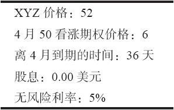

# 36.4　隐含波动率

我们已经在许多地方提到过隐含波动率，不过，在深入探讨它的衡量和使用方法之前，我们想要扩展一下它的概念。隐含波动率只是同期权相关，不过投资者可以将一个具体的标的工具上的各种期权交易的隐含波动率加在一起，产生出一个单一的数字，这个数字常常被称作这个标的物的隐含波动率。

在任何一个时间点上，交易者都可以确切地知道影响到一个期权价格的下列因素：股票价格、行权价、离到期的时间、利率，以及股息。唯一剩下的因素是波动率，事实上，是隐含波动率。它是期权交易中的一个重要的“修正值”。如果隐含波动率过高，期权的定价就会过高。这就是说，它们会相对昂贵。另一方面，如果隐含波动率过低，期权就会变得便宜或定价过低。侧重理论的期权交易者不再使用“定价过高”（overvalued）和“定价过低”（undervalued）这两个术语，因为用这样的术语意味着交易者知道这个期权应当值多少钱。在现代词汇中，交易者会说，这个期权是以“高波动率”或“低波动率”在交易，意思是说，交易者对过去的隐含波动率是什么有一定的概念，而现在的衡量结果同过去相比是高的或者是低的。

从根本上说，隐含波动率是期权市场对标的物在某个期权的存续期内即将出现的统计波动率的猜测。如果交易的人相信这个标的物在这个期权的存续期内将会是高波动的，那么，他们就会报出较高的买报价，使得它的价格变得更高。反过来，如果交易的人认为这个股票将有一段低波动的时期，那么，他们就不想为它支付高价，偏向于报出较低的买报价，因此，这个期权就会是相对低价的。要注意的重要的事是，交易者在正常情况下不知道将来会怎么样。他们无法确切地知道这个标的物在这个期权的存续期内究竟会有多大的波动。

要假设内幕信息不会透露到市场中，虽然这样说，但这是不现实的。也就是说，如果有人拥有关于一个公司的收益报告、新产品公告、兼并动向等非公开信息，他们会积极地买入这个公司的期权，或者是为这个期权报买价，这就会增加这个期权的隐含波动率。因此，在某些情况里，当交易者看到隐含波动率迅速上升，这或许是有的交易者可能确实知道未来，至少是知道某个公司将要公布一则特别的消息。

不过，大部分时间没有人有内幕消息交易的。每个期权交易者，包括做市商和公众，都不得不在买入或卖出期权时对波动率进行“猜测”。之所以如此，是因为他付出的价格在很大程度上是受他对波动率评估的影响（无论他是否意识到事实上他是在做这样的波动率评估）。正如你可以想象的，大多数交易者对于在期权存续期内的波动率会是什么情况没有一点概念。他们只是按照看来合理的价格付账，也许是以历史波动率为基础。因此，今天的隐含波动率同这个期权的存续期里后来披露的实际统计波动率没有相像之处。

想要进一步从数学上对隐含波动率的定义有所了解的人，可以考虑一下下面的公式：

期权价格=f（股票价格，行权价，时间，无风险利率，波动率，股息）

进一步说，假定交易者知道下面的信息：

这样的信息对任何期权来说在任何时候都能从简单的报价系统中得到，除了隐含波动率之外，这些信息满足了我们所需要的其他所有要求。因此，如果这个期权目前的价格是6，交易者应当在布莱克–斯科尔斯模型（或者他所使用的无论什么模型）中输入什么样的波动率才能得到这样的答案呢？也就是说，要形成这个等式，波动率必须是什么：

6=f（52，50，36天，5%，波动率，0.00美元）

无论什么样的波动率，只要它能够使得模型产生目前市场价格（6）作为价值，它就是XYZ 4月50看涨期权的隐含波动率。如果你有兴趣的话，在这个情况里，这个隐含波动率是75.4%。决定隐含波动率的实际程序是一个迭代的程序。没有绝对的公式，计算者在模式中不断用各种不同的波动率评估，直到答案同市场价值足够接近为止。
