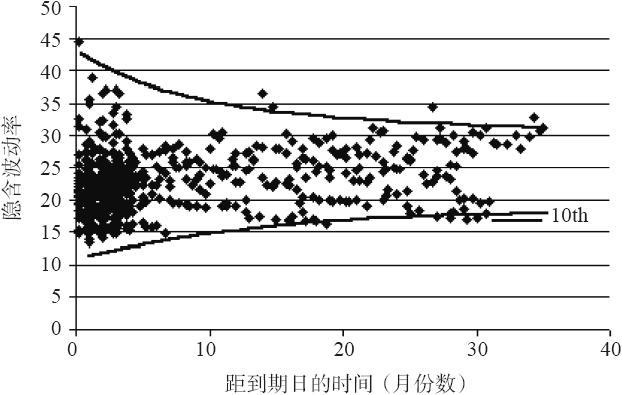
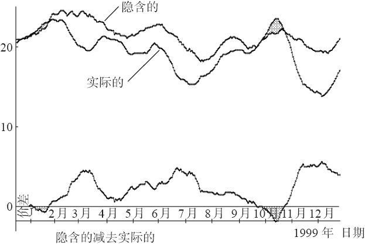
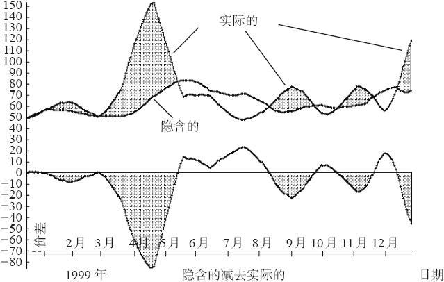
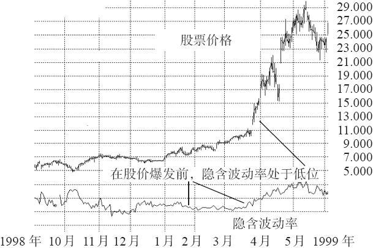
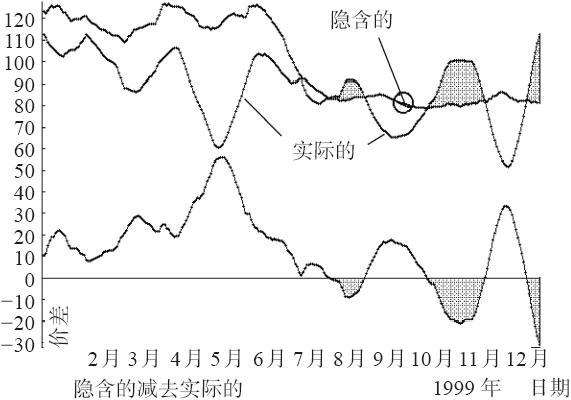
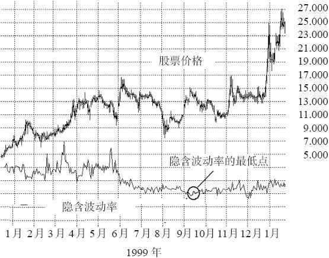

# 36.5　波动率的波动率

为了讨论一个具体实物（股票、指数或者期货合约）的隐含波动率，交易者一般引用单个期权的隐含波动率，或者是整个期权系列的综合的隐含波动率。对策略比较的目的来说，这一般就足够了。不过，事实上，在考虑隐含波动率上还有其他方法。具体地说，交易者也可以考虑隐含波动率的范围的宽度，也就是说，各个隐含波动率数字的波动性有多大。

传统的方法往往是谈论隐含波动率的百分比的高低。这种方法是将同样标的工具现在的隐含波动率的值同过去的隐含波动率的值进行排序。

不过，在使用百分比排序的时候，有一个相当重要的构成部分被漏掉了。交易者无法断定“便宜的”期权在实践中是否真的便宜。例如，如果交易者发现XYZ的整个过去的隐含波动率的范围只是在39%~45%之间，那么，当前40%的值虽然相当低，但看上去不怎么有吸引力。也就是说，如果XYZ期权的第1个百分位数在39%的隐含波动率值，而第100个百分比数在45%的值，那么，40%的值实在算不了什么。如果以绝对值为基础，隐含波动率实在没有多少空间可以增长。即使它上升到了第100个百分位数，这个具体的XYZ期权还是没有增长多少价值，因为它的隐含波动率只从40%上升到了45%。

不过，如果过去的隐含波动率的分布幅度很宽，那么，如果它们目前是在百分比排序的一个低层面上，交易者就可以知道这些期权真的是便宜的。假定，如果XYZ的过去隐含波动率的范围是在35%~90%之间，而不是上面所描写的那个狭窄的范围，那么，XYZ隐含波动率的第1个百分位数是35%，第100个百分位数是90%。现在，如果目前的值是40%，在目前的值之上有大量的期权可以交易的空间，如果隐含波动率向上运动到更高的等位时，就有可能增加期权的价值。

这就意味着，在实际运作中，交易者不但需要知道隐含波动率目前的百分位数，而且需要知道这个百分位数在数字范围中的位置。如果这个范围幅度很宽，那么，一个极端的百分位数确实代表了一手便宜的或昂贵的期权，但是，如果这个范围很窄，那么，交易者也许就不必过分地关心隐含波动率目前的值。

隐含波动率的另一个常常为人忽视的方面是它的范围是如何根据期权中剩下的时间而变化的。对长期期权（LEAPS）的交易者来说，这一点尤其重要。因为一手长期期权隐含波动率的范围没有一手短期期权隐含波动率的范围大。为了说明这一点，我们为OEX期权的隐含波动率作了一幅长达数年之久的图形，既包括普通期权，也包括长期期权。其结果就是在图36-3中显示的扩散图形。

在图36-3中有两条曲线，它们囊括了大多数的数据点。从这些线条可以看出，短期期权的隐含波动率的范围要大于远期期权。例如，在这幅扩散图左端的隐含波动率的值的范围是从14%~40%（不计在线条之外的那一个点）。但是，对24个月或者时间更长的较长期的期权，这个范围是从17%~32%。虽然OEX期权有它们自己的特征，这幅扩散图在我们所看到的任何股票或指数中仍然是相当有代表性的。

图36-3　长达数年的OEX期权的隐含波动率

从这里可以得出的一个结论是，长期期权隐含波动率的变化没有短期期权隐含波动率的变化那么大。对长期期权交易者来说，这个信息会很重要，特别是如果他将长期期权的隐含波动率同标的物的一个合成的隐含波动率或者历史波动率进行比较的时候。

同样，考虑一下图36-3。使用所有所给数据点而得出的OEX合成隐含波动率的第10百分位数是17%，虽然单凭图形看出这一点不容易。在这幅扩散图的右边有一根短线条标出了这个水平（第10百分位数）。可以看出，长期期权很少在这么低的波动率水平上交易。

在图36-3里，两条曲线之间的距离在左侧（也就是说，短期期权）要比在右侧（长期期权）大得多。因此，对长期期权交易者来说，当考虑到所有这些期权的时候，要找到极高或者极低的隐含波动率值，不是一件容易的事。因此，如果你所观察的是所有期权的隐含波动率的百分比排序，包括所有短期期权在内，那么，长期期权很少有看上去“便宜”的时候。

你可以说，如果交易者要买长期期权的话，他应当只看这幅扩散图的右边的波动率范围的幅度。这样他可以就这个期权是否便宜做出决定，或者说，不是单凭长期期权的目前的值同过去的值之间的比较。这种思路在推理上是有一定谬误的。有这么几个原因：第一，如果交易者长期持有这个期权，波动率范围就会扩展开来，隐含波动率有可能会出现显著的下降。第二，长期波动率范围有可能非常之小，即使期权最初相当便宜，隐含波动率的大幅增长也不能转化为像在短期期权中可以看到的那样的价格收益。

懂得过去隐含波动率的范围的重要性，并且意识到隐含波动率的范围随着时间的缩短而扩展，这对所有在交易决定中使用隐含波动率的人来说，都非常重要。

### 隐含波动率是实际波动率的优秀预测指标吗

交易者可以计算隐含波动率的事实，并不意味着这样的计算是对未来的波动率的正确的评估。正如上面所说，就像对一只股票的未来价格一样，市场也并不真的知道一个工具将会如何波动。当然，在评估未来的波动率方面有一定的线索，也有一些一般的方法，但是，期权交易有的时候会出现远离以往水平的隐含波动率这个事实仍然存在。因此，可以把隐含波动率看作是对期权存续期内股票将会实际发生的情况的一种不准确的评估。要记住，隐含波动率是对未来的评估，因为它是以交易者的推测为基础的，它有可能是错的，就像所有对未来事件的评估都有可能是错的一样。

上面所提出的问题也许是一个人们应当更经常地问自己的问题：“隐含波动率是实际波动率的优秀预测指标吗？”从某种程度上说，假设隐含波动率和历史（实际）波动率会汇拢似乎是合乎逻辑的。可是，事情并不真是如此，至少在短期内不是如此。此外，即使它们确实汇拢了，究竟谁在开始时是正确的呢？是隐含的还是历史的？也就是说，究竟是隐含波动率运动到同标的物的实际运动相一致的地步，还是股票的运动加快了或者减缓了，从而达到了同隐含波动率的一致？

为了说明这个概念，我们将使用若干图形来显示隐含的同历史的波动率之间的比较。图36-4显示的是OEX指数的信息。OEX期权一般而言是定价过高的。见第29章的讨论。这就是说，OEX期权的隐含波动率几乎总是高于后来被证明的实际波动率。考虑一下图36-4。在这个图形中有3条线：隐含波动率、实际波动率，以及两者之间的差别。不过，在这些线条是由什么组成的方面，有一个重要的区别。

（1）隐含波动率的曲线描绘出了OEX的每日综合的隐含波动率值的一个20天移动平均值。这就是说，每天计算出一个单一的数字作为当天的OEX的综合隐含波动率。这些隐含波动率的数字通过使用在论述数学应用的那一章所显示的平均化公式进行计算，每个期权的隐含波动率由交易量和实值或虚值的距离加权，以得出这个交易日的一个单一的隐含波动率值。为了将每日的值平滑化，这里使用了一个20天的简单平均移动值。这个逐日的OEX的隐含波动率包括了所有的OEX期权，因此，它同VIX这个波动率指数（Volatility Index）是不同的，后者只是使用最接近平值的期权。由于使用所有的期权，同VIX相比，这里的波动率数字就略有一些不同，但是两者的图形所显示的模式是相似的。这就是说，使用所有OEX计算出的隐含波动率的最高点的出现时间与VIX的最高点出现时间是相同的。

（2）这个图形上的实际波动率同人们通常认为的历史波动率有一点区别。它是20天的历史波动率，它所计算的20天是在计算隐含波动率那一天之后的20天。因此，隐含波动率曲线上的点位是同在20天之后形成的20天历史波动率的计算相匹配的。这样，这两条曲线多少显示出波动率的预测和在20天的时段内实际发生的情况。这些实际波动率值也是用一个20天移动平均值加以平滑的。

（3）这两者之间的差别相当简单，正如图形底部的曲线所显示的。穿过这个差别线画有一条“零”线。

当这条“差别线”穿过这条“零”线的时候，波动率预测同在20天后实际出现的波动率就是相等的。如果差别线在零线之上，那么隐含波动率就过高；期权是定价过高的。反过来，如果差别线在零线之下，那么实际波动率就证明比隐含波动率所预测的要大；期权在这个情况下就是定价过低的。在图36-4里，这样的区域是画了阴影的。简单地说，在图形中有阴影的时段里，你应当拥有期权，在没有阴影的区域里，你应当卖出期权。

注意一下，图36-4确认了这样的事实：OEX期权一直是定价过高的。很少有图形是像OEX图形那样单维的，其中期权如此始终如一地定价过高。大多数股票的差别线都在零线周围上下振荡。考虑一下图36-5和图36-6。图36-5显示的是一幅同36-4相似的图形，将一只股票的实际和隐含波动率进行比较，也显示了两者之间的区别。图36-6显示了同一只股票的价格图形，覆盖在隐含波动率上，这是在一个出现大量阴影之前的时段，包括出现阴影的时期。

图36-4　同历史波动率相对的OEX的隐含波动率

图36-5　某只股票的历史波动率和相对应的隐含波动率

图36-6　这只股票的价格图形

这幅波动率比较图形（见图36-5）显示了若干阴影区域，在这些时段内，股票的波动性比期权所预测的更大。期权的拥有者在这样的时期就会有盈利，只要他们对这只股票所采取的是相对中立的态度。图36-6显示了这只股票在1999年3~4月之前、包括这段时间内的表现，这是图形上阴影最大的区域。注意一下，在股票在一个多月中从10~30的强势运动之前，隐含波动率相当低，这些图形来自实际的数据，它们展示了隐含波动率在多大程度上有可能偏离历史波动率。在1999年2月和3月上旬，隐含波动率在这些图形上处于最低的水平，或者是接近最低的水平。但是，到3月底，股票价格开始暴涨，在一个月里翻了3倍。显然，在这个情况里，隐含波动率在预测即将出现的实际波动率方面是个很差的指标。

在这一年的后半期出现了什么情况呢？在图36-5里你可以观察得到隐含波动率和实际波动率在1999年的其余时间内上下振荡了若干次。看上去这些振荡很小，而且隐含波动率实际上在预测实际波动率方面做得很好，至少是在1999年12月价格出现最后的上升之前是这样。不过，看一下图36-5左边的标度，你可以看出隐含波动率是要停留在50%~60%的范围内，但是实际波动率则不断地向上突破。

这里还有另一个示例。图36-7和图36-8描绘了另一只股票和它的波动率。在每一幅图形的左半边，隐含波动率都相当高。它比后来出现的实际波动率要高，因此，在图36-7中差别线在几个月内都保持在零线之上。然后，由于某种原因，期权市场决定要做调整，隐含波动率开始下降。它的日最低点在图36-8上用一个小圈标了出来，在图36-7上同一个时间点也用一个小圈标了出来。在这个时候，期权交易者是在“说”，他们预期在接下来的那个星期里股票会非常平缓。可是，股票实际上有两次迅速的运动，一次从15跌到11，另一次是涨回到17。这样的运动使得实际波动率上弹，而隐含波动率保持在低位。经过一段时间在13~15之间交易之后，在这期间隐含波动率保持在低位，股票最后向上突破，正如图36-7和图36-8右面的尖顶可以证明的。因此，在这些图形上，在大部分时间内，隐含波动率是实际波动率的一个糟糕的指标。不但如此，即使股票在一个月的时间内价格翻了一倍，隐含波动率仍然停留在低位。

图36-7　另一只股票的历史波动率和相对应的隐含波动率

图36-8　这只股票的价格图形

从这些图形中，要注意的重要的事情是，它们清楚地显示出，对在它之后出现的实际波动率来说，隐含波动率实在算不上一个好的指标。如果它是的话，差别线在大部分时间内都会在接近零线的地方徘徊。事实却是差别线上下急剧摆动，隐含波动率过高或过低地评估了实际波动率，偏差相当大。因此，交易者对波动率目前的估量（也就是隐含波动率）有可能实际上错得相当离谱。

反过来，你也可以说历史波动率对在它之后出现的隐含波动率也不是一个出色的预测指标，特别是短期。没有人真的坚持说它是一个好的预测指标，因为历史波动率只是对过去发生的事情的一种反映。我们能够有把握说的只是，隐含波动率和历史波动率倾向于在一个范围内交易。

这些图形中突出的一点是，隐含波动率的上下起伏似乎比实际波动率要小。这似乎是波动率预测过程的一个自然功能。例如，当市场暴跌时，期权的隐含波动率只有中等程度的上涨。换句话说，在期权交易者和做市商在给期权定价时对波动率进行预测的时候，倾向于做出在某种程度上“中庸”的预测，因为走极端的预测有更大的可能会是错的。当然，事实后来证明它还是错的，因为实际波动率相当迅速地上下跳动。

这里展现的少数几幅图形并不构成一个严密的研究，以得到隐含波动率是实际波动率的一个糟糕的预测指标的结论，不过，我坚定地相信这样的说法是正确的。研究市场的研究生可以在这里寻找他的硕士论文选题。
