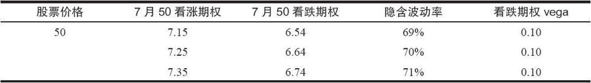
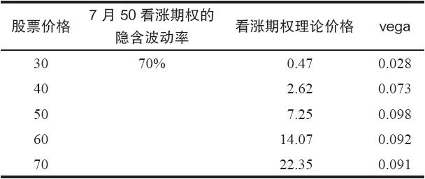
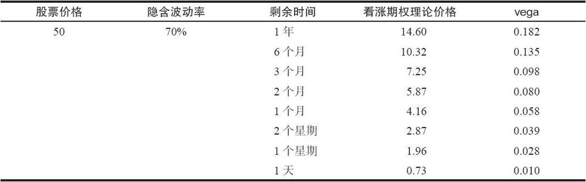
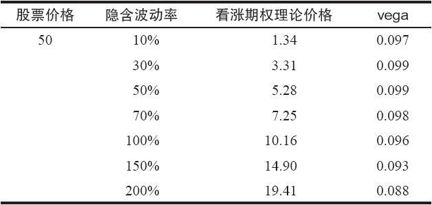
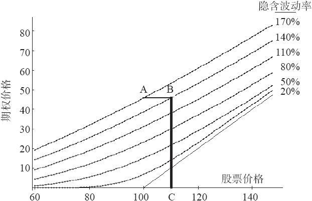

# 37.1　vega

从技术的角度讲，交易者用来衡量波动率变化对一个期权价格的影响的术语是期权的vega。在这一章里，我们将用vega作为参考，但重点是在实践性，因此，对波动率如何影响期权头寸的描写将用日常的语言来描写，同时也将涉及vega的更为数学化的领域。做了这样的声明之后，让我们来给vega下一个定义，在后面的讨论里我们将在这个意义上使用这个术语。

简单地说，vega是期权价格在波动率每变化一个百分点时所变化的数量。

【示例37-1】XYZ的售价是50，7月50看涨期权的交易价是7.25。假定不存在股息，短期利率是5%，离7月到期还有刚好3个月。有了这些信息，交易者可以知道这个7月50看涨期权的隐含波动率是70%。这是个相当高的数字，因此，交易者可以得出结论说，XYZ是一个高波动率的股票。如果隐含波动率升到71%的话，期权的价格会是多少呢？使用一个模型，交易者可以发现，如果发生这样的情况，7月50看涨期权从理论上说价格应当是7.35。因此，这个期权的vega就是0.10（取两位小数）。也就是说，当波动率增加了1个百分点，这个期权的价格增加了10美分，从7.25到了7.35。（请注意，这里的“百分点”指的是波动率中整整1个点的增长，从70%到71%。）

如果隐含波动率不是增加了而是减少了呢？同样，交易者可以使用这个模型来决定期权价格的变化。在这个情况里，使用69%的隐含波动率并且保持其他因素不变，期权的理论价值就会是7.15，同样是0.10的价格变化（这一次是价格的降低）。

这个示例在隐含波动率如何影响看涨期权方面指出了一个有趣而重要的方面：如果隐含波动率增加，期权的价格也会增加，如果隐含波动率降低，期权的价格也会降低。因此，在期权价格同它的隐含波动率之间有着直接（direct）的关系。

从数学上说，vega是布莱克–斯科尔斯模型（或者任何你在用的期权定价模型）的同波动率相关的偏导数（partial derivative）。在上面的示例里，这个7月50看涨期权的vega，在XYZ为50时，可以计算出为0.098，它同交易者在考察时所得出的0.10非常相近。

Vega与看跌期权也有直接的关系。也就是说，在隐含波动率增加的时候，看跌期权的价格也会增加。

【示例37-2】使用前一个示例里同样的条件，假定XYZ在50交易，离7月还有3个月，短期利率是5%，没有股息。在这个情况里，下面的看跌期权和看涨期权的理论价格可以用在所说的隐含波动率上。

因此，看跌期权的vega也是0.10，同看涨期权的vega一样。

事实上，我们可以说，条款相同的看涨期权和看跌期权的vega是相同的。要证明这一点，我们只需要回到转换组合的套利等式。如果看涨期权价格上涨，其他条件（利率、股票价格和行权价）都相等，那么，看跌期权就一定上涨相同的数量。隐含波动率在看涨期权的价格中会造成这样的变化，在看跌期权价格中也会造成相似的变化。因此看跌期权和看涨期权的vega一定是相同的。

同样重要的是要知道vega是怎样随着其他因素的变化而变化的，特别是随着股票价格的变化，或者是时间的变化。下面的示例包括了若干表格，它们显示出在一个典型的上下波动的环境中vega的表现。

【示例37-3】在这个示例里，让我们假设利率（5%）、隐含波动率（70%）、时间（3个月）、股息（0）和行权价（50）都不变，变化的只有股票的价格（见表37-1）。

表　37-1

上面这个示例假设股票价格的变化是发生在同一时间点上。在现实中，时间自然同样会流逝，这也会影响到vega。表37-2显示假设其他条件都不变，vega是如何随着时间的变化而变化的。

【示例37-4】在这个示例里，下面的条件都是固定的：股票价格（50）、行权价（50）、隐含波动率（70%）、无风险利率（5%）和股息（0），不过，我们现在假设时间上下波动。

表37-2清楚地显示出，时间的流逝不但导致看涨期权价格的下跌，而且也造成vega的下降。当然，这是有它的道理的，因为交易者不应当指望隐含波动率的上升会在这样一个期限非常短的期权上产生多大的影响，至少这样的影响肯定不会比它对一个长期期权所产生的那么大。

表　37-2

有的读者也许会想，隐含波动率自身的变化是怎样影响vega的。这可以被称作“vega的vega”，虽然我从来没有听到过有人实际这样说过。表37-3将探讨这个概念。

【示例37-5】同样，若干因素保持不变：股票价格（50）、离7月到期的时间（3个月）、无风险利率（5%）和股息（0）。表37-3允许隐含波动率上下波动，它显示出了在不同的波动率上7月50看涨期权的理论价格和它的vega会有什么样的变化。

表　37-3

因此，表37-3显示出在隐含波动率大幅度变化时，vega令人惊讶地保持在稳定的水平上。这是为什么没有人对“vega的vega”感兴趣的真正原因。vega只有在隐含波动率极其高的时候才开始下降，而这种水平上的隐含波动率是罕见的。

我们也可以计算出为了克服波动率的下跌股票所需要上涨的距离。考虑一下图37-1，它显示的是一手有不同的隐含波动率的6个月的看涨期权。假定交易者买入一手目前的隐含波动率为170%（图形的顶部曲线）的期权。后来，投资者感觉波动率减弱了，期权在隐含波动率为140%的水平上交易。这就意味着这个期权现在“驻扎”在从上往下数的第2条曲线上。从这两条曲线之间的大概的距离来看，由于隐含波动率的下降，整个期权也许亏损了5~8点的价值。

图37-1　不同隐含波动率上的期权理论价格（6个月看涨期权）

看这个问题有另一种方法。同样，假定交易者买入了一手平值期权（股票价格=100），当时它的隐含波动率是170%。这个期权的价值在图37-1的图形上是用A点标志的。后来，这个期权的隐含波动率下跌到140%。为了弥补隐含波动率带来的亏损，股票价格必须上涨到什么地方呢？从A点到B点之间的水平线显示了每条曲线上期权价值相同的部位。因此，从B点向下画一条垂直线到C点，我们就可以看到C点处的价格大约为109。因此，如果隐含波动率从170%跌到140%，那么，股票必须上涨9点才能保持期权价值不变。
