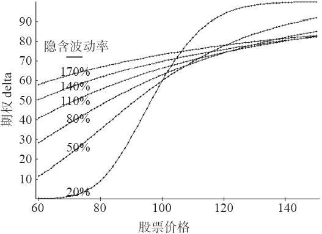

# 37.2　隐含波动率和delta

图37-1显示出另一个不同寻常的效果：当隐含波动率变成非常高时，期权的delta没有多大的变化。简单地说，一个期权的delta衡量的是当股票运动1点的时候，期权价格有多大的变化。从数学上说，delta是期权模型相对于股票价格的一阶偏导数。从几何学的角度说，这意味着一个期权的delta是前面图形中曲线的切线的斜率。

图37-2　6个月看涨期权在不同隐含波动率上的delta值

当股票价格在80~120之间时，图37-1中的底线（这里的隐含波动率=20%）有一个独特的曲率。因此，delta的范围是从一个相当低的数字（当股票价格接近80的时候）到一个相当高的数字（当股票接近120的时候）之间的区域。现在看一下图形中的顶部线条，这里隐含波动率等于170%。从较低的左边到较高的右边，它几乎是一条直线！这条直线的斜率是恒定的。这就告诉我们，对这样一个昂贵的期权来说，delta（它是这个斜率）几乎没有变化，不管股票是在60交易或者150交易！单是这个事实就会使许多人感到惊讶。

此外，这个delta值是可以衡量的：在股票价格从80一直到150，它是0.70或者更高，除了其他涵义之外，这意味着一个隐含波动率极高的虚值期权的delta是相当高的，可以预期它对股票价格运动的反映要比交易者想象得要更为紧密，如果他对delta的观察不是那么仔细的话。

图37-2演绎了这个概念，它显示出一个期权的delta是如何随着隐含波动率的变化而变化的。从这幅图形里可以清楚地看出当隐含波动率是20%时期权的delta变化得有多快，它同当隐含波动率极高时它的变化有多小形成对比。

这个数据本身就很有趣，不过，当交易者认识到他的期权中隐含波动率的变化（vega）同时也意味着这个期权中的delta的显著变化，它就变得更令人入迷了。在某种意义上，这解释了为什么在第1幅图形（见图37-1）里股票上涨了9点而期权的持有人还是什么钱都没赚到：因为隐含波动率从170%下降到了140%。
