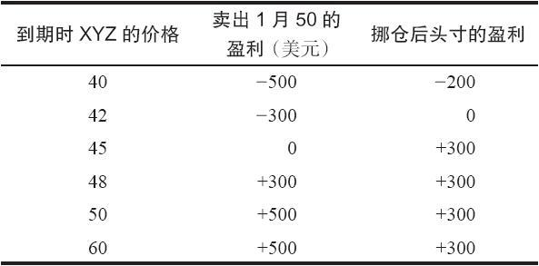
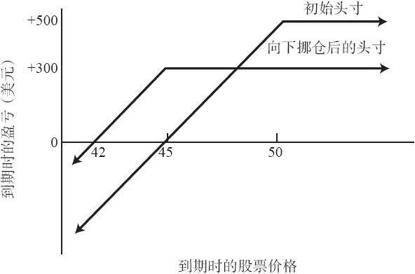
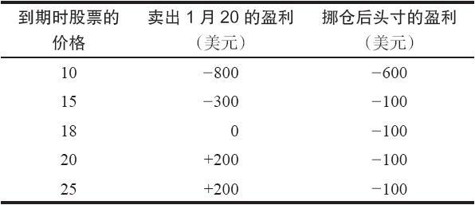
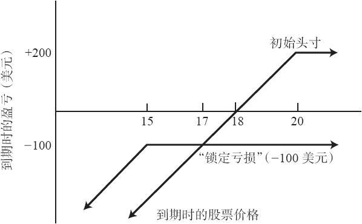
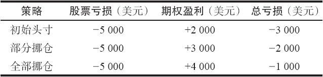
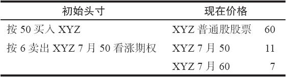
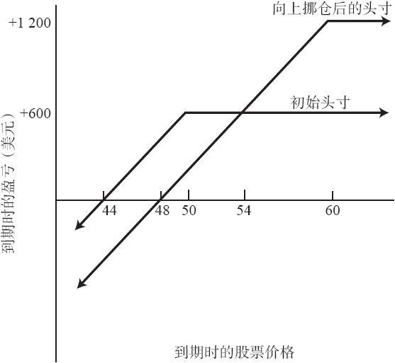

# 2.9　后续行动

建立卖出备兑，或是任何一个期权头寸，都只是策略家工作的一部分内容。一旦建立了头寸，就必须对其进行严密地监控。如果股价下跌幅度太大，就需要及时对其进行调整。此外，即使股价保持相对稳定，随着卖出的看涨期权临近到期日，也需要对其进行调整。

有的卖出者不采取任何后续行动，如果股价在期权到期时高于行权价，他们就让股票被指派行权；而如果股价低于行权价，他们就让初始的合约无价值到期。这些并不总是最优化的行动，投资者需要做出更多的决定。

后续行动（follow-up action）可以分为三大类：

（1）如果股价下跌而采取的保护性行动；

（2）如果股价上涨而采取的进攻性行动；

（3）如果实值看涨期权时间价值消失而采取的避免指派行动。

有的时候，投资者在到期日之前决定将整个头寸平仓，或者让股票被指派行权。这些情况我们也会讨论。

### 2.9.1　如果股价下跌而采取的保护性行动

如果某个投资者面对标的股价相对显著的下跌而不采取保护性行动，就有可能遭受大笔的亏损。因为卖出备兑是一个潜在盈利有限的策略，投资者应当限制亏损，不然一次亏损可以抵消掉好几次盈利。在市场下跌中最简单的后续行动，就是直接将这个头寸平仓。如果股价下跌了一定百分点，或者是跌破了某个技术支撑（support）位，就应当采取这样的行动。不幸的是，这种防守行为有可能被证明是一种不高明的方式。投资者往往会继续卖出时间价格更高的期权，来获得额外的时间价值。

后续行动通常采取的形式是买回初始卖出的看涨期权，然后再卖出另一个行权价或到期日不同的看涨期权来替代。这种类型的调整叫作挪仓行动（rolling action）。当标的股价下跌时，投资者通常买回初始的看涨期权（由于标的股价下跌了，从而获得一定的盈利），然后再以较低的行权价卖出另一种看涨期权。这就是所谓的向下挪仓（rolling down），因为新的期权的行权价较低。

【示例2-11】某个卖出备兑头寸为：按51买入XYZ，按6卖出XYZ 1月50看涨期权。它在到期日时的最大潜在盈利是5点。下行保护是6点，到期日时股价在45之上都可以得到保护。为了说明这个基本的示例，手续费在这里不作考虑。

如果股价开始下跌，也许在两个月里跌到了45，于是就有可能会出现下面的期权价格：

XYZ普通股票：45

XYZ 1月50看涨期权：1

XYZ 1月45看涨期权：4

这时候，1月50的备兑卖出者在他的总头寸中有一个为1点的小额未兑现亏损：他在普通股上的亏损是6点，但是在1月50看涨期权上有5点的盈利（这里需要说明的是，在到期日之前，在“盈亏平衡点”上出现了亏损）。如果股价从这些水平上继续下跌，在到期日时他的亏损就会更大。按1点卖出的看涨期权在下行方向只能再提供1点的保护。如果预期股价会跌得更深，那么，通过向下挪仓可以得到额外的下行保护。在这个示例中，如果投资者按1买回1月50看涨期权，同时再按4卖出1月45看涨期权，他就是在进行向下挪仓。这可以为他增加另外3点的下行保护（按1买回50看涨期权，再按4卖出45看涨期权，从而产生3点的收入）。因此，在向下挪仓之后，他的下行盈亏平衡点就变成了42。

另外，如果股价保持不动，也就是说，如果XYZ在1月到期日时刚好是45的话，卖出者就会得到额外的300美元。如果他没有向下挪仓，而XYZ保持不变的话，他能得到的最多的额外收入就是1月50看涨期权所剩的100美元。因此，向下挪仓不仅能在股价进一步下跌时提供更多的保护，还能在股价稳定时产生额外的收入。

为了更准确地衡量这个示例里由于向下挪仓而获得的总效果，你可以计算出一个盈利表（见表2-15），或者画一幅净盈利图形（见图2-3），来对初始的卖出备兑和向下挪仓后的头寸加以比较。

表2-15　盈利表

图2-3　比较：初始头寸同向下挪仓后的头寸

请注意，挪仓后头寸的最大潜在盈利要比初始的头寸小。这是因为，在向下挪仓到1月45看涨期权之后，卖出者就对股价在45之上的盈利进行了限制。他承诺要按比初始头寸低5点的价格来卖出股票，初始的头寸使用的是1月50看涨期权，因而是对股价在50之上的盈利进行了限制。向下挪仓一般会降低卖出备兑的最大潜在盈利。不过，当一只股票在下跌时，最大盈利也许是次要的考虑。在这样的情况下，额外的下行保护常常是更紧迫的需要。

到期时，如果股价在45之下，向下挪仓的头寸就会比初始的头寸要多盈利300美元，因为向下挪仓产生了300美元的收入。事实上，如果股价涨到但是不超过48，那么向下挪仓头寸的表现都会超出初始头寸。如果期权到期时股价是48，两个头寸的表现就会相等——都产生300美元的盈利。如果股票继续反弹，在期权到期时高于48，那么，如果卖出者没有挪仓，他的收益就会更好一些。从表2-15和图2-3里，可以清楚地看出这些结果。

因此，向下挪仓不能带来好处的唯一可能原因就是股票大幅反弹，也就是说，价格先是下跌然后上涨。在选择向下挪仓时，挪到什么位置很重要，因为挪得过早或是挪到不适当的价格都会限制收益。在选择挪仓价格时，使用股票的技术支撑位常常很有用。一般而言，如果投资者在技术支撑位被突破之后再向下挪仓，就可以减小陷入股价反弹这种处境的可能。

上面的示例是相对简化了的：在现实实践中可能会出现更复杂的情况，例如标的股票的价格突然出现相对陡峭的跌幅。这可能会给卖出者带来所谓的锁定亏损（locked-in loss）。简单地说，这就意味着对该卖出者来说，不存在这样的期权：它们可以让他向下挪仓，从而得到足够的权利金，如果股票在到期时被指派行权，就能兑现由此发生的盈利。这类情况通常更多地发生在价格较低的股票上，这些股票的期权的行权价离市场价相对较远。相对于卖出实值来说，卖出虚值更有可能会遇到这样的问题。尽管从情感上来说，此时向下挪仓无法产生盈利（至少在一段时间内），不是一个令人满意的投资头寸。但是，这样做至少为股价下跌提供了尽可能的保护，因此它仍是有益的。

【示例2-12】某个卖出备兑头寸为：按20买入XYZ，按2卖出1月20看涨期权。在这个头寸中，如果股价出人意料地迅速下跌到16，那么，就会有下列的价格：

XYZ普通股票：16

XYZ 1月20看涨期权：0.50

XYZ 1月15看涨期权：2.50

持有这个头寸的备兑卖出者将面临着困难的选择。他手上有未兑现的2.50点的亏损：股票4点的亏损，1月20看涨期权1.50点的收入。在短期内，这是一个百分比相当大的亏损。他对此无能为力，只能寄希望于股价能够回弹，从而弥补损失。不幸的是，这有可能只是一厢情愿。

即便他考虑向下挪仓，也不会为这样做的前景感到很激动。假如该卖出者想要将1月20的仓位挪到1月15。他因此就会按0.50买入1月20，同时按2.50卖出1月15，从而得到2点的净收入。通过向下挪仓，他承担了按15美元的价格卖出股票的义务。假设XYZ在1月的价格高于15，他的股票被指派行权，该卖出者的交易结果会怎么样呢？他会在股票里损失5点，因为他初始是按20买入的，而现在要按15卖出。这个5点的亏损在很大程度上被他期权中4点的盈利所抵消了：1月20的合约有1.50点的盈利（按2卖出，按0.50买回），加上卖出1月15所得的2.50的盈利。但是，他的净结果还是1点的亏损，因为他在股票上亏了5点，而在期权上只赢回了4点。而且，这1点的亏损是他最好的指望了。这没有错，因为，正如我们已经多次说明的，当股价超出期权行权价，卖出备兑头寸就实现了它的最大潜在盈利，不管超出的数量是多少。因此，由于将行权价挪到15，他就严重地限制了这个头寸盈利的机会，以致到了“锁定亏损”的地步。

即使考虑到最后结果为亏损，对这个卖出者来说，将1月15期权向下挪仓仍然是个正确的决定。因为一旦股价跌到16，就没有人能够拯救这个未兑现的亏损。但是，如果卖出者向下挪仓，他就可以防止亏损的快速累积。事实上，如果股价进一步下跌、保持不变甚至略为上涨，向下挪仓都对他有利。表2-16和图2-4对初始的头寸和挪仓后的头寸进行了比较。从这个图中可以清楚地看出，挪仓后的头寸锁定了亏损。除非股票在期权到期时涨回到17，否则挪仓后头寸的表现都要比初始头寸的表现要好。因此，只要股票还在下跌、保持不变或者涨幅不超过1点，挪仓后头寸的表现实际上都会比初始头寸的表现要好。由于这个原因，这个卖出者将头寸向下挪仓是最合乎逻辑的行动，即使这样做会锁定一笔亏损。

表2-16　初始头寸和挪仓后头寸的盈利比较

图2-4　比较：初始头寸和“锁定亏损”

当卖出者在面临是向下挪仓锁定亏损，还是仍由进一步下跌的头寸继续没有保护这样的两难处境时，技术分析可以提供一定的帮助。如果XYZ跌破了某个支撑位或者某条重要的趋势线，这就为向下挪仓提供了额外的支持。在我们的示例里，如果某只股票从20美元突然跌到16美元，很难想象这样的变化不会显著地损害它的技术图形。无论是什么情况，如果技术图表显示在15.50或16的地方有一个支撑位，那么卖出者也许值得等一等，看看股票在这个支撑位上是否站得住，然后再决定是否要向下挪仓。

避免不得不锁定亏损的最好办法也许是在建立头寸时就尽量避免这种麻烦。如果是就一个波动率中等、价格较高的股票建立实值的卖出备兑，那么，卖出者很少会面临不得不锁定亏损的局面。当然，如果股价跌得太快，卖出者就不得不在相当短的时间内连续向下挪仓，他就有可能别无选择，只能锁定亏损。不过，股价较高，期权的行权价间距（按百分比来说）就较小。因此，如果股价下跌，针对价格较高的股票，卖出者就能迅速地卖出行权价较低的新期权。而且，波动率高的股票的权利金也高，这样，由于股票下跌而造成的亏损，有一部分就可以由向下挪仓而产生的权利金给抵消掉；反过来，如果股价比较低，特别是波动率也比较低，那么，一旦价格下跌，备兑卖出者通常就会有严重的麻烦。

这里不妨提一下与下达交易指令相关的一个问题。如果投资者在买入一手看涨期权的同时卖出另一手看涨期权，他就是在执行一个价差指令。后文会对价差进行仔细讨论。不过，备兑卖出者必须意识到，在挪仓的时候，他可以下达价差指令。一般情况下，这样做可以让卖出者的指令得到更好的执行价格。

### 2.9.2　一个替代向下挪仓的办法

备兑卖出者可以采取另一种方法来得到对市场下跌的额外保护，并且不一定需要锁定亏损。简单地说，该卖出者可以只将他的一部分卖出备兑头寸进行挪仓。

【示例2-13】某个投资者按20买入1000股XYZ股票，按每股2点卖出10手1月20看涨期权。同前文一样，股票跌到16，XYZ 1月20看涨期权的价格是0.50，XYZ 1月15看涨期权是2.50。像上一节里所显示的，如果该卖出者把他的10手看涨期权全都从1月20挪仓到1月15，他就会锁定一笔亏损。虽然这样做有一定的道理，但是他可能不希望自己落到这样的境地。

通过将部分头寸向下挪仓的办法，投资者可以试图在增加对市场下跌的保护与保留市场上涨所带来的盈利之间寻求某种平衡。在这个示例里，卖出者可以只买回5手1月20看涨期权，并只卖出5手1月15看涨期权。这样他的头寸就变成了：

按20买入1000股XYZ股票

按2卖出5手XYZ 1月20看涨期权

按2.50卖出5手XYZ 1月15看涨期权

兑现的收益，从5手1月20看涨期权中得到750美元

这个策略一般被称为部分向下挪仓（partial roll-down），其中，与更传统的全部向下挪仓（complete roll-down）不同，只有一部分初始的看涨期权向下挪仓了。只要对这部分挪仓的头寸作一些分析，就可以清楚地看出该卖出者不再有锁定的亏损了。

如果XYZ的价格反弹到20美元之上，该卖出者在期权到期时就会按20美元卖掉500股XYZ股票（达到盈亏平衡），按15美元卖掉另外500股XYZ股票（这部分会损失2500美元）。他将5手1月20看涨期权留到到期日可以得到1000美元，加上从1月15看涨期权中得到的1250美元，再加上从挪仓的1月20看涨期权中收到的750美元，得到从期权中获得的盈利3000美元，减去从股票里损失的是2500美元，不计手续费的话，得到总的净收益500美元。因此，这个部分挪仓的头寸为卖出者提供了如果股价反弹仍然可以从中得到某些盈利的机会。显然，与完全挪仓的头寸相比，部分挪仓对市场下行所提供的保护就没有那么多，但是，与根本不挪仓相比，它仍提供了更多的保护。要了解这一点，请比较一下表2-17所显示的如果XYZ在到期日跌到15时的结果。

表2-17　到期日时XYZ为15

总之，对那些想要向下挪仓但又不想锁定亏损的备兑卖出者，或者是认为股票在到期日之前会有一定反弹的人来说，应当考虑只将他的部分头寸向下挪仓。如果股票继续下跌，出现明显不能再强有力地反弹回初始的行权价的迹象时，那么，投资者可以再把剩余部分头寸也向下挪仓。

### 2.9.3　向下挪仓时利用不同的到期月系列

在前文所举的示例里，每当向下挪仓时，我们用的都是同一个到期月份。在实际操作中，卖出者在向下挪仓时常常可能会使用一个更远的到期月份，在某些情况中，他甚至会使用一个更近的到期月份。

挪仓到更远的到期月系列的好处是可以得到更多的保护点数。当标的股票就某种技术分析或基本面分析来看变得令人担心时，人们常常采取这一行动。不过，由于向下挪仓减小了最大潜在盈利（前文已经多次说明了这个事实），并不是每一个向下挪仓的头寸都应当挪到更远的到期月系列中去。当使用更远期的看涨期权向下挪仓的时候，卖出者是在更长的一段时期里牺牲了他的部分潜在盈利。因此，只有当卖出者认为股票不能够保持现有的价格水平时，他才应当使用更长时期的看涨期权。在向下挪仓到较远期看涨期权的情况里，尤其可以使用部分挪仓的策略。这是因为，如果只是部分头寸向下挪仓，而当股价反弹时，卖出者仍然有获利的机会。因此，他会对已经挪仓的部分头寸所提供的最大保护感到轻松。

如果卖出者因为诸如标的股价突然下跌这种不受他控制的原因而不得不向下挪仓并且锁定亏损的话，事实上他可以挪仓到近期月的合约。这样他就可以在尽可能短的时间里拿回从短期看涨期权中得到的时间价值。

【示例2-14】卖出者按19的价格买入XYZ股票，同时卖出6个月的看涨期权以得到2点。但是，不久之后，出现了关于这只股票的坏消息，XYZ迅速跌到了14。这时候，行权价为16的看涨期权有下列的价格：

XYZ普通股股票：14

近期看涨期权：1

中期看涨期权：1.50

远期看涨期权：2

无论卖出者挪仓到这三个期权中的哪一个，他都会锁定一笔亏损。所以，最好的策略也许是挪到近期的看涨期权里，以获得3个月里1点的时间价值。用这种方法，他可以依靠在最短时期内时间价值消耗最快的期权来帮助自己摆脱亏损的困境。短期看涨期权在3个月后到期，那时他可以重新评估自己的处境，以决定是否要再卖出另一个短期看涨期权，继续收到短期权利金，或者是卖出一个长期看涨期权。

在挪仓到近期看涨期权的时候，卖出者是想要在最短的时间内回到一个有可能盈利的位置。通过卖出一两次短期看涨期权，卖出者最终有可能在最短的时间内将他股票的成本降低到更接近15的位置。一旦他的股票成本接近15，他就可以用15的行权价卖出一个长期看涨期权，重新回到有可能盈利的处境。他就不必再锁定亏损。

### 2.9.4　股票上涨时采取的行动

一种让备兑卖出者高兴的情况是，标的股票的价格在建立了卖出备兑头寸之后上涨。如果发生这样的事，一般而言有好几种选择。卖出者可以决定什么都不做，让股票指派行权，从而得到建立这个头寸时所希望的收益。另一方面，如果标的股票价格上涨得非常快，卖出的看涨期权达到了持平价，卖出者也可以提前将头寸平仓，或者将看涨期权向上挪仓。下面我们对这两种情况各作一些讨论。

【示例2-15】某个投资者建立了一个卖出备兑头寸，他按50买入股票，按6点卖出一手6个月的7月50看涨期权。他最大的潜在盈利是6，如果股票在到期时高于50，就能实现这样的盈利。他的下行盈亏平衡点是44。此外，如果股票上涨了很多，在短时间内涨到60。当股价在60的时候，7月50可能会卖到11点，7月60可能会卖到7点。因此，这个卖出者也许会考虑买回初始卖出的看涨期权，向上挪仓到一个行权价更高的看涨期权。表2-18对这个情况做了总结。

表2-18　初始和现在价格的比较

如果这个卖出者向上挪仓，也就是说，买回7月50的同时卖出7月60，他从期权中得到13点的收入（从7月50中得到的6点，再加上从7月60中得到的7点），减去为买回7月50所付的11点。因此，他的期权盈利就是2点，加到股票盈利的10点，这样，在7月到期时，只要股票价格高于60，他的最大潜在盈利就增加到了12点。

为了让他的最大潜在盈利增加到这个数量，这个备兑卖出者就必须放弃一定数量的下行保护。下行盈亏平衡点在向上挪仓时向上移动的数量，总是与挪仓所需的支出数量相等。在这个示例里，向上挪仓所需的支出是4点（按11买入7月50，按7卖出7月60）。因此，挪仓后的盈亏平衡点就从初始的44的水平上升到了48。这里还有另一种方法来计算新的潜在盈利和盈亏平衡点。本质上，由于兑现了在7月50看涨期权中5点的亏损，卖出者将他的净股票成本提高到了55。因此，他所持有的卖出备兑基本上就是一个按55买入股票，再按7卖出7月60看涨期权的头寸。用这种形式来表达，我们就可以更容易理解为什么盈亏平衡点是48，以及当股价高于60时的最大潜在盈利是12点。

请注意，凡是向上挪仓，总会有支出出现。也就是说，投资者必须存入额外的现金到这个卖出备兑的头寸里去。这与向下挪仓不一样。因为向下挪仓会产生收入。许多投资者把支出视为向上挪仓的严重缺陷，因而根本不愿意用增加支出的方法来向上挪仓。尽管向上挪仓所需要的支出对不同投资者所起的作用并不都是负面的，但这个支出确实提高了盈亏平衡点，如果股价跌回去的话，卖出者确实有可能遭受潜在的亏损。在向上挪仓时，挪到较远的月份常常是有利的，这会减少所需的支出。

这个向上挪仓的头寸的盈亏平衡点是48。因此，如果XYZ跌回到48，挪仓的卖出者就会无利可图。如果他不向上挪仓的话，在到期时，由于XYZ是48，他会从初始的头寸里赚到4点。我们可以对初始的头寸同挪仓后的头寸作进一步的比较。如果股价在7月到期时是54，这两个头寸是相等的，两者都有6点的盈利。因此，虽然看上去向上挪仓的做法似乎更有吸引力，但卖出者应当知道在到期时在什么样的价位上挪仓的头寸会与初始的头寸相等。如果卖出者认为在到期前XYZ的价格会有10%的调整，从60跌到54（对任何股票来说这都不是不可能的），他就应当保持他的初始头寸。

图2-5　比较：初始头寸与向上挪仓后的头寸

图2-5对初始头寸和向上挪仓头寸进行了比较。请注意，盈亏平衡点从44移到了48，最大潜在盈利从6点增加到了12点；而当到期时股价为54时，这两笔交易是相等的。

总的来说，向上挪仓增加了投资者盈利的潜在可能，但是，也增加了一旦股价朝反向运动就必须面临的风险暴露。因此，它所引进的就不仅是增进收益的可能性，还有风险因素。一般而言，如果不能承受股价至少10%的回调，那就不应当向上挪仓。卖出备兑的初始目的在建立头寸时就已经确定。当股票上升，这些目的已经达到时，卖出者就应当仔细考虑，是否要把盈利置身于风险中。

### 2.9.5　一个严重但常见的错误

当投资者对不让股票被指派行权非常在意的时候（也许他在卖出看涨期权的时候实际上并不想卖出股票），如果股票上升到卖出的看涨期权的行权价，他通常会向上挪仓和/或者向后挪仓到更远的到期月。大部分情况下，这样的挪仓都会产生支出。如果这只股票表现特别强劲，或者市场正经历一个强劲的牛市，那么，这些会需要支出的挪仓头寸就会对备兑卖出者的心理施加沉重的压力。最后，他会因受不了情绪的压力而犯错误。正常情况下，他有两个选择：第一，支出（大额的）资金来买回所有的看涨期权，从而使他持有的全部股票都暴露于下跌的风险中。需要注意的是，此时的下跌可能是在前期大幅上涨，以及因为挪仓而不停支出之后发生的。第二，他卖出一些无备兑的虚值看跌期权来得到收入，以减少向上挪仓所带来的支出。后一种行动比前一种更糟，因为整个头寸现在都高度依靠杠杆支撑，一旦股票价格突然下跌，就会导致可怕的损失，程度也许会严重到亏损整个账户中的资产。就像命中注定似的，这样的错误通常出现在股票的价格接近或是到达顶峰的时候。快速上涨之后的下跌总是急剧和令人痛苦的。

要避免这类后果可能很严重的错误，最好的方法是让股票在某一点上被指派行权。然后，使用得到的资金，要么在另一只股票上建立新的头寸，要么换一个策略来使用。如果做不到这些的话，至少要避免在股票特别有力地上涨之后对策略作过度的改动。尤其需要避免的是，通过卖出无备兑的看涨期权所得到的收入，来支付挪仓所需的资金。

到目前为止，我们讨论的都是在到期日之前的向上挪仓。在到期日或接近到期日时，当时间价值从卖出的看涨期权中消失之后，如果卖出者想要继续持有他的股票，他也许就没有别的选择，只能卖出行权价更高的看涨期权。我们在分析到期时或接近到期时所采取的行动的时候，将讨论这一点。

如果标的股票价格上升，卖出者的选择并不局限于向上挪仓或是什么都不做。随着股价的上升，卖出的看涨期权将失去它的时间价值，而且有可能在持平价附近交易。卖出者此时（或许离到期日还较远）可以在持平价附近把头寸平仓，买回卖出的看涨期权且卖掉股票。

【示例2-16】某个投资者初始按25买入XYZ股票，同时按3点卖出6个月的7月25看涨期权，其净值是22。现在，3个月之后，XYZ上涨到了33，该看涨期权现在变为深度实值，所以在8（持平价）的价格交易，从而为该卖出备兑交易实现了25的有效净值，这也是他的最大潜在盈利。相对于把这个头寸再继续持有3个月并不会再有额外潜在盈利的做法，现在直接平仓可能更为可取。提前在持平价卖出备兑平仓的好处是，卖出者在比预期更短的时间里兑现了最大限度的收益。这样做，他就增加了这个头寸上的年化收益率。虽然采取这样的行动一般而言对现金卖出者有好处（保证金卖出者请读下去），这里牵涉到一些如果他把头寸持有至看涨期权到期日就不会遇到的额外开销。第一，买入期权（买回来）的手续费是一笔额外的开支。第二，他将按比行权价更高的价格卖出他的股票，因此，在这笔交易上，他也要付出略高的手续费。如果在到期日前还有股息，且他提前把卖出备兑头寸平仓，他就得不到这个股息。当然，如果这笔交易是用保证金账户做的，那么，卖出者就可以减少为此支付的保证金利息，因为他的债务将提前还清。在大部分情况里，提前平仓只会增加很少的手续费，而且与提前平仓所增加的年化收益相比，失去的股息也是微不足道的。不过，事情并不永远如此，卖出者在提前平仓之前，应当准确地知道他的支出会是多少。

显然，平掉一个卖出备兑头寸也像建立它时一样困难。因此，你应当通过经纪公司的期权柜台下达平仓指令，把它作为“净”指令来行权。先前帮你用净价格来建立卖出备兑头寸的交易员，现在也会帮你用净价格来平仓。正常情况下，在你下达指令时，你就说你想要按“持平价”卖出股票，买入看涨期权，或者，就像在这个示例里，按“净25”进行买卖。就像通常有必要同期权和股票交易所同时保持联系以建立头寸一样，按持平价格平掉头寸也需要保持同样的联系。
