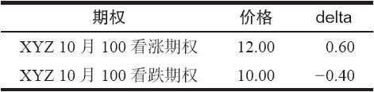
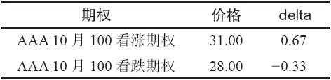

# 37.3　对中性的影响

一个流行的使用delta的概念是“delta中性”价差，这个价差的盈利性应当同市场的运动没有关系，至少在短时间内和有限的股票价格变化中是如此。任何显著影响期权delta的事情都会影响这种中性，从而导致delta中性的头寸变得失去平衡（或者，更可能的是，导致交易者一开始就对构成delta中性价差的因素产生错误的直觉）。

让我们使用一个熟悉的策略（买入跨式价差）作为示例。简单地说，当投资者买入一手跨式价差，他就是买入一手看跌期权和一手条款相同的看涨期权，没有什么时髦的地方。不过，有可能出现的情况是，因为涉及期权的delta，这个方法有向上的偏向，因此，应当建立一手中性的跨式价差。

【示例37-6】假定XYZ的交易价是100，期权的隐含波动率是40%，投资者考虑买入一手6个月的行权价为100的跨式价差。下面的数据总结了这个情况，包括了期权的价格和delta。

XYZ普通股股票：100；隐含波动率：40%

请注意，股票价格同行权价是相等的（100）。不过，delta并不完全相等。事实上。看涨期权的delta是看跌期权delta的1.5倍（就绝对值而言）。投资者必须买入3手看跌期权和2手看涨期权来建立一个delta中性的头寸。

大部分有经验的期权交易者都知道，一个平值看涨期权的delta比一个平值看跌期权的delta要高一些。因此，他们常常不经核对就认为买入3手看跌期权和2手看涨期权是一个delta中性的“买入跨式价差”的头寸。考虑一下一个相似的情况，不过，这里的隐含波动率要高得多，例如，110%。

AAA普通股股票：100；隐含波动率：110%

这里delta中性的比率约是2：1（67除以33），而不是前面示例里的3：2，尽管两个股票的价格都是100，两组期权离到期都还有6个月。两者之间的重要区别是delta中性的比率，特别是如果投资者交易的是大量的期权。这就显示出不同水平的隐含波动率是如何改变投资者对什么是中性头寸的看法。它同时也指出，投资者不能仰赖于他的直觉；最好的做法始终是使用模型进行核实。

将这种看法再推进一步，投资者如果想要保持他的头寸delta中性，他就必须注意隐含波动率的变化。如果AAA期权中的隐含波动率有显著的下降，2：1的比率就不再是中性的，即使股票仍然在价格100上交易。因此，一个想要保持delta中性的交易者不但必须监控股票价格的变化，而且必须监控隐含波动率的变化。对更复杂的策略来说，交易者也会发现因为隐含波动率的变化，delta中性的比率也会发生变化。

前面的示例总结了会影响vega的主要变量，也显示了vega是如何影响除了它自己之外的其他因素，像是delta，从而影响到delta的中性程度。顺便说说，标的物的vega是零：从理论上说，隐含波动率的增加对标的物的价格根本没有影响。在现实中，如果期权非常昂贵（也就是说，隐含波动率扶摇直上），它通常将交易者带入股票交易，因此股票的价格也会发生变化。不过，这不是数学上的关系，而是市场的因果关系。
