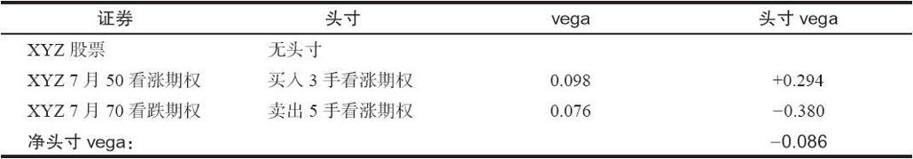

# 37.4　头寸vega

正如通过delta或者模型中任何其他偏导数可以做到的那样，交易者可以计算出一个头寸vega，也就是整个头寸的vega。决定一个头寸vega的方法是用买入或卖出的期权的数量去乘以单个期权的vega。“头寸vega”只是持有头寸的数量，乘以vega，乘以每个期权所对应的股份数（这通常是100）。

【示例37-7】使用简单的看涨期权价差作为一个示例，假设有下面的价格存在：

对一个波动率交易者来说，这个概念非常重要：因为它可以告诉他，他构建的头寸是否会按照他所希望的方式活动。例如，假定投资者发现了价格很高的期权，他觉得隐含波动率会下降，最后会变得与历史的正常状态更为一致。于是他想要建立一个负值头寸vega的头寸。一个负值头寸vega标志着这个头寸在隐含波动率下跌时可以获利。反过来，一个隐含波动率的买家，也就是一个发现某种定价过低情况的交易者，想要构建一个正值头寸vega的头寸，因为这样的头寸在隐含波动率上升时就会获利。无论是哪种情况，其他的因素，例如delta和离到期的时间等，都会对这个头寸的实际盈利金额发生影响，但是，头寸vega的概念对一个波动率交易者来说仍然是重要的。例如，如果发现了便宜期权，然后建立某种头寸vega为负值的奇怪价差，那就没有道理。这样的头寸同交易者想要（在这个情况里，买入便宜期权）的目的是背道而驰的。
