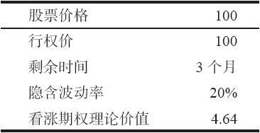
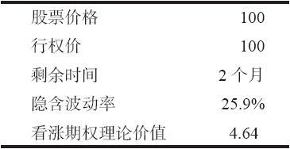
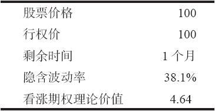
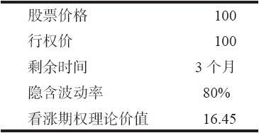
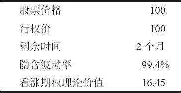
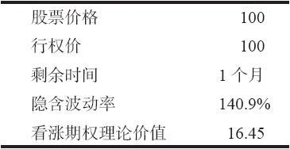
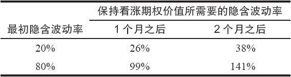
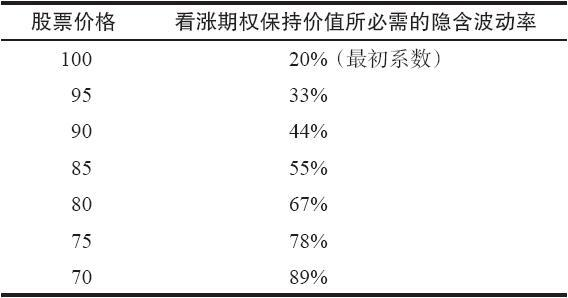

# 37.5　直接买入和卖出期权

让我们现在开始考察隐含波动率对各种策略的影响，首先从最简单的策略开始，也就是直接买入期权。我们已经说明，隐含波动率用直接的方式影响单个看跌期权和看涨期权的价格。也就是说，隐含波动率的增长会导致期权价格的上涨，隐含波动率的下降会导致期权价格的下跌。这个信息是最重要的信息，因为它告诉了期权交易者他需要知道的东西：隐含波动率的爆发性增长是期权持有者的福音，但是，对期权卖出者来说则有可能是一场灾难，特别是对裸期权的卖出者。

用一些示例也许可以将隐含波动率的影响之大说清楚，这个影响即使在期权离到期只剩下不多的时间时也是如此。交易者应当懂得这样的概念：波动率的增长可以克服几天甚至几个星期的因时减值。第1个示例想要将这个概念在某种程度上加以量化。

【示例37-8】假定XYZ在100的价格上交易，交易者对分析一个3个月的行权价为100的看涨期权有兴趣。此外，假定隐含波动率目前是20%。根据这些假设，布莱克–斯科尔斯公式告诉我们，这个看涨期权应当在4.64的价格上交易。

现在，假定时间过了1个月。如果隐含波动率保持不变（20%），这个看涨期权由于因时减值而会丢失将近1点的价值。那么，如果想要完全抵消由于因时减值而带来亏损，隐含波动率需要上涨多少呢？也就是说，在过了1个月之后，在什么样的隐含波动率上这个看涨期权才会仍然价值4.64呢？结果证明它需要在接近26%的地方。

如果再过1个月会发生什么情况呢？当然，有这样的隐含波动率，它可以使得这个看涨期权的价格仍然是4.64，不过，它会高到不合理的地步。事实上，如果隐含波动率增加到38%，这个看涨期权会仍然价值4.64，即使离到期只剩下1个月。

这样，如果隐含波动率在第1个月从20%增长到26%，那么这个看涨期权就仍然会在同样的价格上交易：4.64。隐含波动率出现这样的增长并不少见：从20%到26%这样幅度的增长是经常可以看到的。在下一个月里要它从26%增长到38%，这样的可能性或许要小一些，但并不是绝对不可能。在过去出现过许多产生这样的增长的可能性，例如，在任何8月、9月或10月的熊市或小崩盘里。此外，如果在这个股票上有兼并的传言，或者，如果整个市场变得波动性很大，就像在20世纪90年代的后半期，那么，就有可能出现这样的波动率增长。

也许这个示例是被这样的事实所扭曲了的：一开始的20%的隐含波动率是一个相当低的数字。如果从一个高得多的隐含波动率开始，例如，80%，那么，事情会怎么样呢？

【示例37-9】这里的假设同前面示例里的一样，不过，现在将隐含波动率设在一个高得多的水平上：80%。布莱克–斯科尔斯模型给出这个看涨期权的价格会是16.45。

同样，我们必须问相同的问题：“如果过了1个月，隐含波动率需要多高，布莱克–斯科尔斯模型才会产生16.45的价格呢？”在这个情况里，隐含波动率刚好超过99%。

最后，为了将这个示例同前面的示例进行完整的比较，有必要看一看隐含波动率必须上升到什么水平，才能够抵消另一个月的因时减值。它必须在140%之上。

表37-4总结了这些示例的结果，显示出在时间流逝的过程中，为了保持这个看涨期权的价格，隐含波动率必须上升到的水平。

比起前面的示例来，后面示例里出现的波动率的增长是不是可能性更小呢？也许是这样，对最后那个示例更是这样。最后的示例中，隐含波动率必须从80%上升到140%才能保持看涨期权的价值。不过，在另一种意义上，它似乎有它的道理：注意一下，波动率从20%上升到26%是一个30%的增长。也就是说，20%乘以1.30等于26%。这就是在第1个月为了保持这个看涨期权的价格对较低的波动率的要求：隐含波动率的一个幅度为30%的增长。不过，在更高的波动率上，只需要25%（80%到99%）的增长。因此，按照这样的条件，这两者看上去更为相等。

表　37-4

使得表37-4的上面的一行看上去比底部的一行更有可能的只不过是这样的事实：有经验的期权交易者知道许多股票的隐含波动率很轻易地就会在20%~40%的范围内上下起伏。可是，很少有股票的隐含波动率会高到上面那个较高的范围。事实上，在网络股在20世纪90年代后半期变得火热之前，有这种波动率的只是价格很低、波动率极大的股票。因此，交易者对这样的高隐含波动率的股票没有多少经验，但是，这并不意味着出现在表37-4中的波动率的起伏没有可能。

如果读者能够接触到包含布莱克–斯科尔斯模型的软件程序，他可以对其他的情况进行测试，看看隐含波动率的影响是如何大。例如，掠过细节，读者可以使用一个12个月的期权作为示例，这个期权最初的隐含波动率是20%。为了将这个看涨期权的价值在6个月的时段里保持不变，所需要的只是将隐含波动率增加到27%。从期权卖出者的角度来看，这或许最能说明问题。如果你卖出一个1年的（LEAPS）期权，而且时间过去了6个月，在这段时间里隐含波动率从20%上升到了27%（这显然有相当大的可能），你就会一分钱都赚不到！此时，如果股票的价格还是一样的话，那么这个看涨期权的价格就还是一样的。

最后，我们在前面提到过，隐含波动率常常在市场崩盘中猛然上涨。事实上，交易者可以计算出为了在未来保持这个看涨期权的价值，隐含波动率在市场崩盘中必须增长多少。这同这一节里第1个示例相似，不过现在股票的价格也会降低。表37-5显示的是，在股票价格下跌时，为了保持这个看涨期权的最初价值（4.64的价格）需要有什么样的隐含波动率。其他因素同前面一样：剩下的时间（3个月）、行权价（100）和利率（5%）。同样，这个表格显示的是在同一时刻的价格变化。在现实生活中，需要有略为高一些的隐含波动率，因为每一次市场崩盘都要持续1或2天。

表　37-5

因此，从表37-5里，交易者可以说，即使标的股票在1天之内下跌了20点（在这个情况中是20%），而隐含波动率与此同时从20%猛升到67%，这个看涨期权的价格就不会发生变化！这种极端的事情曾经发生过吗？它确实发生过。在1987年崩盘时，市场在1天之内下跌了22%，而波动率指数（VIX）在1天内在理论上从36%上升到150%。事实上，因为隐含波动率的暴涨，尽管出现了历史上最糟糕的市场崩盘，某些OEX期权的看涨期权买家实际上做到了亏损和盈利相互抵消，甚至赚了一点钱。

即使没有说明其他的问题，这些示例至少应当使得读者知道，在建立一个期权头寸的时候，意识到隐含波动率的存在有多么重要。如果你是买入期权，而且你在隐含波动率是“低”的时候买入它们，那么，如果在你持有这些期权期间隐含波动率只是恢复到“正常”水平，你就可以获利。当然，标的物价格的增长也是重要的。

反过来，期权的卖出者在期权最初卖出的时候必须对隐含波动率保持警惕，也许比期权的买家更要保持警惕。对裸期权卖出者或备兑期权卖出者来说，这一点很重要。如果在卖出期权的头寸建立起来时隐含波动率“过低”，那么，隐含波动率的增加（或者更糟，暴涨）对这个头寸就有很大的威胁。它可以完全抵消掉因时减值的效果。因此，一个期权卖出者不应当只是因为他认为可以每天从消逝的时间中积累因时减值而卖出期权。这有可能不错，但是，隐含波动率的增长有可能完全压倒由于因时减值而存在的盈利，特别是对较长期的期权来说，更是如此。

与此相似，隐含波动率的降低同样也是重要的。因此，如果看涨期权的买家买入“太贵”的期权，也就是隐含波动率“过高”的期权，那么，即使标的物朝对他有利的方向有少量的运动，他还是有可能输钱。

在下一章里，我们将讨论期权的买家或卖家应当如何衡量隐含波动率，以决定它究竟是“过低”还是“过高”。现在，掌握这个总的概念就够了：隐含波动率的变化对期权的价格会有显著的影响，这个影响比时间消逝的影响要大得多。

事实上，所有这些导致了这样的问题：究竟什么是时间价值？一个期权价值中不是内在价值的那部分受到波动率的影响实际上比因时减值的影响还要大，而这部分的价值还是被称作“时间价值”。
