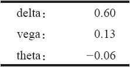
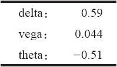

# 37.6　时间价值是一个误称

许多（或许是新入门的）期权交易者似乎认为时间是期权买家的主要敌人。不过，如果交易者对这一点进行认真思考的话，他就应当意识到期权的不是内在价值的那一部分价值同股票的价格运动或波动率的关系实际上比同任何其他东西的关系更紧密，至少在短期内是如此。因为这个理由，更仔细地分析一下一个期权的“多余价值”部分代表的究竟是什么，以及为什么买家不应当将它主要看作是时间价值，也许是有好处的。

一个期权的价格是有两个部分构成的：（1）内在价值，它是期权价值中的“真实的”部分，也是一个期权的实值程度；（2）“多余价值”，它常常被称作是时间价值。影响到一个期权的“多余价值”部分的实际上有五个因素。时间最终会主导所有这些因素，但是，这个期权的存续期越长，其他因素对“多余价值”的影响就越大。

影响这个多余价值的五个因素是：

（1）股票价格的运动；

（2）隐含波动率的变化；

（3）时间的消逝；

（4）股息（如果有的话）的变化；

（5）利率的变化。

每一个因素都是以运动或变化来表述的，也就是说，它们都不是静止的东西。事实上，交易者使用“希腊字母”来衡量它们：delta，vega，theta（没有指派给股息的“希腊字母”）以及rho。典型地说，股息和利率中变化的影响很小（尽管大幅度的股息变化或利率变化会造成一个期限很长的期权的价格变化）。

如果所有条件都保持静止不变，那么，因时减值最终会抹去一个期权的所有的多余价值。这就是为什么它被称作时间价值的缘故。但是，保持静止不变的事物是没有的，如果以日计算的话，因时减值的影响很小，因此，剩下的那两个因素就是最重要的。

【示例37-10】XYZ 11月下旬的交易价位是82。1月80看涨期权的交易价是8。因此，内在价值是2（82减去80），多余价值是6（8减去2）。如果股票在1月到期时价格仍然为82，这个期权的价值自然就只有2，你可以说，6点的多余价值由于因时减值而亏损掉了。但是，在11月下旬的那一天，其他的因素所起的作用要大得多。

在这具体的那一天，这个期权的隐含波动率刚好在50%之上。交易者可以决定这个看涨期权的希腊字母代表的价值是：

这就意味着，例如，因时减值每天只有6美分。随着时间的消逝它会增加，但是，即使过了一两天，除非波动率增加或者股票运动到离行权价更近的价位，theta不过增加到20美分之上。

从上面的数字里我们可以看到（这应当可以凭直觉感觉得到），影响这个期权的最大的因素是股票价格的运动（delta）。这样说有一点不公平，因为可以想到（虽然不太可能）波动率有可能会大幅度上弹，在这个期权的1天的运动中成为比delta更重要的因素。此外，因为这个期权主要是由多余价值构成的，这些更具主导的力量对多余价值的影响就比因时减值要大。

在vega同多余价值之间有一种直接的关系。也就是说，如果隐含波动率上升，这个期权的多余价值的部分也会上升，如果隐含波动率下降，多余价值也会下降。

delta同多余价值之间的关系不是那么直接。股票价格运动到离行权价越远的地方，它对多余价值的缩减就有越大的影响。如果这个看涨期权是实值的（就像在上面那个示例里那样），那么，股票价格的增加会导致多余价值的减小。也就是说，一个深度实值的期权主要是由内在价值构成的，它的多余价值相当小。不过，当一个看涨期权是虚值的时候，效果刚好相反。这时，股票价格的增加会导致多余价值的增加，因为股票价格的增加将股票带到离期权行权价更近的地方。

对有些读者来说，下面所说的也许可以帮助将这个说法概念化。delta部分对多余价值的影响是这样的：

虚值看涨期权：delta100%地影响到多余价值。

实值看涨期权：“1.00减去delta”影响到多余价值。（因此，如果一个看涨期权实值程度很深，而且它的delta是0.95，那么，这个delta只有0.05，也就是1.00减去0.95的增长空间。所以，它对在这个深度实值的看涨期权所剩下的数量很小的多余价值没有多少影响。）

这些关系自然不是静止不变的，例如，假定在一个与上面相同的情况里，股票在82的价格交易，1月80看涨期权的交易价为8，不过，离期权到期日只剩1个星期！这样的话，隐含波动率就是155%（很高，但在高波动期间不是没有听说过）。不过，在这个情况里，这些希腊字母值之间的关系就有很大的不同：

这个非常短期的期权，它的delta同前面示例里的delta相似（一手平值期权的delta一般都是略高于0.50）。与此同时，vega缩小了。在这样短期的期权中波动率变化的效果实际上大约是前面示例里的效果的1/3。不过，因时减值变得非常大，在这个期权中占到了每天半个点的程度。

这样，现在读者对于多余价值是如何被股票价格运动、隐含波动率变化和时间消逝这“三大因素”所影响应当有个概念。交易者如何利用这种情况呢？首先，交易者可以看到，一个期权的多余价值也许更多地来自标的股票的潜在波动率，因此来自期权的隐含波动率，而不是时间。

由于上面的有关多余价值的信息，交易者不应当认为他可以随意地卖出看上去有许多多余价值的期权，然后指望时间流逝给他带来盈利。事实上，有可能有很高的波动率（实际的和隐含的）在相当长的一段时间内将多余价值保持在相同的水平。事实上，在后面论述波动率评估的章节里，我们将会证明，与人们传统的看法相反，期权的买家有更好的机会获得成功。
