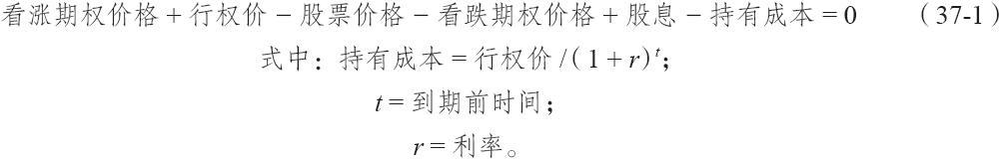
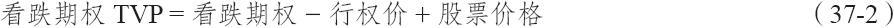
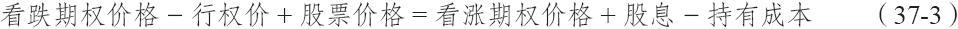
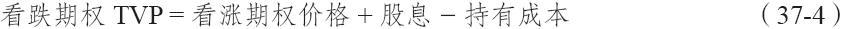

# 37.7　波动率同看跌期权

同前面的讨论显示出的看涨期权的情况相似，在看跌期权中，隐含波动率的增加显然也会导致价格的增长，不过，由于看跌期权同看涨期权之间有一定区别，因此，在这里对看跌期权自身做一点考察还是有用的。一个看跌期权在它变成实值期权之后，往往会很快失去它的权利金。这是因为转换组合。在转换组合中，套利者或做市商买入股票和买入看跌期权，同时卖出看涨期权。如果他将这个头寸一直保持到到期日，他就必须就在建立头寸时出现的支出支付持有成本。另外，他可以得到在他持有这个头寸期间为股票支付的股息。我们在讨论套利的那一章里以略为不同的形式提到过这一点，在这里我们再重复一下：

在一个完美的世界里，所有的期权价格都如此精确，转换组合完全无钱可赚。这就是说，事情将像式（37-1）所描写的那样：

现在，我们已经知道，看跌期权的时间价值是它的超出内在价值的价值。实值看跌期权的内在价值只不过是行权价同股票价格之间的差额。因此，交易者可以为实值的看跌期权的时间价值（TVP）写出式（37-2）：

套利式（37-1）可以改写为：

用式（37-2）来取代式（37-3）中的项，交易者就可以得出：

换句话说，实值看跌期权的时间价值等于（虚值）看涨期权的价格，加上在到期前可以得到的股息，再减去在同一时段的持有成本。

假定股息很小或者是零（正如在大多数股票上那样），交易者可以看到，凡是在持有成本大于虚值看涨期权价值的时候，实值看跌期权就会丧失时间价值。因为这些持有成本可以相对较大（持有成本是为这个头寸的支出所付的利息，而这个支出差不多同行权价相等），它们可能迅速超过虚值看涨期权的价格。因此，实值看跌期权的时间价值消失得相当快。

对于看跌期权的买家来说，这是一个重要的信息，因为他们必须理解，即使股票价格下跌，看跌期权的价值增值也没有人们期望的那么大，因为看跌期权的时间价值消失得相当快。对看跌期权的卖家来说，这个信息更重要：一个看跌期权只要不再有时间价值，这个看跌期权的卖出者就面临着被指派的风险。因此，一手看跌期权远在到期之间就有被指派的可能，即使是长期看跌期权也在所难免。

现在，回到隐含波动率如何影响一个头寸这个主要议题上来，交易者可以问自己，隐含波动率的增加或减小将如何影响到式（37-4）。如果隐含波动率增长，看涨期权的价格就会增长，如果这个增长足够大，那就有可能在看跌期权中注入一些时间价值。因此，隐含波动率的增长也有可能增加看跌期权的价格，但是，如果看跌期权实值过深，隐含波动率的微小的增长未必能使得看跌期权增值。也就是说，隐含波动率的增长会增加看涨期权的价值，但是，在它增加到足以超出持有成本之前，实值看跌期权的价格将保持持平。因此，卖出的看跌期权仍然处于被指派的风险之中。
