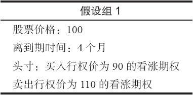
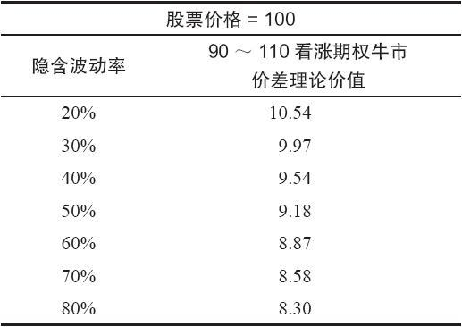
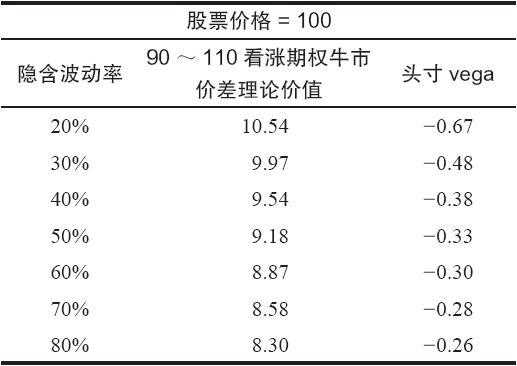
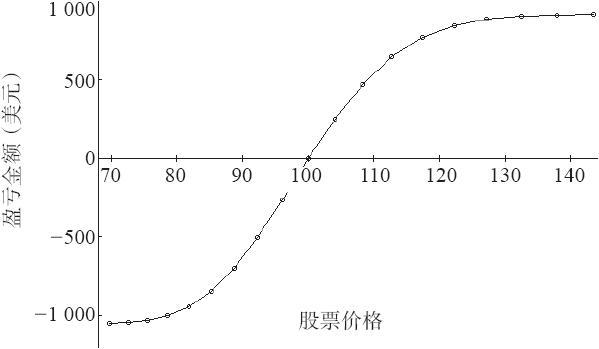
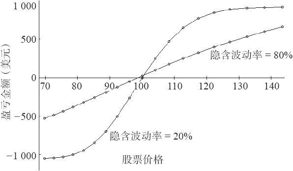
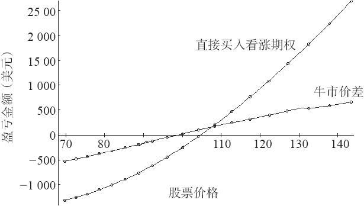
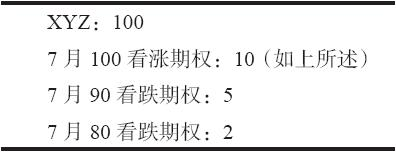
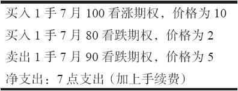
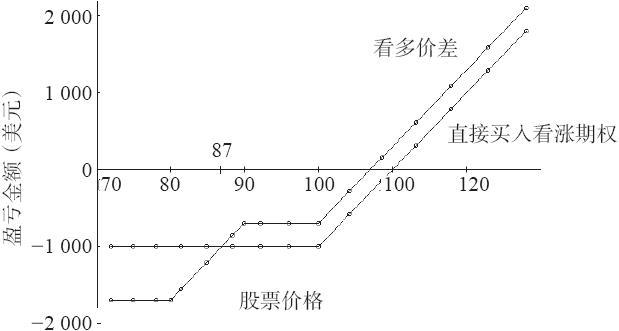
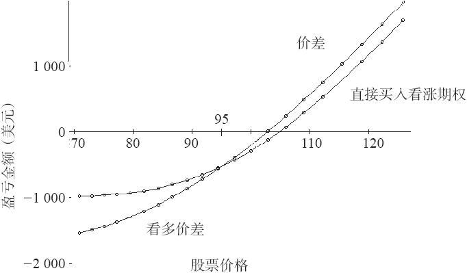

# 37.9　看涨期权牛市价差

在这一节里，我们将考察牛市价差策略。看一看它是如何被隐含波动率的变化所影响的。我们来看一个看涨期权牛市价差，看看如果其他因素保持不变，隐含波动率的变化如何影响到这个价差的价格。我们做下列的假设：

问自己这样一个简单的问题：如果股票在100保持不变，隐含波动率急剧增长，整个90~110看涨期权牛市价差的价格是上涨还是下跌？先回答这个问题，然后读下去。

事实是这样的：如果隐含波动率增加，这个价差的价格就会减小。我想，许多读者都会对这样的结论感到惊讶。表37-6包括了一些示例，它们是使用上面的假设由布莱克–斯科尔斯模型得到的。这些假设中最重要的是，在这个表格所有的示例里，股票的价格都是100。

交易者应当觉悟到，要实际按照理论价值交易这个价差或许不是一件容易的事。因为在期权中有买报价同卖报价之间的差距。不过，隐含波动率的影响是非常清晰的。

交易者可以将隐含波动率每增加1个百分点时一个期权头寸变化的数量加以量化。回想一下，这个衡量标准叫做期权的vega或期权头寸的vega。在看涨期权牛市价差中，交易者从买入的看涨期权的vega中减去卖出的看涨期权的vega，以得出这个看涨期权牛市价差的头寸vega。表37-7是表37-6的重复，不过加进了vega。

表　37-6

表　37-7

因为这些vega都是负值，它们意味着如果隐含波动率增加，价差的价值就会减小，如果隐含波动率减少，价差的价值就会增加。同样，这些说法同交易者对一个看多的看涨期权头寸的期望似乎是相反的。

当然，在股票价格保持不变的情况下隐含波动率在仅仅一天之内就有急剧的变化，这样的情况几乎不可能出现。因此，为了更好地理解应当期望什么，交易者真正需要的是看一看在未来的某个时候（例如，从现在起的两三个星期）在各个不同的股票价格上会发生什么情况。图37-3的图形是对这些更为复杂的情况进行调查的开始。

图37-3　牛市价差30天的盈利图，隐含波动率为20%

图37-3中显示的盈利曲线是以这样的假设为基础的：（1）这个牛市价差仍然使用上面的假设组1中的细节；（2）买入这个价差的时候，隐含波动率是20%，而且在绘制上面的盈利图时保持在这个水平；（3）自从买入这个价差，30天过去了。在这些假设之下，这幅盈利图显示出这个牛市价差相当符合交易者的期望。也就是说，这条曲线的形状同一个牛市价差在到期时的形状很相像，只是如果你仔细看一下的话，可以发现它在股票高于110或低于90（也就是这个价差所使用的行权价）之前，并没有扩展到最大的潜在盈利或亏损。

现在，观察一下如果只有一个因素发生变化而其他假设不变的话会发生什么样的情况。在这个情况里，假设在买入这个价差时隐含波动率是80%，在一个月之后仍然保持在80%。图37-4显示了这样的比较。80%的曲线覆盖在先前显示的20%的曲线的顶部。这个比较相当明显。使用80%的隐含波动率的盈利曲线几乎是一条平直线，只是略为向上倾斜。比起较低隐含波动率的曲线来，显示出小得多的潜在风险和收益。这就指出了另一个重要的事实：对波动大的股票，即使股票有显著的运动，交易者仍然无法期望一个4个月的牛市价差在存续期的第1个月会扩大或者缩小很多。更长期的价差运动就更小。

作为由此而来的结果之一，注意一下，如果在股票上涨的同时隐含波动率缩减了，盈利的可能性就会增加。从图形上看，使用图37-4，如果交易者的盈利图形从80%的曲线在图形的右侧运动到20%的曲线，这就是一个正面的发展。当然，如果股票价格下跌，隐含波动率也下跌，那么，交易者的亏损就会更加糟糕：看一下图37-4左面的图形。

图37-4　牛市价差30天的盈利图

我们可以使用结合其他隐含波动率在内的图形，不过，这会是画蛇添足。表37-6或表37-7的其他价差的盈利图可以插在图37-4显示的这两条曲线之间。

如果我们所讨论的牛市价差是看跌期权收入价差而不是看涨期权支出价差，那么，这些结论看上去也许就不那么反常了。有经验的期权交易者对这里所揭示的已经知道得很多，不过，经验不足的交易者也许会发现这个信息同他们所预期的有所不同。

对牛市价差策略可以得出一些一般的结论。最重要的一个也许是，如果使用到一只高波动的股票上，那么，即使股票按照你所希望的向上有不错的运动，价差的跨度也不会扩大多少。事实上，在隐含波动率很高的情况里，在到期日之前，牛市价差不会扩展到它最大的价格。这会使人非常烦恼和失望。

期权交易者建立牛市价差常常是因为他们感到期权“太贵”，因此，这个价差是一种降低总的投资支出的一种方法。不过，最终所付的代价很大。考虑一下这样的事实：如果股票在30天之内从100涨到了130，任何一个合理的4个月的买入的看涨期权（也就是说，行权价在建立头寸的时候接近股票价格）都会有相当好的盈利，而牛市价差的获益则几乎不到5点。为了说明这一点，图37-5的图形将买入行权价为100的平值看涨期权同90~110牛市价差进行了比较，两者的隐含波动率都是80%。相当明显的是，在一个向上的运动中，买入看涨期权的头寸在很大程度上占据上风。当然，在股票下跌的时候，买入看涨期权的表现就较差，但是，因为这些是看多的策略，我们有理由假设这个交易者在建立这个头寸时对市场的前景是持正向的态度。因此，在下行方向所发生的情况不是他主要考虑的方面。

图37-5　买入看涨期权同牛市价差30天相比，隐含波动率为80%

牛市价差和买入看涨期权也有着相反的头寸vega。也就是说，隐含波动率的上升会对买入看涨期权的策略有利，但是对牛市价差不利（反过来也一样）。因此，买入看涨期权和牛市价差根本就不是非常相像的头寸。

如果交易者想要使用牛市价差来有效地减小买入一手平值期权的成本，那么，至少要肯定期权之间的行权价分得相当开。这样的话，如果标的物价格上涨，在牛市价差中就有合理的空间吸收一定数量的价格增值。同时，交易者也可以考虑使用两个都是虚值的行权价来建立牛市价差。这样，如果股票强势上涨，这个价差交易者就可以得到更大百分比的收益。不过，这样还是无法克服上面所说的事实。它们只会因为采取这些行动而变得没有那么严重而已。

### 是熟悉的情况吗

交易者常常会错误地相信两个头寸比事实上更为相似。例如，交易者进行了某种分析（是基本面分析还是技术分析不重要），而且得出结论，认为这只股票（或者是期货或指数）将要出现上涨运动。此外，他想要使用期权来贯彻他的策略，但是，在对实际市场价格进行考察之后，他发现期权似乎太贵了。因此，他想：“干吗不用牛市价差来代替呢？它成本低，也是看多的。”

标的物的价格相当快就涨了上去，证明这个交易者的预测是正确的，时机也抓得很好。如果标的物运动得很猛，特别是在期货市场里，那么，隐含波动率也同样会增长。如果你是买入看涨期权，那么，你就是幸运儿。但是，如果你买入的是牛市价差，那么，你不但会非常失望，而且将面临如果要等到价差跨度扩大到甚至是接近最大潜在盈利的程度，就不得不把这个价差再持有若干星期（也许是几个月）的局面。

听上去熟悉吗？每一个期权交易者恐怕都或早或晚地经历过这样的思考过程。至少，现在你知道是什么原因了：高的或者增长的隐含波动率不是牛市价差的朋友，但它是直接买入看涨期权的同盟。令人惊讶的是，许多期权交易者并没有意识到这两个策略之间的不同，他们也许认为这两个策略在性质上是相同的。

因此，在使用牛市价差的时候要小心。如果你真的认为看涨期权过于昂贵，想要降低成本，那么，试试这个策略：买入这个看涨期权，与此同时，卖出一手收入看跌期权价差（牛市价差），使用略为虚值的看跌期权。这个策略降低了看涨期权的净成本，同时保持了上行方向的潜在盈利（虽然它增加了下行方向的风险，但这个风险是固定的）。

【示例37-11】当XYZ在100的时候，交易者是看多的，想要买入7月100看涨期权，这个期权在2个月后过期。但是，在经过考察之后，他发现它们的交易价是10，也就是说隐含波动率为59%。他知道，在历史上，这个股票期权的隐含波动率的范围从40%~60%，因此，这些是非常昂贵的期权。如果他现在买入这些期权，而隐含波动率回到它的居中的50%的活动范围，那么，他就会因为隐含波动率的减少而受损。

作为一种可能的补救，他考虑在买入这些看涨期权的同时，卖出一手虚值看跌期权收入价差。这个价差产生的收入就作为降低这些看涨期权的净成本的一种工具。如果他是正确的，股票上涨了，所有这些就意如所愿。不过，在这个头寸中引进了看跌期权价差也在下行方向增加了一些额外的风险。

假定有下面的价格存在：

整个看多头寸现在就由下面的构成部分组成：

图37-6显示出了在到期时直接买入看涨期权和上面所构建的这个看多头寸的盈利性。

图37-6　到期时的盈利性

首先，读者可以看到这个牛市价差头寸的总风险是17点，它出现在当XYZ的价格在期权到期时低于80（看跌期权价差的较低行权价）的时候。当然，这比7月100看涨期权自身10点的成本要高，不过，如果交易者使用任何一种交易止损，他或许就不会有整个的17点的风险，因为他不必在股票一路跌到80之下的情况中始终留住这个头寸。同时也请注意，如果股票在到期时的价格是87，这个牛市价差头寸的亏损就是10点（同看涨期权一样）。因此，只要XYZ在到期时价格为87或者更高，这个组合头寸的风险实际上比直接买入看涨期权更小。因为交易者在建立这个策略时应当是看多的，他完全有可能预计股票在到期时应当是87或者更高。

图37-7提供了另一种比较，这是两个头寸在过了30天之后的比较。注意一下，价差头寸又一次在上行方向表现较好，在下行方向风险较大。两条曲线的交叉点在价格95左右。也就是说，如果XYZ在30天后高于95，牛市价差头寸的表现会好过买入看涨期权的策略。

关于所需要的投资，还有最后一点应当说明。直接买入看涨期权需要一笔1000美元的投资，也就是买入期权的成本。这个牛市价差头寸需要1000美元，加上这个价差的700美元（行权价之间的区别，减去从卖出这个价差得到的3点收入），总的是1700美元，这也是这个牛市价差头寸的风险。因此，取决于股票上涨的程度，直接买入看涨期权的收益率也许会更好。

图37-7　两个头寸在30天后的结果

总的来说，这个牛市价差头寸相对直接买入看涨期权来说是一个有吸引力的选择，特别是当这个看涨期权是定价过高的时候。如果标的股票大幅度下跌，这个价差确实有亏损更多钱的风险。不过，如果交易者真是看多的，而且，如果交易者在整个头寸上使用一个合理的、严格的下行方向的止损，这个价差可以产生比直接买入定价过高的看涨期权更出色的表现。
