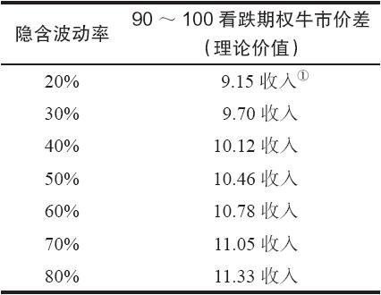
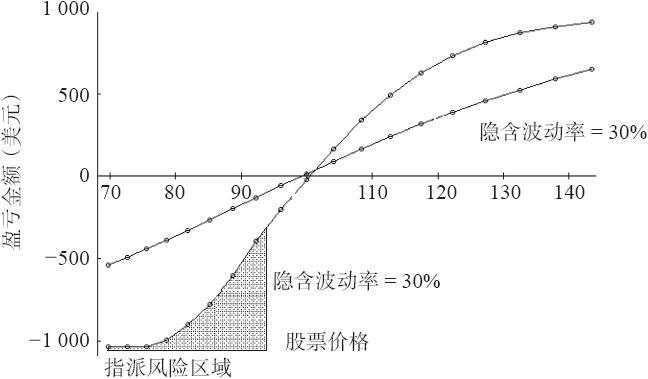

# 37.10　看跌期权垂直价差

令人同样感兴趣的是隐含波动率对看跌期权价差的影响。一种流行的使用看跌期权的策略是卖出收入价差：用看跌期权构成的牛市价差。假定一只股票的售价是100，交易者将要卖出一个行权价为110的看跌期权，同时买入一个行权价为90的看跌期权。这是一个看跌期权收入（牛市）价差。同时假设这些期权离到期还有4个月（见表37-8）。

表　37-8

如果隐含波动率低到20%，如果考虑周到的话，交易者就不应当卖出这个收入价差，因为在这样低的隐含波动率上，这个实值的12月110看跌期权在10美元上交易（持平价格），因此立刻就面临提前指派的风险。不过，可以看到，隐含波动率的增长增加了这个价差的价值。现在，如果交易者卖出这个价差，在隐含波动率增加的时候，他就会输钱。我们在看涨期权牛市价差中也证明了这一点：它们在隐含波动率上升时赔钱。当然，反过来，当隐含波动率下跌时，这个看跌期权收入价差就会赚钱。

30天过后会发生什么呢？图37-8显示了这两种情况：隐含波动率在30%和隐含波动率在80%。读者可以得出结论说，在30%~80%之间的隐含波动率水平的盈利图形居于图37-8显示的这两个盈利曲线之间。

图37-8　看跌期权收入（牛市）价差在30天的盈利

首先，交易者可以观察到，如果隐含波动率增加，看跌期权牛市价差不会扩展到任何接近它的最大潜在盈利的地方。在前面一节里我们在看涨期权牛市价差上也看到过相同的情况。不过，看跌期权牛市价差者落在另一个陷阱里：如果隐含波动率下跌，而且股票价格也下跌，那么很快就会出现提前指派。注意一下图形中左下角的阴影部分，从大约94的价格往下扩展。过了30天之后（这个期权还有3个月的存续期），如果隐含波动率是30%，110看跌期权（卖出的看跌期权）就会同94以下的股票按持平关系交易。因此，它就有提前指派的风险。如果隐含波动率更低的话，看跌期权就会同高得多的股票价格呈持平关系。

就自身而言，在一个股票或期货的看跌期权价差上，提前指派未必一定是件很糟的事。这里会有额外的保证金要求（因为股票必须付钱，如果是期货合约，也要支付保证金），不过，按金额看，风险仍然是相同的。当然，如果不能全额支付股票的话，额外的保证金要求有可能会压垮股票交易者，而且，提前行权也有可能增加额外的手续费。不过，在基于现金的指数期权中，在提前行权之后，会有更严重的风险增长，因为交易者只剩下了价差中的多头腿。如果期权碰巧价值很高，那么，如果标的物迅速上涨，就会有相当大的风险。事实上，在交易者将这个价差平仓的时候，他也许实际上亏得比最初有限的风险金额要多，这全都是因为提前指派。（如果标的物首先价格大跌，使得两手期权都深度实值，然后，交易者在卖出的看跌期权上被指派，接着标的物的价格又急剧上涨。）

这里的教训是：如果交易者考虑要使用其中至少有一个期权是平值或实值的牛市价差，那么，选择看涨期权牛市价差就比看跌期权牛市价差要更好。提前指派对大多数看涨期权来说并不真正是一种考虑。

不过，在这两种情况里都有一个更为严重的问题，这就是即使在股票有漂亮的看多运动的时候，价差也没有扩大。因此，同样，在大多数情况中买入一个看涨期权实际要比使用牛市价差更好，因为盈利更大，而且隐含波动率的增加对直接买入看涨期权的人来说也是件好事儿。

请注意，对虚值看跌期权收入价差来说，这些效果是相似的，但是远没有那么突出。不过还是应当注意到，隐含波动率的增长也会伤害虚值看跌期权收入价差。因此，如果标的物迅速下跌（崩盘，暴跌），那么，隐含波动率通常会迅速地急剧上升。因此，虚值收入价差的交易者就受到增长的隐含波动率和标的物迅速接近他的期权的行权价从而扩大了这个价差的价格这个事实的双重打击。
