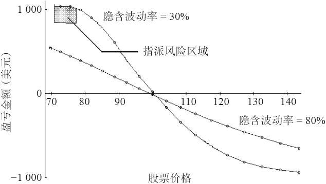

# 37.11　看跌期权熊市价差

那么，在熊市情况中的看跌期权价怎么样呢？在一个看跌期权垂直价差中，交易者买入行权价较高的看跌期权，卖出行权价较低的看跌期权，以构建一个简单的看跌期权熊市价差。实际上，隐含波动率的突然上涨对这个看跌期权熊市价差是有帮助的。这就是说，这个价差的价格会略微扩大。要证实这一点，再看一看表37-8，这一次，只是想象交易者是在使用支出买入这个价差。注意一下，在波动率较低的时候支出最小（当隐含波动率是30%的时候，支出是9.15）。如果隐含波动率立刻就上弹到80%，这个价差就会扩大到11.33的支出，就形成了一笔快速盈利。所以，马上就可以看出一个支出看涨期权牛市价差（它在隐含波动率突然增长时会赔钱）同一个支出看跌期权熊市价差之间的区别。

图37-9　看跌期权熊市价差在30天的盈利

不幸的是，另一个主要缺陷（如果标的物出现有利的运动，这个价差并不扩大）仍然是事实。图37-9显示了一个看跌期权熊市价差，30天之后，两个不同的隐含波动率。同样，较低的隐含波动率的价值扩大得较快，因为两个期权在这个情况里都倾向于变为持平。事实上，你在图形上可以看出，在低波动率的情况里，在股票价格大约低于77的地方，有提前指派的风险。不过，这不是问题，因为在这样的情况里，价差已经扩大到最大的可能限度，如果出现提前指派的风险，只要将头寸平仓就可以了。

不过，当隐含波动率保持在高位的时候，这个价差并不扩大多少，即使股票在30天之后下跌了许多。当标的物迅速下跌时，隐含波动率上升（甚至猛涨）是常见的事，因此，看跌期权熊市价差的价格或许不会扩大多少。这也许不是在心理上让人痛快的策略，因为在标的物迅速下跌时，交易者并没有得到他希望得到的那个水平的盈利。

同样，这里似乎也是直接买入一手期权或许比一个价差更好。在这些情况里，正如同看涨期权一样，这样的说法在看跌期权中也是对的。价差常常使得一个交易者对问题的看法变得无必要地复杂起来。
