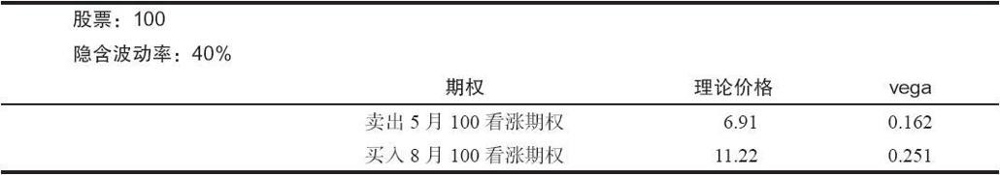
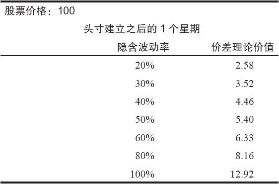
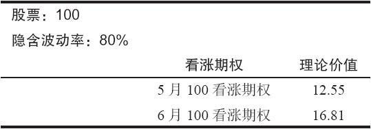

# 37.12　跨期价差

在前面论述跨期价差的那一章里，我们提到，隐含波动率的增加会导致跨期价差价格的扩展。当然，两个期权都会变得更为昂贵，但是，长期期权的绝对价格变化会更大。因此，跨期价差的价格会扩展。这听上去同直觉好像相反，特别是涉及高波动率股票的地方，因此，举一些示例应当有用。

【示例37-12】假定XYZ的交易价是100，交易者对一个跨期价差有兴趣，这个价差买入1手8月（5个月）看涨期权，卖出1手5月（2个月）看涨期权。为了这个示例的目的，假设这些都是平值期权。首先，我们要考察这两个期权的vega，假定隐含波动率是40%：

在理论上，这个价差应当价值4.31，也就是理论价值之间的差异。更重要的也许是，它的波动率暴露是0.089，即买入看涨期权的vega同卖出看涨期权的vega之间的差异。因为vega是正值，这就意味着隐含波动率的增加对这个价差有利。换句话说，如果隐含波动率增加，交易者可以期望期权之间的价差会扩大，如果隐含波动率降低，他可以期望期权之间的价差会缩小。

我们也可以构建下面的表格，以显示这个价差在隐含波动率的不同水平上的理论价值。这个表格假设在隐含波动率发生变化之前只过了很短的时间（只有1个星期）。它同时假设股票的价格仍然是100。

从上面的数据里可以明显地看出隐含波动率的水平对一个跨期价差的价值有非常大的影响。相比之下，因时减值的最初的实际影响则相当小。例如，注意一下，如果波动率在40%保持不变，那么，在过了一个星期之后，价差只会略为扩展，从4.31到4.46。同波动率的增长或缩减导致的变化相比，这是一个很小的数目。

跨期价差交易者常犯的一个错误是认为这样的价差在高波动股票上极度具有吸引力。考虑一下上面的同一只股票，仍然在100的价格交易，不过，由于某种原因隐含波动率猛升到80%（也许是因为有兼并的流言）。

从表面上看这是一个非常具有吸引力的价差。5月期权离到期还有2个月（6月合约还有3个月），这个价差当前的价格是4.26。不过，这两个期权都完全是由时间价值组成的，而且，在5月期权到期时，如果股票价格仍然在100左右的话，6月100看涨期权的价值极有可能远远超出4.26。许多交易者在用这种方法考虑这个价差时没有注意到的事实是，如果隐含波动率能够保持不变，6月看涨期权将会只值“远远超出4.26”。如果这只股票在正常情况下隐含波动率是在40%左右，那么，预期这个80%的水平会保持不变，也许就不够合乎理性。做一个比较，注意一下，如果这个股票在5月到期时是100（这是这样一手跨期价差的最大的潜在盈利），那么，6月100看涨期权，在隐含波动率为40%以及离到期还有1个月的情况下，它的价值就只有4.77。因此，这个价差就只有几美分的盈利（从4.26到4.77），而且，如果股票价格在到期日距离行权价很远，就有可能出现亏损而不是盈利。

这里要记住的是，一个跨期价差是一个“买入波动率”的游戏（而一个反转组合跨期价差则刚好相反）。对这个头寸进行评价时，要注意到隐含波动率会发生什么情况，而不仅仅是股票的价格有可能在什么价位或者在这个头寸中会有多少因时减值。
