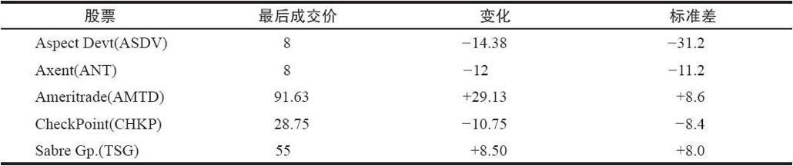
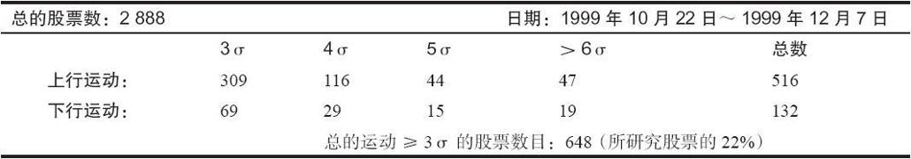
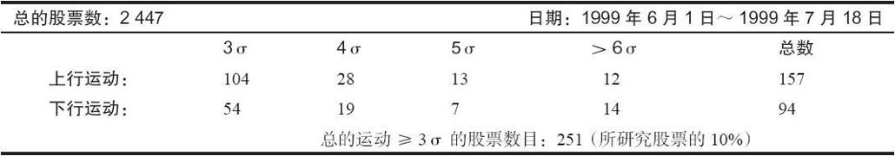
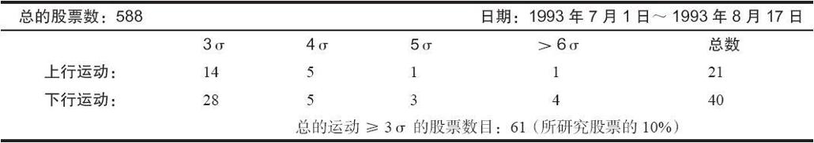

# 38.1　关于波动率的错误概念

在许多金融分析的领域，统计学被用来评估股票（以及期货和指数）的价格运动。许多作者写了大量的论著来讨论如何使用概率来帮助选择有效的期权策略。股票共同基金的经理们常常通过对波动率的评估来帮助他们决定投资组合的风险程度。这样的做法很常见。不幸的是，几乎所有这些运用都是错的！也许说它们“错”了，说得有些过重，但是，几乎所有对股票价格运动的估量全都过于保守。如果交易者在卖出裸期权，或者是其他类似的需要避免高波动价格运动的策略而使用这样的估量的话，那将是极其危险的。

如果你对数学分布不是很熟悉，那么，你应当知道，对数正态分布通常被用来描写股票价格，因为它的形状直观地同股票的行为方式相似：它们不可能低于零，它们可以无限地上升，在大部分时间中它们没有太大的变动。除此之外，分布的形状所根据的是标的工具的历史波动率。在对数正态分布中（正态分布也一样），股票价格在99.74%的时间内保持在离它们目前的价格3个标准差之内的范围内。一个标准差（sigma）是一种统计学的衡量方法，它的绝对距离随着时间而增加，它也是所有股票或期货合约中的某种可以通过使用历史价格而很容易计算出来的东西。

股票的实际行为方式同许多数学模型对股票理论行为方式的假设之间有很大的区别。问题在于，假设正态或对数正态分布可以预测股票的价格运动。这样的假设排除了偶尔会出现的这样的交易日的可能，在这些交易日里，许多股票、若干期货和相对较少的指数会经历疯狂的运动。正态分布基本上是说，股票不可能上涨或下跌超过3个标准差。事实上，根据数学，如果按照正态分布（“经典的”钟状曲线是一种正态分布）活动，运动3个标准差的概率是0.0013（或者说，略高于1‰）。因此，如果2500种股票有期权，那么，在这些股票中，在任何一个既定的交易日，你的预期应当是，它们之中大约只有3只股票会运动到3个标准差。

可是，在现实的市场交易里，股票运动超过3个标准差是正常的事。有的甚至多到5个标准差之上。从统计学上说（如果对数正态分布是正确的话），交易者在他的一生中也许只能看到一次这样幅度的运动，可是，在现实中每天都有5~10次！具体地说，按照正态分布，运动到8个标准差的概率是0.000000000000000629。这个数字是如此之小，如果价格真的是按照正态分布的，那么，自从有了宇宙到今天，你只会看到这样的情况发生一次。如果正态分布是股票价格的正确构成形态，这样小的概率就会指出，交易者在10亿个交易日中都不会看到一次8个标准差的运动。可是，你几乎在每个交易日都可以看到若干这样的运动，而且，它们未必是低价的、稀奇古怪的、从1美元跌到75美分的股票，或者是某种类似的不伦不类的东西。

如果这些数目还不足以使你相信股票不是按对数正态分布的，也许，下面的研究能够做到这一点。表38-1列举了1999年4月5日这个星期一出现的一些运动，这一天股市的波动率比较大（道琼斯指数上涨了174点）。

表　38-1

这一天有许多其他显著的运动。在表38-1的名单里，所有3个价格下跌的股票都是因为收益警告，2个价格上涨的是因为当时的网络狂热。总的来说，有55只股票的运动在那一天超过了4个标准差！这一天并不特别，虽然它是处在收益警告的季节，也是在网络狂热之中。但是，如果你仍然相信对数正态是股票价格的正确分布模型的话，那么，市场波动性较大这个事实还是解释不了这些大幅度的运动。

为了说明出现这种情况并不是特别选的示例的缘故，我们选了一个低波动率的时段。自从芝加哥期权交易所有了波动率指数（VIX）的交易以来，最低的市场波动率读数出现在1993年1月~7月之间。最低的一天是1993年7月25日。在这一天，有12只股票的运动幅度超过了4个标准差。它们包括Adaptec（ADPT）、Bethlehem Steel（BS）、U.S.Steel（X）、Chiquita Brands（CQB）和Novell（NOVL）等著名的公司。

要知道一只股票运动了多少标准差的唯一方法是在衡量中使用它的历史波动率，例如，20天历史波动率。因此，一只像Bethlehem Steel这样的波动率不大的股票在1993年的4点的运动同Ameritrade在1999年的29点的上涨（见表38-1）相比，就相形见绌了。不过，如果使用历史波动率，按照标准差来看，两者都是大幅度的运动。

我们还可以进行另一场测试。这里用来测试的是1998年10月8日的价格，这一天，在经过俄罗斯债务问题而导致的严重的快速下跌之后，市场见了底（在经过了一个星期的起伏极大的交易之后，这是波动率非常大的一天），测试的目的是要看一看有多少股票的运动幅度在4个标准差之上。有33只股票，不过，这个看上去不高的数字反映了这样的事实：许多股票的20天历史波动率到10月8日已经膨胀到一定程度。在这一天，公用事业指数（UTY）跌了14点，这大约是5.5个标准差，American Power Conversion（APCC）上涨了6点，这是一个高于5个标准差的获益。

也许你会认为，这些1天的运动不足以说明问题，在一个更长的时间里，对数正态分布是更好的说明。我们就用一个稍微长一些的时段对波动率的衡量做了一个研究。这个研究的结果不但肯定了我们的怀疑，而且，定量地给出了某些股票能够有多大的波动率，实际上更加惊人。

第1个示例是由1999年10月22日到1999年12月7日之间的30个交易日组成的。这些日子没有什么神奇的地方。它们只是碰巧是在进行这个研究中有数据的最近30个交易日的时段。

这个时段的第1个交易日是市场上相当普通的一天：波动率或许比当时市场的正常波动率要略微低一些。为了证明这个说法，应当注意到，在10月22日，CBOE的波动率指数（VIX）大约为23，这个是一个相对中等的水平。因此，这不是一个波动率很高的时段。

这个示例相当简单。我们对2900种有期权交易的股票进行衡量，看一看从1999年10月22日起，在一个30天的时段内，它们之中有没有哪一个在任何时候运动幅度大于3个标准差的。这个标准差是以每只股票的20天历史波动率为基础的。显然，如果一只股票在这个30天时段的最后一天有超过3个标准差的运动，那么，这个运动幅度会比在这个时段的第1天超出3个标准差的运动幅度要大得多。因此，在读下去之前，先猜一猜：在这30天内，有多少股票出现过超出3个标准差的运动？还记得吧，对数正态分布预测的是，没有一只股票会有这么大幅度的运动。答案就在下一段里。

在我们所说的这个时段里，在朝上方向有大幅度运动的股票比朝下方向的股票要多。这不奇怪，因为市场在这段时间是向上走的。最后的总数显示是这样的：在这个研究包括的时间内，在2900种股票之中，将近650种股票经历了3个标准差以上的运动，其中包括65种股票运动的幅度大于6个标准差。如果对数正态分布是正确的，表38-2的两行数字就会都变成零。这就明确地显示出在这个阶段中，股票的价格运动并不符合“正态”的预期。这个研究的结果显示在表38-3中（请注意，“σ”是希腊字母sigma，数学家传统上用它来表示标准差，因此“3σ”意味着3个标准差）。

表38-2　股票价格运动

最大的股票运动是一只股票在6个交易日里从价格5上跳到几乎12。最大的向下运动之一是一只股票在两个星期内从20跌到了8，其中主要的跌幅出现在两天之内。

如果你觉得这个研究有偏向，因为它所研究的是纳斯达克市场正处在强势的时候，那么，这里有另一个示例，它使用的另一组数据：在1999年6月和7月18号之间（长度也是30个交易日）的股票价格。在这段时候，大幅度的运动比较少，大约2500种股票中有大约250种的运动幅度超过了3个标准差。可是，这仍然是每10个中有1个，远远要大于如果你相信正态分布的话所会预期的。表38-3显示了结果。

表38-3　更多的股票价格运动

最后，这里还有一个示例，它使用的是在我们的数据库中波动率最小的一个时段：1993年7月。它的结果包括在表38-4里。

表38-4　波动率最小的时段中的股票价格运动

初看上去，好像在市场的这个低波动率的时段中大幅度的股票运动急剧减少，接着，你会意识到它还是代表了所研究股票的10%。1993年有场内期权的股票数目比1999年要少得多，因此，数据库中的数据也少（这个数据库只跟踪有场内期权交易的股票）。同样，这仍然意味着，比起对数正态分布所指出的几乎是零的概率来说，股票会有大幅度标准差的运动的概率实际上要大得多（大约是每10个中有1个）。
