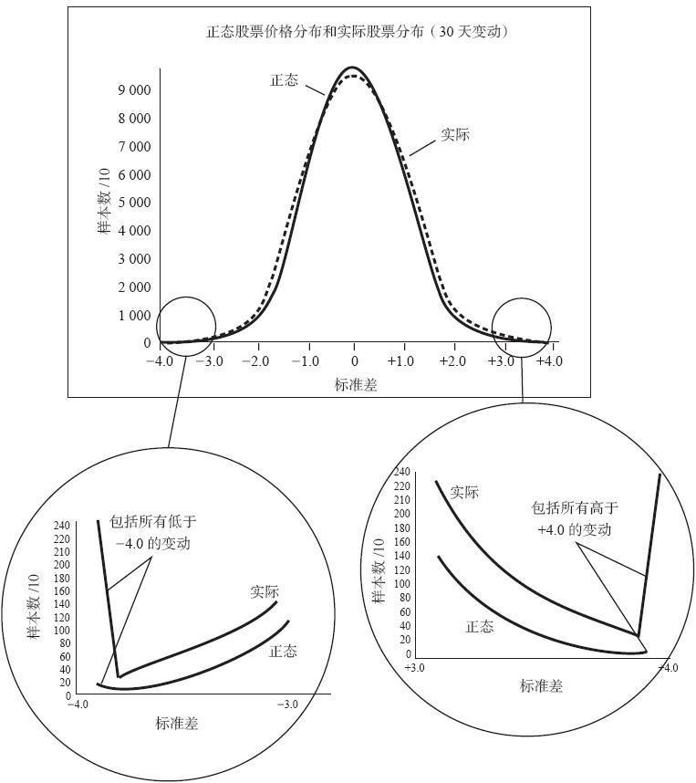
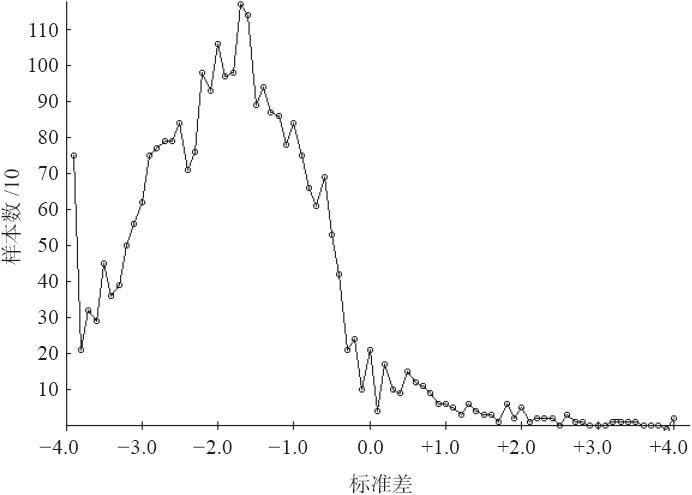
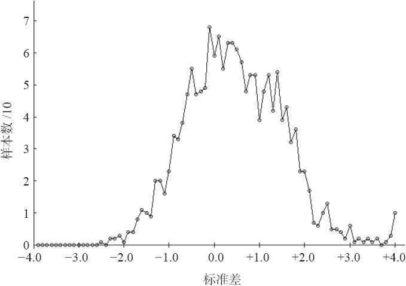
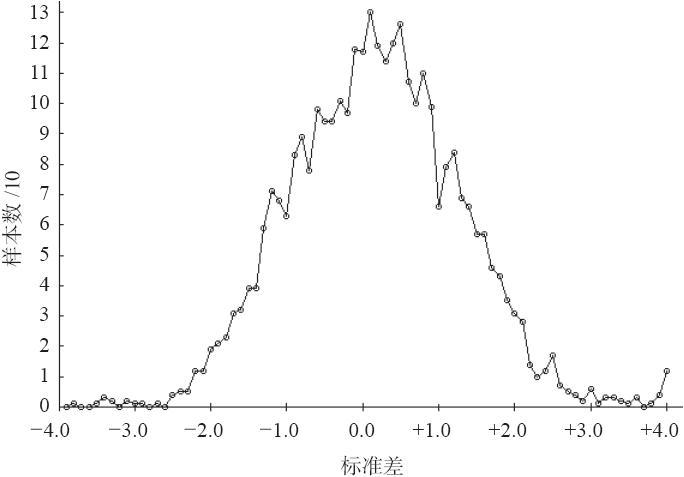

# 38.3　股票价格分布

前面的示例指出，至少在这些具体的情况里，股票价格的运动同对数正态分布是不一致的，而对数正态分布是许多数学模型用来描写股票和期权价格行为的分布模型。对数学家来说，这不是什么新消息：早在20世纪60年代中期就有文章指出，对数正态分布是有漏洞的。但是，对股票价格行为来说，这不是一个很糟的描述，因此，许多人继续在实际应用中使用对数正态来描述价格活动。

自从1987年以来，股票展现出高度的波动率，特别是在类似1987年的崩盘和2000年4月14日的小型崩盘这样暴跌的日子里，它们使得更多的人警觉到在他们通常对股票运动方式的假设中或许有什么不对的地方。对数正态分布“说”，一只股票在现实中不可能运动到3个标准差之外（不管是在一天、一星期还是一年中）。股票的实际价格运动讥讽了这样的假设，它们在一天之内常常运动4个、5个甚至10个标准差（不是所有的股票，但是许多股票是这样，多到对数正态分布的模型解释不了）。

为了进一步将这些想法定量化，我们写了一些计算机程序来分析我们的股票价格数据库中6年的数据。对于股票市场来说，这是一个相当短的时段。虽然它的长度足以提供有意义的分析（在这个分析中有250万个股“交易日”），这个时段是一个有偏向的时段，股市在其中大部分时间是向上的。

### 38.3.1　“大”画面

这个分析的第一部分显示出，股票价格的总分布同这个研究的预期是基本相符的，而且，（不奇怪）同其他人对股票价格的“真正”分布的论述也是基本相符的。也就是说，在股票价格的实际运动中，标准差幅度超过对数正态分布预测的概率要比符合对数正态分布的概率要大得多。大多数数学家和股市参与者把落在分布尾段的这种高概率现象叫做“肥尾”。就是这些“尾巴”给期权卖出者带来麻烦，或许甚至给使用杠杆的股票持有者带来麻烦，因为融资的买家和裸期权的卖出者以为这样的情况永远不会发生。对他们以及许多股市参与者来说，股市价格的这种行为方式凭直觉是觉察不到的。

图38-1中的图形显示了这个总分布。顶部的图形是对数正态分布的图形和使用1993年9月到2000年4月期间数据的实际分布图形，这两幅图形重叠在一起。实际分布是使用30天运动绘制的（也就是说，看一看某一天的股票价格，然后看一看在30个日历日之后它在哪里，以此来计算标准差的数目）。图中的x轴（底部的轴线）显示了标准差运动的数目。请注意，这个曲线的形状更接近于一个正态分布而不是对数正态分布，因为x轴表示的是标准差运动的数目而不是股票价格自身的运动。因为这个原因，在这一节剩下的讨论中，我们将使用“正态”这个词。应当明白，“正态”的是标准差的分布，由这些标准差运动所衡量的股票价格的分布是“对数正态”的。y轴（左边的轴线）显示的是“计数”，它是在我们计算的250万个数据点中，一个数据点实际在x轴上出现（在“实际”分布的情况里）或预期会出现（在“正态”分布的情况）的次数。y轴的记数法是显示实际数字被10所除。因此，例如，“正态”分布中的最高点（标准差运动的数目是0）显示了在250万次中大约有95000次，你可以预期一个股票在30个日历日中不会有变化。

初看上去，这两根曲线似乎是几乎相同的。不过，仔细检查一下，很清楚它们不是，事实上，它们之间有一些相当令人吃惊的区别。

图38-1　股票价格分布不是“正态”

### 38.3.2　肥尾

图38-1相当清楚地显示出了肥尾现象。这里提供了放大的肥尾图形，以显示理论（“正态”）分布同实际股票价格运动之间的不同。考虑一下下行的方向（图38-1左下角被圈的图形）。首先，注意一下，“实际的”和“正态的”图形在尾部（最左的那一点）都向上抬起。这是因为这个图形是截止在-0.40个标准差，所有更大的运动都积累在一起，画在最左面的那一点上。你可以看到，“正态”分布预期在250万个数据点中有少于200次运动等于或超出-0.40个标准差（是的，“正态”分布确实允许有大于3个标准差的运动，只是这样的概率非常小）。另一方面，实际股票价格（即使是牛市，在这个研究所包括的时段中，它们同样也出现）跌过-0.40个标准差的，在250万次中有2500次。因此，在现实中，将实际分布同理论分布相比，实际遭受严重下跌的机会要大到12倍以上（2500同200相比）。同时注意一下在左下角的圆圈中实际分布在图形里始终大于正态分布。

向上方向的肥尾显示出的是相同的情况。实际股票价格的上涨可以远远超过正态分布所指出的。在极端的情况里（运动+4.0个标准差以上），在实际股票价格中有2000个主要的运动，而正态分布所预期的只有100多一点。同样，这里的差别也非常大：20：1。

### 38.3.3　拐点

如果实际分布在两端出现肥尾，那么，它一定在某个地方的点数积累要低于正态分布图，因为对两者来说，这里都只有250万个点存在。在这个情况里，正态分布事实上在-2.5个标准差和+0.5个标准差之间点数比实际分布要高。这些是两条曲线的交叉点，也就是拐点（inflection point）。在这个范围之外，实际分布比预期的要更密集。

这也可能是因为这里的数据所反映的是一个非常看多的时期。也就是说，实际股票上涨得比它们预期会上涨的更远，并不一定就在尾部，而是在中间的区域，在+0.5同+1.5之间。就尾部而言，这并不改变研究的结果，不过，你也许并不是始终能够把中等上涨会出现得比预期的更频繁作为依据。

### 38.3.4　这个研究的附带好处

在进行这些分析的过程中，我们一路也计算了许多小一些的分布。其中之一是在整个研究涉及的任何一个交易日中的价格分布。现在，你必须明白，每一天的交易只能产生大约3000个数据点（在数据库里有大约3000种股票），因此，由此产生的曲线不会像图38-1所显示的曲线那么平滑。不过，有的交易日相当有趣。例如，考虑一下2000年4月14日这个星期五的小型崩盘。道琼斯工业指数这一天跌了617点；标普500指数跌了83点，纳斯达克100指数跌了346点。除了1987年的崩盘之外，这是历史上最大的一天跌幅。图38-2显示了这幅分布图形。

图38-2　2000年4月14日的股票价格分布，包括2984种股票

首先，注意一下这个分布朝左侧的倾斜，这同我们的直觉是相符的：如果出现2000年4月14日这样严重的暴跌，这个分布应当在左面。同时，注意一下最左面的数据点，它代表了所有-4.0标准差或者幅度超出它的运动，这个数据点显示出在2984只股票中有750只的运动达到了这样的幅度！这是难以置信的，它真正指出了在类似这样的日子里，裸看跌期权和融资（使用保证金）买入股票会有多么危险。没有一个概率计算器会得出同这样的现象相近的结论，可是，这样的情况确实出现了，在给其他人带来严重损害的同时，它使得持有看跌期权的人得到了巨大的好处。

除了具体日子中的分布之外，我们还为具体股票在考察时段绘制了分布图形。图38-3显示了IBM的图形，使用的数据来自同上面研究使用的相同时段（1993年9月~2000年4月）。在下一幅图形里，我们使用了更长的价格历史来绘制IBM从1987~2000年的价格运动分布。图38-3及图38-4描绘的都是IBM在30天内的运动。

图38-3或许更鲜明地显示了牛市在最后的6年多对事情发生的影响。在图38-3里有IBM的1600个数据点（也就是每天的读数），而整个分布是向右边倾斜的。在整个时段里，它显然可以相当轻易地向上运动。事实上，这里出现的最糟糕的运动是1个-2.5标准差的运动，而在上行方向则有10个+4.0或更大幅度的朝上的标准差运动。

对IBM的行为做更长一些时间的观察，考虑一下更长期的IBM的价格分布，回到1987年3月，正如显示在图38-4中的那样。

从图38-4中可以清楚地看到，同图38-3相比，这个较长期的分布同正态分布更为相符，也就是说，它有一个对称的外形，而图38-3则是明显地偏向右边的（朝上的方向）。

图38-3　股票价格分布，IBM，7年

图38-4　实际股票价格分布，IBM，13年

这两幅图形对图38-1显示的大画面有一定的意义。这个研究使用的数据库里大部分股票的数据只是回溯到1993年（IBM是一个例外）；但是，如果所有股票的概括研究都使用一直回溯到1987年的数据，那么，可以肯定，“实际”价格分布会比较对称，而不是那么偏向右边（朝上的方向）。这是因为在这个较长的阶段里，有更多的看空的阶段（1987年、1989年和1990年都有一些不那么动人的时刻）。不过，这并不改变基本的结论：股票能够运动到比正态分布所指出的边界更远的地方。
