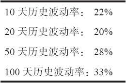
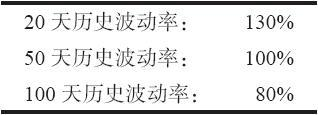
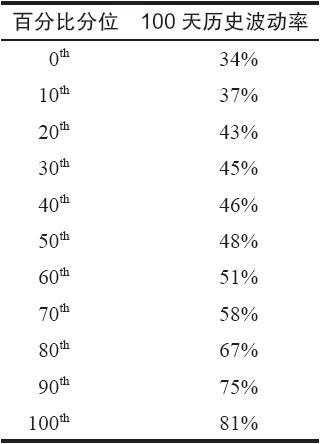
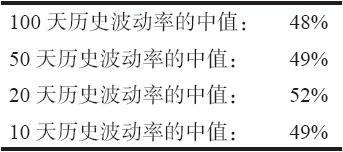
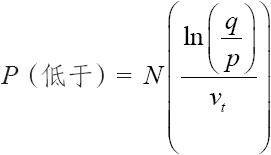
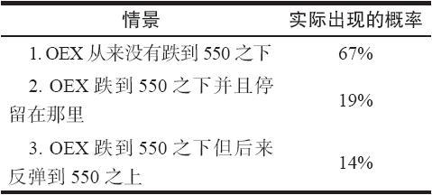
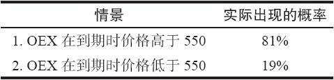
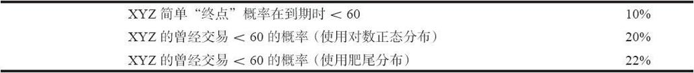

# 38.7　股票价格运动的概率

这一章介绍的有关分布的信息可以结合到更为严密的确定概率的方法中去。这就是说，交易者想要对一个股票、期货合约或指数出现一定幅度运动的概率进行估量，并且这种估量已经将价格的肥尾或其他非对数正态的行为考虑在内。

计算这种概率的软件一般叫作“概率计算器”。在市场上有许多这样的软件程序。有免费的，也有要1000美元这样离谱的高价的。在现实中，一个精通统计学的人可以创造出一个高水平的概率计算器，或者，这样的程序也可以花100美元左右的名义费用而买到。

在进入各种不同的概率估量的方法之前，应当注意到，它们全都需要交易者输入一个对波动率的估量。其他只有少数几种需要输入的数据，通常是股票价格、目标价格和研究的时段等。交易者输入的波动率自然是将来的波动率，这是一个无法确切预测的数字。尽管这样，所有的概率计算器都要求输入这个数据。因此，交易者必须记住，他从任何一个这样的概率计算器得到的结果都只是对可能发生的事情的一种估量。它不应当被看作是可以依赖的“真理”。

另外，概率计算器所作的第二个假设是：在整个研究过程中，交易者输入的波动率始终保持不变。我们知道这是不对的，因为波动率每天都在变。但是，确实没有什么好办法来对波动率在研究时段中的变化进行估量，因此，我们差不多是被迫向这种不正确的假设妥协。

就概率计算器而言，没有什么确定的办法可以解决这些波动率的“问题”，不过，一个有帮助的技巧是，使得波动率偏向于对你的目标不利的方向。这就是说，在你对波动率的预测中保持极度保守。如果事情的发展好过你的估量，没有问题。但是，你至少没有在一开始就把事情夸大了。用一个示例可以帮助说明这个技巧。

【示例38-1】假定有一个交易者在考虑买入XYZ上的一个跨式价差。这个5个月的跨式价差的售价是8，股票目前的交易价是40。一个概率计算器可以帮助他决定在期权到期之前XYZ上涨到48或下跌到32（盈亏平衡点）的机会。不过，这个概率计算器的答案在很大程度上取决于这个交易者输入这个概率计算器的对波动率的估量。假定有关XYZ的波动率有下面的已知信息。

这个交易者应当使用哪个波动率呢？他是不是因为这个跨式价差是5个月的，离到期差不多就是100天，所以就选择100天的历史波动率呢？他是不是因为20天历史波动率是大多数交易者认为“大家接受”的衡量标准，因此就选择20天历史波动率呢？他是不是应当计算出一个刚好是离到期前的天数的历史波动率，然后使用这个计算出的波动率呢？

从最保守的角度出发，上面的这些答案全都不对，至少所说的理由不对。因为交易者在这个策略中是买入期权，他应当使用上面的历史波动率衡量尺寸中最低的作为他的波动率估量。这样做，他采取的就是保守的方法。如果这个跨式价差的买入策略在这样的保守的假设下前景不错，那么，他就可以感到相当的把握，不会夸大了成功的可能性。如果后来证明在这个头寸存在的期间波动率比估计的要高，对这个由买入期权组成的头寸来说就是额外的好处。因此，在这个示例里，他应当使用20天历史波动率，因为这是他面临的4种选择中波动率最低的一种。

与此相似，如果交易者考虑的是卖出期权或者是持有一个vega为负值的头寸（这样的头寸在波动率增加时会受到伤害），那么，他进行这样的概率预测时就应当使用最高的历史波动率。这样做，他同样也是持保守的立场。如果这个策略在高波动率的假设之下，看上去仍然可行，那么，他就可以相信，在这个头寸的存续期内不至于因为更高的波动率而措手不及。

有的时候，即使使用100天的回溯时段也不足以决定历史波动率。这就是说，标的物在100天内表现得离奇和反常。它在现实中的真实性质不能由它在过去100天的运动所说明。有人会说，无论在哪种情况中，100天的时间都不足以决定历史波动率。虽然在大部分时间里，上面显示的4种波动率衡量尺度都足以给波动率提供线索。

在需要一个更长的回溯时段的时候，可以使用另一种方法：回到标的物价格的历史数据库中，计算出在数据库中数据时段的20天、50天和100天的历史波动率，或者至少是相当大一部分的过去价格。然后，使用这些波动率估量计算结果的中值。

【示例38-2】XYZ在过去几个月里表现离奇，原因是整个市场的高波动率和一系列影响到XYZ的混乱新闻事件。一个交易者想要交易XYZ的期权，但是需要对XYZ的“真正的”潜在波动率有可靠的评估，因为他认为这些新闻事件是失真的。眼下，历史波动率的读数如下。

不过，当交易者向后对XYZ的交易历史看得更远的时候，他看到XYZ的波动率通常没有这么大。因为他怀疑XYZ最近的表现并不代表它真正的长期表现，那么，在他的期权定价模型或概率计算器中应当输入什么样的波动率呢？

与其是使用上面3个数字中的最大值或最小值（取决于他是买入或者卖出期权），这个交易者决定向后看一看XYZ最近的1000个交易日。如果使用100个连续的交易日来计算出一个100天历史波动率的话，就会有901个这样的时段（从第100天开始，一直继续到第1000天，第1000天应当就是目前这个交易日）。应当承认，这些并不是完全独特的时段；在1000天的数据里只有10个不重复的（独立的）、持续的100天的时段。不过，假设我们使用的是这901个时段。于是交易者就会得到100天历史波动率的一个分布。假定它看上去像是下面的数据所显示的。

换句话说，这901个历史波动率（每个里面有100天）是整理过的，然后决定它们的百分比分位数。上面的表格只是整个百分比在哪里的一个剪影。这901个波动率的范围是从低端的34%到高端的81%。同时注意一下，从第20~60之间变化很小：100天的历史波动率在整个这一段之间是43%~51%。上面数字的中值是48%，也就是在第50分位数上的100天波动率。

回到这个示例的前面，目前的100天历史波动率是80%，同过去1000天的历史衡量相比，这是个很高的读数，肯定远远高于48%的中值。

交易者可以用相似的分析在1000天的历史数据中发现在这段时间内10天、20天和50天的历史波动率。这些波动率也可以加以整理和排序，使用第50分位数（中值）的数据作为对波动率的估量。在这样的计算之后，交易者就有了这样的信息：

使用1000天的数据：

如果这些是交易者得出的数据，那么，他或许就在期权模型或概率计算器中使用48%左右的波动率估量。当然，这同（在这个示例一开始所显示的）目前的历史波动率有显著的不同。因此，交易者必须仔细衡量，决定他究竟是预期股票的表现同较长期（1000个交易日）的特征更为一致，还是有理由认为这个股票的行为方式已经发生了变化，因而应当使用更高的和更近期的波动率。

因此，在策略分析中要考虑的相关波动率包括中值，也包括目前的数字。如果交易者在他的策略中准备买入期权，他应当使用上面显示出的波动率的最小值48%吗？也许。不过，如果他是期权的卖家，那么，他应当使用最大值130%吗？这可能有些过于谨慎，但是，至少这会使他感到安全，如果他的波动率卖出头寸在这么高的波动率预测中仍然有正的预期收益，那么，这一定是一个具有吸引力的头寸。

在上面的示例所显示的分析里，使用1000个交易日并没有什么神奇的地方。也许使用600个交易日的效果会更好一些。这里的宗旨是使用足够的交易日以引进一定的历史数据，与股票的近期的离奇行为相抗衡。

在其他方面，这个示例也显示出，无论交易者在计算中花多大工夫和使用多少数学，波动率都是不稳定的。因此，充其量它们也只是对将来会发生什么的一种不牢靠的估量。但是，它是交易者所能得到的最好猜测。不过，交易者必须意识到，如果近期同远期波动率的比较显示出这么大的分歧的话，对使用这些波动率的任何数学预测的结果都不应当过度依赖。这些结果同波动率预测自身一样是脆弱的。

当然，无论是哪种情况，在头寸存在期间出现的实际波动率有可能甚至比交易者在最初分析中所使用的波动率更不尽如人意。交易者对此是无可奈何的。不过，如果你选择的是看上去对你不太有利的波动率，而且这个头寸在这样的假设下仍然具有吸引力，那么，交易者遇到的就更有可能是让他高兴的惊喜，在头寸存在期间的实际波动率更有可能会进一步为他带来好处。

在最近的一章里，我们概括了各种使用历史波动率、隐含波动率、这两种波动率的移动平均值，甚至使用GARCH波动率来试图预测波动率的方法。所有这些方法都无法确定地告诉我们将来会发生什么事情。因此，对波动率的预测无可避免地是模糊不定的。

除了这种在评估波动率的模糊性之外，概率计算器所提供的答案代表了某种“在长期中”发生的事情的概率。也就是说，如果同样的情况出现了许多次，这个答案在揭示股票会有多少次朝所说的目标价格运动方面是有用的。如果交易者碰巧是栽在1987年崩盘的漩涡中，那么，这对他提供不了多大的安慰。因此，要记住，概率计算器是工具，它可以为你在对相似头寸的相对风险进行估量方面提供帮助（例如，评价各种裸期权卖出），但是，在任何一种情况中，股票运动的结果与概率计算器描写的这个运动实际发生的概率，可以是大不相同的。

### 38.7.1　终点计算

下面一段描写的是各种概率计算机制是如何工作的。我们在第28章论述数学应用时已经展示了最简单和最直接的概率计算器。它包括在论“预期收益”的那一节里。为了完整起见，这里再显示一下这个公式。

这个公式提供的是一只目前价格为p的股票，在这个时段结束的时候，低于某个其他价格q的概率。这里使用的是对数正态分布。

在时段t结束时股票低于价格q的概率：

式中　N——累积正态分布；

P——股票目前价格；

q——既定价格；

ln——既定时段的自然对数。

如果投资者感兴趣的是计算股票在既定价格之上的概率，那么，这个公式就是：

P（高于）=1-P（低于）

在上面的公式里，同往常一样，式中，t是按年计算的距离到期的时间；v是年化波动率。

就预测的目的而言，这个公式是相当基本的，许多交易者都使用它。在www.optionstrategist.com这个网站可以找到这个计算器的免费版本。它的主要问题是，它提供的是股票在一个时段终点（t）时高于或低于目标价格的概率。这不是一种完全现实的进行概率分析的方法。大部分期权交易者对他们的头寸在一个期权的存续期内会发生什么事非常关心，而不是只在到期日的时候。

【示例38-3】假定这个交易者是卖出看跌期权。他卖出的是OEX（标普100）10月550裸看跌期权，OEX目前的交易价是600。在通常情况下他不会只是将头寸留在那里，一直等到到期，因为卖出裸期权有很大的风险。在这里，基本上有可能出现以下三种情况。

（1）OEX有可能在到期之前从来都没有跌到550之下。在这种情况里，他就会有一个从来没有危险的非常让人安心的交易，期权会无价值地到期。

（2）OEX有可能跌到550之下，并且在到期之前一直停留在那里。在这种情况里，除非OEX只是跌到离550相差不远的地方，否则，他肯定会有亏损。

（3）OEX有可能在交易建立之后和期权到期之前的某些时候跌到550之下，但在到期之前反弹到550之上。

如果出现第三种情况，一个有经验的期权交易者几乎肯定会调整他的头寸，避免出现大量的亏损。他可以将他的裸看跌期权向下挪仓到另一个行权价，或者干脆将它们平仓。不过，他不可能什么都不做。

上面显示的这个简单的概率计算器公式并没有考虑到这个交易者会面临的第三种情况。因为它所关心的只是股票在期权到期时的价格，而只有第一和第二种情况符合这种考虑。因此，使用这个简单的计算器并不能真正说明一手交易在它的存续期之内所发生的事情。

让我们给上面的交易加进一些数字，这样你就可以看出其中的不同。假定在上面的示例里波动率的估量是25%，离到期还有30天，OEX的价格是600，卖出的裸看跌期权的行权价是550。下面是可能产生的概率：

上面所说的概率是这三种不同的情况出现的“真正”概率。不过，如果交易者使用上面展示的简单的概率计算器，他就会得到下面的信息。

因此，使用简单计算器，看上去有81%的可能这个交易者都不必操心这手交易。只需要坐在一边，放心地等这个期权无价值地到期。不过，在现实生活中，正如前面一组概率所显示的，这里只有67%的机会这个交易者不必为这个交易担心。这里的区别（另外的14%）是第三种情况（OEX跌到550之下，但是在到期之前又反弹到550之上）出现的概率。简单概率计算器完全没有将这种情况考虑在内。

因此，大多数严格的交易者都不使用这种简单模型。这是不是说它一点也没有用处呢？不是，作为一个比较的工具，它无疑是有效的。例如，在股票期权中，用它来对这手OEX看跌期权无价值到期的概率与考虑中的另外一个卖出期权的这样的概率进行比较。不过，可以有更好的分析方法。

在结束对这个简单概率计算器的情况的讨论之前，应当指出另外一点。我们在本书前面提到过，一个期权的delta实际上是对这个期权在到期日时成为实值的概率的相当好的评估。因此，delta和上面显示的这个简单的终点概率计算器想要向交易者传递的信息是相同的。在现实中，隐含波动率在不同行权价的合约中会有不同（波动率倾斜），特别是在指数期权中，因为这个事实，期权的delta不一定完全同波动率计算器的结果相符。即使是这样，在对股票在到期日时高出行权价（看涨期权）或低于行权价（看跌期权）的概率进行估量方面，delta还是一个迅速和简捷的方法。

### 38.7.2　“曾经”计算器

在看到了终点计算器的弱点之后，下一步是要设计一个能够对股票在概率研究时期（通常是一个期权的存续期）内的任何时候曾经达到过目标价格的概率进行评估的计算器。事实上，有两种方法可以解决这个问题。一种是使用蒙特卡罗（Monte Carlo）分析，其中，分析者让计算机运作大量随机生成的情景（例如，10万种左右），同时记录下达到目标价格的次数。在评估一个事件的概率方面，蒙特卡罗分析是一个完全有效的方法，不过，这是一个相当复杂的方法。

在现实中，还有一种可以用来创造出一个能够对“曾经”的概率进行评估的简单公式。不过，这也不是一项简单的任务。在下面的讨论里，我将引用同乔治亚大学（University of Georgia）数学系教授斯图尔特·梅休（Stewart Mayhew）博士的通信内容。由于知识产权的原因，这里没有列出完整的公式，不过，对一个数学或统计学专业的人来说，从下面的描写中应当能够推导得出来。如果你对实施实际的公式不感兴趣，那么，你可以使用麦克米伦分析公司（McMillan Analysis Corp.）卖出的程序中得到这样的计算，这个程序可以在www.optionstrategist.com买到。

这里的讨论技术性相当高，因此，对数学描述不感兴趣的读者可以略过下面这一段，直接跳到论述蒙特卡罗研究的那一节。

有公式可以发现股票在它的生命期内任何时间碰到上行方向的目标价格的“曾经”概率，在决定这个公式的过程中，下面的步骤是必要的。首先，假设股票的价格是随机运动的，它们的表现是以无风险利率（r）为前提的。数学家把随机行为称作“布朗运动”（Brownian Motion）。在布朗运动上，统计学著作中有若干可用的公式。如果你是要评估达到最大限度点（上行目标）的概率，需要的是已知的一个求得布朗运动累积最大值的累积密度函数（cumulative density function，CDF）的公式。在这个公式里，必须使用对数正态函数来描写这个上行的目标。因此，与其是在CDF公式中使用实际目标价格，我们用ln（q/p）来代替。式中，q是目标价格；p是股票目前的价格。

这个“曾经”概率计算器为期权交易者提供了更多有用的信息。不但裸期权卖出者对他将不得不在一个期权的存续期内进行调整的概率有了一个更加现实的评估，而且，期权的买家也能够发现有用的信息。例如，如果交易者用10的价格买入了一手期权，那么，他就可以使用“曾经”概率计算器来评估股票在期权存续期内的任何时候在高出行权价10点之上交易的概率。这就是说，这个期权有多大的概率会达到至少是盈亏平衡？当然，这个期权买家也可以用它来决定其他的事情，例如期权价格翻倍（或者投资达到某种其他的，他认为对他的分析来说是合适的收益）的概率。

### 38.7.3　蒙特卡罗概率计算器

到现在为止，我们所讨论的计算器都有前面所说的局限性：主要是，它们在很大程度上都依赖于使用者对波动率的估量，它们假定波动率会始终保持不变，而且，使用的是对数正态分布。这一章在前面解释了对数正态分布不是股票价格遵循的真正分布。因此，我们想要的概率计算器是能够随着时间而对不同的波动率情况进行调整，而且使用的不是对数正态的股票价格分布的概率计算器。

如果按照这样的假设，那么，我相信没有哪一个单一的公式可以用来进行概率计算。我们必须使用被称作蒙特卡罗的模拟。从本质上说，你“告诉”计算机你想要模拟什么。这可以是现实生活中的任何数目的事情，或许是国家宇航局的航天飞机中的火箭引擎的一个部件，或者是一台内燃引擎，或者是一块石头的运动。只要能够描绘过程，计算机就可以模拟。然后，计算机可以对这些情况进行大量的模拟，以决定该怎样回答这样的问题：“航天飞机引擎部件失败的概率有多大”，或者“这台内燃引擎能运作多少时间不用换油”，或者“股票在某个目标价格交易的概率是什么？”可以把蒙特卡罗模拟技术看作是让计算机反复多次地进行这个模拟，并且记录下某个结果出现的次数。如果尝试（模拟）的数目大到一定程度，而且模型本身没问题，那么，用由此产生的记数除以进行尝试的次数，就是对所说事件出现概率的一个很好的评估。人们进行大量尝试的原因是因为经过大量数目的尝试，一个事件出现的频率会大致接近它在一次单独尝试中出现的实际概率，这样的一次单独尝试，例如，可以是你的交易。

下面三段内容描写了构建一个使用蒙特卡罗模拟的股票概率计算器所需要的一般的必要程序。同样，这里的技术性也相当高，因此，如果读者对数学背后的背景知识不感兴趣的话，那么可以略过下面的三段。在股票概率计算器的情况里，可以按照下面的方法来进行蒙特卡罗模拟。

我们知道股票价格的分布看上去是什么样。如果你想模拟真实情况的话，可以将肥尾构建在这个分布中。对数正态分布和实际分布都可以见图38-1。将这个信息告诉计算机是一件相当简单的事。例如，回忆一下，在图38-1中有250万个数据点。在图38-1的实际分布中，它们之中大约有9.2万点（或者说3.68%）的产生是因为股票没有变化。同时，它们之中大约2500点，或者说1‰，是从-4.0以上的标准差运动产生的。这些百分比，同其他的一起，被输入计算机，从而构成一个包括100%的所有可能的股票运动在内的总分布。

然后，我们告诉计算机，让股票根据用户输入的无论是什么样的波动率而随机运动。这样，就会有相当大概率，在既定的一天它不会运动到非常远地方，它会运动到3个以上的标准差的概率非常小。当然，在肥尾分布中，比起普通的对数正态分布来说，出现3个以上标准差运动的概率要更大一些。蒙特卡罗模拟通过既定数目的交易日而演进，随着时间的推进而累积性地移动股票。如果股票碰到盈亏平衡价格，这个具体的模拟就会被终止，下一个就会开始。在所有的尝试（或许是10万个），那些上行价格被触及的次数除以总的尝试数目，以得出概率估量。

费这么大力气对这些更为复杂的概率分布进行评价，真的值得吗？事情似乎是这样。考虑一下下面的示例。

【示例38-4】假定一个交易者正在考虑卖出XYZ裸看跌期权，XYZ股票的交易价格为80。他想要卖出11月60看跌期权，它在2个月到期。虽然XYZ的波动率相当高，他感到如果看跌期权被指派，他不在乎。不过，他想要看到这些看跌期权无价值地到期。假定他通过各种波动率计算器得到了下面的信息：

如果根本不需要关心这个看跌期权的概率真的只是10%，这个交易者或许应当卖出裸期权，而且感到相当安心，因为他有的是一手不必过分担心的交易。不过，如果需要为这个看跌期权操心的真正的概率是22%，那么，他也许就不会做这笔交易。许多裸期权卖出者想要卖出的期权是有可能出现麻烦的概率在15%以下的期权。

因此，选择使用什么样的概率计算器在是否建立一个交易方面确实会造成不同。

概率分析对其他策略也能起到相当好的作用，收入价差交易者（虚值看跌期权价差的卖家）通常想要对必须采取防御行动的概率进行定量分析。任何对一个深度虚值看跌期权收入价差进行调整或平仓的做法通常会摧毁它的大部分或者全部的盈利，因此，对必须做这样调整的概率在一开始就有一个精确的估量，是很重要的。

期权的买家也可以从使用更准确的概率估量中得到好处。对买入跨式价差和宽跨式价差这样的中性策略来说，基本上都是这样。在这种情况中，交易者感兴趣的是股票在这个头寸的存续期内能够运动到足以碰到这个跨式价差的两个盈亏平衡点之一的概率。

蒙特卡罗概率计算可以扩展到将其他种类的分布也包括进来。在统计学界，有许多描绘随机模型的分布。对数正态分布只是其中的一种（不过，总的来说，它是跟踪股票价格运动最紧密的一种）。同时，有的学派认为，在研究股票策略时，应当分析每只股票各自的价格分布模型，而不是使用在整个市场上积累起来的总的价格分布。对这一点，有很激烈的争论，因为一只个股的交易模型会突然发生改变，只要看一看在20世纪晚期和21世纪早期任何一只网络股就知道了。因此，基于个股行为的概率估量，即使是这种行为持续了许多年，还是有可能是一种不可靠的统计数据，不足以用来作为概率估量的基础。

总起来说，交易者在持有一个头寸之前应当使用概率计算器，即使这个头寸只是直接买入期权。即使是股票交易者或许也应当使用概率计算器。不过，在这样做的时候，交易者应当意识到这个估量的局限性。它在很大程度上依赖于对波动率的估量，而对波动率的估量是由使用者输入的，而且是以对标的工具在期权存续期间所使用的分布模型的假设为基础。虽然这两个局限都无法完全克服，交易者可以通过使用保守的波动率估量来解决这个问题。同时，他可以看一看概率计算在若干种分布下的不同结果（或许是对数正态分布、肥尾分布或者那些仅是使用相关标的工具在过去的价格行为的分布模型），同时分析一下区别在哪里。在这样的情况中，他至少对在期权头寸的存续期内有可能发生什么有一定的感觉。
