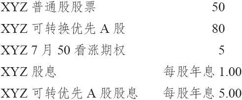
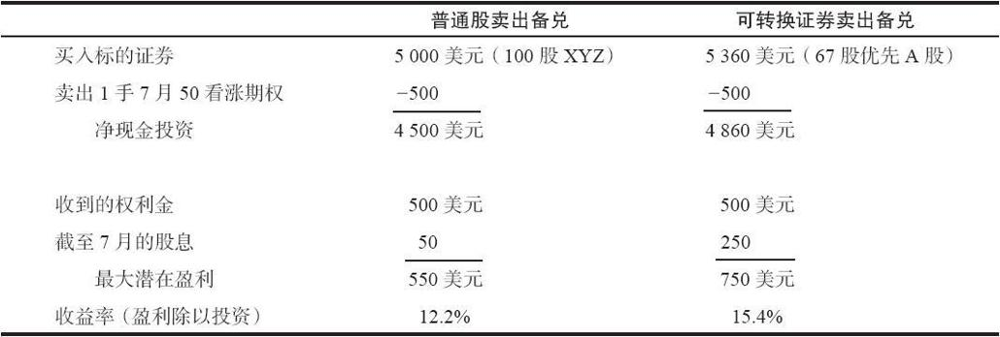
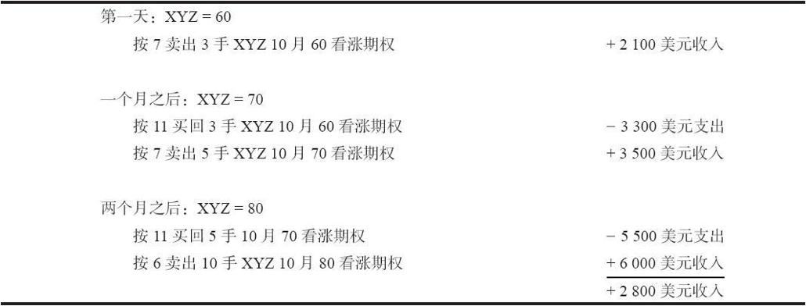

# 2.11　特殊的卖出备兑情形

截至目前，我们的讨论都同就普通股卖出备兑有关。不过，投资者也可以就可转换证券（convertible security）、权证（warrant）或是长期期权（LEAPS）卖出备兑看涨期权。此外，我还将在这里讨论一种不同的卖出备兑策略，也就是递增收益（incremental return）的概念，这个概念对大宗股票的持有者，包括个体和机构的投资者，具有很大的吸引力。

### 2.11.1　可转换证券卖出备兑

买入某种可转换成普通股的证券有可能会比直接买入股票更有优势。使用可转换证券的一个优势是它常常能产生比使用普通股更高的收益。可转换债券（convertible bonds）和可转换优先股（convertible preferred stocks）就是为了这个目的而常常使用的证券。

在讨论卖出备兑之前，复习一下什么是可转换证券也许是有好处的。假设XYZ普通股有XYZ可转换优先A股，它每股可以转换成1.5股普通股。每股可转换证券可以转换成多少股普通股，是卖出者必须知道的一项重要信息。这些信息可以在《标普股票指南》（Standard&Poor’s Stock Guide）中找到[如果是债券的话，则可以在《标普债券指南》（Bond Guide）中找到]。

卖出者还应该知道究竟需要持有多少股可转换证券才等同于100股普通股。在XYZ的示例里，我们可以很快地通过用100除以转换比率1.5来得到这个数量。用100除以1.5约等于66.667，因此投资者就必须持有67股XYZ可转优先A股以对应一手就100股普通股而设立的XYZ期权。请注意，在这项计算中，我们不需要知道XYZ普通股或转换证券的市场价格。

在交易可转换债券时，转换的信息一般用类似这样的表述：按价格20转换50股。转换价格是无关紧要的。重要的是该手债券能够转换的股份数，在这个示例里就是50股。因此，如果某个投资者使用这些债券来做看涨期权的卖出备兑，他就需要持有2手债券（2000），等价于100股股票。

当知道了可转换证券的必要购买数量，投资者就可以使用这些证券的实际价格以及它们的收益来判断，究竟是就普通股还是就可转换证券来做卖出备兑更具有吸引力。

【示例2-23】我们已知下列信息：

请注意，在这两种情况里，卖出的看涨期权都是7月50看涨期权。使用可转换证券作为标的证券，并不改变对所用期权的选择。在表2-19的计算中，为了更简单地对收益作比较，没有把手续费考虑进去。在现实中，无论是普通股还是优先股，交易的手续费都是非常相近的。因此，从数目的角度来看，就可转换证券卖出备兑比就普通股卖出备兑，似乎有更大的优越性。

表2-19　普通股和可转换证券卖出备兑的比较

当就一个可转换证券卖出备兑时，有一些额外的考虑。首先是可转换证券的升水。在这个示例中，当XYZ的卖出价是50的时候，XYZ可转换优先A股的真实价值就是50乘以1.5，即每股75美元。不过，它的售价是80，其中，包括价值75之上的5点的升水。一般而言，如果一个可转换证券的升水过高，就不会有人要买它。在这个示例里，升水还比较合理。如果某个可转换证券的升水高于所计算出的价值的15%，那么就可以说它的升水过高了。

在就可转换证券卖出备兑时的另一个考虑是对指派的处置。如果卖出者被指派，他就会将他的优先股转换成普通股，然后交割普通股股票；或者在市场上卖出优先股，再用所得资金从市场上买入100股普通股股票，按照指派通知交割这些股票。如果该可转换证券有升水，那么第二种选择一般就更可取，因为将优先股转换为普通股会损失优先股中所有的升水。当为可转换债券时，则会损失累积的利息。

卖出者同时还应当注意，他的可转换证券是否是可以赎回的（callable）。如果是的话，具体的赎回条件是什么。一旦可转换证券被该公司赎回，它就不再按其与标的股票的关系而交易，而是按赎回价交易。因此，如果股票急剧上涨，卖出者卖出的期权会产生亏损，而无法从可转换证券处得到任何弥补。如果可转换证券被赎回，一般而言，整个头寸就应当立即平仓，卖掉可转换证券并买回期权。

卖出备兑的其他方面，例如向下或超前挪仓，即使是就可转换证券卖出期权，也没有什么变化。卖出者应当正常地按期权价格与普通股股价之间的关系来采取行动。

### 2.11.2　权证卖出备兑

我们也可以就权证而卖出备兑看涨期权。同样，投资者必须持有足以转换成100股标的股票的权证，一般而言，这会是100份权证。这笔交易必须是现金交易，权证必须完全付清，它们不具有借贷价值。从技术上说，场内权证是可以用保证金交易的，但是许多经纪商都要求全额支付。这里还可能有额外的投资要求。权证也有行权价。如果某个权证的行权价高于该看涨期权的行权价，备兑卖出者就必须存入金额等于他两部分投资之间的差额的资金。

使用权证的好处是，如果它们深度实值，它们就会给现金备兑卖出者带来较高的收益，因为它们只需要较少的投资。

【示例2-24】XYZ的价格是50，有按25买入普通股股票的XYZ的权证。因为该权证是深度实值，它的售价大约为每份权证25美元。XYZ没有股息。因此，如果卖出者考虑进行XYZ 7月50卖出备兑看涨期权的话，他也许会选择权证而不是普通股股票，因为这样的话，他每100股普通股股票的投资就会是2500美元，而不是购买100股XYZ所需的5000美元。由于没有股息，在两种情况里，潜在盈利都是相同的。

即使股票会支付股息（权证是没有股息的），但由于权证投资的金额较小，卖出者仍然可能从权证卖出备兑中得到比普通股卖出备兑更高的收益。当然，这要取决于股息到底有多少，以及该权证究竟实值有多深。

由于同时有期权和权证交易的股票数量不多，以及核实可获得收益的固有问题，实际进行权证卖出备兑的交易并不常见。不过，在某些情况下，进行深度实值权证卖出备兑交易，卖出者确实可以获得一定的好处。一般不建议就平值或虚值的权证卖出备兑，因为如果标的股价下跌，权证会更大比例下跌，从而形成一个高风险的头寸。同时，在这个示例里，如果卖出者向下挪仓到一个行权价比权证行权价更低的期权时，他的投资额就有可能会增加。

### 2.11.3　长期期权卖出备兑

卖出备兑看涨期权的一种形式是通过买入长期期权（LEAPS）看涨期权，并卖出更短期虚值看涨期权的方式来构造的。这个策略与权证卖出备兑很相似。第25章在讨论对角价差时，会更详细地讨论这个策略。

### 2.11.4　增额收益的概念（收入挪仓）

卖出备兑看涨期权的增额收益概念是指，备兑卖出者可以获得股票在今天的股价与目标卖出价格（可能比今天的股价高出许多）之间的增值部分的全部价值。与此同时，卖出者还能从卖出期权过程中获得增额的正收益。

许多机构投资者对卖出备兑看涨期权有顾虑，因为它对潜在盈利的上限作了限制。如果在进行了卖出备兑之后，股票价格下跌了，那么大多数机构投资者会觉得比较好，因为相对于只持有股票而没有进行卖出备兑的其他机构投资者而言，他们的业绩表现会更好。但是，如果在卖出备兑之后，股票价格大幅上涨了，那么许多机构投资者就会因卖出备兑限制了他们的盈利而感到不满。这个策略并不是只适用于机构资金管理者，也适用于普通投资者。只是投资者的持股数量最好较大（至少是500股，最好是在1000股之上）。增额收益的概念适用于所有像这样的投资者，他们会一直持有股票（即使中途出现短暂下跌），直到股价达到事先确定的、更高的价格，他们才愿意卖出。

这个策略的第一步是确定该卖出者愿意卖出股票的目标价格。

【示例2-25】某位客户持有1000股XYZ股票，股票当前价格是60，该客户愿意按80的价格将股票出手。与此同时，他希望能从股票卖出备兑中实现一笔正的现金流。这笔正现金流并不必然来自于股票被指派行权时所实现的期权收益。更可能的情况是，当股价在60时，不大可能有行权价是80的期权在交易，因此，他可能没办法卖出10手7月80看涨期权。即使有7月80看涨期权存在，这也不是一个好的做法，因为此时投资者收到的期权权利金会很少（也许每手看涨期权10美分），从而不值得卖出这样的期权。增额收益策略可以让该投资者达到自己的目的，而不管有没有更高行权价的期权存在。

增额收益策略的基本方法是，一开始只就所持有的全部股票中的一部分卖出看涨期权，而且是卖出那些行权价离当前股价最接近的看涨期权。然后，如果股价上涨到更高一级的行权价，投资者就通过增加卖出备兑的数量来实现向上挪仓和获得收入。为收入而挪仓是必不可少的，它是整个策略的关键。最后，当股票达到了目标价格时，股票被指派行权，投资者以目标价卖出了所有股票，此外，他还能额外得到所有期权交易中所积累的总的收入。

【示例2-26】XYZ的价格是60，投资者持有1000股，他的目标价格是80。他可以按每手7卖出3手最远期的60看涨期权。表2-20显示了在一个不很妙的情况下（股票价格一下子涨到了目标价格）会发生的情况。正如表2-20所显示的，如果XYZ在一个月里涨到了70，那3手初始的看涨期权就会被买回去，然后在70的价格上卖出足够的看涨期权，并产生一笔收入（5手XYZ 10月70看涨期权）。如果股价在下一个月里继续上升到80，这5手看涨期权就会被买回去，而此时整个股票头寸都会以目标价格进行卖出备兑（10手看涨期权）。

如果XYZ的价格保持在80以上，股票就会被指派行权，所有1000股股票都会按80的目标价格卖掉。另外，投资者还可以挣到一路上所有卖出期权而得到的收入。它们的总额达到2800美元。因此，这个卖出者不仅得到了股票上涨到目标价格的整个增值部分，还得到了卖出期权所产生的增额的、正收益。

表2-20　两种增额收益的策略

在一个平静的市场中，监控这个策略会相对容易一些。如果卖出的备兑看涨期权没有了时间价值，因而可能会被指派，卖出者可以向前挪仓到一个更远的到期系列，保持卖出备兑看涨期权的数量不变。这个交易也会产生额外的收入。

如果目标价格最终被触及，而此时该卖出者希望保留一些股票，当卖出的看涨期权开始失去它们的时间价值时，那就可以使用先前提到的“部分抽身策略”。当从某个头寸中“抽身”出来后，投资者就可以设定更高的目标价格，开始整个过程的重复。
