# 39.2　对波动率的预测进行交易

波动率交易者必须有某种手段可以断定隐含波动率已经反常到可以进行交易的地步。然后，他必须决定建立什么样的交易。此外，同任何策略一样，特别是期权策略，后续行动也很重要。在这一章里，我们不再引进新的策略。这些策略在本书的前面章节里都已经有了介绍。不过，在合适的地方，我们将简短复习有关这些策略和后续行动的要点。

首先，交易者必须找到隐含波动率异常的情况。虽然这并不是分析的终点。在此之后，交易者需要做一些概率分析，看一看标的物在过去的行为。其他微调的方法也常常有用。我们在这一章里将对这些进行介绍。

### 39.2.1　发现隐含波动率异常

对于什么是确定隐含波动率是否“异常”的最好方法，在波动率交易者之间有许多不同的看法。最流行的方法是将隐含波动率同历史波动率进行比较。不过，在前两章我们说过，隐含波动率未必一定是历史波动率的好的预测指标。虽然不能放弃这种方法，可是，在使用时必须有选择。另一种方法是将今天的隐含波动率同它过去的值进行比较。这个概念在很大程度上依赖于隐含波动率的百分位数的概念。最后，还有试图从隐含和历史波动率图形中“读出”信息的方法。这实际上同GARCH想要做的有些相像，不过只是用于短期而已。因此，这些方法是：

（1）将隐含波动率同它自己过去的水平进行比较（百分位数方法）；

（2）将隐含波动率同历史波动率进行比较；

（3）诠释波动率图形。

此外，我们还将考察两个用得较少的方法：将历史波动率现有的水平同对历史波动率过去的值进行比较，以及只是用一个概率计算器来计算概率并交易，这有最大成功概率的机会。

### 39.2.2　百分位数方法

在本书作者看来，这个百分位数的方法有很多好处。当有人说波动率倾向于在一个范围内交易，它是波动率交易的基本前提时，他一般指的是隐含波动率。因此，了解当前隐含波动率在过去隐含波动率的波动范围中处于什么位置，是有意义的。如果隐含波动率就通常交易的水平来说是低的，那么我们就可以说这些期权是便宜的。反过来，如果它相对那些过去的值来说是高的，那么我们就说这些期权是贵的。这些结论不是根据历史波动率得出来的。

隐含波动率的百分位数一般用来说明目前的隐含波动率值相对它过去的值而言处在什么位置。在这种情况中使用的“隐含波动率”值是综合值，它包括了一个标的工具上所有的期权，对它们根据实值或虚值的程度而加权（平值期权得到更大的权重），同时也根据它们的交易量来加权。我们在论述数学应用的第28章首次介绍了这个技巧，而且在其他地方也多次提到过它。每一个标的工具的综合隐含波动率值可以作为每天的数据储存在数据库里，专门处理期权数据的公司卖出这样的数据库。同时，www.optionstrategist.com的会员还可以得到这样数据的图形。

一般而言，在任何既定的一天里，大多数标的工具的综合隐含波动率值都在接近第50级百分位数左右。不过，某一天在某些标的物中出现接近零或100%的百分位数值也不少见。这些是波动率交易者所感兴趣的情况。例如，那些值在第10级或者更低的期权可以被认为是“便宜的”；那些在第90级百分位数之上的就会被认为是昂贵的。

在现实中，隐含波动率的百分位数受大盘市场运动的影响。例如，在一个严重的市场下跌中，整个市场的隐含波动率都会增加。于是，交易者可以发现大量股票的期权的隐含波动率在第90级以上。反过来，在其他的时候有可能出现整个市场的隐含波动率都有显著的下跌。例如，1993年，还有2001年的夏天。在这样的时候，我们常常发现有大量的股票，它们的期权的隐含波动率在百分位数的第10级以下。这里要说的是，百分位数的分布是动态的，而不是像对数正态分布那样是静止的。是的，也许经过一段长时间，考虑到大量的示例，我们会发现隐含波动率的百分位数是正态分布的，但不是在某个既定的一天。

交易者在这个百分位数计算中有自己的一些选择。首先，他必须决定在进行排序时要使用多少的历史天数。一年大约有255个交易日。因此，如果他想要一个两年的历史，他就需要根据过去两年的510天的值来记录今天的隐含波动率值的百分位数。为了确定百分位数，本书的作者通常使用600天的隐含波动率的历史，不过，其他的时间长度也不是没有道理。这里的目的是要使用足够长时间的波动率历史，从而给交易者更好的视野。这样，一个第10级或者第90级的百分位数才会真正有意义，从而成为确定一个期权是便宜或者昂贵的好的起点。

除了实际的百分位数之外，交易者还应当意识到隐含波动率分布的宽度。我们在前面对此已经有过讨论，从根本上来说，这个概念是：如果第一个百分位数是40%的隐含波动率，而第100个是45%的隐含波动率，那么，在交易者是否能够将一个期权归类为便宜或昂贵方面，这里的整个范围狭窄到了没有意义的地步。

在低百分位数的隐含波动率上买入期权的好处是为交易者提供了两种赚钱的途径：其中之一是通过标的物的运动（例如，如果拥有一手跨式价差的话），另一个是通过隐含波动率的增加。也就是说，如果期权回到第50级的隐含波动率，买入“便宜”期权的隐含波动率交易者也可以从这个运动中获利。这里的前提条件是，第50级同第10级之间的距离大到足以让期权价格的运动具有一定的意义。作为一条或许应当记住的规则：如果期权在1个月之内从目前的（低）百分位数值上升到了第50级，隐含波动率中的增长是不是同这段时间内的因时减值相等或更大？换一种说法，在其他条件都不变的情况下，在1个月之后，如果隐含波动率上升到了第50级，期权的交易价格仍然相等或者上涨了吗？如果是这样的话，那么，隐含波动率的宽度就大到了足以产生所想要的结果的地步。

这种确定隐含波动率是否异常的方法的吸引人之处在于，交易者“被迫”以相对价值为基础买入便宜的期权（或者是卖出昂贵的期权）。这里还没有把历史波动率考虑在内，我们在后面讨论概率计算器时将谈到它。当然，没有担保说在头寸存在期间隐含波动率会运动到第50级，但是，如果这种情况发生的话，那么显然会对这个头寸有一个帮助。

事实上，这个方法所衡量的是交易期权的公众现在对波动率是怎么“想”的，并且将它同他们过去的想法进行比较。因为公众在主要的转折点（对于价格和波动率）总是错的，因此，有理由说，当“所有其他人”将波动率压到一个过低的水平时，那么就应当买入波动率。不过，如果反过来，说当其他人将波动率推到极高的水平时就应当卖出波动率，那就未必正确。在这种情况中要注意的是，有人有可能有内幕消息，从而使得期权贵得有道理。这是卖出波动率比较困难的另一个理由：那些实际上使得隐含波动率变得很高的人，有可能掌握比你知道的多得多的信息。

### 39.2.3　把隐含波动率同历史波动率进行比较

交易者最常用的确定期权是便宜或昂贵的方法是将现有的综合隐含波动率与各种不同的历史波动率的值进行比较。不过，这只是因为大家都用它，并不一定就说明这个方法在确定什么样的期权最适合波动率交易者方面是最好的方法。在本书作者看来，它不如百分位数（将隐含波动率同隐含波动率相比）的方法，不过，它有它的优点。使用这种方法背后的理论是，隐含波动率同历史波动率最终毫无疑问会汇拢。因此，如果交易者在它们差距很大的时候建立一个波动率交易头寸，就应当有它的优势。

不过，这个理论有不少漏洞。第一，没有人能够担保这两者就会及时汇拢。例如，在交易者的头寸变得有利可图之前汇拢。历史的和隐含的波动率常常会在几个星期内保持着相互分离的状态。

第二，即使确实出现了汇拢，它并不一定就意味着交易者可以赚钱。举例来说，考虑一下这样一个情况，其中隐含波动率是40%，历史波动率是60%。这是一个相当大的差距。因此，你会想要买入波动率。此外，假设这两者确实汇拢了，这是不是说你一定会赚钱？不，事情并不是这样。如果它们确实汇拢了，但是汇拢在40%，那会怎么样？或者，更糟一些，汇拢在30%？在这些情况中，随着股票运动速度减缓，而你的期权失去时间价值，几乎可以肯定你会赔钱。

这种方法的另一个问题是，隐含波动率在买入的时候未必就是低的，在卖出的时候未必就是高的。考虑一下刚刚用过的示例。我们只知道隐含波动率是40%，历史波动率是60%。我们对40%是高、是低还是中等没有概念。因此，还是有必要看一看隐含波动率的百分位数是多少。如果40%被证明是一个相对较高的隐含波动率，就像通过看一看在过去几年里隐含波动率在什么水平上而确定的那样，那么我们或许在这个情况里就不想要买入波动率，即使隐含波动率同历史波动率之间有很大的差距。

许多做市商和场内交易员都使用这种方法。不过，他们常常寻求短期内定价错误的期权，认为波动率很快就会回到原来的水平。不过，对一个头寸交易者来说，上面说到的那些问题会给他带来麻烦。

在这样说了之后，如果还是有人要使用这个方法来试着确定期权在什么时候异常的话，那么应当实施下面所说的相似的程序。交易者必须肯定隐含波动率同所有的相关的历史波动率相比都有显著的不同。例如，交易者也许需要肯定隐含波动率比10天、20天、50天和100天的历史波动率都低出80%。此外，也应当注意到隐含波动率目前的百分位数，这样，交易者就有某种相对的基础来确定是否所有的波动率，历史的和隐含的，都非常高或非常低。如果它们全都在非常高的百分位数，那么，交易者就不应当买入期权，如果它们都在非常低的百分位数，那么他就不应当卖出期权。

一幅既显示隐含波动率也显示某些历史波动率的波动率图形往往可以对做出这些决定有所帮助。交易者不但能够迅速地看出期权是在高百分位数或低百分位数，而且还可以看出在过去相似的时候，当隐含波动率同历史波动率之间有显著的区别时，究竟发生了什么情况。

最后，交易者需要某种衡量尺度来确认如果在隐含波动率同历史波动率之间确实出现了汇拢，他是否就能够赚钱。例如，如果交易者是在买入一手跨式价差，他也许需要知道，如果隐含波动率在1个月内碰到了历史波动率（例如，这些历史波动率中最低的水平），他就实际上有钱可赚。交易者可以使用不同的时段，但是，他必须小心，不要出格。例如，如果目前的隐含波动率是40%，历史波动率是60%，那么，要让隐含波动率在一两天内上升到60%，就几乎不可能。使用这个标准同时也可以保证隐含波动率同历史波动率之间的绝对差距会大到足以能够得到盈利的地步。也就是说，如果隐含波动率是10%，历史波动率是13%，那么，在两者之间的区别就是30%。表面上看，在隐含波动率同历史波动率之间有一个“大”的差别。但是，如果隐含波动率上升，同历史波动率汇拢，这就意味着在隐含波动率中只有3点的绝对值的上涨，如果时间有了变化，去掉成本之后，这样的上涨恐怕不足以产生盈利。

如果达到了所有这些标准，那么交易者就成功地使用隐含波动率同历史波动率比较的方法发现了“定价错误”的期权，因此他就可以进入到波动率分析的下一个步骤：使用概率计算器。

### 39.2.4　诠释波动率图形

交易者在确定期权是否定价错误时使用的另一种技巧是实际去分析波动率的图形，典型的是隐含波动率的图形，不过也可以是历史波动率的。这看起来似乎是一种主观的方法，不过，它同GARCH的方法没有多大的区别，后者被认为是高度先进的。当交易者考察波动率图形时，他不是像技术分析家看股票图形那样在寻找技术形态：支撑位、阻力位、头肩形、旗形和三角旗形等。他只是在寻找波动率变化的趋势。

在使用许多指标，特别是情绪指标方面，这都是一种有效的方法。通过等待这个趋势发生变化，使用者就不会在波动率向下的趋势之中买入，也不会在波动率向上的趋势之中卖出。

【示例39-1】假定一个波动率交易者确定，目前股票XYZ的隐含波动率水平在所有过去值中居于第1级的百分位数。因此，这些期权从来都没有这么便宜过。整个市场或许在经历一段非常平滞的阶段，或者XYZ自身是在一个拉长的、狭窄的交易范围内交易，这两种情况都有可能导致隐含波动率持续地大幅度地下跌。找到这些便宜的期权之后，他想要买入波动率。不过，他无法担保隐含波动率不会继续下跌，即使它已经便宜到从来没有过的地步。

如果遵循等待隐含波动率的趋势出现反转这个技巧的话，他就会每天都注意观察XYZ的隐含波动率，一直到出现少量的增加，这样的增加象征了期权的买家现在对XYZ的期权变得比较感兴趣了。图39-1显示了这种情况看上去会是什么样的。
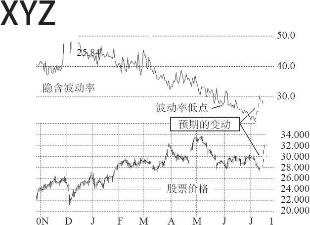
图39-1　隐含波动率的趋势图

这幅图形对若干现象做了标记，因此，我们将对它做详细的讨论。在图39-1上有两幅图形：顶部的线条是隐含波动率的图形，底部的是股票价格的图形。隐含波动率的图形显示出，在6月1日附近，它达到了历史低位：28%（也就是说，它在历史波动率的百分位数的第0级）。因此，交易者也许会在这个水平上买入波动率。不过，在这个时候，隐含波动率显然还在陡然下跌的趋势中，因此，看到这幅图形的波动率交易者也许会决定要等到波动率有反弹时再买入。事实证明这是一个明智的决定，因为股票在此之后的1个半月中都没有方向，与此同时波动率还在不断地下降。在这幅图形的右侧，隐含波动率跌到了将近20%的地方。

这两个图形上的实线表示的是已知的XYZ的隐含波动率和价格历史。虚线表示的是可能会出现的情况。如果隐含波动率不再是向下了，这时，他才有理由买入波动率。

这种方法有它的优点，理由是交易者无法知道波动率会跌多深，而且，更重要的是，他不知道波动率会涨多高。我们提到过，同样的方法在其他的情绪指标中也相当有效，特别是看跌–看涨比率。在20世纪90年代的牛市里，只包含股票的看跌–看涨比率一般是在30~55的范围之内。因此，有的交易者变得习惯于看跌–看涨比率超出50就买入市场（对整个市场来说，高的看跌–看涨比率是看多的预测指标）。但是，当牛市结束的时候，或者是至少僵持的时候，看跌–看涨比率集中在接近70~75的地方。因此，使用静态方法（也就是，“超过50就买”）的人就会被埋葬，因为他们在看跌–看涨比率出现新高的时候买入得过早，因而就不得不承担后果。如果采用趋势反转的方法，他们就可以得救。这是一种更为动态的程序，交易者因此会让看跌–看涨比率继续上升，直到见顶为止。在这个时候，就可以买入市场。

这正是诠释波动率图形所要做的。交易者不是依靠过去的数据来琢磨运动的绝对的最高值或最低值会出现在哪里，而是注意到波动率数据是在极端的水平（百分位数的第1级或第100级），于是对它进行监控，直到它调转方向。这对期权卖出者特别有用，因为它可以防止掉入巨量期权买入的漩涡里，在这样的情况里，买方或许有关于某种类似兼并之类的公司事件的内部信息。不错，期权可以是非常昂贵（第100级百分位数），但是，它们是贵得有理由的，那些有内幕消息的人知道这个理由，而典型的波动率交易者则不知道。如果波动率交易者等到隐含波动率值出现向下的转向再卖出这些期权，那么，他有很大可能可以避免绝大多数的麻烦，因为在新闻面世之前，或者是买家（也许认为兼并的传言不会兑现）放弃之前，这些期权或许不会失去它们的隐含波动率。

在提前入市这一点上，期权的买家没有期权的卖家所面临的问题，不过，等到波动率趋势上升（就像在图39-1中那样）再来猜测波动率是否已经见底，也是有道理的。正如在一个严重下跌的趋势中买入一只股票是有勇无谋的那样，在买入波动率方面，也是如此。

同样的方法用在历史波动率的时候用处比较小，因为这样的图形对期权价格没有什么可说的。下面一节将对这种看法进行扩展。

### 39.2.5　历史波动率与历史波动率的比较

上面一节总结了三种交易者想要发现异常期权的主要方法。有的时候也有人提到另外一种方法：将历史波动率目前的水平同历史波动率过去的水平进行比较。我们也将介绍这一方法，不过，一般而言，这种方法不如其他的方法，因为这样一种比较没有告诉我们有关期权价格的任何信息。例如，如果我们发现目前的历史波动率在历史波动率的百分位数中居于非常低的位置，但接着又了解到期权价格昂贵，而且隐含波动率或许还高出历史波动率，那么，这对我们没有什么帮助。在这种情况里，交易者通常不想买入期权，因此，最初的对历史波动率同历史波动率的比较就是一种浪费。

将历史波动率目前的水平同它的过去的值进行比较，是一种朝后看的方法，因为历史波动率涉及的只是过去的股票价格。这种方法没有考虑到隐含波动率。此外，这种方法包括了这样的假设：一只股票的波动率特征是不会变化的，就波动率而言，它会转回到某种“正常的”过去的价格行为。现实根本不是如此。几乎所有的股票在一定时期内都会显著地改变它的历史波动率的模式。

考虑一下在技术股红火时期的一只高波动的股票：Rambus（RMBS）。从股票上市到2000年2月之间，历史波动率的范围在50%~110%之间。在这个时候，股票的平均价格是每股20美元左右。

2000年2月，RMBS股票价格开始迅速上涨，于是事情有了很大的变化。在这个时候，股票暴涨到115，然后跌回到35，接着在135附近形成了新高，随之又暴跌到接近20。因此，股票自身在两年之内完成了一段疯狂的来回旅程。图39-2和图39-3就是在这段时间RMBS的股票图形和历史波动率图形。
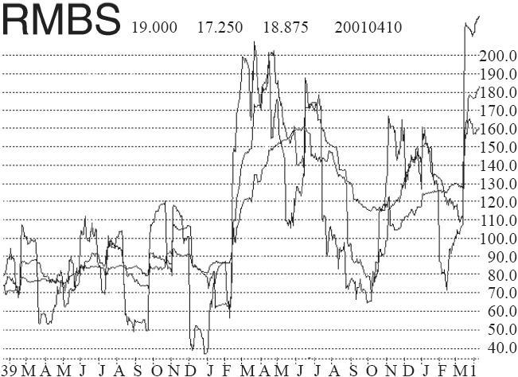
图39-2　RMBS的历史波动率
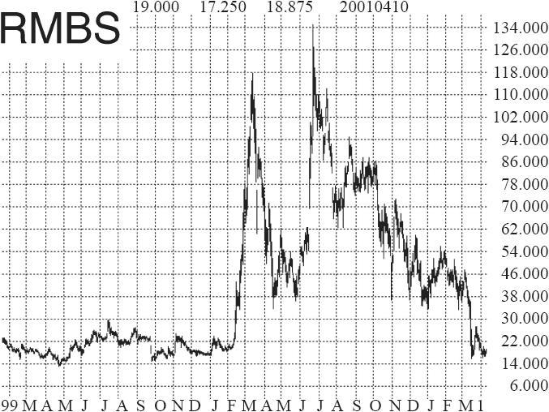
图39-3　RMBS的股票图形

在发生这样的情况时，历史波动率会陡然上升。在2000年2月之后，一直到2001年，历史波动率都在120%之上。因此，很清楚，Rambus的行为模式在2000年2月之后有了很大的变化。在此之后，如果交易者在任何时候将历史波动率进行比较，他就会错误地得出结论说，RMBS将要减缓下来，最近的历史波动率同过去的历史波动率相比显然过高。如果交易者根据这样的结论在RMBS上卖出波动率，那么，这会是一个昂贵的错误。

RMBS可能是一个极端的示例，但它决不是绝无仅有的。许多其他股票在行为上也经历过类似的变化。在我看来，因为有这样的行为存在，把历史波动率与对历史波动率过去值进行比较的方法就不能成为一种有效的选择波动率交易的方法，因而在这方面就是一种没有用处的方法。

这种方法的最大的用处是用来对前面所介绍的其他方法进行补充，从而为波动率交易者就他对标的工具波动率的预期提供某种观察的角度；不过，它显然只能用来起到一般的指导作用。

### 39.2.6　查看基本面因素

一旦发现了这些定价失误的期权，查看一下新闻，看一看在这种价格失常背后有没有基本面的原因，这始终是必须要做的。例如，如果期权非常便宜，于是交易者查看了新闻报道，发现标的股票是一个全现金兼并收购的对象，这样，他就不会买入这些期权。这个股票不会有什么运动，事实上，如果兼并实现，股票就会消失。

与此相似，如果期权看上去非常之贵，交易者查看了新闻，发现标的公司有一个正在被政府机构（例如，美国食品和药物管理局）审核的新产品，那么，就不应当卖出这个期权，因为根据美国食品和药物局听证会的决定，这个股票有可能出现一个跳空运动。有许多相似的公司事件会使期权价格变得非常之贵。在有这样的事件或谣传出现的时候，波动率的卖家不应当搅和在其中。

不过，如果没有可以解释得了为什么期权是如此便宜或如此之贵的新闻，那么，波动率交易者就可以将他的分析继续下去。

### 39.2.7　选择要用的策略

一般而言，当交易者决定要交易波动率时，简单的策略就是最好的策略，特别是如果交易者买入波动率的话。如果这里涉及波动率倾斜，那么，也许有其他更好的策略，我们在这一章的后面将讨论这些策略。不过，如果交易者是因为认为隐含波动率异常因而想要直接交易波动率的话，那么，只有少数几个策略可以使用。

如果波动率过低，那么，应当买入跨式价差或者宽跨式价差。如果标的工具目前的交易价附近有可以使用的行权价，那么，交易者一般会买入跨式价差。不过，如果标的物目前的交易价介于两个行权价之间，那么，宽跨式价差就是更好的选择。无论是哪种情况，一个头寸交易者应当买入一手离到期还有几个月的跨式价差，从而增进他盈利的机会。没有什么“最好”的时间长度，因此，交易者在做出这个决定时应当使用概率计算器来帮忙。我们将在后面讨论如何使用概率计算器。

【示例39-2】XYZ的交易价是39.60，波动率交易者决定他想要买入波动率。根据这个信息，他应当试图买入一个看跌期权和看涨期权的行权价都是40的跨式价差。

假定目前是12月，XYZ可以使用的到期月份有1月、2月、4月、7月和10月。再加上下一年1月的长期期权（LEAPS）。于是他会对每一种跨式价差进行分析（1月40、2月40和4月40等），看一看买哪一个最好。一般而言，根据期权价格通常的构造方法，似乎是中等范围的跨式价差成功的概率最高。当然，在使用概率计算器时要考虑到每个跨式价差的实际价格。在这个情况里，对一个头寸交易者来说，从统计学的角度来看，7月40跨式价差或10月40跨式价差或许是最好的选择。

如果XYZ在例如37.50的价格上交易，那么，这个交易者或许就应当考虑买入一个宽跨式价差，买入1手行权价为40的看涨期权，同时买入1手行权价为35的看跌期权。从买入宽跨式价差的角度来说，将行权价之间的距离拉大到一个行权价间距（例如，对股票期权来说是5点）之外是没有意义的。这只是使得这个头寸在一开始时更为中性。

说到中性，交易者也应当使用这个头寸的delta来修正看跌期权对看涨期权的比率，使得这个头寸在建立的时候尽可能保持中性。这是我们建议使用的方法，因为波动率买家并不在乎股票是上涨还是下跌。他只对股票的运动或波动率的增长感兴趣。

【示例39-3】XYZ仍然是在39.60交易，交易者想要一个中性的头寸。他应当使用这个头寸的delta来构建一个中性的头寸。例如，考虑一下10月40跨式价差。假定概率计算器使用的波动率是40%。根据这些条件（以及我们在前面的示例中所假定的那些条件），10月40看涨期权的delta是0.60，10月40看跌期权的delta是-0.40。因此，买入2手看涨期权和3手看跌期权的比率是中性的比率。如果看涨期权的售价为6，看跌期权的售价为5，那么，这个2对3的头寸的盈亏平衡点就是上行方向的53.5和下行方向的31。这些信息可以总结如下。
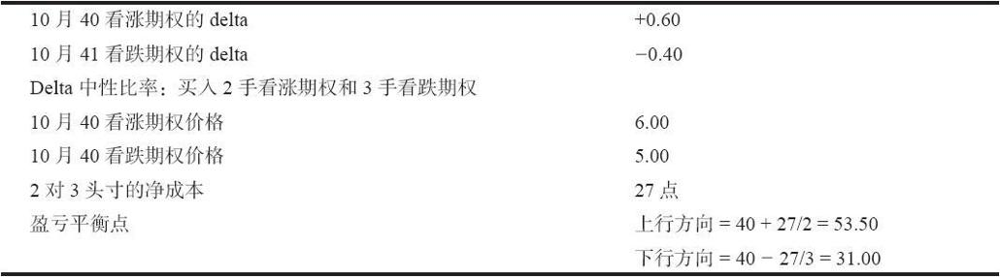
于是概率计算器会努力算出在到期日之前股票有多大的机会出现在53.50或31.00的价位上。事实上，因为在若干到期月都有跨式价差，策略家应当用相同的方式对它们每一个都进行分析。表39-1显示出他的选择会有什么样的结果。如果交易者在考虑买入一个宽跨式价差，那么，他也可以用看跌期权和看涨期权的delta来进行相似的计算，其中看涨期权的行权价高于看跌期权的行权价。

表　39-1
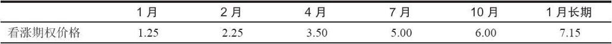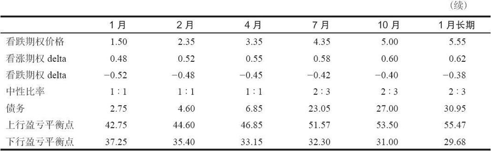
另一个在波动率低的时候可以使用的简单策略是跨期价差，因为它有正值的vega。也就是说，如果隐含波动率上升，可以期望它会拓宽。不过，对大多数交易者来说，跨期价差的盈利有限的性质是一种太大的负担，无论是从心理上还是从手续费上来说都是如此，因此，波动率交易者对这个策略用得不多。有的交易者只有在他们认为隐含波动率在近期内不会增长时才使用跨期价差。他们或许买入一手略为虚值的看涨期权跨期价差，同时也买入一手略为虚值的看跌期权的跨期价差。这样，如果在短期内没有多大的变动，卖出的期权会无价值地到期，留在手里的买入的跨式价差或宽跨式价差就比在此以前更具吸引力。当然，这个策略有它的缺点：标的物的一个快速的运动会导致亏损，这样的情况在买入一个简单的跨式价差或宽跨式价差的情况中是不会发生的。

### 39.2.8　卖出波动率

如果交易者在卖出波动率（也就是说，波动率很高），他的选择要复杂一些。几乎每个曾经卖出过波动率的人都有过不愉快的经验，或者是因为股票价格猛然上涨，或者是因为波动率陡然上升。在这一章的后面我们将详细讨论卖出波动率应当注意的一些问题。现在，我们将考虑简单一些的策略，这样，我们的讨论仍然是关于构造一个波动率交易头寸。

简单地说，一个波动率卖出者一般有两个策略可以选择（虽然也可以引进一个更复杂的策略）。最简单的策略就是卖出一手虚值看跌期权和一手虚值看涨期权。所选的行权价应当离标的物目前的价格有足够的距离，这样，这个头寸面临麻烦（也就是说，标的物在这个头寸的存续期内实际在裸期权的行权价上交易的可能性）的可能性就会相当小。正如上面的期权买家先是列举出若干到期月，然后计算出盈亏平衡点一样，波动率的卖家也应当这样做。一般来说，他也许应当卖出短期的期权，不过，所有的到期月都应当考虑，至少在开始的时候是这样。同时，他也许应当试一试不同的行权价，以求在股票达到裸期权行权价的低概率与得到足够的权利金从而使得交易有价值之间实现平衡。对本书作者来说，用不足1点的价格卖出裸期权是不值得一试的。

当然，仅仅卖出这样的一手看跌期权和一手看涨期权意味着这些期权是未备兑的，而这样的策略并不是对所有的人都合适的。我觉得下一个最好的策略是一个收入价差。收入价差的问题是，交易者既卖出昂贵的期权，也买入昂贵的期权作为保护。波动率的变化对收入价差的影响在前面两章已经仔细讨论过了，因此，这里就不复述了。我们所要说的只是，如果波动率下降，收入价差交易者可以兑现的盈利就相当小（或许甚至不足以抵消将头寸平仓的手续费支出），而一个裸期权卖出者则显然可以在更大的范围内得到更多的盈利。

在卖出裸期权同收入价差之间的选择在很大程度上取决于交易者自身的哲学和心理素质。如果交易者对裸期权感到不自在，或者他不可能花许多时间来监控市场活动（或者是有人为他监控），又或者他没有足够的钱来给头寸支付保证金，将它一直保持到股票价格达到盈亏平衡点，那么，裸期权对这样的交易者就不合适。

另一个会影响到期权卖出者策略选择的因素是所考虑的标的工具的类型。至今为止，指数期权对裸期权卖出是最好的选择。其次是期货，股票排在最后。这是因为这些不同工具的不同行为方式。直到现在，股票仍然最有可能出现巨幅跳空的运动，而这样的运动是卖出裸期权的死敌。因此，如果交易者发现有昂贵的股票或期货期权，那么，更合理的也许是使用收入价差的策略。

有时候，当期权很贵的时候，还有另外一种策略可以使用。它叫做波动率后式价差，不过，我们要在这一章的后面再讨论这个策略。

### 39.2.9　使用概率计算器

不管使用什么样的方法来发现异常的期权，不管交易者偏好什么样的策略，都有必要使用一个概率计算器，对标的物是否会出现能够产生盈利的运动（或者，如果你是卖出期权的话，对它们是否不会产生落入亏损的运动）有一个可依据的看法。这是历史波动率可以起到很大作用的地方，因为它是概率计算器的输入数据。事实上，如果对波动率不能提供一个可信的估计，那么，没有一个概率计算器可以产生令人相信的预测。请回过去复习一下前面的那一章，那里对概率计算器和股票价格分布有深入的讨论。

使用概率分析也可以减少把隐含波动率同历史波动率进行比较这种选择方法所固有的一些问题。如果概率对成功有利，那么我们也许就不会那么在乎期权目前的隐含波动率是在高百分位数上，还是在低百分位数上（虽然我们仍然不会当期权在隐含波动率的高百分位数上时买入波动率，或者是当期权在低百分位数上时卖出期权）。

在使用概率计算器时，交易者首先选择一个策略（例如，如果期权便宜就买入跨式价差），然后，像前面那一节说明的那样，计算出盈利平衡点。接下来使用概率计算器来确定标的工具在期权头寸的存续期之间是否有任何交易到某一盈亏平衡点上的可能性。前面一章说明过，使用肥尾分布的蒙特卡罗模拟是用于这个程序的最好方法。

一个买入波动率的情况要具有吸引力，标的工具超过盈亏平衡点的概率就应当大于80%，一个卖出波动率的情况要具有吸引力，标的工具在造成亏损的价格上交易的概率就应当小于25%。当然，波动率的卖出者可以通过选择深度虚值期权来大大地影响这个概率。正如上面指出的，波动率卖出者事实上应当就若干不同的行权价来计算概率，力图在高概率的成功同收入的权利金数量大到值得承担这个风险之间找到平衡。

【示例39-4】OEX指数在650交易。假定交易者认为波动率很高，想要对裸期权卖出进行分析。另外，假定他的选择集中到卖出9月期权上，这个期权在五个星期后到期。表39-2列出了他考虑的主要选择。在这个示例里的期权是指数期权，这些期权价格反映了（我们后面要讨论的）波动率倾斜。这样，这个示例可以更真实一些。

表　39-2
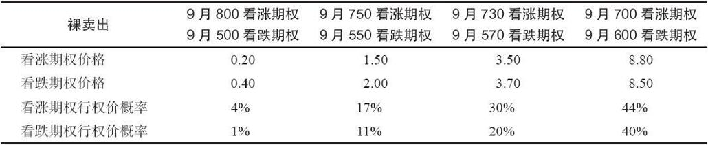
右面两栏的选择应当排除在考虑之外，因为股票在到期日之前碰到行权价的概率太高，远远超出前面提到的作为指导方针的25%。这就留下了9月500~800宽跨式价差和9月550~750宽跨式价差作为考虑对象。虚值最深的期权（9月500~800宽跨式价差）的概率最好，但是，售价这么低的期权没有给收益留下多大的余地，即使它们是无价值到期。记住，对裸指数期权来说，交易者建立一个头寸，需要至少为指数价格10%的保证金，在这个示例里，这就意味着6500美元。事实上，我们建议根据行权价自身来准备保证金（800的15%，在这个示例里就是12000美元）。因此，卖出9月500~800宽跨式价差而收入60美元，再减去手续费，似乎算不上什么收益。因此，最好的选择似乎是550~750宽跨式价差。如果期权无价值到期，所建议的保证金是750（较高的行权价）的15%，或者说11250美元，交易者在手续费之外还可以赚到320美元，这就是在1个月内的大约2.8%的收益。交易者无法将这样的收益年化，因为他不知道在这些期权到期之后，同样的期权定价结构在下5个星期内是否会继续存在。

也可以进行其他概率的计算。例如，假定交易者决定买入一个跨式价差，他不但应当知道有多大的概率会盈亏平衡，而且还应当知道有多大的概率至少得到一定百分比的收益，例如，20%。交易者也应当计算股票运动超过盈亏平衡点20%的概率。这个距离（20%）是一个可以使用的合理的数字，因为如果股票确实运动到这么远的话，投资者很有可能提走部分盈利，或者是调整他的头寸。

### 39.2.10　使用股票历史价格

到目前为止做的所有工作：确定什么期权是昂贵的、选择一个策略，以及计算成功的概率，在某种程度上都还是理论性的，我们还没有就标的工具的波动率进行过任何“回测”。在这里，交易者应当考察一下过去的价格，看一看股票在过去是否有过大幅度的运动（不管这样的运动是想要的还是不想要的）。

【示例39-5】交易者考虑要买入XYZ 10月40跨式价差，价格为11点，当时股票价格是39.60。这些期权是便宜的，根据概率计算，成功的概率也相当好。现在需要提出和回答的问题是：“这个股票在过去是否有过在10个月（这个跨式价差离到期的时间）里运动11点的能力？”或者，更重要的，“这个股票在过去是否有过在10个月里运动28%的记录”？因为11除以39.60为28%。如果这只股票有历史价格，那么就很容易回答这些问题。交易者甚至可以通过观察这只股票的图形，在没有计算机帮助的情况下自己回答这些问题，不过，计算机对历史价格的分析要更为严谨，因此更值得提倡。

这些答案可以用概率的形式来表达，同概率计算器产生的结果相似。

假定交易者认定这只股票在过去的77%的情况里能够在10个月里运动11点。这还可以，但不是非常出色。不过，当交易者看到XYZ的价格图形时，他看到它在上涨到目前的价格之前，在很长一段时间内在低得多的价格上交易。很难指望一个10美元的股票会在10个月内运动11点。这就是为什么第二个数字，那个涉及28%运动的数字，是更重要的数字。在这个情况里，交易者可以发现XYZ在过去的90%的情况里能够运动28%。这样看来，这是一个相当不错的买入跨式价差的头寸。

这个对过去价格的分析可以用更精密的方法来完成。与其是看股票在过去的运动幅度是否达到过所需要的距离，交易者不如看一看这只股票的运动“看上去”怎么样。也就是说，在有些情况中，过去的运动看上去似乎吸引人，但仔细看一下，交易者就不会那么乐观。

例如，如果XYZ确实已经反复出现过28%的运动，但是在构成它10个月的股票历史中，在大部分时间里它很少有大于这个幅度的，那么怎么办呢？这样的话，交易者也许不会想要持有这个跨式价差。

过去运动的另一种情况可以是，XYZ产生过交易者没有理由相信它会重复的运动。也许这是因为一个不理想的盈利报告而导致的向下的大幅跳空，或者，如果这是在20世纪末和21世纪初的一只网络股票，它有一个大幅度的向上运动，紧接着又出现了一个大幅度的向下运动。这是另一种不会重复的运动类型，因为在没有网络狂热的情况下，这只股票在一个大幅度的往返运动之前和之后，都只是一只在一定范围内运动的股票。

这些问题只要看一看图形就可以解决。不过，在许多情况里肉眼会造成假象。更为严谨的方法是构建一幅这些过去的股票运动的直方图，并且对这幅直方图进行研究。

图39-4显示了这样的一幅直方图。x轴显示了在XYZ价格数据库中的每个10个月的运动幅度。到“1”的运动意味着股票在10个月里运动了28%，但没有更多。到“-2”的运动指出它在10个月里跌了56%（所要求的距离的2倍）。y轴（左边的刻度）显示了运动出现次数的百分比。在图39-4中显示的作为示例的直方图实际上是一个对交易者非常有利的图形。请注意一下，股票总是有可能至少运动28%。此外，它相当频繁地2~3次地运动到这么远。最后，在这幅直方图的点位之间有一种延续性。y轴上的一些数据点几乎在所有的x轴的数据点上（在最小的和最大的x轴点之间）。这是一种好现象，因为它显示出XYZ有可能在过去活动中占统治地位的聚集运动。
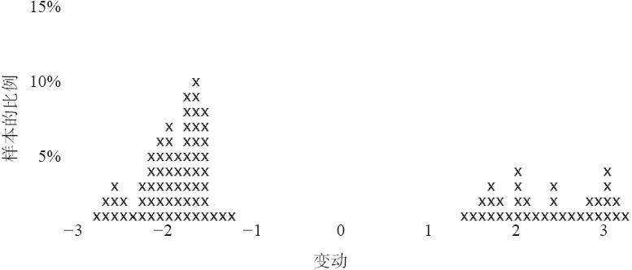
图39-4　XYZ运动的直方图（在10个月内测试28%的运动）

至于什么不是一个“好”的直方图，我们不会太迷恋于一幅显示出在x轴靠近“-1”和“1”或者它们之间有大量聚集数据点的直方图。如果可能的话，我们想要股票有比只超出盈亏平衡的距离运动得更远的能力。作为示例，看一看图39-5，它显示出了一个运动几乎没有超出过“-1”或“1”点位的股票，即使在超出这些点位时，超出的幅度也很小。大部分这样的情况会导致交易亏损，因为，即使股票可能超出需要的百分比，但这是它在10个月中最大的运动，而交易者不可能知道刚好要在这一点上提取盈利。图39-5的直方图所显示的跨式价差是不应当买的，无论在此之前的分析是怎么说的。
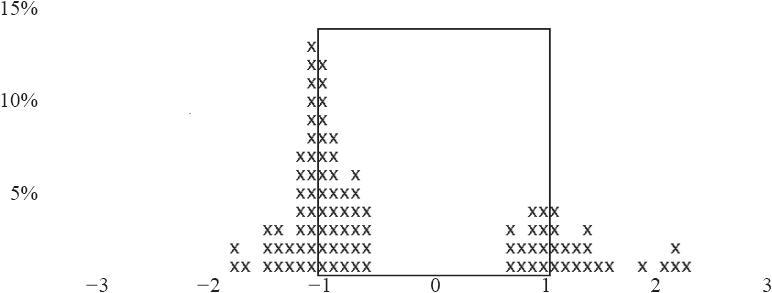
图39-5　差强人意的运动的示例

如果这个直方图显示出在“+3”水平之上有大量的运动，而在这个水平之下几乎没有什么运动，那么，这样的情况也是应当避免的。这样一幅直方图很有可能反映的是向上猛涨的、网络类型的股票活动，我们在前面提到过，对这样的活动没有理由指望它会重复自身。一般而言，交易者不想看到在直方图的x轴上有过多的空白处，需要的是持续性。

如果直方图是有利的，那么波动率的分析就完成了。交易者就找到了定价失误的期权，它们有相当好的理论盈利性，它们过去的股票运动证实了这样的运动在将来是有可能出现的。

### 39.2.11　另一种方法

在考虑了所有这些分析之后，另一种方法出现在脑海里：仅仅使用过去的运动，完全无视其他的分析。这听上去有些极端，但是它无疑是一种有效的方法。它就像给那些“知道”IBM能够运动18点并且因此想要买入这个跨式价差的人提供一些动力。如果直方图（对过去运动的研究）告诉我们IBM确实有相当大的运动18点的机会，那么，我们还有必要去考虑隐含波动率同历史波动率的关系，或者两种类型的波动率目前的百分位数，或者理论概率计算器的结论吗？从某种意义上来说，它就像是将隐含波动率（跨式价差的价格）同历史波动率（股票价格运动的历史）在一个严格的实践的意义上进行比较，而不是使用统计学的方法。

在现实中，交易者必须注意，不要买入过分昂贵的期权（或者卖出过分便宜的期权），因为谁都不能忽视隐含波动率。不过，跨式价差自身的价格（它是由直方图上的x轴决定的）并不反映出期权的价格，因此，在非技术分析的意义上说，也不反映出隐含波动率。我怀疑，如果只是使用过去的运动来产生波动率交易的候选者的话，这张名单会相当长。因此，就实践而言，它没有什么用处。

### 39.2.12　关于卖出波动率的更多考虑

在早些时候我许诺过要讨论更复杂的卖出波动率的策略。在以中性的方式卖出（定价过高的）期权，也就是“卖出波动率”时，期权策略家往往面临一个困难的选择。许多交易者不喜欢卖出裸期权，特别是裸股票期权，而且，许多用来限制风险的价差形式都迫使策略家必须选择方向（看多或者看空），而他并不真的想要这样的策略。这一节将讨论在股票和期货期权市场中有保护地卖出波动率这个更具挑战性的方面。

卖出波动率的困难之处在于发现一个允许交易者从卖出昂贵的期权中获利而又不必为其对冲（买入同样昂贵期权进行对冲）支付太多这样的中性策略。大多数交易者首先使用的简单策略是收入价差。从理论上说，如果隐含波动率在持有收入价差头寸期间下跌，那么就有盈利兑现。不过，再去掉建立头寸时花在四个不同期权上的手续费，有的时候还有将它们平仓（假定交易者卖出的看跌期权价差和看涨期权价差都是虚值的）的手续费，如果头寸提前平仓，也许就剩不下多少真正的盈利。总的来说，收入价差策略没有什么不好的地方，但是，它不具有真的可以使人感到兴奋的东西。有没有其他的既对风险有所限制，同时又在隐含波动率下跌时可以获利的可用策略呢？价格最高的期权是期限最长的期权。如果隐含波动率高，那么，如果交易者可以卖出这些期权并且对它们进行对冲的话，那会是一个好策略。

最简单的具有我们想要的特征的策略是卖出一个跨期价差，也就是说，卖出一个较长期的期权，同时，买入一个同样行权价的短期期权为它对冲。不错，这两者都相当贵（而且，近期期权的隐含波动率也许比远期的还要略高一些）。不过，远期期权交易价的绝对值要高得多，因此，如果两者都变得便宜起来，长期期权下跌的幅度就点数而言比近期的要大不少。这就是说，长期期权的vega比短期期权的vega要大。当交易者卖出一个跨期价差的时候，它叫做反向跨期价差（reverse calendar spread）。这个策略在论述反向价差的那一章里介绍过。读者应当复习一下那一章，不仅包括对该策略的介绍，还包括股票和指数反向价差中所内含的保证金问题的描述。

大部分交易者在反向跨期价差中所遇到的问题之一是，它产生不了很大的盈利。这个价差在卖出之后差距在理论上可以缩减到零，但是在现实中它不会如此，因为，即使它已经非常深度实值或虚值，长期期权还是会保留某些数量的时间价值。因此，这个价差永远不会真的缩减到零。

不过，还有另一种方法，它常常可以提供大一些的潜在盈利，同时仍然保留如果隐含波动率降低还可以盈利的可能。在某种意义上，它是反向跨期价差策略的修正，它可以创造出一个潜在地甚至更理想的头寸。这个头寸叫做波动率后式价差（volatility backspread），它涉及卖出一手长期的平值期权（正如在反向跨期价差一样），并且买入更多数目的较近期的虚值期权。这个头寸一般是按delta中性的原则构建起来的，并且有一个负值的vega，也就是说，如果隐含波动率下降，它就有盈利。

【示例39-6】XYZ在6月上旬的交易价是115。它的期权非常昂贵。交易者想要使用下面这两种期权构建一个波动率后式价差。
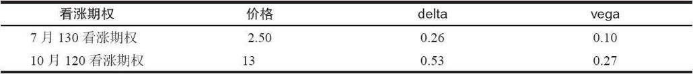
一个delta中性的头寸将是买入2手7月130看涨期权，卖出1手10月120看涨期权。这就带进了8点的收入。同时，它有一个小量的负值的vega，因为2乘以7月看涨期权的vega，减去1乘以10月看涨期权的vega是-0.07。也就是说，XYZ总的期权的隐含波动率每降低1个百分点，这个头寸就有7美元的获利，这不是一个大数目，不过这只是一个小头寸。
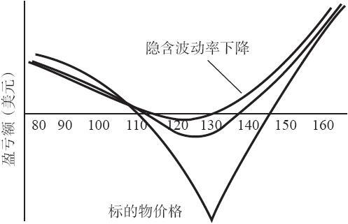
图39-6　波动率后式价差中性头寸

这个头寸的盈利性显示在图39-6中。这个策略风险有限，因为它没有涉及裸期权。事实上，如果XYZ上涨到一定的幅度，交易者可以有大笔的盈利，因为那手多余的看涨期权多头。同时，在下行方面，如果XYZ大幅度下跌，所有的期权都会失去它们大部分的价值，交易者的盈利数量就会接近于最初得到的收入。此外，隐含波动率的下降也产生了一小笔盈利，虽然因时减值可能对交易者不利，这取决于短期期权买在什么时候。最大的风险是XYZ的价格在7月到期时刚好在130上，因此，任何一个使用这个策略的策略家都应当计划在这个近期到期日之前将这个头寸平仓。它不应当被留在手里，等到价值贬值到最大的亏损点。

可以考虑对这个策略的修正。修正之一是卖出更长期的期权，当然，要用买入近期期权来为它们对冲。期权的期限越长，它的vega就越大，因此，隐含波动率的降低会导致价格更高的长期期权价格下跌得越深。不过，之所以想要使用这样的修正，是因为这样的事实：当期权变得真正昂贵的时候，近期期权常常会出现倾斜的情况。也就是说，近期期权交易时的隐含波动率会比长期期权的隐含波动率要高得多。在长期期权（LEAPS）中尤其是如此。因为这个原因，交易者应当肯定他不至于落入短期期权丧失波动率而长期期权与此同时还或多或少地保留了相同的波动率（长期期权就常常如此）这种情况。近期同远期期权之间的不同的波动率这个概念在第36章论述波动率交易基本原理时有过更为详细的讨论。作为一种一般的规则，如果交易者发现较长期期权的隐含波动率比你要买的期权的隐含波动率要低得多，那么，就不要使用这个策略。这个策略不太可能在长期期权（LEAPS）中发挥预期的作用。

交易者在寻找这类交易时应当分析的另一件事是，使用看跌期权是否比使用看涨期权更好。理由之一，你可以建立一个高度的盈利性是在下行方向的头寸（同上面的XYZ的示例所显示的上行方向的情况相反）。当然，在考虑到这样的可能性之后，交易者实际上可以从建立一个既有看涨期权价差也有看跌期权价差的头寸中得到好处。不过，如果你这样做的话，你就创造了一个“好消息，坏消息”的情景。好消息是最大风险减小了。例如，如果XYZ刚好在130（看涨期权价差中最糟的情况），相随的看跌期权价差的收入就可以把这个风险减少一些。不过，坏消息是，在这个头寸中的没有盈利的价格范围变得宽多了，因为有两个地方会在某种程度上出现最大亏损（在买入的看涨期权的行权价和买入的看跌期权的行权价）。

我们将简短地提一下保证金，因为我们在论反向价差的那一章已经讨论过了。对指数和股票期权，这个策略被看作是裸期权，这是一种荒唐的假设，因为任何人都可以从盈利图中看出，这个头寸在近期期权到期之前都是完全对冲的。这就提高了对非交易所会员的交易者资本的要求。不过，对期货期权来说，这个保证金的反常情况不是一个问题。对这些期权，交易者只需要为行权价之间的差额减去所收到的收入提供保证金，因为这是这个头寸的真正风险。总起来说，想要在股票和期货期权市场里卖出波动率的交易者需要有对冲，因为经常有价格跳空出现，而且这样的跳空可能造成惨重的亏损。这个策略创造了一个更为中性的，更少依赖于价格的途径来从隐含波动率的下降中获得盈利，特别是同简单收入价差相比，尤其如此。

### 39.2.13　总结：根据对波动率的预测进行交易

在波动率表现异常时进行交易，从理论上来说是个有吸引力的策略。上面所介绍的程序包括了若干步骤，使用了统计的和理论的分析。不过，无论是哪种情况，概率计算器都必须“说”一手波动率交易有很高的成功概率。这只不过是在进行概率分析之前使用什么样的标准来限制我们的选择的问题。因此，从这个角度来观察波动率交易分析也许更有用处：

步骤1：使用一个标准来对各种波动率交易的选择进行限制。下面这些都可以用来作为第一标准，但并不是同时全都用上：

（1）隐含波动率必须在百分位数的一个极端的等级上；

（2）历史波动率同隐含波动率之间必须有很大的区别；

（3）诠释隐含波动率图形，观察是否出现了趋势的反转。

步骤2：使用一个概率计算器来预测是否可以期望这个策略会成功。

步骤3：使用过去价格的历史，决定标的物在过去是否有能力创造出有盈利的交易。（例如，如果交易者考虑要买入跨式价差，问这样的问题：“这个股票是否能够运动到这么远，频率是否高到足以使这个买入跨式价差的交易获利？”）使用直方图来保证过去的股票价格分布是平滑的，这样，一个异常的、无代表性的运动就不会过分地影响到这些结果。

从步骤1开始的每一个标准在每一天都可以产生一个各不相同的有效的波动率交易的候选名单。如果一个具体的候选策略出现在不止一个名单上，那么，它就有可能是所有的情况中最好的一个。
