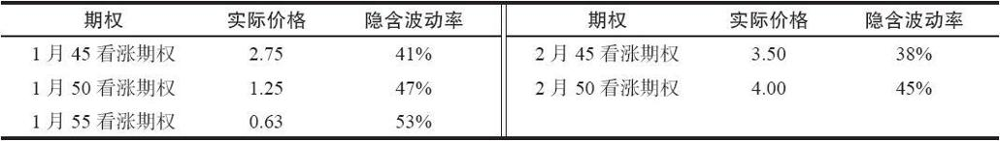
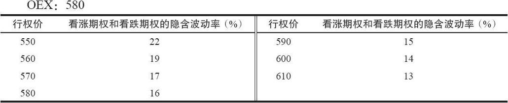
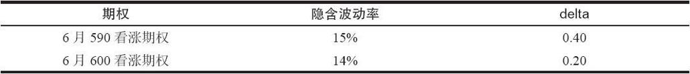
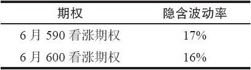
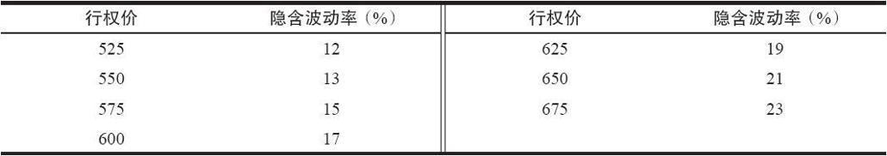

# 39.3　交易波动率倾斜

在这一章的前面我们提到过，在两种情况中波动率预测有可能是“错误”的。第1种情况是隐含波动率脱离常规。第2种情况是同一标的工具上的单个期权的隐含波动率之间有显著的区别。这叫做波动率倾斜，它自身就提供了交易的机会。

### 39.3.1　同一标的证券上不同的隐含波动率

一个期权上的隐含波动率是交易者应当用来作为布莱克–斯科尔斯模型输入的波动率，这样，这个模型所产生的结果就同这个期权目前的市场价格相等。因此，每个期权都有它自己的隐含波动率。一般而言，它们相互之间的值会相当接近，虽然不是完全相同。不过，在有的情况里，各个隐含波动率之间的差别大到值得引起策略家的注意。这一节要讨论的就是后面这种差别相当大的情况。

【示例39-7】XYZ的交易价是45。有下面的期权价格存在，它们的隐含波动率也列在下面：

请注意，这些单个期权的隐含波动率的范围是从较低的38%到较高的53%。对同一标的证券的期权来说，这个差别相当大，不过，对于说明问题的目的而言，它是有用的。

买入较低隐含波动率的期权，与此同时卖出较高波动率的期权，这样可以建立一个中性的策略，比如买入10手2月45看涨期权，卖出20手1月50看涨期权。中性价差的示例在下一章里会有所扩展，那里将讨论使用精确的衡量来决定应当分别买入多少和卖出多少看涨期权。

在交易这样一个头寸之前，策略家应当问问自己，不同期权之间是否有理由在隐含波动率之间有这么大的差别。一般而言，我们有理由说，虚值期权的隐含波动率要比平值期权略高一些，较长期限的期权要比短期期权的隐含波动率更低一些。不过，在许多情况里事情并不是如此，因此，交易者必须小心，不要将事情过于抽象化。

投机者常常想要找到成本额最低的期权。因此，如果是有兼并的谣传，他们就买入虚值期权，而不是买入定价更高的或者实值的期权。如果虚值期权因为兼并谣传而非常之贵，那么，策略家就必须小心，因为中性策略的概念会把他带进卖出裸看涨期权。这不是说他应当完全避免这样的情况；他也许有可能构建一个头寸，其中在上行方向有足够的余地保护他自己，或者，他也许相信这个谣传只是个谣传而已。

回到前面的关于同一标的股票有不同的隐含波动率这个总的题目上，策略家应当问问自己，他是怎么样发现单个期权之间的差别大到值得引起注意的。在下一章的论述高级数学概念那一节的结尾处提供了一个数学方法。在这里我们只需要说，有方法可以将各个隐含波动率中的差别归结为一个单一的数字，有点像“隐含波动率的标准差”，对策略家来说相当容易使用。对这些数字可以建立起一个名单，对股票或期货进行比较，看一看哪一个可以成为这类中性价差的对象。在既定的一天中这个名单一般都相当短，大约20种股票和10种期货可以够得上标准。

同一标的股票的各个期权的隐含波动率保持各不相同，这个概念需要更进一步的讨论。在下面一节里，我们将讨论在不同行权价的波动率之间的半永久的扭曲性这个观念。

### 39.3.2　波动率倾斜

在1987年股市崩盘之后，指数期权经历了后来被证明是永久的扭曲。虚值看跌期权始终比虚值看涨期权要贵。此外，虚值看跌期权比平值看跌期权也要贵；虚值看涨期权比平值看涨期权要便宜。导致这种扭曲的效果有若干因素，但是，它的根子很深，从那时起，在所有的市场起伏中都始终存在。其他的市场，特别是期货市场，也经历过在各种不同行权价的隐含波动率之间的长期扭曲关系。

这个现象的正式名称为波动率倾斜：它是不同行权价的期权按不同的隐含波动率交易的持久效果。应当注意到，同样行权价的看涨期权和看跌期权一定是按相同的隐含波动率交易的；否则的话，转换或反转组合就会消除这些区别。不过，在不同的行权价之间没有真正的套利。因此套利无法消除波动率倾斜。

【示例39-8】OEX指数期权中有波动率倾斜。假定OEX和它的期权的平均波动率是16%。在有波动率倾斜存在的时候，在各个行权价上的隐含波动率看上去可能是这样的：

在这种形式的波动率倾斜中，虚值看跌期权是最贵的期权；虚值看涨期权是最便宜的。隐含波动率的这种模式叫做反向波动率倾斜（reverse volatility skew），或者，也叫做负向波动率倾斜（negative volatility skew）。

这种效果的原因产生于股票市场有强烈的偶尔崩盘的倾向这个事实，寻求保护的投资者买入指数看跌期权。由于1987年崩盘期间出现的投资组合保险策略的失败，他们不像原来那样卖出那么多的股指期货。此外，卖出裸指数看跌期权所需要的保证金也增加了，特别是对做市商，他们是裸看跌期权的主要提供者。因此，对指数看跌期权有高需求但只有低供给。所以，虚值的指数看跌期权就非常昂贵。

这并不能完全解释为什么指数看涨期权会如此便宜。出现这种现象的部分原因是因为机构交易者可以通过卖出一些虚值的指数看涨期权来为那些昂贵的指数看跌期权提供一些资金。如果他们的机构持有股票，那么，这样的卖出基本上就是卖出备兑看涨期权，在大部分情况中，这些机构会拥有标的股票。这个策略叫做领圈价差。

波动率中的这种扭曲同股票价格的概率分布并不一致。这些扭曲的隐含波动率为股票运动界定了一条不同的概率曲线。它们似乎是说，市场下跌的机会要大于上涨的机会。实际并不是如此；事实上，事情是反过来的。回过去考虑一下使用对数正态分布来界定价格运动的理由。因此，如果交易者能够将头寸保持到到期日，他就有机会从波动率倾斜中获得盈利。

前面的示例显示出交易者想要卖出高隐含波动率的期权，同时买入低隐含波动率的期权作为对冲。因此，对OEX的交易者来说，有以下三种相关的策略。

（1）买入一个OEX的看跌期权熊市价差。

例：买入10手OEX 6月560看跌期权

卖出10手OEX 6月540看跌期权

（2）买入OEX看跌期权，卖出更多数目的虚值看跌期权（卖出看跌期权比率）。

例：买入10手OEX 6月560看跌期权

卖出20手OEX 6月550看跌期权

（3）卖出OEX看涨期权，买入更多数目的虚值看涨期权（看涨期权后式价差）。

例：买入20手OEX 6月590看涨期权

卖出10手OEX 6月580看涨期权

在所有这三种情况里，交易者都是在卖出较高隐含波动率，买入较低隐含波动率的期权。第一个策略是一个简单的熊市价差。虽然它的获利是基于这样的事实：期权就隐含波动率来说是有倾斜的，但是，它不是一个中性的策略。为了获利，它需要标的物价格下跌。使用这样的方向性的策略没有什么不对的地方，但是，策略家必须意识到这个倾斜（在到期日之前）是不会消失的，因此为了盈利，指数的价格必须要有运动。

第二个策略也许对略为看空的投资者最合适，虽然市场的严重下跌有可能使得指数低到那手多余的看跌期权空头会有严重亏损的地步。不过，从统计学的角度看，这是一个吸引人的策略。在到期时，波动率倾斜必须消失；市场必须运动到同它们的现实概率分布相一致，而不是同具有倾斜的期权所隐含的虚假概率分布相一致。这样，策略家就有了潜在的有利可图的情景。

后式价差策略对看多的投资者最合适，虽然有的时候也可以为了收入而创建后式价差，这样，如果指数下跌，就可以赚一小笔钱。从理论上说，一个策略家可以同时实施这两种策略，这可以给他在一个较大的指数价格范围内取得优势。同时，这并不意味着他不会输钱；它只是说他的策略因为期权定价的方法而从统计学上看更有优势。也就是说，他获利的可能性更大。

不过，在现实中，一个中性的交易者要么选择比率价差，要么选择后式价差，而不是两者兼备。作为一般的规则，如果目前的隐含波动率是在高百分位数上，交易者应当使用比率价差策略。如果目前隐含波动率在低百分位数上，那就使用后式价差。按照这种方法，隐含波动率向回运动到第50级百分位数，已经建立的头寸也会有好处。

在这些策略中发生的另一件有趣的、对它们会有好处的事情是：随着OEX的运动，波动率倾斜也会扩展到各个行权价中。在前面一节的示例里可以看出，交易者或许应当继续使用在他建立这个头寸时出现的扭曲的波动率来预测他的盈利。这是一种保守的策略，也是一个正确的策略。在这些OEX价差交易的情况里，它也许会有好处。

假定OEX的交易始终存在倾斜，这意味着无论在什么样的绝对价格水平上，平值的行权价都有16%的隐含波动率；这个倾斜于是会从这个行权价上扩展出去。因此，如果OEX上涨到600，那么600的行权价就会有16%的波动率；或者，如果它跌到560，那么560的看跌期权和看涨期权就有16%的波动率。当然，16%只是一个起代表作用的数字；OEX的“平均”波动率也会改变。为便于说明，假设平值的行权价保持一致的波动率是一种方便的做法。

【示例39-9】交易者开始的时候建立了一个OEX的看涨期权后式价差，想要从波动率倾斜中得到好处：

最初的情况：OEX：580

一个中性价差就会是：

买入2手6月600看涨期权；

卖出1手6月590看涨期权。

因为这里的delta的比率是2：1。

现在，假定OEX在后来上涨到600，时间还远在到期之前。在这个情况里，这不是一个特别吸引人的价格。读者应当记得，在到期日，如果标的物价格刚好在买入的期权的行权价上，一个后式价差就会有它最糟的结果。即使是在到期之前，如果指数刚好在600，交易者就不能指望会有什么盈利。

不过，这个策略一开始就有统计学上的优势，这也许对他能够有所帮助。目前的情况看上去也许是这样的：

6月600看涨期权现在是平值期权，因为OEX上升到了600。这样，它的隐含波动率就是16%（或者是OEX在当时不管有什么样的“平均”波动率，这里假设它仍然是16%）。6月590看涨期权的波动率要略微高一些，因为这里仍然有波动率倾斜的存在。

因此，对在这个价差里的期权多头来说，它们的隐含波动率增加了，这是一个好处。当然，期权空头的隐含波动率也增加了，但是，由于两个原因，这个总的价差还是可以获利：

（1）买入期权的数量比卖出的要多一倍；

（2）波动率增长对平值期权的效应最大，实值期权所受的影响最小。

所有的指数期权都有这种波动率倾斜。波动率倾斜在其他市场中也存在。有波动率倾斜的其他市场通常是期货市场。特别是黄金、白银、白糖、大豆和咖啡的期权，它们常常会出现一种同指数期权中所出现的波动率倾斜形式相反的波动率倾斜。在这些期货市场里，最便宜的期权是虚值看跌期权，而最贵的期权是虚值看涨期权。

【示例39-10】1月大豆在580上交易（每蒲式耳5.80美元）。下面的隐含波动率表格显示出了波动率倾斜在这个大豆市场中是如何同前面示例里OEX市场中所显示的相反的：

1月大豆：580

请注意，虚值看涨期权现在是更为昂贵的期权，而虚值看跌期权则是最便宜的。这种隐含波动率的模式叫做前向波动率倾斜（forward volatility skew），或者说，正向波动率倾斜（positive volatility skew）。

由这些波动率所隐示的大豆价格的分布是不正确的，这同OEX在股市中的情况一样。大豆的隐含分布过于看多，它隐示着大豆市场上涨100点的可能性要比下跌50点的可能性要大得多。考虑到大豆的历史价格运动，这是不正确的。

一个想要从这个市场的前向（或者说正向）波动率倾斜中得到好处的策略家基本上有3种可用的策略。它们是同我们为OEX所推荐的策略相反的策略，OEX的隐含波动率倾斜是反向的（或者说负面的）。首先是看涨期权牛市价差，其次是看跌期权后式价差，最后是看涨期权比率价差。在这3种情况里，交易者会买入较低行权价的期权，卖出较高行权价的期权。这就给了他理论上的优势。

对OEX策略所做的同样的评论也可以用在这里。牛市价差是一个方向性的策略，因此，尽管在统计学上有波动率倾斜上的优势，交易者或许也只能在标的物价格上涨的时候才能期望它会赚钱。建立看跌期权的后式价差的最好时机是当隐含波动率的总的水平在一个低百分位数上的时候。最后，看涨期权比率价差在上行方向有很大的风险（而且，期货价格有可能快速上涨，特别是在基本面条件有所变化的时候，就像天气的变化对谷物市场的影响那样）。使用看涨期权比率的最好时机是当隐含波动率已经在高百分位数上的时候。

作为一条总的评语，应当注意到如果波动率倾斜在交易者仍然持有头寸的时候消失的话，一般就会有盈利产生。在正常情况下在这个时候提取盈利对策略家是有利的。否则的话，后续措施就应当坚持采用为这些策略所建议的总的行动：在比率价差的情况里是防止大量亏损的保护性措施；在后式价差的情况里，提取部分盈利，或许将买入的期权挪仓到一个更接近平值的行权价。

### 39.3.3　对波动率倾斜的总结

凡是有波动率倾斜存在的地方，无论是在什么市场，中性的策略家就有机会建立一个有优势的头寸。这些优势产生于这样的事实：正常的市场运动与期权所隐含的不同。不仅如此，如果在所有的行权价上，从最低到最高，都有倾斜的话，那么，期权是就错误的。策略家使用相同的倾斜在到期日之前预测他的盈利时应当小心，因为它也许会持续一些时间。不过，在到期日，它自然一定会消失。因此，计划要将头寸留到到期日的策略家可以发现，波动率倾斜为他提供了一个产生正预期收益的机会。
