# 40.2　希腊字母

风险的衡量尺度一般是用实际的或假想的希腊字母来命名的。例如，我们在前面的章节里讨论的“delta”。到今天，人们通常就只用这个“希腊文”代码来描述一个期权头寸的风险暴露。例如，“delta多头200股”说的是整个头寸的表现就像是刚好持有200股标的股票多头。一共有6个这样的希腊字母，不过，常用的只有4个。

### 40.2.1　delta

同期权策略家相关的最重要的风险衡量指标是“delta”，也就是当标的证券发生运动时，它的期权头寸有多大的即时暴露。事实上，delta这个术语通常至少用在两种不同的上下文里：一个是用来表达在标的证券发生1点的运动时期权变化的数量，另一个是用来描述整个期权投资组合的股票等股头寸。

复习一下单个期权的delta的定义（最早在第3章中有介绍），读者应当还记得，delta在看涨期权中是一个从0.0~1.0的数字，在看跌期权中是一个从-1.0~0.0的数字。这是如果标的股票运动1点时期权会运动的数量；换种说法，它是反映股票价格任意变动对期权价格变化的比例。

【示例40-1】假设一个XYZ 1月50看涨期权的delta是0.50，XYZ的价格是49。这就意味着这个看涨期权的运动速度是这个股票的运动速度的50%。因此，如果XYZ跳到51，2点的涨幅，那么，就可以预期1月50看涨期权的价格会上涨1点（股票涨幅的50%）。

在另一种说法中，一个看涨期权的delta常常被认为是看涨期权在到期时会是实值的概率。也就是说，如果XYZ是50，1月55看涨期权的delta是0.40，那么，有40%的概率XYZ在1月到期时的价格会超过55。

看跌期权的delta是用负数来表达的，它意味着看跌期权的价格运动方向同标的证券的方向相反。还记得吗，虚值期权的delta是小一些的数目，随着期权虚值程度的加深而趋向于0。反过来，深度实值的看涨期权的delta接近于1.0，深度实值的看跌期权的delta接近于-1.0。请注意：从数学的角度看，一个期权的delta是布莱克–斯科尔斯模型（或者无论哪个你正在使用的公式）的同股票价格相关的偏导数。从图形上看，它是期权价格曲线的切线的斜率。

让我们现在来看一看波动率和时间这两者是如何影响一个看涨期权的delta的。这一章的许多数据都既用表格也用图形来表示，以满足读者的不同需要。

标的股票的波动率对期权的delta是有影响的。如果股票波动率不高，那么，实值期权的delta就会比较高，而虚值期权的delta就会比较低。图40-1和表40-1描绘了两只波动率不同的股票上的各个不同看涨期权的delta。这里显示的是在不同行权价上的delta，离到期的时间都是3个月，标的股票的价格都是50。请注意，这幅图形确认了这样的事实：低波动率股票的实值期权的delta较高。对虚值期权，事情就是反过来的：在这样的情况里，高波动率股票的期权的delta较高。另一种观察这个数据的方法是，高波动率股票的期权所含的时间价值总比低波动率股票的期权要多。在跟踪股票价格运动方面，在实值的时候，含有更高时间价值的期权不如那些只有很少或者没有时间价值的期权那么准确。因此，这些低波动率股票的实值期权有较高的delta，因为它们在跟踪标的股票价格运动方面更准确。虚值期权的整个价格都是由时间价值组成的。时间价值较高的期权（那些高波动率股票上的期权）的运动幅度会更大，因为它们的价格较高。因此，高波动率股票的虚值期权的delta就更高。
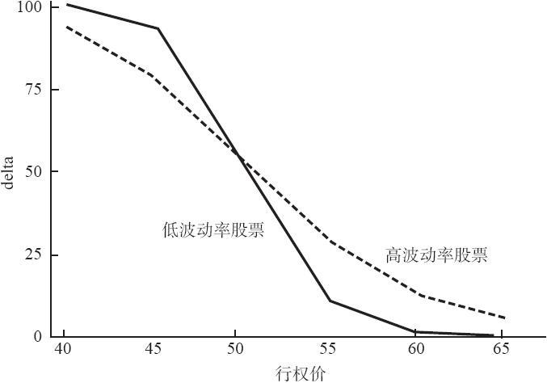
图40-1　delta比较，XYZ=50

表40-1　不同波动率时的delta比较，XYZ=50，离到期时间=3个月
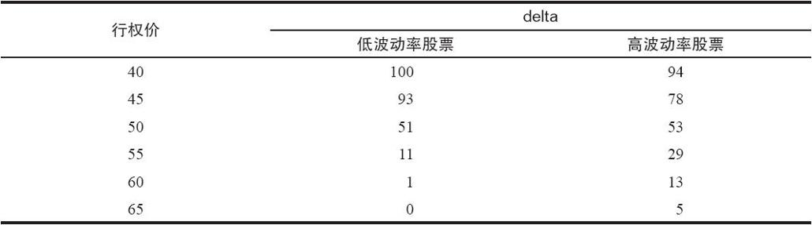
时间同样也会影响delta。图40-2（见表40-2）和图40-4显示了时间同delta之间的关系。图40-2的标度同图40-1（delta同波动率）相似：delta数据显示在不同的行权价上，在所有的情况里，XYZ的价格都等于50。请注意，短期期权在实值时delta比较高。同样，这也是因为它们的时间价值最少。对虚值期权，事情刚好反过来：长期的期权的delta较高，因为这些期权所含的时间价值最多。
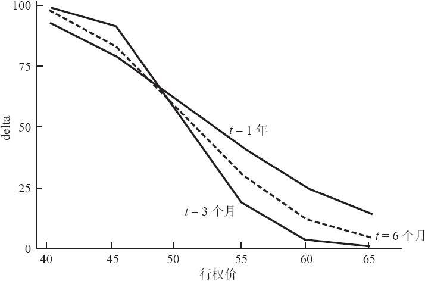
图40-2　delta比较，XYZ=50

表40-2　delta比较，离到期时间不同，XYZ=50
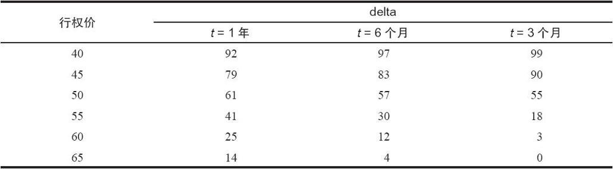
图40-3（见表40-3）描绘了一个XYZ 1月50看涨期权，XYZ的价格为50。这幅图形的横轴是“到期前剩下的星期数”。请注意，较长期的平值期权的delta比较短期期权的delta数值大。事实上，随着到期日临近，delta的数值缩减得更加迅速。因此，即使股票价格保持不变，波动率稳定，它的期权的delta随着时间的流逝还是会变化。对策略家来说，记住这一点很重要，因为他不断地在监控他的头寸的风险特征。他不能因为股票在一段时间内保持同样价格，就假设他的头寸不会有变化。

头寸delta。delta这个术语的另外一种用法是我们在前面提到的等股头寸（ESP）；对期货期权来说，它被称作等额期货头寸（EFP）。为了在这两种用法之间加以区别，期权的delta一般被称作“期权delta”（option delta），而ESP或EFP被称作“头寸delta”（position delta）。读者应当还记得，头寸delta的计算是根据下面这个简单的等式：

头寸delta=期权delta×每手期权的股份数×期权数量
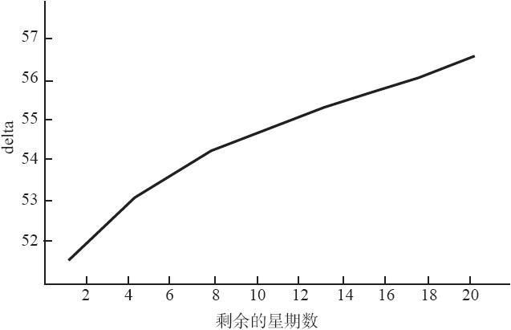
图40-3　因为时间变化而变化的delta

表40-3　因为时间变化而变化的delta
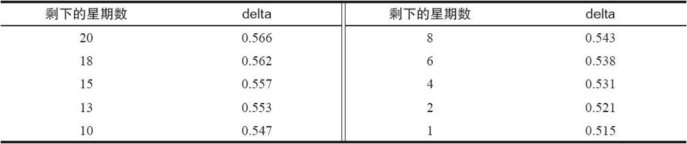
对于期货期权，“每手期权的股份数”为“每手合约的股份数”所代替，这个数目永远是1。这是对一个期权头寸有多大市场风险暴露的衡量。无论是把它叫做头寸delta，ESP还是EFP，交易者都是使用他的投资组合中的单个期权的delta来计算整个风险暴露。通过将这个头寸（或者是整个期权投资组合）中的每一项的计算加在一起，交易者就可以大致知道整个头寸有什么样的市场风险暴露。下面是从论述数学应用的那一章里搬过来的一个示例，它显示的是怎样计算一个复杂头寸的净风险暴露。

【示例40-2】当XYZ为31.75时有下列的头寸存在。它同一个买入的跨式价差（或后式价差）相像，如果有可能，许多做市商和专业交易者都会建立这些类型的头寸，以利用我们今天的市场中所固有的突发的波动率。
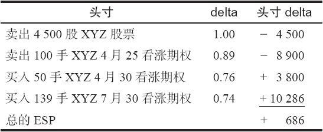
这个头寸虽然看上去相当复杂，但它可以简约为仅仅是大约700股XYZ多头。这通常被称作“delta多头700股”。因此，当用来指整个头寸的delta的总和的时候，“delta”一词同“等股头寸”是同义的。

由于头寸是持有delta多头，因此对市场而言这个头寸有一定的风险暴露。如果头寸的delta为零，它就将是delta中性的，因此，从理论上来讲，此时，头寸对市场而言是没有风险暴露的。

请注意，交易者只要简单看一下他的投资组合，就可以得出他的delta的总的特征：看涨期权空头或看跌期权多头会在头寸中引进负的delta；看涨期权多头和看跌期权空头会引进正的delta。此外，很明显，标的证券多头会给头寸增加多头delta（long delta），而标的证券空头给头寸增加负的delta。我们将在本章的下一节讨论如何使用这样的信息来调整交易者的头寸。

显然，整个头寸的delta会随着股票价格的上下运动和时间的变化而变化。这里得出的数字只是为了知道这个头寸在当时的构成。正是因为需要知道这个头寸在其他因素发生变化时将如何变化，所以策略家才使用了下面的这些概念。

### 40.2.2　gamma

简单地说，gamma是在标的股票价格变化时delta变化的速度。我们已经知道，当看涨期权从虚值期权变为实值期权时，它的delta会增加。gamma只是对delta增加的速度的一个准确的指标。

【示例40-3】XYZ的价格为49，假定1月50看涨期权的delta是0.50，gamma是0.05。如果XYZ的价格上涨1个点到50，这个看涨期权的delta增加的数量就是这个gamma的数值。它会从0.50增加到0.55。

正如同delta一样，gamma也可以用百分比来表示。不过，在这个情况里，增加或减少也要用在delta上。

【示例40-4】同样，XYZ的价格为49，假定1月50看涨期权的delta是0.50，gamma是0.05。如果XYZ的价格上涨2点到51，这个看涨期权的delta就会增加股票运动的5%，因为这里的gamma是0.05，或者说5%。这个股票运动的5%是0.05×2，或者说0.10。因此，delta就会增加0.10，从0.50到0.60。

显然，delta不可能在每次XYZ上涨1点的时候都增加0.05，因为如果按照这样的算法，它最终会超过1.00，而delta的最大数值是1.00。因此，gamma显然发生了变化。总的来说，当股票价格接近期权的行权价时，gamma就达到了它的最大值。当股票价格离开行权价时，不管是哪个方向，gamma值都会减小，朝它的最小值0的方向运动。

从概念上说，这就意味着深度实值的或深度虚值的期权的gamma接近于0。这是合理的，它意味着深度实值或深度虚值期权的delta不会再有什么变化，即使股票价格运动了1个点。

【示例40-5】假定XYZ的价格是25，1月50看涨期权的delta基本是0。如果XYZ向上运动1点到了26，这个看涨期权仍然是深度虚值，它的delta仍然是0。因此，这个看涨期权的gamma是0，因为股票价格上涨了1点，而delta没有变化。

与此相似，当XYZ的价格为25的时候，XYZ的1月45看跌期权的delta是-1.0。如果XYZ价格上涨1个点到26，这个看跌期权的delta不会改变；它仍然是深度实值的，因此，delta仍然会是-1.0。因此，这个深度实值的期权的gamma也是0，因为delta在标的证券有1点的上涨时没有发生变化。

请注意，所有期权的gamma都是正，不管是看涨期权还是看跌期权。

知道gamma的其他特性也会有用。随着到期日的临近，平值期权的gamma会急剧增加。考虑一下一个离到期只有一两天的期权。如果它是平值的，delta就会是将近0.50。不过，如果股票上涨了2点，这个期权的delta就会上跳到差不多1.00，因为离到期时间很短。因此，这个gamma就会大约是0.25（股票运动了2点，delta增加了0.50），同这个数值相比，一个离到期还有好几个星期或者好几个月的平值期权的gamma值就要小得多。同样是标的股票的2点的运动，对一个较长期的期权来说，几乎不会导致delta有什么变化。

虚值期权表现出的gamma同到期时间之间的关系是不同的。一个将要到期的虚值期权有着非常小的delta。不过，如果这个虚值期权还有不少剩余的时间，那么，它的gamma就会大于将要到期的期权。

图40-4（见表40-4）描述了三个到期时间不同的期权。在这里可以观察到gamma同时间的关系。请注意，短期期权对深度实值和虚值的，有非常低的gamma，但是对平值的（在50的）有最高的gamma。反过来，长期的1年的期权有3次在深度实值或虚值的期权中达到了最高值。这些数据展现在表40-4中。这张表格包括了略多一些的数据：在离到期时间甚至更短的情况中的平值期权的gamma。注意一下在平值期权中gamma是怎样随着时间的减少而迅速增加的。在只剩1个星期的时候，gamma超过了0.28，也就是说，要是股票价格只是从50上涨到51，这个看涨期权的delta也会从0.50上升到0.78。
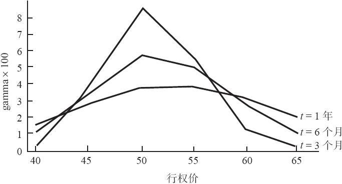
图40-4　gamma比较，XYZ=50

表40-4　gamma比较，离到期时间不同，XYZ=50
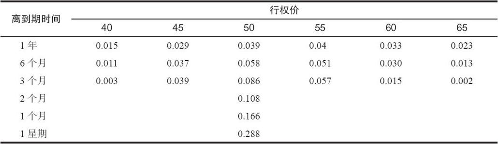
gamma同时也与标的证券的波动率有关。波动率低的股票的平值期权的gamma要高于波动率高的相似的期权。下面的示例说明了这一点。

【示例40-6】假定XYZ的价格是49，ABC的价格也是49。另外，XYZ波动率比较大（隐含波动率30%），ABC的波动率相对较低（20%）。这样，这两个股票的相似期权的gamma会有显著的不同。
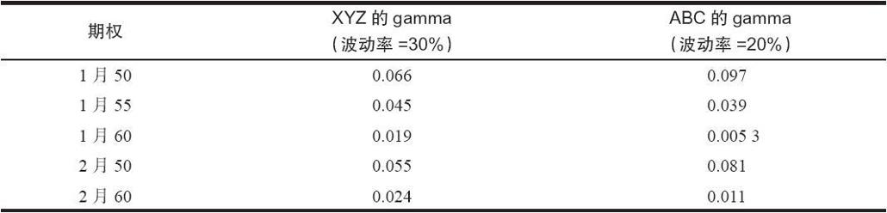
请注意，波动率较低的ABC股票的平值期权（1月50和2月50）的gamma比XYZ平值期权高。不过，看一看行权价高一档的（1月55），你会发现波动率更大的期权的gamma要略高一些。看一看高两档的，波动率较高的期权的gamma要高得多，1月60的和2月60的都是如此。

如果你考虑一下波动率同delta之间的关系，就可以发现这个概念是有道理的。在低波动率的股票上，你可以发现，即使是略微实值的期权，它的delta也增长得很快。这是因为，由于股票波动率低，买家不愿意为这个期权支付太多的时间价值。因此，gamma也相当高，因为随着期权变为实值的，delta的增长就会比在波动性高的股票上更加迅速。虚值期权则是完全不同的事情。因为对波动率低的股票来说，想要快速运动到虚值期权的行权价不是一件容易的事，因此，虚值期权的delta相当小，它也不会很快发生变化（也就是说，gamma也小）。

图40-5总结了这些概念（见表40-5），它描绘了不同波动率股票上的相似期权的gamma。为了便于画图，我们假设XYZ等于50，离到期还有3个月。

请注意，对一个波动率非常高的股票来说，在离到期还有3个月的情况下，gamma在几乎所有的行权价上都相当稳定。这就意味着，即使标的股票只有1点的运动，在这样一个高波动股票上的所有期权的delta都会有相当大的变化。对中性的策略家来说，意识到这一点很重要，因为如果标的股票波动率非常高，一开始是delta中性的头寸很快就会发生变化。正如从这个表格里可以看到的，这个“中性”价差中的期权的delta会很快改变，从而使得这个价差变得相当非中性。我们在这一章的后面将详细地讨论这个概念。
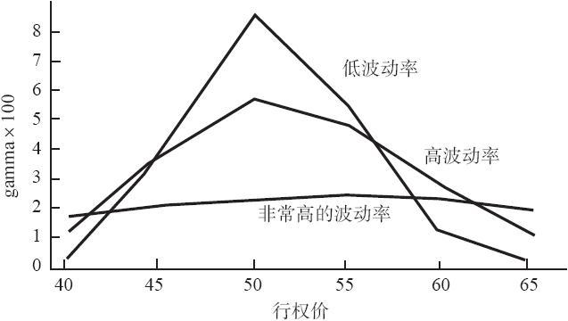
图40-5　gamma比较，XYZ=50，t=3个月

表40-5　不同波动率的gamma比较，XYZ=50，t=3个月
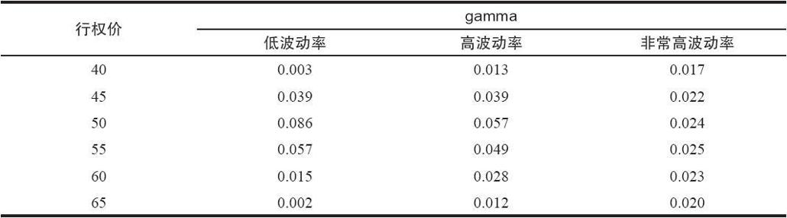
正如我们用delta来构建整个头寸或者投资组合的等股头寸，我们也可以用相似的方法来使用gamma。下面是一个这样的示例，它使用的是前一个关于头寸delta的相同的证券。要注意的重要一点是，标的证券自身的gamma是零。之所以如此是因为标的证券的delta（它始终是1.0）从来不改变，因此它的gamma就是零。gamma衡量的是delta的变化总量；如果标的证券的delta从来都不发生变化，那么，标的证券的gamma一定是零。

【示例40-7】当XYZ是31.75时，有下面的头寸存在。回顾一下，它同一个买入跨式价差（或后式价差）相似，如果股票在到期时运动到一定的幅度，无论是在哪个方向，它们都能获利。除了前面列举的delta之外，这里还列举了gamma。注意一下，因为gamma是一个很小的绝对值，在计算中有时我们保留了3或4位小数。
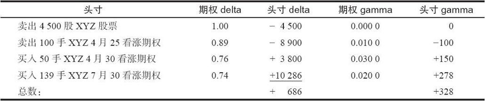
同前面一样，这个头寸差不多是delta多头700股。此外，你现在可以看到它是正gamma 300多股。这意味着，XYZ每运动1点，delta就预期会变化328股：如果股票向上运动1点，delta就会增加到+1014（现有的delta，也就是686，加上gamma的328）。如果XYZ向下运动1点，那么，delta就会减少到+358（现有的delta，也就是686，减去gamma的328）。

请注意，在上面的示例里，如果XYZ继续上涨，gamma会保持为正（虽然它最后会缩减一些），而delta会继续增长。这意味着这个头寸会更多头。如果你注意到，随着股价上涨，由于有额外的看涨期权多头的存在，以及它们的实值程度加深，这个事实就显得有它的道理了。反过来，如果XYZ继续下跌，delta就会继续减小，并且很快就变为负，也就是说，这个头寸现在整体上是卖空的。因此，这个头寸确实同一个买入跨式价差相似：在市场上涨时，它会变得更加多头；而在市场下跌时，它会变得更加空头。

买入期权，无论是看涨期权还是看跌期权，都有正的gamma，卖出期权则有负的gamma。因此，一个持有正gamma头寸的策略家就有一个净买入的头寸，他一般会希望市场有大幅度的运动。反过来，如果策略家持有一个负gamma的头寸，这就意味着他是卖空期权，因而想要市场保持稳定。

请注意，有可能在delta中性的情况下仍然有相当大的gamma。（例如，如果策略家拥有delta相互对冲的看跌期权和看涨期权，他就会是delta中性，但是，仍然有正的gamma，因为这两个期权都是买入的。）如果策略家是delta中性的，他知道在这个时候他没有市场风险暴露，但是，他的gamma向他显示出，如果市场运动，他的头寸会出现什么样的风险暴露。我们在本章的后面将详细讨论这些概念。

### 40.2.3　vega或tau

在希腊字母表中没有称作“vega”的字母。因此，有的策略家（为了追求纯粹）选择使用真正的希腊字母“tau”来表示这个风险指标。本书中使用的是“vega”这个词，不过读者应当记住“tau”指的是同一件事。vega是当波动率变化时期权价格变化的数量。vega始终是用正数来表示的，不管是指看跌期权或者看涨期权。

我们知道，高波动率的股票有高价的期权。因此，随着波动率的增加，一个期权的价格也会增加。如果波动率降低，这个期权的价格也会降低。vega只不过是一种想要在其他条件不变的情况下对波动率运动时期权价格增加或减少幅度进行量化的做法。

在考虑一个示例之前，复习一下波动率这个术语是有帮助的。波动率是对标的证券运动速度的一种衡量。从统计学上说，它通常是作为股票价格在一定时段（一般是年化的）的标准差来计算的。这种统计学的衡量是用百分比来表示的，虽然将这个百分比同实际股票运动联系起来有可能是复杂的。我们可以说，一个波动率为50%的股票比一个波动率为30%的股票的波动性更大，这样就够了。股票市场总的波动率一般是15%，虽然它会不断变化（例如，崩盘）。

【示例40-8】同样，假设XYZ的价格是49，1月50看涨期权的售价是3.50。这个期权的vega是0.25，XYZ当前的波动率是30%。

如果波动率增加1%，到了31%，那么，根据这个期权的vega，期权的价值就会增加0.25，到3.75。

如果波动率不是增加而是下跌了1%，到了29%，那么，1月50看涨期权的价值就会减小到3.25（损失0.25，也就是这个vega的数量）。

如果一个期权的隐含波动率增加，这个期权的价格也会增加。因此，即使XYZ股票可能表现出同以前相同的运动，即它的（历史）波动率没有变化，如果有足够的期权买家，他们还是会抬高XYZ的隐含波动率。同样，即使历史波动率没有变化，过多的期权卖家仍然有可能压低隐含波动率。因此，我们必须得出结论说，vega所衡量的是当隐含波动率变化时期权价格变化的数量。

vega同时间有关系。图40-6（见表40-6）显示了离到期时间不同的期权的vega。我们假定在所有的情况中标的股票的价格都是50。注意一下，离到期的时间越长，vega就越高。注意一下下面的情况很有意思：对期限很长的期权来说，略为虚值的看涨期权（行权价=55）的vega实际上高于平值期权的vega。不过，随着时间的消逝，这种差异也消失了。我们在这里没有显示出来但也同样真实的是，在波动率非常高的股票上的略为虚值的期权，它的vega也会比平值期权的vega高。
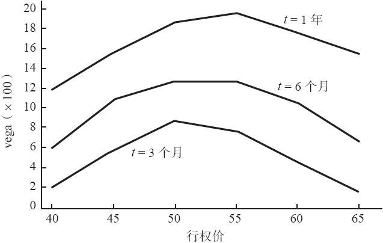
图40-6　vega比较，XYZ=50

表40-6　不同时段的vega比较，XYZ=50
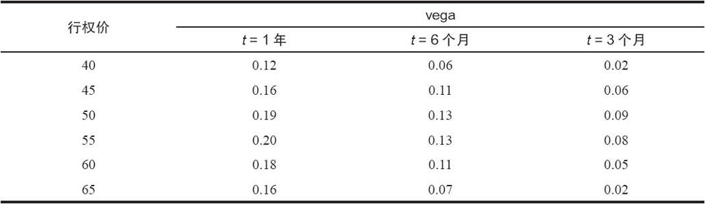
同前面讨论过的风险指标一样，vega可以用来指期权自身（期权vega），或者指整个头寸（头寸vega）。因为vega是用正数表示的，如果交易者是买入期权，那么他的头寸vega就是正的。这就意味着如果波动率减小，他就有暴露，如果波动率增加，他就能赚钱。

【示例40-9】同样，假定我们有一个同前面一样的后式价差，XYZ的价格是31.75。
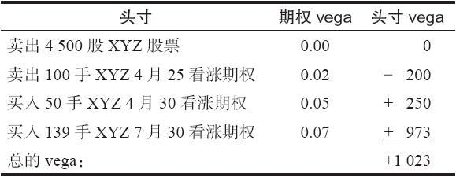
这个vega是正的10.23点（1023美元，因为这些股票期权中每一点价值100美元）。这个头寸有一个正vega的事实意味着它是暴露于波动率的变化的。如果波动率降低，整个头寸就会亏钱：波动率每降低1%点就亏损1023美元。不过，如果波动率增加，这个头寸就能盈利。

平值期权的vega最大，随着期权变得深度实值或者虚值，vega趋向于接近零。同样，这也很容易理解，因为波动率对深度实值或虚值期权的影响没有那么大。另外，对于平值期权来说，长期期权的vega要高于短期期权的vega。要证实这一点，考虑一个极端的情况：一个距离到期只有一天的平值期权，因为即将出现的到期日，无论是什么样的波动率变化，对它都不会有多大的影响。不过，离到期还有3个月的平值期权无疑会对波动率的变化做出反应。

vega同delta和gamma都没有直接的联系。交易者可以有一手既没有delta也没有gamma的头寸（delta中性，gamma也中性），但是仍然对波动率有暴露。这并不意味着这样的头寸是交易者所不希望看到的；它只是说，如果交易者有这样一个头寸，那么，他就对市场大部分风险都没有暴露，只需要把注意力集中在波动率风险上。

在本章后面的部分，我们将讨论如何使用波动率来建立头寸以及如何使用vega来监控头寸。

### 40.2.4　theta

theta衡量的是一个头寸的因时减值。所有的期权交易者都知道时间是期权持有者的敌人，它是期权卖出者的朋友。theta是对交易者头寸中的时间的风险指标。theta一般是用负数来表示的，它是用期权价值会发生的变化的数量来表示的。因此，如果一个期权的theta是-0.12，这就意味着整个期权每天会失去12美分，或者说大约1/8点。对看跌期权和看涨期权都是这样，虽然行权价和到期日相同的看跌期权同看涨期权之间的theta并不相同。

非常长期的期权在1天的时间之内是没有多少因时减值的。因此，一手长期期权的theta接近于零。另一方面，短期期权，特别是平值的短期期权，theta的绝对值最大，因为它们的价值每天都要为时间的变化所蚕食。高波动率股票期权的theta比低波动率股票期权的theta要高。显然，前者更为昂贵（有更多的时间价值），所以每天都会损失更多的时间价值，也就是说，它们有更高的theta。最后，因时减值不是线性的，期权在合约快到期之前每天亏去的价值百分比更大。

图40-7（见表40-7）描绘了theta与不同行权价和不同波动率的期权的关系，这些期权离到期都还剩3个月。同样，注意一下，对波动率非常高的股票来说，虚值期权的theta同平值期权的theta一样大。这是说，每过一天，股票价格达到虚值的行权价的概率就降低一些，从而导致期权丧失价值。这并不改变这样的事实：对非常短期的期权来说，平值期权的theta最大。
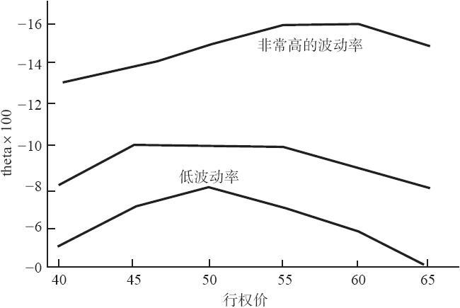
图40-7　theta比较，XYZ=50，t=3个月

表40-7　不同波动率的theta比较，XYZ=50，t=3个月
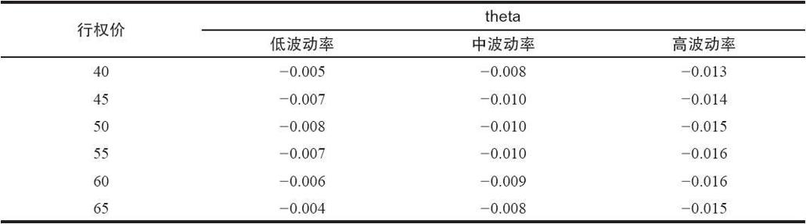
正常情况下，策略家对单个期权的theta不感兴趣。他通常更关心delta或gamma。不过，正如其他风险指标一样，可以计算出整个期权投资组合的theta。“头寸theta”这个量度有可能变得相当重要，因为它使得策略家能够很好地了解时间消逝每天给他的头寸带来预期的盈利或亏损。下面的示例说明了这一点。请注意，标的证券自身的theta是零，因为它没有因时减值的问题。

【示例40-10】XYZ的价格是49，策略家在2月时持有下面的头寸，因此，4月看涨期权比7月看涨期权先到期。这个头寸同一个大型的跨期价差头寸相似。
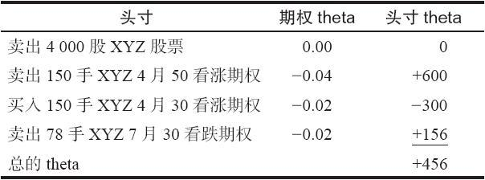
这个头寸预期因为因时减值每天可以盈利456美元。请注意，卖空的头寸，不管是看跌期权还是看涨期权，都有一个正的头寸theta，而买入的头寸都有一个负的头寸theta。负的头寸theta意味着这个头寸因为时间而有风险，而正的头寸theta则意味着时间是对这个头寸有利的。

### 40.2.5　rho

由于利率的变化而发生的期权价值的价格变化，这就是rho。读者应当还记得，对期权价格有影响的因素之一就是利率。利率上涨，看涨期权的价格就会上涨，而看跌期权的价格就会下跌。反过来也一样：利率下降，看涨期权的价格就会下跌，而看跌期权的价格就会上涨。rho衡量的是这些价格上涨或下跌的数量。

看跌期权和看涨期权相对利率的行为也许不是一看就能明白的，不过，回忆一下，用实值看涨期权建立起来的套利（“利率游戏”，我们在第27章讨论价差的时候提到过的）说明了，随着利率的增长，套利者愿意为实值看涨期权支付更多，因为他们可以从就这个实值看涨期权而卖空的股票上得到更多的利息。因此，上涨的利率可以导致看涨期权的价格上涨。

对看跌期权，反过来则是对的：上涨的利率会导致看跌期权的价格下跌。同样，可以用一手套利来说明这一点。记得吧，在一手反转组合中，套利者卖出股票和看跌期权，同时买入看涨期权。我们已经说明，随着利率的上涨，他愿意为看涨期权支付更高的价格，因为他可以从卖空他的股票中获得额外的利息。这自然就意味着他愿意以更低的价格来卖出看跌期权。

在看涨期权中，rho是用正数表示的，在看跌期权中，它是负数。rho在深度虚值期权中数值最小，在深度实值期权中数值最大。较长期期权的rho较大，非常短期的期权的rho接近零。下面的期权价格表可以帮助说明这些关系。

【示例40-11】XYZ的价格为49，下面期权标有rho（1月是近期月）。
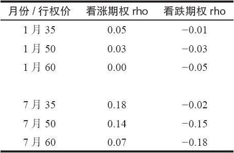
请注意，无论是在1月的合约里还是在7月的合约里，实值看涨期权（行权价35）的rho都比虚值看涨期权（行权价60）的rho要大。与此相似，实值看跌期权（行权价60）的rho按绝对值也比虚值看跌期权（行权价35）的rho要大。同样，在1月合约和7月合约中都是如此。

另外，注意一下所有的较长期的7月合约的rho都比相应的较短期的1月合约中的rho要大。

同前面的示例相似，我们也可以为整个头寸计算出“头寸rho”。一般而言，如果不是因为他的投资组合包含一些长期期权或者深度实值的期权，交易者不会对他的头寸rho太关心。因此，当交易者交易长期期权（LEAPS）或权证的时候，rho对他才是更为重要的考虑，这两者都有可能是极度长期的工具。在我们至今所讨论过的风险指标中，rho是用得最少的一个，因为许多交易者往往是用相对短期的期权来构建他们的头寸。

### 40.2.6　gamma的gamma

有的时候，你也许会听到有人说“风险的六个指标”。还有第六个指标，它是最富神秘感的。在任何时候，交易者都知道一个期权的delta和gamma。当股票运动的时候，delta发生（gamma数量的）变化，但是，gamma也会发生变化。有的交易者有兴趣知道当股票变化的时候，gamma会有多大的变化。因此，他们计算出一种gamma的gamma，它是当股票价格变化时，gamma变化的数量。我们在这一章的末尾将讨论这个概念。对涉足高波动率股票的头寸的策略家，这是最重要的，因为，如果股票运动得足够远，gamma（从而delta）有可能发生急剧的变化。因此，交易者也许应当知道这个风险指标是如何影响他的盈利性的。

### 40.2.7　总结

delta：正delta标志着这个头寸目前是看多的；如果标的证券价格向上，这个头寸就会赚钱。负delta标志着这个头寸目前是看空的。

gamma：正gamma意味着如果标的证券价格上涨，delta就会上升。正gamma一般是说在这个头寸里主要是买入的期权，要么是看跌期权，要么是看涨期权；负gamma标志着头寸是卖出的或裸期权。

theta：负theta意味着随着时间的消逝，这个头寸会亏钱（典型的买入期权的头寸）；正theta是说时间对这个头寸有利（卖出期权的头寸）。

vega：正vega意味着（感受到的）波动率的增加对头寸有利（有买入期权在内的头寸一般都是如此）；负vega意味着波动率的减小会有好处。
