# 40.3　策略考虑：使用“希腊字母”

在考察策略家如何使用delta，gamma等运作一个具体策略之前，看一看它们是如何同本书所介绍的各个策略相关的，是有好处的。表40-8是各种策略对各种市场因素的暴露的一份总指南。它不是一份适用于所有目的，或者专门集中在哪一方面的表格。因为随着股票的上涨或下跌，有些风险因素无疑会发生变化。

在构建这个表格的时候，我们做了一些假设。首先，假设那些delta标为零的策略是作为中性策略而建立的。对牛市价差和熊市价差，假设股票价格是在两个行权价之间。对两种其他的价差（看涨期权比率和看跌期权比率），假设股票价格在卖出的期权的行权价上。对所有其他情况，其中只涉及一个行权价，假设股票价格等于行权价。

表40-8　常用策略的一般风险暴露
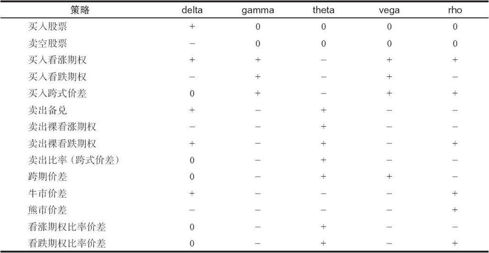
正如可以预期到的，涉及买入和卖出期权的价差策略比起直接买入或卖出的策略来要更难量化。跨期价差策略是一个价差交易者不想看见股票运动很多的策略，他宁愿标的证券的价格停留在接近行权价的价位，因为这是有最大潜在盈利的区域。它的gamma是负数的这个事实就反映出了这一点。同时，对跨期价差来说，时间的流逝是有利的，theta是正数的这个事实反映出了这一点。最后，因为隐含波动率或利率的增加会抬高价格，扩大价差的两条腿之间的差距（产生盈利），因此，vega是正数，rho是负数。

牛市价差的delta是正数，它反映出这个价差的看多的性质，但是，它的gamma是负数。gamma是负数的理由是，随着标的证券价格上涨，头寸的看多性就减小，因为这个头寸的潜在盈利是有限的，从而它的看多性也是有限的。由于相似的原因，熊市价差的delta是负数（反映出看空性），它的gamma是负数（反映出有限的看空性）。牛市价差和熊市价差就其他风险指标来说是相同的：theta是负数，反映出因时减值对这个头寸不利的事实。没有那么明显的是如果感觉到的波动率增加了，头寸就会受损这个事实；不过，负的vega告诉我们这一点是真实的。

这些风险指标是重要的，它们相当形象地描绘了一个期权头寸或期权投资组合的风险和收益的特征。它们在建立一个新头寸上是有用的，因为交易者可以看到他承担了多少风险。此外，在后续行动中它们也非常有用，因为交易者可以看到他的头寸的性质在当前的市场中有了什么样的发展。下面，我们将详细地讨论如何使用这些风险指标来帮助建立头寸和采取后续行动。

### 40.3.1　delta中性

中性头寸中的一种流行类型是delta中性，也就是说，使得等股头寸（ESP）或等额期货头寸（EFP）为零。一个delta中性的头寸是，一个价差中买入期权的预计的价格变化的总额基本上被同一价差中卖出期权的预计的价格变化的总额所对冲的头寸。

【示例40-12】XYZ的交易价是50。下面的3个期权按表中所指出的价格和delta在交易。另外，表中也显示出了每个期权的“理论价值”。
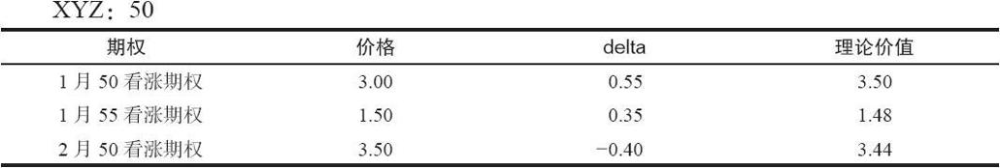
假定交易者可以依赖“理论价值”（不过，这是一个很大的假设），那么，显然，1月50看涨期权比其他的期权要便宜：其他期权接近它们的价值，而1月50看涨期权的价格要比它的理论价值低50美分。这个中性的策略家想要买入1月50看涨期权，同时用这里展现的两个其他的期权中的一个来为他买入的期权对冲。选择之一是在买入的1月50看涨期权同若干数目的卖出的1月55看涨期权之间建立一个价差。为了确定需要买入和卖出多少，交易者只需要将这两个期权的delta相除就可以了。

delta中性价差的比率=0.55/0.35=11：7

因此，delta中性的比率价差就是由买入7手1月50看涨期权和卖出11手1月55看涨期权而组成。要证实这个价差相对XYZ的价格变化是中性的，注意一下，如果XYZ价格向上运动1点，1月50看涨期权的价格将增加0.55，因此，7手这样的期权就会增值7×0.55，或者说总的3.85点。与此相似，1月55看涨期权的价格会增加0.35，因此，11手这样的期权就会增值11×0.35，或者说总的3.85点。因此，这个价差的多头腿会盈利3.85点，而空头腿会亏损3.85点，这是一个中性的情况。

由此产生的头寸是一个比率价差。这个价差的盈利性出现在期权到期时XYZ的价格在51~62之间，图40-8显示了这一点。不过，这不是主要的方面。对中性的交易者来说，这个头寸的真正的吸引力在于，如果1月50看涨期权的定价过低的性质（同1月55看涨期权相比）消失了，那么，不管XYZ的短期市场运动是什么，这个头寸都会产生盈利。如果这样的情况发生，整个头寸就可以平仓。
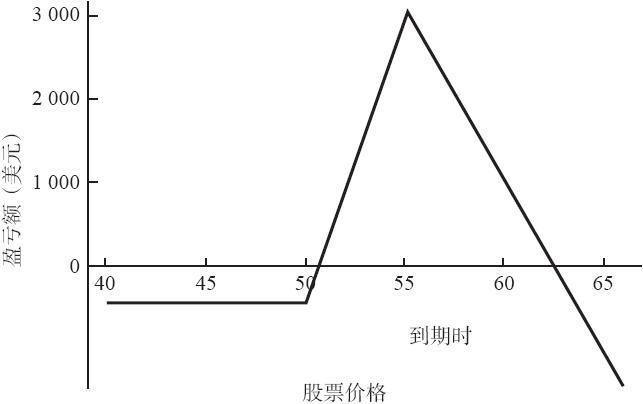
图40-8　XYZ比率价差

为了说明这个事实，假定XYZ实际上跌到了49，而1月50看涨期权回到了“理论价值”：
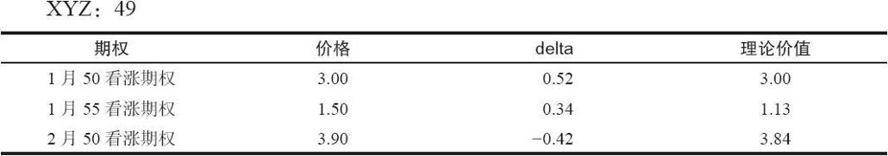
注意一下，这个表格中的理论价值等于前一表格中的理论价值减去delta的数量。因为XYZ 1月50看涨期权不再是定价过低的，整个头寸就应当平仓，策略家从1月50看涨期权上没钱可赚，但是，在11手1月55看涨期权上，每手赚得0.40，在去掉手续费之前，总的盈利是440美元。

这个示例在很大程度上依赖于这样的假设：交易者能够准确地对这些头寸的理论价值和delta进行估计。在现实中，这样的任务有可能相当艰巨，因为要进行估计，交易者就必须知道这个普通股股票的未来波动率。这不是一件容易的事。不过，就这个价差的目的而言，我们使用的是两个delta的比率。此外，这个示例并不要求交易者知道每个期权的准确理论价值：这里，唯一需要知道的是一个期权相对另一个期权价格更便宜。

用来代替比率价差，我们也可以使用前面的数据来建立另一种类型的中性头寸：买入1月50看涨期权（这是这个头寸的基础，因为我们假设的是它是便宜的期权），同时买入2月50看跌期权（这是上面的数据中给我们唯一的另一种选择）。这是一个某种买入跨式价差的头寸。回忆一下，一个看跌期权的delta是负数；因此，同样，我们可以将两个delta的绝对值相除而得出这个delta中性的比率：

delta中性跨式价差比率=0.55/|-0.40|=11：8

因此，一个delta中性的跨式价差头寸是由买入8手1月50看涨期权和买入11手2月50看跌期权组成的。这个跨式价差没有市场暴露，至少在短期内没有。注意一下，这个delta中性的跨式价差的盈利图形同delta中性比率价差有很大的不同，不过，它们两者都是中性的，而且，两者都是以1月50看涨期权便宜这个事实为基础。如果股票价格大幅度运动，这个跨式价差就能赚钱，如果股票价格只有少量的运动，比率价差就能赚钱。（见图40-9）
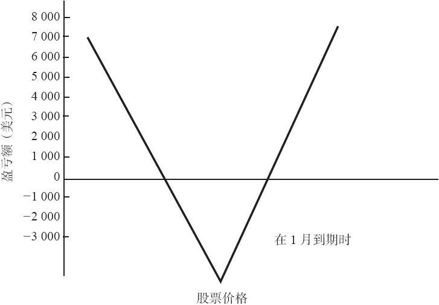
图40-9　买入XYZ跨式价差

这样两个盈利图形如此不同的策略，有可能实现相同的事情（也就是说，捕捉住XYZ 1月50看涨期权定价过低的现象）吗？是的，不过，为了决定哪个策略“更好”，策略家必须考虑其他的因素：例如，标的证券的历史波动率，或者在到期之前实际还剩下多少时间，以及他自己对待卖出未备兑看涨期权的心理态度。看一下这两个头寸的gamma，可以帮助我们更准确地判定它们的其他风险。

delta中性并不是100%地中性的。事实上，delta中性说的是，交易者只有在标的证券有小量的价格变化的情况下才是中性的。在考虑到其他风险指标时，一个delta中性的头寸有可能具有严重的非中性的特征。因此，交易者不能轻率地建立一个delta中性的头寸，然后就不管它了，随着某种因素的变化，它还是有可能有显著的市场风险。

例如，显然，一眼看上去，上面一节所描写的两个头寸（比率价差和买入跨式价差）完全不同，但是，它们都是delta中性的。如果交易者在他的头寸里结合使用其他的风险指标，他就有可能将这些“中性”策略之间的区别量化。我们将使用一个卖出跨式价差的头寸来考察这些不同的因素是如何发挥作用的。

包含裸期权的头寸的gamma是负数。这意味着在标的证券运动时，这个头寸就会加进同这个运动相反的属性：如果证券上涨，整个头寸就会变成看空；如果它下跌，整个头寸就会变成看多。这样的描写一般适用于所有的裸期权，像比率价差、裸跨式价差，或者卖出比率等。

【示例40-13】XYZ的价格为88。离7月到期还有3个月，XYZ的波动率是30%。假定以10点的价格卖出100手7月90跨式价差（看跌期权和看涨期权的售价各为5点）。正如表40-9所显示的，开始的时候，这个头寸接近delta中性。但是，因为两个期权都是卖出的，每个卖出就都给这个头寸带来了负的gamma。

表40-9　卖出跨式价差头寸的delta和gamma，XYZ=88
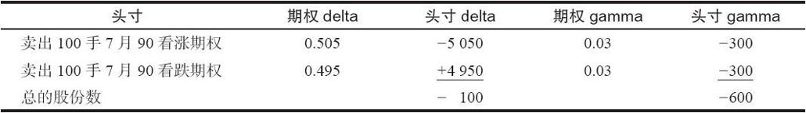
这个示例显示出了计算gamma的用途。最初的头寸只是净卖空100股XYZ，一个非常小的delta。事实上，一个交易少量股票的人也许实际上会因此而相信，他能够卖出这100手跨式价差，因为它仅仅等同于卖空100股股票。

计算gamma可以迅速地证明，这样的想法是不可行的。这里的gamma非常大，有600股负gamma。因此，如果股票仅仅跌了2点，这个交易者的跨式价差头寸的表现就有可能同一个买入1100股的头寸（最初的100股卖空加上gamma告诉我们的可以预期的买入的1200股）相似！在股票下跌2点之后，整个头寸看上去会像下面这样：
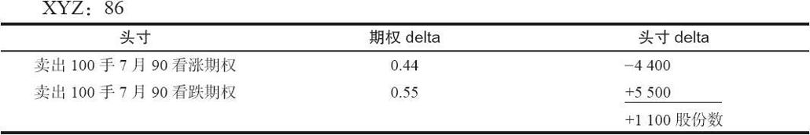
因此，股票的一个2点的下跌意味着这个头寸已经有了“看多”的面目。进一步的下跌会使得这个头寸变得甚至“更为看多”。这显然不是一个适合于小投资者的头寸（卖空100股股票），尽管如果你只是看这个头寸的delta的话，它看上去好像是如此。观察一下gamma就可以更充分地揭示出真正的风险。

与此相似，如果股票上涨了2点，到了90，这个头寸就迅速变为delta卖空。事实上。在这个情况里，交易者可以预期它会是卖空1300股：最初的卖空100股加上由负gamma所指出的1200股。于是，上涨到90时，这个头寸看上去就会是这样的：
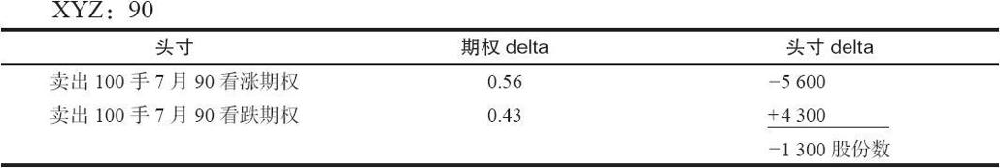
这些示例说明了，像卖出100手跨式价差这样的一个大头寸在股票价格只有小距离的运动时，有可能以多快的速度具有一个大数值的delta。将这个运动加以类推并不完全正确，因为随着股票价格的变化，gamma也会变化。但是，这可以给交易者一种感觉，让他知道他的delta会有多大的变化。

事先就近期未来的某一点而计算这样的信息常常是有用的。图40-10描绘了这个大型的卖出跨式价差的头寸在卖出两个星期之后的delta。横轴上的点数是股票的价格。这个头寸的中性消失之快，是值得警觉的。两个星期之内的一个到93的小幅度运动（只是一个标准差）可以使得整个头寸变为同卖空3300股XYZ相等。图40-10所显示的实际上只是gamma对这个头寸的效果，不过，这样的表现形式也许更适合有些交易者的习惯。
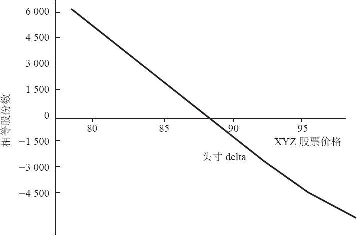
图40-10　预计的delta，在14天内

这里所说的是这个头寸是在同市场“斗争”：当市场上涨时，这个头寸变得越来越看空。这会是一个令人不愉快的局面，无论是从创造了未兑现的亏损而言，还是就心理影响而言。头寸delta和gamma可以用来估计将会出现的未兑现亏损的数量。如果这个标的股票有迅速的运动，这个头寸预期会有多大的亏损呢？从delta和gamma中很快可以得到答案：XYZ运动的第一个点位，从88到89，这个头寸的表现就像是在卖空100股股票（头寸delta），因此，它会亏损100美元。XYZ再上涨1个点，从89到90，这个头寸的表现就像是它是在卖空最初的100股股票（头寸delta），加上另外的600股（头寸gamma）。因此，在XYZ的第二个点位的运动中，整个头寸的表现就像它是在卖空700股股票，因此，亏损另外的700美元。所以，如果XYZ立刻上涨2点，这个头寸就会有未兑现的亏损800美元。这个情况可以总结为：

亏损，股票运动的第一个点=头寸delta

亏损，股票运动的第二个点=头寸delta+gamma

股票运动2点的总亏损=2×头寸delta+头寸gamma

使用上面示例的数据：

亏损，XYZ从88运动到89：-100美元（头寸delta）

亏损，XYZ从89运动到90：-100美元（delta）-600美元（gamma）=-700（美元）

总亏损：XYZ从88运动到90：-100美元×2-600美元（gamma）=-800（美元）

我们可以通过观察看涨期权和看跌期权在XYZ从88上涨到90之后的价格来核实这个结论。如果这样的情况发生了，你可以使用一个模型来计算预期的价格。不过，还有另一种方法。考虑一下下面的说法：

如果股票上涨1点，看涨期权的价格就会是：
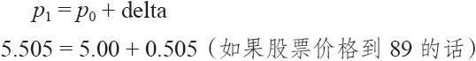
如果股票价格上涨了2点，这个看涨期权就会有上面数量的增长，加上下一个点的相似增长。股票第二点运动的delta是最初的delta加上gamma，因为gamma告诉我们delta的变化会有多大。
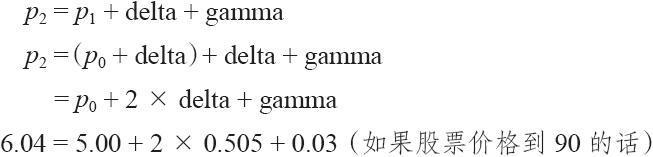
使用同样的计算，如果XYZ立刻上涨到90，这个示例中的看跌期权的价格就会是：

4.04=5.00-2×0.495+0.03

因此，总的来说，这个看涨期权会增加1.04，不过，看跌期权只会增加0.96。这样计算出的100手看涨期权的未兑现的亏损就是10400美元，这笔亏损为100手看跌期权的9600美元盈利所对冲，剩下的净未兑现亏损就是800美元。这就证实了从上面使用头寸delta和头寸gamma所得出的结果。同样，这也肯定了这样的逻辑上的事实：股票的一次快速运动会在一个卖出跨式价差的头寸中造成未兑现的亏损。

接下去，让我们看一看其他因素对于这个卖出跨式价差的一些影响。时间对这个跨式价差的卖出者有利。在头寸建立之后，在头两个星期内的因时减值没有在接近到期日时那么大。我们可以使用这个头寸的theta来准确地计算出预期的因时减值的数量有多大。
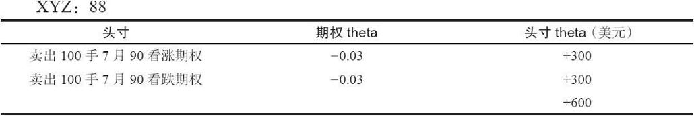
这是在这个头寸刚建立时（XYZ价格为88，离到期还有3个月）就因时减值而言所看上去的模样。这里的看跌期权和看涨期权的theta基本上是相同的，它们指出，每个期权的价值大约每天会销蚀掉3美分。请注意，这里的theta是用负数表达的，因为这些期权是卖出的，头寸theta是一个正数。一个正的头寸theta意味着因时减值对你有利。从卖出100手看涨期权中，交易者可以预期每天得到300美元。从卖出100手看跌期权中，他还可以预期每天得到300美元。因此，他的总头寸每天会因为因时减值而产生一笔600美元的理论盈利。

卖出跨式价差可以从因时减值中产生盈利，这没有什么惊人的。这是公认的事实。不过，这个因时减值的数量可以通过使用theta而量化。此外，它也可以显示出如果考虑到时间的流逝，这个delta中性的头寸并不是中性的。

最后，让我们就波动率的变化来考察一下这个头寸。这可以通过计算头寸vega来实现。
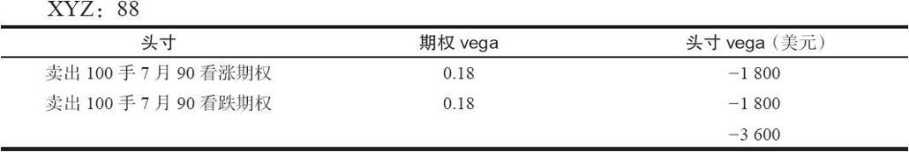
同样的，这个信息也是出现在头寸刚建立的时候，离到期还有3个月，XYZ的波动率为30%。这个vega相当大。看涨期权的vega为0.18意味着如果期权的隐含波动率增加了1个百分点，从30%到31%，这个看涨期权的价格就会增加18美分。因为这个头寸是卖空100手看涨期权，看涨期权价格增加18美分就转化为一笔1800美元的亏损。看跌期权的vega同看涨期权相同，因此，如果期权交易的波动率只是增加了1个百分点，整个头寸就会亏损3600美元。当然，如果波动率减少了1个百分点，到29%，那么整个头寸就会有3600美元的盈利。

因此，在这个卖出跨式价差的头寸里，波动率风险是最大的风险。同前面一样，很显然，波动率的增长对有裸期权在内的头寸是不利的。使用vega将这个风险进行量化，同时也显示出在建立这样一个头寸时，力图卖出定价过高的期权有多么重要。策略家不应当在任何时候都固守一种策略。例如，他不应当总是卖出裸看跌期权。如果这些看跌期权的波动率低于历史正常水平，这样一个头寸很可能会遇到由头寸vega所代表的风险。在近期内有过好几次这样的情况，大部分是在市场崩盘的时候：指数和股票期权的隐含波动率都急剧上跳。这样的情况对期权的卖家是不利的。而且，几乎每一次指数期权的隐含波动率在崩盘出现之前都相当低。因此，任何考察他的vega风险的交易者都不应当在期权就历史而言是“便宜”的时候卖出裸期权。

总之，当交易者考虑到所有其他因素时，这个“中性的”头寸在现实中会变得非常复杂。
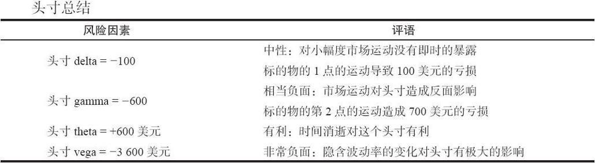
在一开始的时候，这个卖出跨式价差的头寸只有一件事情是保证对它有好处的：因时减值（随着价格、时间和波动率的变化，风险因素也会变化）。股票价格运动没有帮助，但始终会有股票价格运动，因此，交易者可以预料到他会感到这些价格运动的负面影响。波动率是一个重要的未知因素。如果它减小，跨式价差的卖出者就会有漂亮的盈利。不过，现实地说，它只会减少一个有限的数量。如果它增加，这个头寸的盈利性就会变得很糟。更糟的是，如果隐含波动率增加，标的股票的价格有很大的可能也会上涨。这也不是一件好事。因此，很重要的一点是，跨式价差的卖出者只有在有理由相信目前的波动率很高而且有可能会下降的情况下才使用这个策略。如果有一定的危险，会出现相反的情况，那么就应当避免这个策略。

如果波动率保持相对稳定，交易者就可以预见到时间的消逝会对这个头寸发生什么影响。delta不会变化太多，因为这些期权已经是实值的了。不过，gamma会增加，它意味着离到期日越近，短期的价格运动对这个头寸的未兑现的盈利就越有更大的影响。theta会增长更多，它意味着对于跨式价差的卖出者来说，时间会是个更好朋友。短期期权比长期期权的因时减值的速度要快。最后，vega也会减小一些，因此，在离到期的时间明显减少的时候，单是隐含波动率的增长对头寸的破坏性影响就没有那么厉害。所以，时间的消逝一般会在大部分方面改进这个裸跨式价差。不过，这并没有解决当前情况中的所有问题，也不意味着过了一些时间就没有风险了。

比起只是将这个跨式价差卖出头寸描绘为delta卖空100股，或者是看一看这个头寸在到期时会怎么样来说，上面示例所显示的这类分析要深入得多了。在前面的示例里，我们知道在3个月后到期时如果XYZ价格在80~100之间，整个跨式价差的卖出者就能获利。但是，在这期间究竟会发生什么事，那完全是另外一回事儿。要决定这个头寸在当前的时间点上会有什么正常的或失常的表现，delta、gamma、theta和vega都是有用的。

回到这一节开始时的那个策略表格。注意一下比率价差或者跨式价差（它们是相等的策略），它们具有我们刚才详细描写的这些特征：delta是0，若干其他因素是负。我们显示过这些负值的因素是如何转化为潜在的盈利或亏损。观察一下同一表格的其他栏目，注意一下卖出备兑和卖出裸看跌期权（不要忘了，它们也是相等的），你可以看到对它们的描写同对跨式价差的描写非常相似：delta是正，其他因素是负。这是一个比卖出裸跨式价差更糟的情况，因为它有所有相同的风险，而且，除此之外，如果标的股票立刻下跌，它也会遭受亏损。这里要说的是，如果交易者在观察了上面这些示例之后感到卖出跨式价差并不是一个特别吸引人的策略，那么，他就更不应当采用卖出备兑，因为它有相同的风险因素，并且还不是delta中性的。

正如我们所许诺的，在这里我们将扩展在讨论期货期权的那一章中提到的一个示例。读者应当还记得，交易者常常在期货期权中发现波动率倾斜，不过，我们指出过，交易者通常不应当仅仅因为它们看上去具有最大的理论优势而买入一手平值看涨期权（最便宜的）和卖出大量的虚值看涨期权。我们提供了下面的示例。现在，我们将扩展这个示例，将gamma包括进来。

【示例40-14】在1月大豆期货期权价格中有很高的波动率倾斜存在：虚值看涨期权比平值看涨期权要贵得多。

下面的数据是已知的：

1月大豆：583
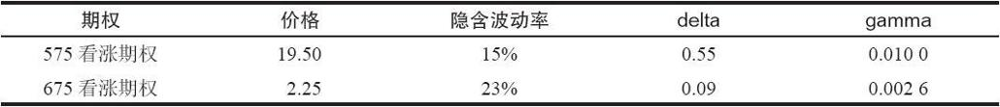
使用这些数据，下面的价差看上去是中性的：

在展示最初的示例的时候。我们通过使用盈利图形来说明这个比率过于陡峭，如果出现价格大幅度上涨，就会有问题。

现在，交易者知道了gamma的概念，他就可以将这些问题量化。

这个价差的头寸gamma的相当负面的：

头寸gamma=0.01-6×0.0026=-0.0056

这就是说，1月大豆每上涨10点，这个头寸就变得大约卖空1/2个期货合约。最大的盈利点是在675，比目前价格583高92点。虽然大豆一般不会在几天内就上涨92点，不过，这确实说明了如果大豆迅速上涨到潜在最大盈利点，这个头寸会变得非常卖空。如果这样的情况发生的话，这里就不会有任何盈利出现。

即使是大豆的一个不大的20美分的上涨（小于停板限额），也会使得这个小小的价差显著地看空。如果交易者建立了一定数量的这种价差，例如，买入100和卖出600，他就有可能很快地变成非常看空的。

一个中性的价差交易者不会在这个价差中使用这样大的一个比率。他会使得gamma中性，然后处理随之而来的delta。下一节就将讨论实现这个目的的方法。

### 40.3.2　创造多重中性

那么，策略家该怎么办呢？如果他感到其他因素是风险的话，他可以试图建立就这些因素来说是中性的头寸。如果他想要除去因为波动率增加或减小而带来的风险的话，那么，没有理由说他不能建立一个vega中性而不是delta中性的头寸。或者，也许他想要除去股票价格运动的风险，如果是这样，他可以试图保持同时delta中性和gamma中性。

这听上去好像是个简单的概念，但是，如果你动手建立一个让不止一个风险变量保持中性的头寸的话，事情就不是这样了。例如，如果交易者想要建立delta和gamma都是中性的一个价差，他可以使用下面的方法。

【示例40-15】XYZ的价格为60。一个价差交易者想要使用下面的价格建立一个gamma和delta都是中性的头寸。
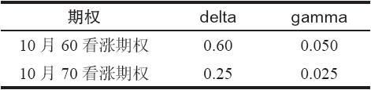
建立一个让这两个风险指标都中性的价差的秘诀是首先将gamma中性化，因为delta始终可以通过标的证券的对冲头寸而得以中性化，不管它是股票还是期货。首先，通过将两个gamma相除来确定一个gamma中性的价差。

gamma中性比率=0.050/0.025=2：1

因此，买入1手10月60看涨期权，同时卖出2手10月70看涨期权，就会是一个gamma中性的价差。现在，计算一下这个价差的头寸delta。
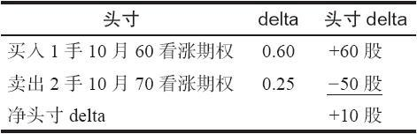
因此，保持gamma中性的比率使得如此建立起来的这个2：1价差的头寸delta变成了买入10股股票。如果交易者买入100手10月60看涨期权和卖出200手10月70看涨期权，他的头寸delta就是买入1000股。

这个头寸delta可以很容易地通过卖空1000股股票来得以中性化。由此产生的头寸就是gamma和delta都是中性的。
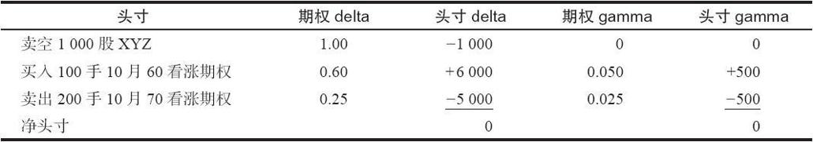
因此，建立一个gamma和delta都是中性的头寸是一件简单的事。事实上，凡是要建立一个delta和任何一个其他的风险指标都是中性的头寸，都是一件简单的事，因为必须要做的只是先建立其他风险指标（gamma，vega和theta等）之间的中性比率，然后通过使用标的物来除去由此产生的头寸delta。

从理论上讲，交易者可以建立一个同所有5个（如果你要包括gamma的gamma的话，那就是6个）风险指标都保持中性的头寸。当然，在这样一个头寸里，也不会有多大的潜在盈利。不过，有的交易者，像做市商，实际上确实使用了这样的构造方法，至少是想要使用这样的构造方法。对做市商来说，盈利来自期权的买报价同卖报价之间的价差，而不是来自对市场方向的预测。

不过，对不止一个风险因素保持中性的想法仍然是一个有效的概念。事实上，如果策略家能够确定他真正想要实现的目的是什么，那么，他常常可以剔除其他因素，构建一个目的刚好是实现他想要的东西的头寸。假定交易者认为某一种期权的隐含波动率过高。他可以只是卖出跨式价差，以捕捉这个波动率。不过，他因此就暴露于标的股票的价格运动。对他更有利的是构建一个vega为负值的头寸，以反映他对波动率的看法，然后再使得头寸变为delta中性和gamma中性，这样，这个头寸对市场运动就没有什么暴露。通常这可以相当容易就做到。举一个示例就可以说明这样做的方法。

【示例40-16】XYZ的价格是48。离到期还有3个月，XYZ和它的期权的波动率是35%。下面的信息是已知的：
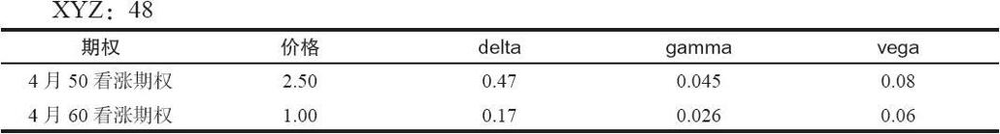
无论是什么原因（也许是因为历史波动率过低），这个策略家决定卖出波动率。也就是说，他想要有一个负的头寸vega。这样，如果波动率降低，他就可以赚钱。这或许可以通过买入一些4月50看涨期权和卖出更多的4月60看涨期权来实现。不过，他不想要任何价格运动的风险，因此就做了一些分析。

首先，他应当确定一个gamma中性的价差。这样做的方法同确定一个delta中性的价差是相同的，不同的只是用gamma。只需要将两个gamma相除来确定一个需要使用的比率。在这个示例里，假定我们将使用4月50看涨期权和4月60看涨期权：

gamma中性比率=0.045/0.026≈1.73：1

因此，一个gamma中性的头寸可以通过买入100手4月50看涨期权和卖出173手4月60看涨期权来建立。做为选择，也可以买入10手同时卖出17手，这样也基本上能够满足gamma中性的比率。在这个示例里我们将使用较大的头寸。

在选择了这个比率之后，对delta和vega会有什么影响呢？
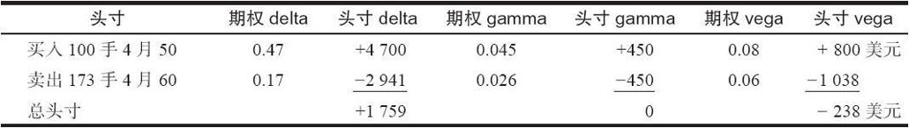
这个头寸的头寸delta是买入1759股XYZ股票。这可以很容易通过卖空1700或1800股XYZ股票来中性化这个delta而得到“治愈”。因此，整个头寸，包括卖空1700股股票，对delta和gamma就都会是中性的，而且会有想要的负值的vega。
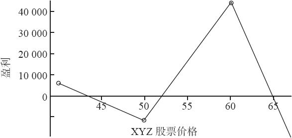
图40-11　vega为负值的价差：gamma和delta为中性

图40-11显示了在到期时的实际盈利图。不过，要记住，在正常情况下这个策略家不应当想要将这样一个头寸留到到期日。如果他预期的波动率的下降实现了（或者事后证明他错了），那么，他就应当将这个头寸平仓。

另一点应当注意的是，在一开始的时候delta和gamma是中性的这个事实并不意味着在股票运动（或者甚至波动率变化）的时候它们会永远保持中性。不过，在短期内，股票价格运动对这个头寸不会或者只会有很小的影响。

总的来说，交易者始终能够创建一个对gamma和delta都是中性的头寸，要做的是首先选择一个使得gamma为零的比率，然后使用标的证券中的一个头寸来使得由于这个选择的比率而产生的delta中性化。这类头寸总是涉及两个期权和一些股票。由此产生的头寸对其他的风险因素未必是中性的。

### 40.3.3　数学的方法

策略家应当意识到，由于有了计算机，对若干风险因素来说，要决定它们是否中性是一件相当容易的事。需要做的事只是解一系列联立方程。

在前面的示例里，得出的vega是个负数：-238美元。只要波动率从目前的35%的水平下降1个百分点，交易者就可以预期得到238美元。我们可以通过另一种方法得出这个结论，只要交易者愿意事先定出他想要承担的vega风险。这样，他就可以假设gamma为0，找出在这个价差中需要交易多少期权。同上面一样，通过使用普通股股票，delta是中性的。

【示例40-17】价格同前面示例里相同。XYZ是48。离到期3个月，XYZ和它的期权的波动率是35%。下面的信息也相同。
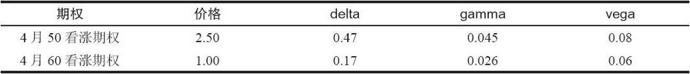
一个价差交易者预期波动率会下跌，想要建立一个波动率每降低一个百分点就可以获利250美元的头寸。此外，他还想要gamma和delta中性。他知道最终通过使用XYZ普通股股票可以将任何delta中性化，就像前面的示例里那样。他需要用多少手期权进行价差才能获得想要的结果呢？

为了回答这个问题，交易者必须针对两个未知数x和y建立两个方程。未知数x和y分别代表了要买入和卖出的期权的数量。方程中的常数取自上面的表格。

第一个方程表示了gamma中性：

0.045 x+0.026 y=0

式中，x为价差中4月50看涨期权的数目；y为价差中4月60看涨期权的数目。请注意，这个方程中的常数是所涉及的这两个看涨期权的gamma。

第二个方程表示了想要的如果波动率下降就可以获利2.5点（或者说250美元）vega风险：

0.08 x+0.06 y=-2.5

式中，x为价差中4月50看涨期权的数目；y为价差中4月60看涨期权的数目。这个方程中的常数是期权的vega。

此外，请注意，这里的vega风险是负数，因为价差交易者想要的波动率降低时获利。

通过代数的方法来解这两个方程，就会得到下面的结果：

方程：

0.045 x+0.026 y=0

0.08 x+0.06 y=-2.5

解：

x=104.80

y=-181.45

这意味着该交易者要买入105手4月50看涨期权，因为x是正数，这就是说期权应当买入。他还要卖出181手4月60看涨期权（y是负数，这就是说看涨期权应当卖出）。这同前面示例里确定的比率是几乎相同的。数量要稍微高一些，因为这里的vega是-250美元而不是在前面示例里得出的-238美元。

最后，交易者要通过计算头寸delta来再次确定需要买入或卖出的用来中性化delta的股票数量：

头寸delta=105×0.47-181×0.17=18.58

因此，为了中性化这个头寸，需要卖空1858股XYZ股票。

注意：不能将这两个方程都设为等于零，否则，所有的解就都等于零。这很容易解决，只需要将其中至少一个设为等于一个不是零的小数目，例如0.1。只要有一个风险因素不等于零，你只需要解开这些联立方程，就可以确定所有其他因素的中性比率。市面上有许多便宜的计算机程序可以解开类似这样的联立方程。

这个概念可以推广到更远，以确定为了得到想要的结果而创造的最好价差。交易者也许甚至应当试一试三个不同的期权，使用第三个期权来将delta中性化，这样他就不必使用股票来中性化。第三个方程可以使用delta作为常数，并且设为等于零，代表delta是中性的。解出这个答案需要一个三元三次方程，对计算机来说，这是一件简单的事情。

只要有一个风险因素不是零，交易者通过解这些联立方程就能够确定所有其他因素的中性比率。更为重要的是，计算机可以扫描许多产生gamma和delta中性的有具体的头寸vega（例如，-238美元）头寸的组合。然后，他可以通过一些逻辑的方法来选择“最好的”可选价差，如果可能的话，包括选择那些有正theta的价差，这样时间就会对他有利。

总的来说，交易者可以将所有的风险因素都中性化，或者，他可以规定他所想要承受的风险。只要写出方程，将它们解出来就行。最好是使用计算机来完成这个工作，不过，这一点可以做到的事实在期权价差和降低风险的策略中开拓了一个全新的、广阔的天地。

### 40.3.4　使用风险指标对头寸进行评价

前面的讨论处理的是建立一个新头寸和如何确定它是否中性。不过，这些风险指标的最重要的用途是预测一个头寸在将来的表现会如何。最起码地说，一个认真的策略家应当使用计算机来印出在未来预计价格上的盈亏预测。此外，应当就几个未来的时间点进行这类分析，从而策略家对时间消逝的影响以及标的证券的较大幅度运动的影响有一个概念。

首先，交易者应当为第一个分析选择一个合适的时段，例如今后的7天。然后，他应当使用股票价格的统计学预测（见论数学应用的第28章），以确定标的证券在这个时候的可能价格。显然，这个股票价格预测需要使用波动率，而波动率在某种程度上是可变的。不过为了这样一种预测的目的，我们可以使用当前的波动率。可以选择由此产生的多达9个的结果：从-2到+2的每半个标准差（-2.0，-1.5，-1.0，-0.5，0，0.5，1.0，1.5和2.0）。

【示例40-18】XYZ的价格是60，波动率是35%。可以用下面的公式来确定股票在7天之后的价格分布：
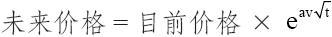
其中：

a同下面表格中的常数（-2.0，…，2.0）相应：
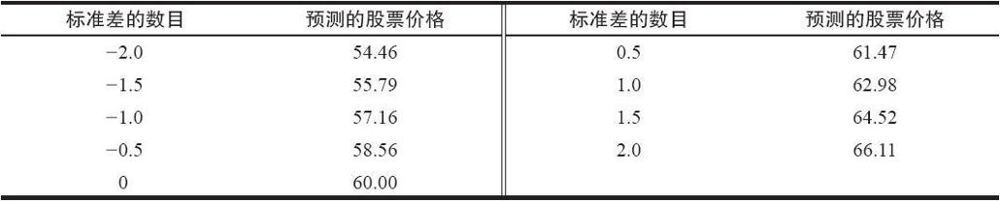
同样，回过头去看一看论述数学应用的第28章，那里对这个确定结果的公式有更详细的讨论。

请注意，用来预测价格的公式把时间作为它的一个构成要素。这就意味着，在我们考察更远的时间时，可能的股票价格范围就会扩大，这是这项分析中的一个必要的和逻辑的组成部分。例如，如果我们要确定离今天14天的未来股票价格，价格的范围就会是从52.31~68.82。也就是说，XYZ在7天之后是54.46的概率同在14天之后是52.31的概率一样大。到期日距离今天大约90天，在到期日，这个价格范围会大许多。在试图对这个头寸进行评价的时候，不要犯对每个时段（7天、1天、1个月、到期日等）使用相同价格的错误。这样的分析会得出错误的结论。

一旦得出了合适的股票价格，对每一个股票价格都需要计算出下面的数值：盈利或亏损、头寸delta、头寸gamma、头寸theta和头寸vega。（对股票和期货的短期期权来说，头寸rho一般不是一个重要的风险指标。）有了这些信息，策略家在对付未来方面就有所准备。有一件重要的事情需要注意：在确定这些预测值时，有必要使用一个模型。正如前面所显示的，如果在头寸中期权的当前隐含波动率是扭曲的，那么，策略家应当在期货期权价格预测中使用当前的隐含波动率作为模型的输入数据。如果他不这样做，要是卖出的期权过于昂贵，买入的期权过于便宜，这个头寸有可能看上去具有过分的吸引力。如果将当前的隐含波动率结构推演到近期的未来中，那么，这样得出的盈利图形会更真实一些。

使用一个同上面的示例相似的示例，一个通过卖空股票而保持delta中性的比率价差，就可以描绘出这个概念。

初始头寸。XYZ的价格是60。1月70看涨期权离到期还有3个月，同1月60看涨期权相比，它的价格比较贵。一个策略家预期当XYZ期权的隐含波动率减小时，这种差异会消失。因此他想要建立下面的头寸，这个头寸是delta和gamma中性的。
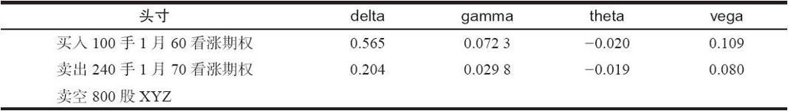
整个头寸的风险暴露是：

头寸delta：-46股（基本上是delta中性）

头寸gamma：+8股（gamma中性）

头寸theta：+256美元

头寸vega：-830美元

因此，这个头寸的gamma和delta都是中性的。另外，因为正的theta，每过1天这个头寸就有256美元的盈利，这是一个吸引人的特征。正如这个价差交易者所希望的，如果XYZ的波动率减小，这个头寸就赚钱：隐含波动率每减小1个百分点，这个头寸就盈利830美元。解（gamma和vega系数的）二元一次方程，就能知道需要买入和卖出的数量。由此得出，通过卖出800股XYZ，头寸delta就会变为中性。

下面的分析假定1月70看涨期权相对昂贵的现象还会持续下去。它们是整个头寸中卖出的期权。如果定价过高的现象消失，这个头寸价差看上去就具吸引力，不过，没有人可以担保说它们会变得更便宜，特别是在一个像一两个星期这样的时段里。

按照上面所确定的股票价格，在7天之后这个头寸看上去会是什么样子呢？
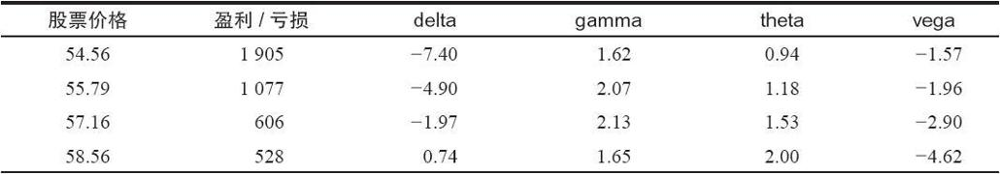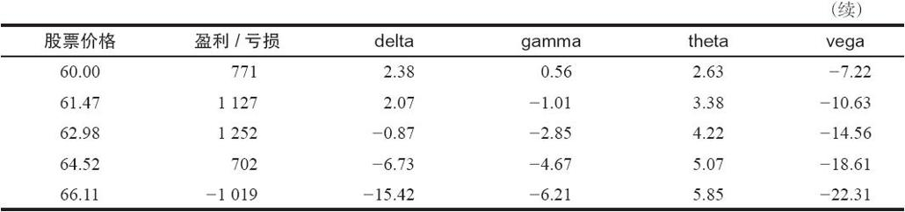
与此相似，在过了14天之后，这个头寸会有下列的特征。
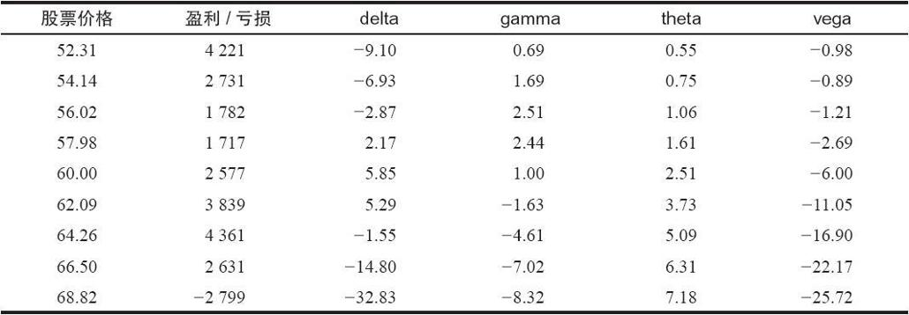
图40-13用图形的方式表现了同样的信息，因此，喜欢图形而不是表格的读者可以容易地跟上下面的讨论。

首先，这个价差的盈利性是可以考察的。这幅盈利图假设XYZ的波动率保持不变。注意一下，在7天之中，如果股票价格保持不变，这个头寸就有小额的盈利。这是可以预见的，因为theta是正，所以时间对这个价差有利。同样，在14天之内，如果XYZ的价格保持相对没有变化，盈利甚至会更大，同样也是因为正的theta的原因。总的来说，这个头寸在7天之内的预期盈利是800美元，在14天是2600美元。这就指从统计学上看，这是一个吸引人的情景，不过，这自然不意味着交易者一定不会输钱。

继续看一下这幅盈利图，下行方向对这个价差是有利的。因为如果XYZ暴跌，头寸中卖空股票的那一部分就会贡献出更大的盈利（见图40-12）。上行方向是会出现麻烦的地方。在7点之内，在上行方向，如果股票价格为65时这个头寸盈亏平衡，在14天里，它在67.50盈亏平衡。

读者也许会问，“为什么在上行方向有这么大的风险呢？我以为这个头寸是delta中性和gamma中性的呢。”不错，这个头寸最初对这两个指标都是中性的。这个中性性解释了盈利曲线在目前股票价格为60时的平坦性。不过，当股票在上行方向运动了1.50个标准差，这个中性性就开始消失了。要知道这一点，让我们看一看图40-13和图40-14，这两幅图形显示出了在这个价差建立起来之后的7天和14天的头寸delta和头寸gamma。同样，这些同前面表格中列出的数字也是相同的。

首先，看一下在7天中的头寸delta（见图40-13）。注意一下当XYZ在57~63之间时这个头寸保持delta相对中性。这是因为gamma最初是中性的。不过，如果XYZ在7天之内上升到63之上或者下跌到57之下，这个头寸就变得相当delta卖空。在这种情况下gamma会发生什么呢？因为我们刚刚观察到delta最终会变化的，这肯定意味着这个头寸得到了一些gamma。
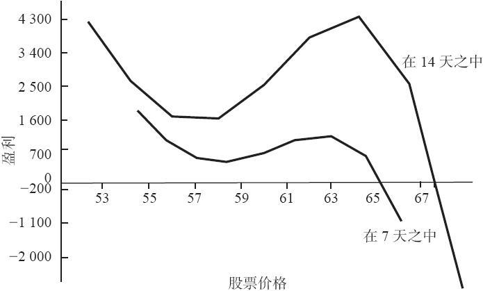
图40-12　XYZ比率价差：gamma和delta为中性
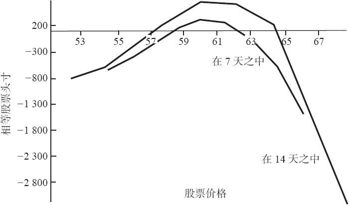
图40-13　XYZ比率价差：头寸delta
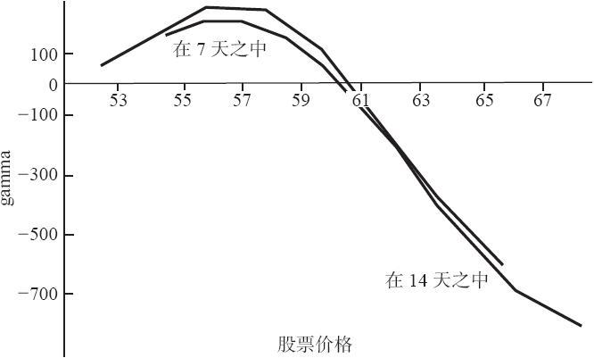
图40-14　XYZ比率价差：头寸gamma

图40-14描绘了gamma不是非常稳定这个事实，考虑一下它是从接近0的地方开始的。如果XYZ下跌，gamma就会略有上升，反映出在XYZ下跌时这个头寸会变得更为看空这个事实。但是，因为同这个头寸中卖空的股票配对的只有看涨期权，所以在下行方向没有风险。正的gamma，哪怕只是像这个示例中的小额的正数，在股票运动中都是有好处的。

上行方面就完全是另一回事儿。在7点之内，股票价格在63之上时，gamma看似变得严重负数。记住负的gamma意味着交易者的头寸对市场价格变化会有不良的反应：这个头寸很快就变成“同市场斗争”。随着股票价格进一步上涨，gamma就变得越来越负面。这些观察适用于7天的情况也适用于14天的股票价格运动；事实上，对gamma的影响在这个示例里似乎并不特别取决于时间，因为在图40-14中的两根线条非常接近。

上面的信息详细地描写了这样的事实：如果股票在太短的时间内上涨得太快，这个头寸的表现就会有问题。不过，稳定的股票价格会产生盈利，下跌的价格也会。这些结论并不很惊人。因为，只要简单地观察一下，你就可以看出在这个头寸里有额外的卖出看涨期权加上一些卖空的股票。不过，事先计算这个信息的要点是要能够预测在什么地方做出调整以及做多大的调整。

后续行动。策略家应当怎样使用这个信息呢？一个简化的方法是当delta变为非中性的时候调整delta。不过，这样没有对gamma做任何事，所以未必是最好的方法。如果交易者要调整的只是delta，他就应当用下面的方法来做：delta图形（见图40-13）显示出，如果XYZ在一个星期内上涨到64.50，这个头寸就大约delta卖空800股。一个简单的计划是，如果股票上涨到64.50，那么就回补800股卖空的XYZ股票。回补800股股票就会使这个头寸在当时回到delta中性。注意，如果股票缓慢地上涨，策略家回补这800股的价位就应当更高一些。例如，如果delta在14天（同样请见图40-13）显示XYZ要在65.50左右才到了一个delta卖空800股的价位。因此，如果XYZ要2个星期才开始上涨，交易者可以等到65.50再回补这800股股票，使头寸回到delta中性。

无论是哪种情况，买入800股股票都不能处理随着股票价格上涨而悄悄出现负的gamma。同负的gamma作斗争的唯一方法是买入期权，而不是股票。要使一个头寸回到对不止一个风险暴露保持中性，需要交易者在解决这个问题时采用同最初建立这个头寸时相同的方法。首先将gamma中性化，然后用股票来调整delta。注意一下在这个方法同前面刚描写过的那个方法之间的区别。这里，我们想要调整gamma，然后再处理delta。

为了加进一些正的gamma，交易者应当买回（回补）一些正在卖空的1月70看涨期权。假定做这个决定的时候是XYZ在14天达到了65.50。从图40-14看，你可以看到这个头寸在这个时候会大约gamma卖空700股。假定1月70看涨期权的gamma是0.07。那么，交易者就必须回补100手1月70看涨期权，在头寸中增加700股正的gamma，使头寸恢复到gamma中性。这笔购买自然使得这个头寸变为delta多头，因此，必须卖空一些股票使得头寸delta再次恢复到中性。

因此，后续行动的程序有些同建立头寸的程序相似。首先将gamma中性化，然后通过使用普通股股票来除去由此产生的delta。我们在这里没有显示由此生成的后续调整的盈利图形，因为这个过程会不断持续下去。不过，作若干观察是有必要的。第一，买入看涨期权来减小负的gamma会伤害这个头寸的原始主题：如果可能的话，保持负值的vega和正值的theta。买入看涨期权会给头寸增加vega，减少theta，这不是价差交易者想要看到的。不过，比起让头寸随着股票价格上涨而积累亏损来，它还是更为可取的。第二，如果头寸有利可盈，交易者或许应当选择将它平仓。如果波动率像预期的那样下降，就会发生这样的情况。这时，当股票上涨，产生负的gamma，交易者实际上会有盈利，因为他关于波动率的假设是正确的。如果他认为从降低的波动率中不会再有太大的潜在盈利，他或许应当使用负的gamma开始上升的那一点作为头寸出场的价位。第三，交易者也许应当选择接受获得的gamma风险。与其是让他最初的主题处于危险的境地，不如只是调整delta，让gamma积累起来。这不再是一个中性的策略，但是，交易者有他的理由用这种方法来处理问题。至少他已经计算了风险并且意识到这个风险。如果他选择接受它而不是剔除它，这是他的决定。

第四，显然，这个过程是动态的。随着各种因素的变化（股票价格、波动率、时间），头寸自身也在变化，策略家面临着新的选择。这里没有绝对正确的调整。在许多时候，这个过程与其说是科学还不如说是艺术。另外，随着股票的运动和时间的消逝，或者如果这个头寸所包括的证券发生了变化，策略家应当不断地重新计算这些盈利图形和风险指标。只有一点是绝对真实的，那就是认真的策略家应当意识到他的头寸同至少4个基本指标有相关的风险：delta，gamma，theta和vega。忽视这些风险是对管理这个头寸的不负责任。

### 40.3.5　买入gamma

一个卖出定价过高的期权，同时使用其他期权或股票为它对冲的策略家常常会有一个同前面描写的那个策略相似的头寸。大幅度的股票运动，至少是在一个方向上，对这样的头寸典型地会成为麻烦。这个头寸的反面是持有一个买入gamma的头寸。这就是说，如果股票在某个方向有快速运动，这个头寸的表现会更好。虽然这似乎有好的心理作用，但这些类型的头寸有它们自己类型的风险。

买入gamma的最简单的头寸是一个买入跨式价差的头寸，或者是一个后式价差（反向比率价差）。另一种构建买入gamma头寸的方法是倒转一个跨期价差：买入近期期权，同时卖出远期期权。因为近期期权的gamma比同一行权价的远期期权的gamma要高，这样的头寸就有买入gamma。事实上，预期股票会有剧烈波动的交易者常常构建这样一个头寸，原因是公众会相随而来，将短期期权的价格抬高（增加它们的隐含波动率），使得这个交易者的价差有更大的盈利性。

不幸的是，所有这些头寸常常会变成买入所有的其他一切，也包括theta和vega。这就意味着时间对这个头寸是不利的，而且，隐含波动率中的摆动可能有帮助，也可能有害。交易者是否可能构建一个买入gamma，但是不受其他因素牵制的头寸呢？当然可以，但是，它看上去会是什么样子呢？正如你也许想到的，这里的答案不是铁板钉钉的。

在下面的这些示例里，假设有这样的价格存在。
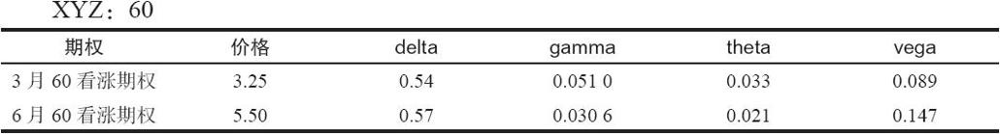
【示例40-19】假定有位策略家想要建立一个gamma多头，但delta和vega中性的头寸。他认为股票会运动，但是不敢肯定运动的方向，而且不想在波动率的快速运动方面有任何风险。为了给“他想要gamma多头”这个说法量化，让我们假设他想要gamma买入1000股，或者10手合约。

我们已经知道，delta始终是可以到最后再中性化的。因此，让我们先来考虑一下其他两个变量。下面的两个方程是用来确定为了使gamma多头和vega中性而需要买入的数量。

0.0510 x+0.0306 y=10（gamma，以合约数表示）

0.089 x+0.147 y=0（vega）

这两个方程的解是：

x=308

y=-186

因此，交易者应当买入308手3月60看涨期权，同时卖出186手6月60看涨期权。这是一个我们讨论过的反转跨期价差：买入近期看涨期权，卖出远期看涨期权。

最后，delta必须要中性化。要做到这一点，使用刚刚确定的数量来计算头寸delta：

头寸delta=0.54×308-0.57×186=60.30

因此，这个头寸是买入60手合约，或者6000股股票。可以通过卖空6000股XYZ来将delta中性化。

这个总的头寸看上去就会是这样：
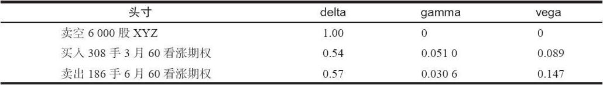
它的风险指标是这样的：

头寸delta：买入30股（中性）

头寸vega：7美元（中性）

头寸gamma：买入1000股

这个头寸于是满足了最初的想要gamma多头1000股的目标，但是delta和gamma是中性的。

最后，注意一下，theta=-625美元。这个头寸每天由于因时减值会损失625美元。

这个策略家必须比这个分析走得更远一些，特别是如果他处理的头寸不是一个简单的组合。他应当计算出盈利图，同时也看一看随着时间的消逝和股票价格的变化，这些风险指标是如何表现的。

图40-15（见表40-10、40-11和40-12）显示出在7天、14天和3月到期时的潜在盈利。图40-16显示了在7日和14日的时间间距上的头寸vega。在讨论这些事项之前，这些数据将展现在3个不同时间的表格中：7天、14天和在3月到期日。

表40-10的数据描绘了7日的头寸。

表40-11代表了14日的结果。

最后，3月到期日时这个头寸的模样应当已经相当清楚了（见表40-12）。

在每一种情况里，注意一下股票价格都是根据最后一节显示的统计公式计算出来的。时间消逝得越多，股票就越有可能从目前的价格上漂移得更远。
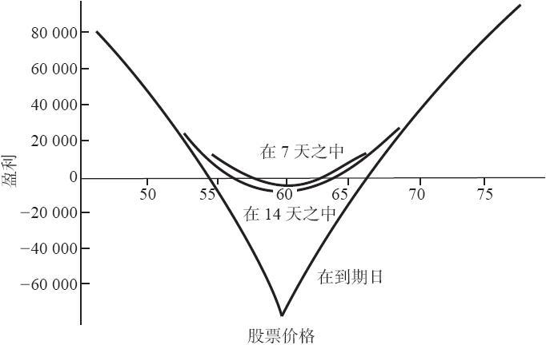
图40-15　交易gamma多头，盈利图

表40-10　gamma多头头寸在7天的风险指标
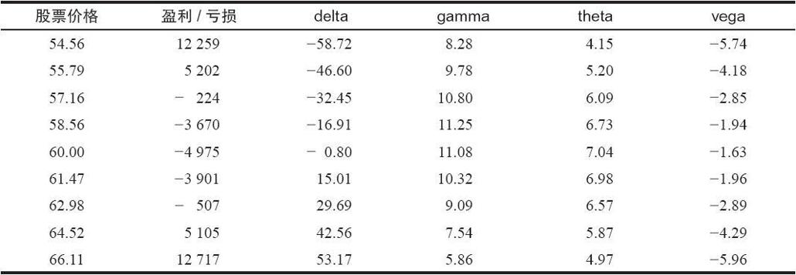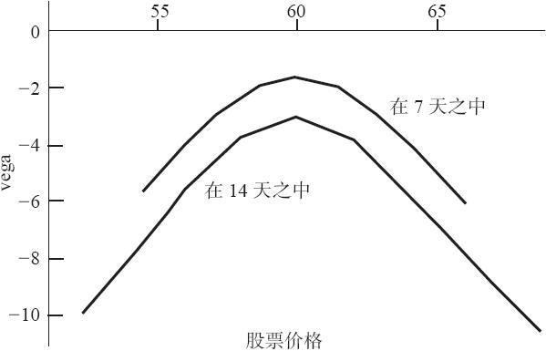
图40-16　交易gamma多头，头寸vega

表40-11　gamma多头头寸在14天的风险指标
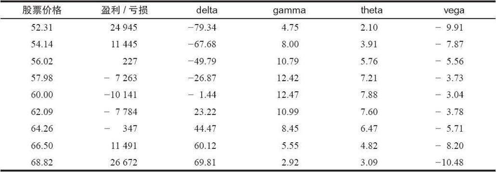
表40-12　gamma多头头寸在3月到期时的风险指标
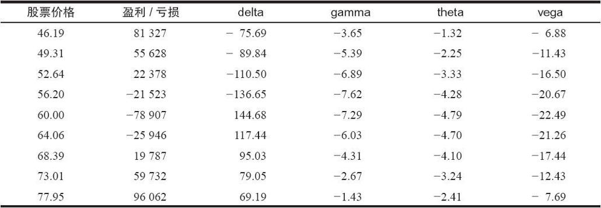
这幅盈利图形显示出这个头寸在很大程度上像一个买入跨式价差头寸的图形：如果股票无论在哪个方向朝上或者朝下运动，它都会有大量的、对称的盈利。此外，如果股票保持相对无变化，亏损就会很大。这些亏损往往会立刻开始积累，在14天内变得相当可观。因此，如果交易者进入这类头寸，他最好是很快就得到他想要的股票运动，要不然，他就应当准备砍掉他的亏损，退出这个头寸。

关于这个头寸要注意的最让人吃惊的事情是时间对这个头寸的灾难性效果。这幅图形显示出了如果预期发生的股票运动没有实现的话会产生多大的亏损。这些亏损完全是因为因时减值：theta在最初的头寸中是个负数（每天625美元的亏损），而且保持是负数（令人惊讶地不变），一直到3月到期日（当买入的看涨期权到期）。时间也会影响vega。请注意vega怎样立刻开始变为负数，而且，随着时间的消逝，负数会越变越大。简单地讲，有理由说，随着时间的消逝，这个头寸变得容易受到隐含波动率增长的伤害。

时间和波动率之间的关系对策略家来说也许不是一下子就看得出来的，除非他花时间来计算这类表格或图形。事实上，交易者也许在某种程度上对这样的观察而感到束手无策。实际发生的是，随着时间的消逝，如果波动率增长，所持期权就不再具有那么大的爆炸力，不过，卖出的期权还剩下很多时间，因此，如果波动率上升，期权就会剧烈上涨。

图40-17和图40-18对delta和gamma提供的数据没有那么能够说明问题。因为gamma在开始时是正数，随着股票上涨，delta也急剧上涨，如果股票下跌，delta也下跌得同样迅速（见图40-18）。对一个买入gamma的头寸来说，这是标准的表现；一个买入跨式价差看上去非常相似。注意一下在整个过程中gamma保持是正数（见图40-17），虽然如果股票朝着这个分析使用的价格范围的终端运动的话，它会跌到较小的水平。同样，对一个买入跨式价差的头寸来说，这也是标准的行为。
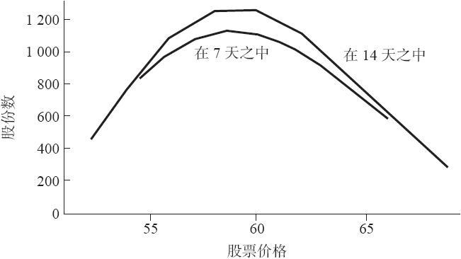
图40-17　交易gamma多头，头寸gamma
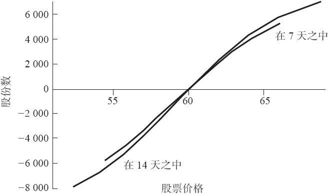
图40-18　交易gamma多头，头寸delta

因此，这是一个好的头寸吗？除非你知道标的证券会发生什么情况，否则这是一个难于回答的问题。从统计学的角度看，这类头寸有负面的预期收益，而且一般在长期中产生亏损。不过，在近期期权注定要过热的情况里（也许是因为兼并的谣传，或者是有关于一个公司的显著信息的透露），许多精密的交易者建立这类头寸来利用股票价格预期的爆发性运动。

其他变量。不用涉及过多的细节就能够将上面的头寸同相似的一些头寸进行比较。这样做的目的是要说明策略家最初要求的变化会如何改变已经建立的头寸。在前面的头寸里，策略家想要买入gamma，但是对delta和波动率中性。假定不止是预期到价格的运动（也就是说，他想要正gamma），而且预期到波动率中的变化。如果是这样的话，他应当也想要正的vega。假定他决定波动率每移动1个百分点，他就想要盈利1000美元，用这样的方法来为这种要求进行量化。那联立方程就会是：

0.0510 x+0.0306 y=10（gamma）

0.089 x+0.147 y=10（vega）

这些方程的解是：

x=243

y=-80

此外，为了使得这个头寸达到delta中性，还必须卖空8500股股票。由此产生的结果就是：
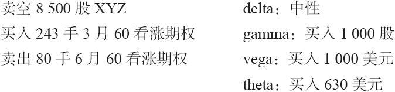
还记得吗，上一节讨论的那个头寸是vega中性的，它是：
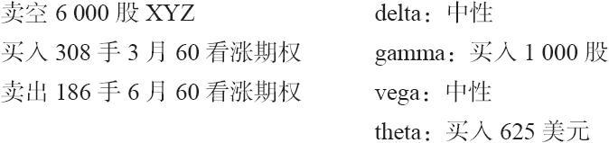
请注意，在这个新头寸里，买入的3月60看涨期权是卖出的6月60看涨期权的3倍之多。比起那个vega中性的头寸来，这个比率要大得多，在那个头寸里，每卖出1手就买入大约1.6手。买入的近期期权的更为主导的地位意味着这个新头寸对因时减值的暴露比前一个头寸甚至更大。也就是说，为了得到正的vega，交易者被迫在因时减值方面承担更大的风险。由于这个原因，比起前面那个头寸来说，这个头寸就不是那么理想；既要买入gamma又要买入波动率，这似乎风险太大。

这并不是说交易者无论在什么情况下都不应当买入波动率。事实上，如果交易者预期波动率会上升，他也许应当建立一个delta和gamma都中性，而vega为正的头寸。同样，使用同前面的示例相同的价格，下面的头寸可以满足这些标准：
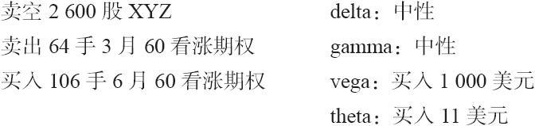
这个头寸的形式更为传统。它是一个跨期价差，不同的只是多买了看涨期权。另外，这个头寸的theta现在只有11美元，也就是说，每天因为因时减值而遭受的损失只有11美元。猛一看它似乎是这三种选择中最好的一种。不幸的是，当你画出盈利图（见图40-19）的时候，你会发现这个头寸在下行方向有相当大的风险：卖空的股票弥补不了大数量的6月60看涨期权。不过，这个头寸在上行方向确实有钱可赚，而且，如果波动率上升，它也可以盈利。如果在建立这个头寸时，3月看涨期权相对6月看涨期权定价过高，那么，它的吸引力就更大了。
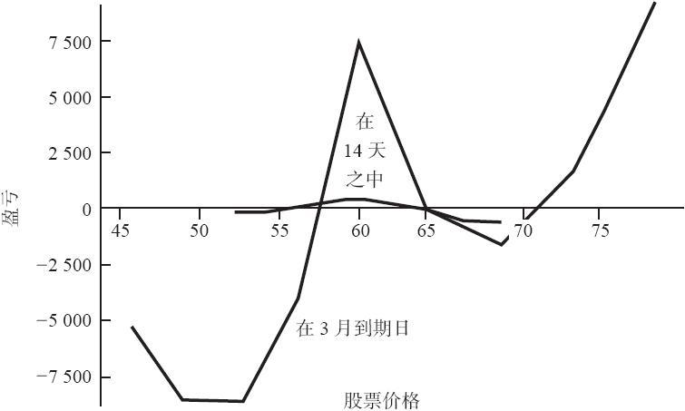
图40-19　交易gamma多头，“传统的”跨期价差

总之，通过对交易者想要承担或避免的风险进行界定，可以为构建最终头寸提供细节。策略家应当考察潜在的风险和收益，特别是盈利图形。如果潜在风险不是他想要的，策略家就应当重新思考他的要求，重头来过。因此，在这里展现的示例里，策略家感到他最初想要的是买入gamma的头寸，但是，它涉及过多的因时减值的风险。于是有了再一次的努力，在这个情景中引进了正的波动率。最后，第3个分析产生了，它涉及的是只买入波动率，不买入gamma。由此产生的头寸的时间风险很小，但是，如果股票价格下跌，就会有风险。它或许是这3种方法中最好的一种。策略家是通过一个逻辑的分析过程而得出这个结论的。
