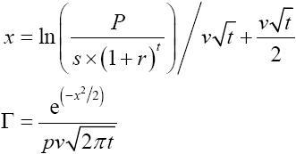
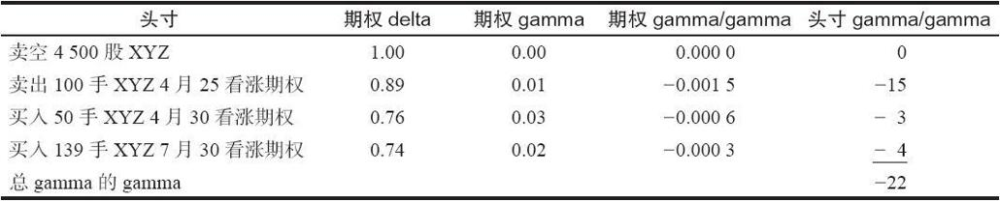
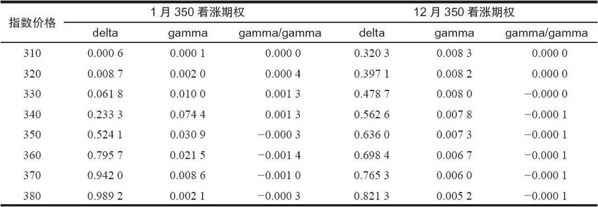
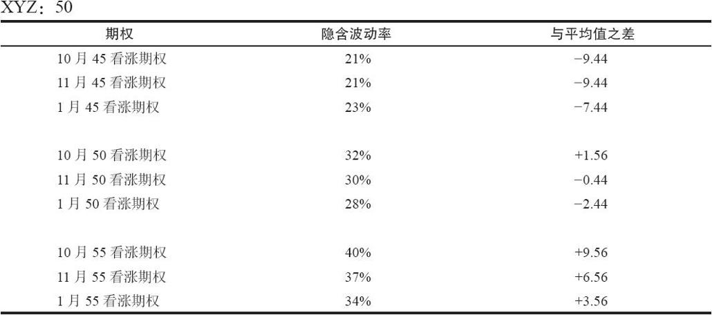
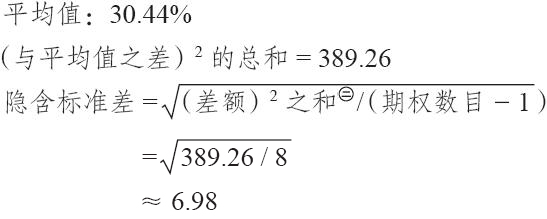

# 40.4　高级数学概念

这一章剩下的部分是对论述数学运动的第28章的一个简短的补充。它的技术性相当高。那些想要理解在这些风险指标背后的基本概念的，或许想用更高级的方法来使用它们的读者，也许会对下面的讨论感兴趣。

### 40.4.1　计算“希腊字母”

我们已经知道，delta的方程是布莱克–斯科尔斯模型计算的一个副产品：

Δ=N（d1）

每一个风险指标都是可以通过数学的方法从这个模型中推导出的偏导数。不过，有一种取得近似值的捷径，它同样也起作用。例如，求gamma的公式可以是这样的：

这里有一个正确但更简单的方法来得出gamma。delta是布莱克–斯科尔斯模型中与股票价格相关的偏导数，也就是说，它是同股票价格变化相应的一定数量的期权价格的变化。gamma是同股票价格变化相应的delta的变化数量。因此，你可以通过以下步骤来得出gamma的近似值：

（1）使用p=当前股票价格来计算delta；

（2）设定p=p+1，重新计算delta；

（3）gamma=从第1步得出的delta-从第2步得出的delta。

同样的步骤也可以使用在其他的“希腊字母”上。

vega：

（1）使用一个特定的波动率计算出期权的价格；

（2）使用上面的波动率加1%，计算出期权的另一个价格；

（3）vega=第1步的价格同第2步的价格之间的差额。

theta：

（1）使用当前离到期的时间计算出期权的价格；

（2）使用离到期少一天的时间计算出期权的另一个价格；

（3）theta=第1步的价格同第2步的价格之间的差额。

rho：

（1）使用目前的无风险利率计算出期权的价格；

（2）将利率增加1%，使用增加后的利率计算出期权的另一个价格；

（3）rho=第1步的价格同第2步的价格之间的差额。

### 40.4.2　gamma的gamma

我们在前面推迟了对这个概念的讨论，因为它不是很容易掌握。现在将它包括在内，为的是那些有的时候也许会想要使用它的读者。对它不感兴趣的读者可以略过这一节。

回忆一下，这是一个期权头寸第六个风险指标。gamma的gamma是当股票价格发生变化时gamma会变化的数量。

还记得吗，在前面对gamma的讨论里，我们提到过，gamma是会变化的。下面的示例是以前面用的同一个示例为基础的。

【示例40-20】XYZ的价格为49，假定1月50看涨期权的delta为0.50，gamma为0.05。如果XYZ向上运动1个点，这个看涨期权的delta就会增加这个gamma的数量。它会从0.50增加到0.55。简单地说，如果XYZ向上再运动1个点，到51，delta就会再增加0.05，到0.60。

显然，delta不可能在XYZ价格每增长1点时都增长0.05，因为，这样下去它最终会超过1.00。而我们知道，delta的最大值是1.00。因此，gamma显然也是在变化的。

在现实中，随着股票价格离行权价越远，gamma就变得越小。因此，当XYZ价格为51时，gamma可能就只有0.04。所以，如果XYZ上涨到52，这个看涨期权的delta就会增加0.04，到0.64。因此，gamma的gamma就是-0.01，因为gamma在股票上升1点的时候从0.05下降到0.04。

随着XYZ的价格变得越来越高，gamma就变得越来越小。最后，当XYZ在60到65之间时，delta就变成将近1.00，而gamma就接近于0.00。

gamma的这个随着股票运动而出现的变化叫做gamma的gamma。它或许有其他的名字，不过，因为只有最精密的交易者才使用它，所以它没有一个标准的名字。一般而言，交易者是在他的整个投资组合中使用这个指标，以衡量这个投资组合对头寸gamma的反应。

【示例40-21】正如在前面一些示例中那样，XYZ的价格是31.75，有下面的风险指标存在：

还记得吧，在同一个用来描写gamma的示例里，这个头寸是delta多头686股，它的正gamma是328股。此外，我们现在看到，gamma自身是随着股票上涨而下降（它是负数），或者，随着股票下跌而增加。事实上，XYZ每运动1点，可以预期它会增加或降低22股。

因此，如果XYZ向上运动1点，就会出现以下情况：

（1）delta从684增加到1014，增加gamma的数量；

（2）gamma从328降低到306，标志着如果XYZ继续上涨，delta增加的数量就会比以前小。

你可以想象出在不同情况中gamma的gamma的变化的一般画面（实值、平值和虚值，或者是离到期的不同时间）。下面的两个指数看涨期权的表格显示出了在不同股票价格上的delta、gamma和gamma的gamma，这两个期权是离到期还有1个月的1月350看涨期权和离到期还有11个月的12月350看涨期权。

从这里可以得出若干结论，这些结论并不都是一目了然的。首先，长期期权的gamma的gamma是非常小的。这是可以预期的，因为长期期权的delta变化得非常慢。下一个事实在较短期的1月350的表格中看得最清楚。深度虚值期权的gamma的gamma几乎是零。不过，随着期权接近实值，gamma的gamma就变为正，虽然期权仍然是虚值的，它则接近于它的最大值。当期权变为平值的时候，gamma的gamma就变成负。之后它一直是负，当期权变成略为实值时达到它最大的负值。从这里起，随着期权的实值程度变得越来越深，gamma的gamma保持它的负值，但越来越接近于零，最后，当期权极度实值时，达到了（负）零。

有没有可能不必进行深度的数学计算就可以推断出这个风险指标呢？有这样的可能。注意一下，当一个期权是虚值的时候，它的delta是从一个小数目开始的。然后它开始增长，开始的时候很慢，然后越来越快，直到它在一个平值期权中达到刚好是0.60之下。从这里起，它继续增长，但是，随着期权变为实值期权，增长的速度要慢得多。delta的这种运动可以通过gamma来观察出来：它是delta的变化值，因此，它开始的时候随着股票价格接近行权价而缓慢增加，然后，当期权是实值的时候开始减小，始终是个正数，因为delta在股票上涨的时候只会朝正数的方向变化。最后，因为gamma的gamma是gamma中的变化，因此，随着gamma越变越大，它开始变为正，但这时是gamma开始逐步减小的时候，这可以从负值的gamma的gamma中反映出来。

总之，gamma的gamma是精密的交易者用在大宗的期权头寸上的，在这些期权头寸中，股票价格的变化给gamma带来的影响不是很明显。交易者常常对它们的delta有所感觉。他们甚至对delta在股票价格运动时会有什么变化也有所感觉（也就是说，他们对gamma也有所感觉）。不过，精密的交易者知道，即使是从零delta和零gamma开始的头寸最后也会获得一些delta。gamma的gamma告诉交易者这个头寸最后获得delta的速度会有多快以及数量会有多大。

### 40.4.3　衡量隐含波动率的差异

读者应当还记得，我们在讨论隐含波动率的时候曾经说过，交易者如果能够发现这样的情况，其中，同一个标的证券上的不同的期权之间的隐含波动率有很大的差异，那么，这就可能是一个有吸引力的建立中性价差的机会。策略家也许会问，他应当如何来确定这两个期权之间的差异大到值得他注意的程度了呢。更进一步说，有没有一种可以快速确定这一点的方法（当然要使用计算机）？

解答这一点的一个逻辑的方法是看一看每个期权自己的隐含波动率，并且计算出这些数字的标准差。用这个标准差除以这个股票总的隐含波动率，就可以将它转换为一个百分比。这个百分比，如果足够大的话，就可以提示策略家，告诉他在这个标的证券的不同期权之间有可能存在进行价差交易的机会。下面的示例可以说明这个程序。

【示例40-22】XYZ在50交易，有下面的期权和各自不同的隐含波动率存在。我们可以通过这个公式为这些隐含波动率计算出一个标准差，叫做隐含标准差（implied deviation）：

隐含标准差=sqrt（（与平均值之差）2的和[1]/（期权数目-1））

注：疑原文有误，原文是“差额和的平方”，应该是“差额平方的和”。——译者注

这个数字代表了隐含波动率之间的原始标准差。为了将它转换为可以用来比较的数字，必须把它除以平均隐含波动率：

差值百分比=隐含标准差/平均隐含波动率

=6.98/30.44

=23%

如果这个“差值百分比”大于15%，那么它通常就是显著的。这就是说，如果不同期权的波动率之间的差异大到在上面的计算中会产生15%甚至更大的结果，那么，策略家就应当考虑是否要在这个证券或者期货合约中建立中性的价差。

这里展示的概念可以使用隐含波动率的加权平均值（将交易量和同行权价的差价考虑进去）而不是原始的平均值而得到进一步完善。这个任务就留给读者了。

我们提到过，计算机可以在很短的时间内进行大量的布莱克–斯科尔斯模型计算。因此，计算机可以甚至更快地计算出每个期权的隐含波动率，然后进行“差值百分比”的计算。想要建立这类中性价差的策略家只需要看一下差值百分比的清单，找出价差交易的候选者。在既定的某一天，这个清单一般相当短，合格的大约只有20种股票和10种期货合约。

[1] 疑原文有误，原文是“与平均值之差和的平方”，应该是“与平均值之差的平方的和”。——译者注
