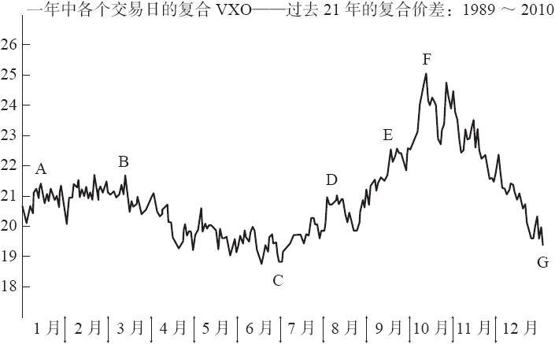

# 41.2　VIX的计算方法

初始CBOE波动率指数的计算方法发布于1993年，并回溯至1986年。实际的计算公式是由杜克大学的罗伯特·威利（Robert Whaley）博士所设计的。它使用了OEX期权的4个序列的数据，以当前的OEX价格为中心，一个行权价高于当前的OEX价格，另一个低于，并包括最近的两个到期月。这些期权的隐含波动率被加权来组成1个数值——VIX。

在当时（1993），OEX期权还是流动性最好和最受欢迎的指数期权。不过，随着时间的变化，标普500股指期权（SPX）开始占据了这个地位，这主要是因为SPX更受大型机构投资者的欢迎。此外，期权交易者已经知道，自1987年股灾起，指数上的深度虚值看跌期权就变得比平值期权更贵（从隐含波动率的角度）。与此同时，深度虚值看涨期权变得比平值期权更便宜。最终，需要有一种新的波动率计算方法来把这些因素都考虑进去。

因此，在2003年，CBOE修改了VIX的计算方法。“老的”VIX仍然保留，只是它的交易代码变成了VXO。“新的”VIX是基于SPX期权的，并且把前两个到期月的所有行权价的期权都囊括在内。实际上，并不是所有的行权价都被囊括在内，不过已经差不多接近所有了，只要该期权有买报价和卖报价。用方言来表述的话，那就是“新的”VIX是基于前两个到期月的期权“条”（strips）。实际的计算公式比较复杂，大家可以在CBOE的网站上找到，同时还可以找到关于该主题的一些学术论文。

老的和新的VIX衡量的都是30天的波动率。你将在后面看到，这一点非常重要。正是这个原因，使得更长期的，在未来很多个月之后到期的衍生品，将不能很好地跟踪VIX。用数学的术语来说，这个30天的估计意味着，在计算VIX中所使用的2条SPX期权在每一天都有不同的权重。随着时间从这一个月到下一个月，“近”月的SPX期权条的权重会降低，而“远”月的权重会增加。

VIX的计算方法是通用的，它可以用来计算任何有连续交易（有买报价和卖报价）的期权，需要用到最近的两个到期月的2条期权的数据。因此，几乎所有的场内股票、指数或期货合约的期权都可以进行类似VIX的波动率计算。

为了交易某个资产的VIX期权，首先需要为该产品建立一个波动率，或VIX指数。标的股票（指数或期货）有常规的场内看跌期权和看涨期权交易，但VIX期权并不是以股票价格来交易。它们是根据由该股票的看跌期权和看涨期权所计算出的VIX指数来交易。因此，首先需要建立一个类似VIX的指数，然后就可以交易该指数的期权了。例如，SPX看跌期权和看涨期权已经上市了很多年，那么这些期权就可以用来计算最初几个月的VIX，然后再基于VIX指数来建立VIX期货和期权。

VIX最初是CBOE波动率指数的术语和代码。不过现在这个术语已经扩展来描述计算波动率的整个过程。例如，以施乐为例。最初它是一个公司的名字（现在也是），不过最终变成了“复印”的意思，甚至变成了“复印机”的意思，而不管是哪家公司生产的。这样的事同样发生在VIX上。施乐实际上提起过一次诉讼来阻止其他公司使用它的名字，不过这个尝试没有成功。

在2010年和2011年，CBOE在黄金、原油和欧元（外汇）上引入了VIX的计算。分别使用了热门的ETF（GLD、USO和FXE）上的期权。后来，VIX的计算推广到更多的ETF和特定个股上。甚至期货交易所也参与其中，以该交易所上市的期货期权为基础，为黄金和原油引入了VIX计算。

从那时开始，CBOE把VIX计算推广到大量的其他ETF和一些个股上。包括苹果（AAPL）、亚马逊（AMZN）、高盛（GS）和IBM（IBM），以及以下的ETF：新兴市场（EEM）、中国（FXI）、巴西（EWZ）、金矿（GDX）、白银（SLV）和能源（XLE）。这些股票和ETF的波动率（VIX）计算都有单独的代码。

这个现象与1976年看跌期权被引入的情形非常类似。当时，似乎让每个上市期权的股票都同时有看跌期权和看涨期权上市是一个幻想，不过最终这成了常态。我们目前可能就处在这样的临界点上，未来上市期权的资产可能都会有看跌期权、看涨期权和VIX期权。显然，我们现在还在这个过程的早期阶段，不过它确实有可能成为现实。

对大家所讨论的究竟是哪个VIX的界定，现在还没有展开，但将来会变得很有必要。在很多年里，VIX都是指基于SPX期权的波动率计算。但随着时间的推移，会越来越有必要将其称为“SPX VIX”，以便于“黄金VIX”、“苹果VIX”等相区分。

波动率存在每年的季度特征，这有时对交易者非常有用。知道波动率在一年之中的一般路径非常重要。单个年度可能会有一些变化，但大多数年度都满足一种或另一种普遍模式。

图41-1显示了“老的VIX”（VXO）在1989~2010年这22年间复合值。在这22年中的每一年里，计算每一天的VXO平均值。例如第一天的平均值是20.75。之所以用VXO，是因为它有更长的历史回溯数据。VIX和VXO的走势基本相同，因此下面的结论也可以应用于VIX。

图41-1　波动率的季节性

因此，图41-1中的模式是该年中每个交易日的22年平均VXO。波动率看上去会在1月略微上升，并在3月得到尖峰。然后再下降至年度低点（非常接近7月的第1天）。然后波动率会大幅上升，一直持续至夏季的后半部分（传统上认为8月是个不波动的月份，这里的结论不是这样），并在9~10月出现急剧上升。

当然，股票市场经常在9~10月大幅下跌，这就导致了图41-1中所显示的波动率上升。关于尖峰的时间，“平常的”交易者可能认为他已经知道波动率将会继续怎么变化了——它在上升。因此，即使他错过了在夏季买入波动率，他还可以在10月买入，希望未来波动率会变得更大。这就是个体投资者的想法，不过这是个反向指标。波动率没有再继续上升，反而在该年的秋季下降，并在该年的最后时间里回撤得很厉害，与7月的低点非常接近！

当然，这个模式并不是在每一年里都成立。但即使某些年看上去不符合这个模式，也会有明显的相似性。例如，考虑一下2010年。在该年的5月有一次“闪电崩盘”（flash crash），伴随着的是一次大幅的市场下跌。因此，VIX从4月的年度低点快速上升到5月年度高点。在该年的剩余时间里，波动率都在逐渐下降。换句话说，从某种程度上说，2010年左边的图形是图41-1中的图形被“压扁”后的效果。同样的情况在其他一些年份也出现过。

这些季节性数据并不是你构造特定策略的必要信息，但它明确指出了：在春末或夏初“买入”波动率是一个好的选择，而在秋季卖出波动率可能同样有用。
