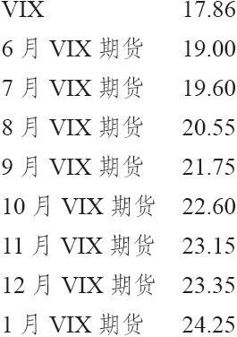
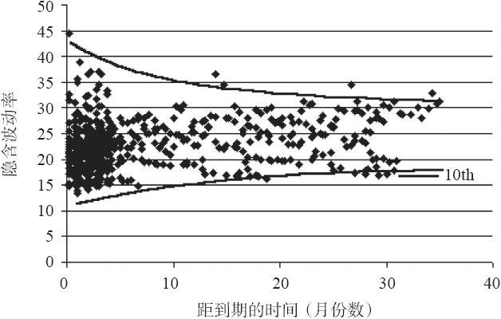
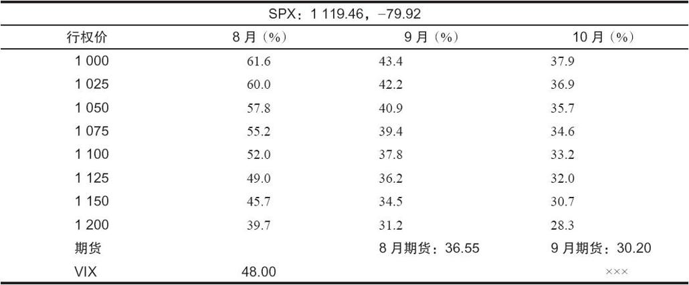
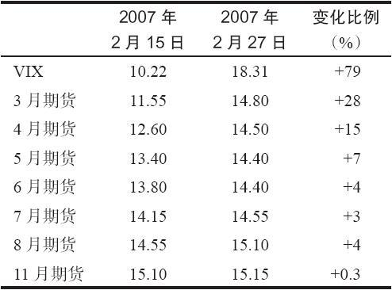
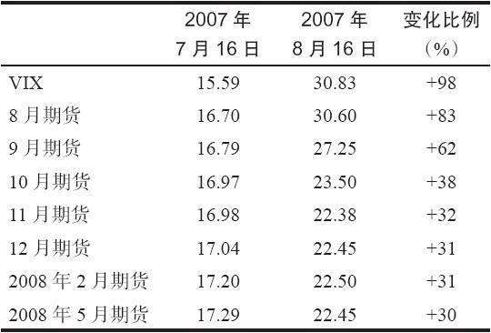
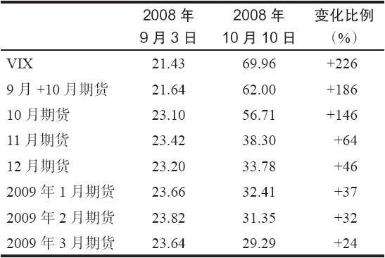
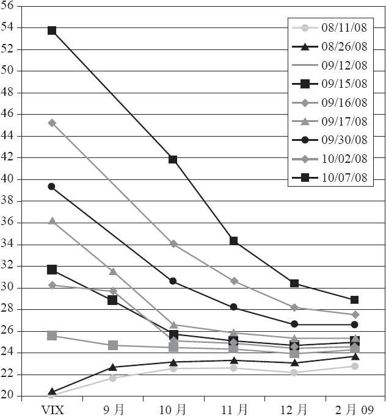

# 41.3　上市的波动率期货

在2004年，CBOE成立它的期货交易所（CFE）时，只考虑了2个产品：历史波动率期货和隐含波动率期货。隐含波动率期货（或VIX期货，这个名字更常用）后来被证明是更受欢迎的产品。

我们在第34章讨论了期货。如果你对期货不是太熟悉，你可以再复习一下那一章，虽然下面的信息已经足够让你理解VIX期货。如果你准备交易任何波动率衍生品，千万不要忽略这一节的内容。即使你认为自己对交易VIX期货没有兴趣，而只对VIX期权有兴趣，你仍然必须理解VIX期货，这样才能理解VIX期权。因此，这一节内容是要求必读的。

期货合约有到期日，而没有行权价。这就是期货和期权的主要区别之一。另一个区别是，期货交易有很高的杠杆，因此投资者在交易期货合约时并没有有限的风险。相反地，期货价格中一个小幅不利变动（例如10%）就可能抹去他的初始保证金要求。

VIX期货以价格的形式来标价，与VIX类似。例如，如果VIX自身的价格在20附近，那期货的价格在大多数情况下可能会比20稍微高一点。一手VIX期货合约的每一点变动价值1000美元。因此，某个投资者以21买入7月VIX期货合约，并以22卖出，那他就会挣1000美元（不考虑手续费）。

期货经纪商的保证金要求差异很大，这取决于期货的价格和市场整体波动率。交易所在合适的情况下会提高保证金标准以限制投机。目前，1手VIX期货合约的交易所最低保证金为4000美元。我们会在后面讨论价差保证金。因此，VIX期货合约有很大的杠杆，就像大多数期货合约一样。合约中4点的变动就会让你有翻倍的盈利，或者亏完你全部的初始保证金。

### 41.3.1　VIX的到期日

VIX期货会上市多个到期月份，从当前日期开始，至少有7个连续的到期月份。每个期货合约都有一个到期日。一眼看上去，VIX的到期日仿佛很神秘，其实确定到期日的方法有其实际的物理原因，就像所有商品和金融产品的到期日一样。

任意特定月份的VIX期货的到期日会比下一个月到期的SPX期权早30天。它通常是星期三。它有时会是“正常”期权到期日（该月的第三个星期五）之前的星期三，或者是下一个星期三。只有这两种可能。

【示例41-1】7月SPX期权在该月的19日（星期五，该月正常的第三个星期五）到期。因此6月VIX期货的到期日会比它早30个日历日。这就是7月中有19天，6月中11天。由于6月有30天，从月底向前数11天所得到的到期日是6月19日，星期三。

为什么会“向前数”30天？为什么不让VIX期货刚好在第三个星期五到期，就像所有其他的股票和指数期权那样？让我们晚一点再讨论这个问题，先来看看流动性。如果没有套利交易，没有哪个衍生品会具有流动性，或者说会成功。例如，看跌期权和看涨期权的做市商可以通过建立与期权相反的头寸来对冲掉相等的头寸。当监管者在2008年10月准备禁止卖空交易时，他们显然没有意识到这一点。如果不能卖空标的物，期权做市商就不愿意持有看涨期权多头或看跌期权空头。这个禁令很快就针对期权做市商取消了（这相当于针对所有人都取消了，因为其他人可以买入看跌期权，然后让做市商卖空股票来对冲他们卖出的看跌期权）。

这30天的向前数的期限是有必要的，因为这让做市商可以对冲他们的期货头寸。最初，VIX衍生品的设计者很难决定如何让这个产品可以被对冲。然后他们想到了这个主意。还记得吧，计算VIX需要加权两条SPX期权，并且权重在每天变。期货的做市商会持有大量的期货头寸，他们希望能用SPX期权来对冲这个头寸。从纯理论上说，他们需要在这两个月份的期权条的所有SPX期权上建立头寸，并且只要他还持有这个对冲头寸，他就需要每天调整这两条期权的数量。显然，这是荒谬的。正是因为需要知道做市商如何才能有效地对冲大的期货头寸，才延误了这个产品的初次上市时间。

最终，一个明智的对冲方法产生了。那就是，在期货的到期日，让VIX的计算方法只与一个期权条相关，并且这些期权都会在30天后到期。这样做市商就可以持有大量的期货头寸，并同时用一条SPX期权来对冲，然后持有这个头寸，不需要每天调整SPX期权的数量。这个方法解决了这个问题，至少是绝大部分。

VIX期货的实际到期时间为星期三到期日的早上，此时计算VIX只需使用到期日为30天的SPX期权。在计算SPX期权时所使用的价格的规则为买报价和卖报价的平均值，或者是最后交易价，这些规则可以在CBOE的网站上找到。

一旦得到“只适用于到期日”的VIX计算结果，那VIX期货就到期了，并以该价格来进行现金交割。

【示例41-2】接着上面的示例，在到期日，星期三，6月19日，6月VIX期货实际上并没有交易。相反，当在这一天的早上，6月SPX期权开盘时，在该整条期权中每个相关的期权首个买卖报价或交易价都被用来进行类似VIX的计算（根据常规的VIX公式），因此“VIX交割价”就被确定了下来。CBOE会以VRO（像指数一样报价）这个代码来传播这个VIX交割价。因此，6月期货就以这个价格进行交割并到期。这些合约会从每个交易者的账户中消失，并以该价格计算最终的盈利或亏损。这个处理流程与其他那些现金交割的金融期货（例如标普500期货）到期时的流程是一样的。

假设有个账户已经以23.25的价格买入了6月VIX期货，并持有至到期。此外，再假设在到期日，确定的VRO是20.84。那就会有2.41点的已实现亏损，或2410美元，被记录在他的账户中，然后该期货头寸就会从他的账户中移出。在现实中，该期货会在他的账户中逐日盯市，因此这笔2410美元的亏损会积累一段时间。

关于VIX到期的问题，有一些强词夺理式的指控。有谣言认为，SPX期权的交易者可以让虚值期权的价格变得异常，来让到期日的VRO发生价格跳跃。这些指控一般都是一些想象，虚构性大于真实性。交易所实际上有一些流程来在到期日剔除掉无关的SPX期权的价格。

不管怎么样，确实发生过许多VRO相对前一个晚上的VIX收盘价有大幅跳跃的现象存在。这主要是因为隔夜市场的变化，从而导致SPX在下一天开盘时出现跳空。因此，你最好在到期之前将你的VIX衍生品头寸平仓，而不是单纯地持有它们至到期。

### 41.3.2　期货与VIX对比：升水或贴水

如果期货合约的价格比VIX高，那就说它在以升水价交易。相反，如果期货的价格比VIX低，则说它在以贴水价交易。换句话说，就像标普期货和许多其他的期货合约一样，升水或贴水这两个术语是在指期货和VIX之间的关系，而不是其他什么东西。也就是说，我们一般不说“VIX相对期货合约有贴水”，而是说“期货合约相对VIX有升水”。

波动率的交易者注意期货的升水是有用的。但只是考虑当月期货合约的升水是不够的。在当月合约临近到期的时候，升水对该合约的重要性就没有下一个合约那么大。因此，有必要用两个近期期货合约的数据，来计算出一个混合的升水。

由于VIX是两个近期月份期权条的30天加权平均值，并且这是指日历日，那我们就可以用两个近期月份期货的价格来直接计算这个混合的升水。

【示例41-3】当6月VIX期货成为当月合约的第一天，有下面的价格存在。假设6月和7月VIX衍生品的到期日之间有4周的时间间隔（即20个交易日）。

VIX：23.05

6月VIX期货：25.00

7月VIX期货：27.50

因此升水就是：

6月升水：25.00-23.05=1.95

7月升水：27.50-23.05=4.45

由于两个到期日之间有20天，并且离7月到期日还有19天，因此6月的权重为95%，7月的权重为5%。因此混合的升水就会是：

0.95×6月+0.05×7月=0.95×1.95+0.05×4.45=2.125

下一个交易日，该权重就会是0.90和0.10，再然后就是0.85和0.15，等等。当两个VIX到期日之间间隔5周的时候，这意味着它们之间有25个交易日，那么每一天的权重变化就是0.04（即，第一天的权重会是0.96和0.04，第二天会是0.92和0.08，等等）。

如果投资者用这种方式来计算VIX升水，那在VIX到期这段时间就会有一个平滑的转换过程。否则，如果投资者只是用最近的合约，那在每个期货到期日都会有一个跳跃或跳空，因为不管交易者愿意为下个月的期货支付多少升水，最近的期货会由于它快要到期而只有很少的升水。

### 41.3.3　期限结构

当投资者在谈论所有期货合约的共同升水特征时，他是在讨论期货的期限结构。许多期货合约都存在这样的情况，同时有7个或更多的月份在交易。一种比较正常的模式是，随着时间的延长，会看到有越来越大的升水。

【示例41-4】这是一个有正斜率期限结构的例子：

看见了吗？每个期货合约的价格都比前一个稍高一点。这就是一个正斜率的期限结构。我们会在这一章更多地讨论和引用期限结构，但它确实意味着交易者愿意为更远到期的SPX期权支付更高的隐含波动率，而为近期的SPX期权支付更少。

我们在第36章《波动率交易的基本概念》中已经强调过这个概念。图36-3显示了OEX期权的隐含波动率。由于该图会在本章中引用很多次，所以我们把它作为图41-2复制了过来。图中的点是期货的价格。例如，如果图41-2中所有期货都沿着较低的边界附近，那就会是一个向上倾斜的期限结构。如果它们沿着较高的边界分布，那就会是一个向下倾斜的期限结构。

图41-2　长达数年的OEX期权的隐含波动率

在牛市中和/或VIX价格非常低的时候，经常存在一个正斜率的期限结构。而在持续的熊市煎熬中，特别是VIX非常高的时候，常常出现负斜率的期限结构。例如，在2008年最后几个月，以及2009年3月之前的断断续续的时间里，VIX期货的期限结构为严重的负斜率。因此股票市场的牛市经常导致期限结构向上倾斜，越是牛气冲天的时候，期限结构的向上倾斜程度越大。但当市场开始下跌时，向上的倾斜会缓解。此外，如果股市继续下跌，期限结构会从一个正的斜率，逐渐变平，如果熊市一直持续则最终会发生反转（负斜率）。

从这个角度来看，期限结构有时可被视为市场是否被超买或超卖的良好指标。此时期限结构的斜率会朝一个方向或另一个方向“非常陡峭”。此时很可能它会变平，为了让这种情况发生，股票市场会反转方向（至少是暂时的）。

交易新手经常会问，为什么这些期货价格与VIX差异很大，即使短期期货也是如此。除了期权定价的自然期限结构之外，就像图41-2中所示，还有另一个重要的因素，VIX的计算方法和衡量VIX期货之间的差异。还记得吧，在VIX的计算中，我们使用的是两个近期条的SPX期权，而期货仅仅跟踪了存续期为30天的SPX期权。

例如，考察一下在2011年8月发生了什么。此时VIX暴涨至48，而股票市场暴跌，但VIX期货的收盘价并没有达到那个水平。在2011年8月8日，VIX收盘价为48，而近期（当月份）的8月VIX期货的结算价为36.55，有11.45的巨大贴水。在这一天，9月（第二个月份）期货甚至有更大的贴水——17.80。9月VIX期货在这一天的结算价为30.20。

当交易者看见这样的价格时，他们可能会这样想：“难道这些期货交易者都疯了吗？他们为什么会让期货价格比VIX低这么多？难道他们不知道股市在暴跌吗？”这些期货价格其实与交易者的想法没有多大关系。相反，产生这种价格的原因是，VIX和期货的组成部分并不相同。VIX和VIX期货都是基于SPX期权的隐含波动率。在这一天，VIX是根据8月和9月SPX期权的隐含波动率的加权结果。而VIX期货，则仅仅基于一条SPX期权——那些在期货到期日之后30天到期的期权。因此，在8月8日这一天，8月VIX期货是基于SPX 9月期权。类似地，9月VIX期货是基于SPX 10月期权。

让我们看一看这些细节，以了解为什么会有这么大的贴水出现。表41-1显示了在2011年8月8日时特定SPX期权收盘时的隐含波动率。VIX是列标中“8月”和“9月”的隐含波动率的加权结果。

然而，8月期货仅仅是列标为“9月”的期权的组合结果。9月期货仅是列标为“10月”的期权的组合结果。因此，很容易就可以发现，为什么VIX会比8月期货高这么多，为什么8月期货会比9月期货高这么多。这都与SPX期权的隐含波动率有关系，其中主要是“8月”列中的隐含波动率太大了。

这样的贴水最终会消失，如果没有在到期日之前消失的话，也会在到期日消失。

表41-1　在2011年8月8日，SPX的隐含波动率

观察过去一些极端时刻时的期限结构会很有指导性。当VIX期货首次开始交易的2004年，由于当时处于充分的牛市，VIX非常低。事实上，VIX在2007年早期之前一直维持低位。但是，在2007年2月27日，中国提高了准备金率，导致全世界的市场都开始下跌。在一天之内，中国股票市场下跌了8%，道琼斯指数下跌了400点，标普指数下跌了50点。这对长期的低波动率市场带来了很大的冲击。期货的行为开始变得不寻常。表41-2显示了市场暴跌之前和之后的期限结构。

表41-2　VIX衍生品的表现，2007年2月

表41-2有很多可以讨论的内容。首先，注意VIX相对于这些期货合约上升的幅度。本质上，期限结构从2月15日的向上倾斜变为在2月27日有点向下倾斜。并且没有一个期货跟随了VIX的变化，3月当月合约显然比其他合约上升更多。这个示例是我们将显示的如何模拟VIX的众多示例中的第一个。如果投资者想模拟VIX，不管是出于投机还是保护某个股票组合的目的，他都必须只交易当月合约。

期货在2007年2月27日没有上升那么多的一个原因是，它们看上去预示着市场过度反应了，牛市还会继续。不过它确实后来很快就恢复了。因此，当所有期货都相对VIX有贴水时（就像2月27日中那样），那市场就被超卖了，当VIX下跌时，就是一个买入的信号。换句话说，当VIX有一个尖峰，特别是当所有期货都以贴水价在交易时，就是一个买入整个股票市场的信号。

期货没有跟随VIX这一事实的原因是，当时许多惊慌失措的交易者中只有很少的人在交易这个产品。毕竟，一些有前瞻性的个人投资者，并没有完全被2007年的持续的低波动的牛市所迷惑，他们认为波动率会在下一年的某个时候上升。因此他们买入8月或11月VIX期货。可以想象，当2007年2月首次VIX暴涨发生的时候，他们会有多沮丧，他们的期货几乎没有上涨。媒体和一些错误的分析师给这一现象提供了一些错误的解释。其中一些解释非常荒唐。而另一些比较接近了，但没有点到实质，比如引用SPX期权是欧式行权的事实等。

正确的理由是，长期的8月和11月波动率在2月的这一天并没有上涨那么多。只有SPX 3月和4月期权的隐含波动率有显著的上涨。我们可以从典型的期限结构图（见图41-2）中看到，近期期权的隐含波动率比远期期权的隐含波动率更容易爆发。在这个例子中，3月和4月期权上升最多，而3月期权的权重又最大，所以导致VIX急剧上升。3月VIX期货的标的是4月期权，因此也仅与这个月的波动率有关。后面月份的期权并没有上涨多少。因此，如果某个投资者想去模拟VIX的爆发性运动，他不能交易长期VIX期货或期权。相反，他必须交易短期期权，并不停地挪仓。

长期月份有时会有剧烈反应，特别是当“聪明的钱”认为市场有长期风险的时候。而在2007年2月出现的事件，大多数聪明的交易者只认为这是市场的短期风险，中国准备金率的上升只是一个短期事件。他们确实对了，市场在2007年3月又开始延续向上的趋势。

但在2007年7月和8月，产生了一个完全不同的图。股票市场在2007年7月中期达到了新高，此时出现了一个新的术语：次级债（对大多数人来说是新的）。SPX在1个月里出现了接近200点的急速下跌。肯定有什么新的事情发生了，市场已经从2002~2003年的低点上涨很久了，在此期间的波动率一直很低，并且没有大的回调。这次回调结束于8月中期。在这一个月里，产生了一种完全不同的波动率期限结构。表41-3显示了在这段时间所发生的情况。

表41-3　VIX衍生品的表现，2007年7~8月

表41-3中的期货的反应与表41-2中有非常大的不同。首先，请注意VIX增加了很多，差不多在一个月中翻了一倍。8月的短期VIX期货合约的涨幅最大，达83%。因此期货和期权的交易者并没有预期波动率会很快回到表41-2中的低波动率水平。如果你持有8月合约作为保护，你会对它的表现感到满意。你不太可能得到更多了，相对于标的物有98%的变化，而衍生品已经有83%的变化了。不过如果你是用该年更远的月份合约来对冲的话，比如11月，那你就可能有点失望，因为这个长期合约只上涨了30%多一点。

因此，即使金融市场中出现了一次主要的爆发（这是历史上最差的一个熊市的起点），长期合约的隐含波动率只上涨了一点点。再说一次，如果有人想模拟VIX的表现，那他必须使用短期合约，并不断地挪仓。

再请注意7月16日的期限结构，它在温和地向上倾斜，但一个月之后，它变成严重地向下倾斜。在这段时间内，牛市的图形变成了熊市的图形。这是牛市已经终结和熊市已经开始的又一个信号。

关于VIX期货表现的第三个也是最后一个示例显示在表41-1中。这个例子的数据中包括了雷曼兄弟破产，市场从焦虑的熊市演变为完全的金融危机。我们在后面的分析中还会用到这里的数据。

如果说什么时候需要波动率保护，就是这个时候，这是史上最严重的金融灾难之一。VIX跳跃了226%（实际上后来变得更高）。在2008年9月3日，9月期货是这时的当月合约。如果你持有这个合约并在9月到期时将它挪仓至10月合约，你将从你的期货头寸中赚到186%。当然，这没有VIX的变化那么多，但它已经是一个很多的对股票价格下跌的保护了。即使你一直持有的是10月合约，你也能获得146%的收益，这至少也提供了一定数量的保护。

不过如果你持有的是更长期的合约，比如那些到期日在2009年的合约，那相对于VIX的上涨，以及股票市场所发生的下跌，你实际所得到的收益却很少。2009年3月合约在表41-4中所涵盖的这段时间内的涨幅只有24%。显然，近期合约更紧密地跟随着VIX，即使VIX在金融危机中出现爆发也是如此。

请注意在2008年10月10日期限结构的陡峭向下倾斜。所有期货的价格相对于VIX都有很大的贴水。就如前文所示，当VIX出现尖峰，而所有期货都存在贴水时，就是一个买入整个股市的信号。不过在这个例子中，VIX现在还没有达到尖峰。因此仅仅因为所有期货都出现贴水，并不成为买入股票的理由。尽管它是一个警示，即短期时间维度内出现了买入信号。我们后面会看到，有一些（期权）策略可以用来处理这种情形，特别是VIX/SPX对冲策略。

表41-4　VIX衍生品的表现，2008年9~10月

图41-3显示了与表41-4相同的信息，不过是以图形的形式来表示的。图形中的每一条线都代表不同日期的期限结构。在每一条线上都有一些点来表示大量期货和VIX的价格。图形中最低的线表示的是2008年8月11日的期限结构。在这一天，VIX刚刚超过20，期货则有小幅的升水，一直延续到2009年的2月合约，这个合约的价格大约是23。因此这一天的期限结构是略微向上的。

图41-3　VIX期货的期限结构

即使在这个时候熊市仍在继续，但市场基本上在窄幅波动，因此VIX衍生品上就看不出有什么紧急性。在2008年8月后期，期限结构并没有改变太多。然而，进入9月，市场中出现了关于雷曼兄弟可能会破产的恐慌和谣言。不过即使是在2008年9月12日，期限结构仍然十分水平，VIX略微低于26，各个期货则在24或25的价格上交易。

然而，在9月15日，消息证实了，美国政府不会紧急救助雷曼，然后股票市场开始暴跌。VIX在9月15~17日急剧上升。因此在9月17日，期限结构变为明显的向下倾斜。此时VIX刚好高于36，但当月期货（这一天的当月期货是10月合约，因为9月刚好在这一天的早上到期）却只有26！当月期货有10点的贴水。其他月份的期货则在更低的价格上交易。比如2009年2月合约的价格为25。换句话说，虽然股票市场正在暴跌，并且VIX在暴涨，但VIX期货却非常平稳，现在的价格只比先前高一点点。这是不寻常的，也是不正确的（我们后面会看到）。不正确是指，波动率应该变得更高。那些在如此低的价格卖出波动率期货的人，肯定是被误导了。

图41-3中的最后一个日期是2008年10月7日。在这一天，VIX一直攀升至54，不过10月期货仍相对较低，只有42。其他的期货则更低了，11月为34，12月为30，2009年2月为29。因此，此时的期限结构为非常陡峭的向下倾斜。这就是在极端熊市中会发生的情况。VIX继续上涨，但期货并没有紧随其步伐。只有当月期货有一点希望会跟随VIX。当然，在到期日，当月期货价格和VIX会有一个靠拢。根据这个事实，我们可以设计一些有意思的策略来处理这些类型的情形，我们下面会谈到。

最终，在2008年10月的熊市周期中，VIX日内最高上升到88的尖峰。这个尖峰与2008年10月底的市场强劲反弹形成对照。

在这个始于2007年的持续熊市中，还有其他的波动率尖峰。这些尖峰虽然没有像2008年10月时的那个尖峰那么极端，但它们也都有同样的特征：所有的VIX期货都以贴水价在交易，并且期限结构也是向下倾斜。每次VIX达到尖峰时，都会发生一次强劲的反弹。在2007年8月、2007年11月、2008年1月、2008年3月和2008年7月这几次发生的情况最为明显。股票市场每次都会反弹。这些反弹并不是熊市的终结，但它们却是有交易价值的，SPX指数至少有100点的中期反弹。

不过，并不是每次市场触底都有这样的信号出现。例如，在2009年3月熊市最终触底时，VIX就没有出现尖峰。当股市大跌的时候，VIX只是上升了一点点。从波动率来看的市场触底的唯一线索，就是期货的期限结构在市场最终反弹时从斜向下变成了斜向上。但即便是这样，期限结构的变化也不是立刻发生的。在2009年4月13日之前，期限结构都仍然有一个负的斜率，此时距股市的实际底部出现已经有1个月了。

当然，这样的情况也会在其他时候出现，而不仅仅是在熊市中。事实上，大多数的股市严重下跌都会伴随着出现VIX的快速上升，然后VIX达到某个尖峰。此时就是股市的买入信号。当VIX的尖峰出现，并且VIX期货也以贴水价交易时，就是一个更确定的买入信号。

### 41.3.4　方差期货

为了完整性，我们将讨论CBOE/CFE在2004年上市的另一个波动率期货——方差期货。方差是对已实现波动率的一种衡量。因此这些合约是在衡量市场过去的波动情况。从技术上说，它们是在衡量SPX过去90天的历史波动率，每季度一次。方差是标准差（或波动率，从传统意义上的话来说）的平方。在第28章的“模型的特征”一节，我们提供了计算方差的公式。这些合约就是用那个公式来确定交割价的。

这些合约的到期日分别为3月、6月、9月和12月。这些合约的交割日为该月的第三个星期五，就像其他“常规”期权一样。由于它们波动很剧烈，所以1点变化的价值是50美元。例如，当波动率在2008年的秋季，从20点上升至接近90点时，最近的方差期货的价格从400上升至8100（波动率的平方）。这是7700点的变化，价值385000美元（50美元乘以7700）。

方差期货的保证金要求是变化的，依赖于其初始价格。如果所有上市的期货合约的价格都在400或更低一点，那每手合约的保证金就会是5500美元。如果合约价格更高，那保证金也会提高。如果所有合约的价格在10000~11025之间，那每手合约的保证金就会是230000美元。方差期货的保证金的完整表格可以在CFE的网站上找到（http://cfe.cboe.com）。

在继续介绍这些合约之前，有一点需要强调一下。与波动率期货不同，这些方差合约很不受欢迎。即使是在最好的时候，它们的持仓量也只有几百手。最近，它们几乎没有持仓量了。这一点有些让人吃惊，因为它们是模仿在场外市场上非常成功的类似合约的。有可能是因为它们是用方差来报价，而不是波动率。例如，如果一个做市商在给波动率报价为“买入价20，卖出价21”，从方差来表示的报价就会是“买入价400，卖出价441”。因此价差就会是41个“最小变动价位”那么宽。这样做不会鼓励流动性。

针对这些期货，CBOE有一些有意思的计算方法，以计算实际的交割价。当某个合约只有90天或更少的存续期时，实际波动率的计算就开始了。这被称为计算期。因此期货价格“隐含了”剩余期限的波动率。

【示例41-5】6月方差期货已经在它们的“计算期”的中间了，它们的计算期是到期前的90个日历日。假设过去45天的方差计算结果（见第28章）是200（波动率为14.1%）。

此外，假设6月方差期货合约目前的价格为300。那我们就可以推导出市场对期货剩余期限内的方差的估计。

如果实际方差是200，并且期货价格为300，那在剩余的45天的剩余实际方差就会是400。也就是说，如果前45天的实际方差是200，那么剩余45天的实际方差就会是400，这样总的90天的方差才会是300。

因此，该期货价格预示着，市场在期货的剩余存续期内会变得更加波动——平均为400（或20%的波动率）。在了解了这个信息之后，交易者就可以对期货价格进行假设或者预测。

CBOE每日用IUG（隐含的）和RUG（实际的）这两个代码来公布隐含波动率（上例中的400）和已实现方差（上例中的200）。从信息的角度来看，这些指数（IUG和RUG）有时对交易者来说非常有用。即使他们并不交易方差期货本身。

这些计算只应用于最近期的期货合约，即处于计算期内的那一个。更远期的方差期货实际上并不与任何具体数据有关系，除非它们进入计算期，那就会与已实现的波动率进行靠拢。这些合约一般都以非常高的方差预期在交易。从2004年5月出现时至2007年夏季（在熊市开始之前），SPX典型的实际方差接近100（10%的波动率）。正常情况下，这些方差合约在它们存续期的最后时间里会以非常低的方差在交易。事实上，一直做空这些合约就可以赚到钱。

CFE已经提出，他们会在将来修订这个合约，以便它有更广的吸引力。如果他们这样做了，那方差期货有可能会成为有意思的交易工具。不过，至少在目前为止，它的流动性太小了，你只能做很小额的投机交易。
