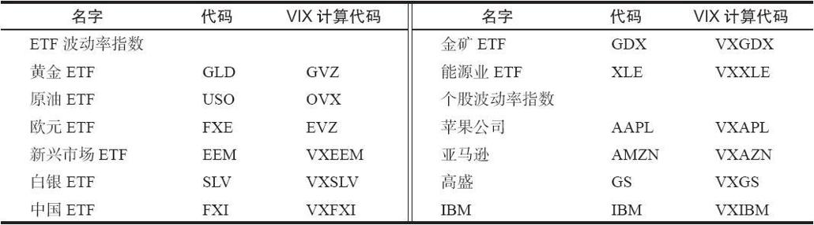
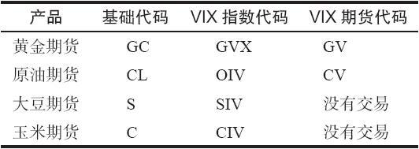
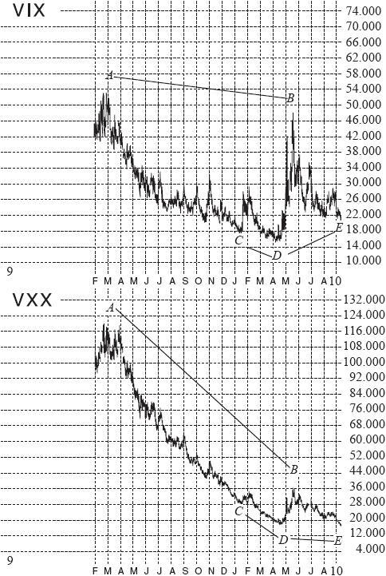

# 41.4　其他上市的波动率产品

在这一节，我们将介绍其他的波动率产品，但还不包括期权。波动率期权将在下一节进行介绍。

人们可以公开获得很多基于波动率的指数和数据，但它们并不是都有相应的产品在交易。例如，标普500指数（SPX）建立于1957年，尽管它在很长的时间内都是市场的主要指数，但在1982年标普期货出现之前，实际上都没有办法来交易标普500指数。VIX建立于1993年，但直到2004年才可以交易它。类似地，还有其他的波动率衡量，其中大部分都是由CBOE发布的，它们可能对交易者用来观察市场非常有用，但此时却没有办法来交易它们。也许在未来会可以交易。

关于波动率的概念扩散得很快，现在很多指数、ETF和股票都有与波动率相关的产品。就像前文所提到的，未来可能每个上市期权的股票都会有看涨期权、看跌期权、波动率期货和期权上市交易。看跌期权在1976年引入之后很快就获得了广泛的认可。对于普通公众来说，波动率期权可能没有像看跌期权那样看上去有用，因此他们的接受过程可能要困难一些，不过波动率期权最终会做到的。

### 41.4.1　其他波动率指数

还有其他波动率指数。与VIX相同的计算过程可以应用于任何具有连续期权序列交易，并且一直有“好的”买报价和卖报价的资产。例如，纳斯达克100（NDX）波动率就是采用了与VIX一样的计算方法，你可以使用代码VXN来找到它。对纳斯达克的另一个计算方法，使用了有些稍微不同的公式，可以使用代码QQV来找到。同样地，罗素2000指数（RUT）的波动率计算结果是RVX，道琼斯30工业指数（DJX）的VIX波动率计算结果是VXD。

与VIX相关的特定统计数据包括VIX买报价（代码：VWB）和VIX卖报价（代码：VWA）。

还记得VIX是一个30天波动率的估计吧。CBOE还公布了一种更长期的，3个月的波动率估计，也使用了与VIX一样的计算方法，它的代码是VXV。

还有一些有意思的策略指数。其中一个是VPD，即升水策略指数（premium strategy index），它跟踪的是每月简单卖出1个月的VIX期货合约并不断挪仓的策略的表现。还有一个类似的策略：VPN，它包括卖出1个月的VIX期货，并买入1个看涨期权。另外还有一个波动率套利指数：VTY。

这些指数中的大部分都只能有时看一看，因为它们还不能交易。

### 41.4.2　股票、期货和ETF的波动率指数

现在大家对VIX越来越感兴趣，并把这种计算方法应用到更多的资产的期权上。例如，GLD是黄金ETF。它的期权的流动性非常好，交易很活跃。因此，就可以把VIX的计算方法应用到这个产品上，并得到一个“GLD VIX”。事实上，CBOE已经开始在很多资产上这样做了，并肯定在未来会有更多的这样的应用。此时，大多数这样的产品都还只是计算指数，目前还没有就这些资产上市期货或期权，因此它们还不能交易。不过，它们很可能在不久的将来就变得可以交易。

从这个角度来看，最初的VIX应该被认为是“SPX VIX”，尽管这个名字现在还没有使用。因为现在这些产品的列表还比较短，表41-5列示了这些产品。

表41-5　现有的VIX计算

在这份完整列表中，目前唯一可以交易的产品是GLD，它在CFE有期货上市交易（基础代码：GV），在CBOE有期权上市交易（代码：GVZ）。截至目前，它们的交易不是太活跃，但可能有一天这个列表和许多更多的标的物会上市波动率期货和期权。

为了保证这个议题的完整性，我们再介绍一下芝加哥商品交易所（CME）——黄金和原油的期货，以及其他东西，都在这个交易所交易。CME也参与到这个波动率交易的活动中来了。他们用黄金期货期权和原油期货期权也建立了与VIX类似的指数。请注意，这些期权与GLD和USO期权有差异，尽管它们的隐含波动率并没有太大的区别（这一点并不奇怪）。它们也不怎么受欢迎。CME还对大豆和玉米建立了与VIX类似的波动率计算，不过这些产品目前还没有上市交易。虽然他们认为这些产品很好，不过实际的产品还没有成功。这些CME的产品的代码见表41-6。

表41-6　CME基于期货期权的波动率计算

### 41.4.3　波动率ETF和ETN

一旦波动率期货变得非常受欢迎后，其他机构就会试图复制这个产品。由于CBOE和CFE有特定的授权协议，因此就不能直接复制相同的产品。也就是说，不能另外成立一家期货交易所来用同样的方法交易波动率期货。不过，有大量的利用VIX期货的交易所交易基金（ETF）和交易所交易票据（ETN）被成立了起来。

第一个，也是最受欢迎和流动性最好的产品是巴克莱银行成立的VXX。它的正式名称是iPath标普500 VIX短期期货交易所交易票据（iPath S&P 500 VIX Short-term Futures Exchange Traded Note）。它成立于2009年1月31日，成为那些不能直接交易期货和期权的机构来交易VIX的一个方式。巴克莱会每天挪仓，以确保它们能与VIX公式保持适当的比率。

还有一个类似的ETN，即iPath标普500 VIX中期期货ETN（iPath S&P 500 VIX Mid-term Futures ETN），交易代码是VXZ。它使用了4~7个月的VIX期货，以建立一个更长期的波动率产品。它没有VXX那么受欢迎，因为（我们前文已经说明了）长期波动率期货不能很好地跟踪VIX的短期变化。即便是这样，它也有较大的流动性。VXX和VXZ都有期权上市，它们的到期日是“常规的”该月的第三个星期五。

截至目前，VXX是最活跃和最受欢迎的波动率ETF和ETN。不过，由于市场中对波动率对冲产品的需求在增加（未来还会继续增加），其他产品也在变得受欢迎。下面的列表简单整理了目前存在的主要产品。需要注意的是，经过成立这些产品的公司的努力，或者独创性地满足投资者的特定需求，目前流动性不好的产品未来有可能会变好。

其他公司也成立了一些直接复制VXX和VXZ的产品。这些产品也使用了VIX期货来建立最终的产品。Velocityshares成立了短期和中期的ETN，分别用VIIX和VIIZ这两个代码在交易。Proshares也有波动率ETF产品在交易，代码为VIXY和VIXM，也分别是短期和中期产品。我发现这就像在做一个字母型花片汤（alphabet soup），不过这些产品都在由那些希望获得波动率保护的交易者在交易。目前VXX的流动性大约是VIXY的40~50倍，是VIIX的200倍。

这些产品的其中一些成立者希望有更多的创造性。有一个叫反向VIX ETN的产品，它是由Velocityshares成立的，交易代码是XIV（刚好把VIX的顺序颠倒过来，意识到了吗？）。当交易者开始理解这个产品的运作原理之后，这个产品开始每天有几百万股的交易量。在下一节，我们将讨论这些合约的一些缺点，以及为什么这个反向产品会有确定的盈利潜力。当然，还有一个中期的反向ETN，代码是ZIV。

Velocityshares还成立了相对VIX有两倍变化速度的ETN：短期产品是TVIX，中期产品是TVIZ。TVIX也变得非常受欢迎，因为交易者们喜欢用这个产品所提供的两倍速度来进行波动率投机。

甚至还有产品设计来反映期限结构的陡峭程度（XVIX）。此外，CBOE建立了一个指数（不是可以交易的实际产品）来反映SPX期权价格的倾斜度，它的发布代码是SKEW。

看见这么多产品，你可能会想把它们都忽略掉。不过，这并不是一个好的选择，因为它们中的一些确实有吸引力。

未来，这些产品间的相对流动性肯定会有变化，但在目前，VXX、XIV（反向）和TVIX（双倍速度）是交易最活跃的产品。

### 41.4.4　ETF和ETN的潜在问题

这些基于ETF的商品一个主要问题是，它们不能必然很好地跟踪标的商品。这主要因为ETF是在被迫交易期货合约，当ETF管理人在从一个期货合约挪仓到另一个时，常常做出一个“亏损的”交易，从而让ETF的表现与相应的现货指数或商品自身的表现之间存在差异。

有许多关于美国原油基金ETF（USO）和美国天然气基金ETF（UNG）的文章，它们比较了相应的实际的原油或天然气价格。这些基金买入实际的商品期货，并在它们到期时不断挪仓。这就产生了一个“问题”，当长期合约比近期合约更贵时，该ETF就需要支付这个差异。

【示例41-6】最近的原油期货即将到期，因此它的价格在到期时会接近现货价格。假设这个价格是75。USO ETF会卖出在这些最近的期货上的头寸，然后以76.50的价格（例如）买入下一个月的期货。

一个月之后，假设现货市场价格没有变化，仍为75。这次即将到期的期货，其成本是76.50，但现在的价格是75。因此这个ETF就在这些合约上有1.50的损失，即使现货一点都没变。

一段时间之后，所有这些以更高的价格进行挪仓的累积效应会拉低这个基金相对于现货市场的表现。此外，由于ETF只有有限的资产，因此这些损失最终从理论上会导致这个ETF损失完现金。

相同的问题有时也会影响这些波动率指数ETN，VXX、VXZ和所有其他的产品（包括XIV，它是反向ETN，其被影响的效果刚好相反）。VXX使用了前两个VIX期货合约，而VXZ使用了第4~7个月的合约。在每一天，这些合约的权重都会发生变化，以反映期货的合适比率。

【示例41-7】考虑VXX ETN。假设9月VIX期货刚到期，因此组成VXX的是买入10月和11月的VIX期货。在还有19个交易日（4周）剩余的时候，10月合约的比率会是95%，11月是5%。下一天就会是90%/10%，再下一天就会是85%/15%，等等。在每一天的收盘时，该ETN的管理者（巴克莱银行）都需要卖出一些10月期货，并买入一些11月期货。

当VIX期货的期限结构变为向上时，11月合约会比10月合约更贵（更不要说做市商知道这些订单的来源，因此在执行订单时会对巴克莱收取特定的额外费用）。

不过，有时期限结构会向下倾斜，此时ETN实际上会从挪仓中挣钱。因为第二个月的价格比第一个月的更低。这种情况常出现在熊市中。

看一下图41-4，它显示了VIX和VXX自2009年1月成立以来至2010年中期的简要图形。即便是在没有进行统计验证的情况下，我们也可以发现，VXX的表现会比VIX自身差很多。考虑一下点A和点B，它们分别代表了VIX在2009年3月和2010年5月的尖峰。在VIX的图上，点B基本上与点A一样高。不过在VXX的图上，点B则比点A低很多。

在这段时间内，VIX期货的期限结构一般都是连续的斜向上的。因此，VXX每天的挪仓都会导致亏钱。这就导致VXX相对于VIX表现更差。

点C、D和E进一步强化了这一点。从点C至D，VXX的表现基本与VIX一致。在这段时间内的期限结构非常水平，因此VXX的拖累就最小。从点D至B，股票市场在下跌，因此VXX实际上还有盈利（比后者更高）。但在夏季时情况变得糟糕，VIX期货的升水变得很大，并且期限结构变得相当陡峭，这两点都会损害VXX的表现。因此在点E，VXX已经创了新低，而VIX则没有。

图41-4是有说服力的：当期限结构向上倾斜时，VXX的管理人会每天都在做亏损的交易，虽然他们每天只需挪仓一小部分头寸。不过当期限结构斜向下时，巴克莱的交易者就能每天从挪仓中赚钱。

在任何情况下，当期限结构斜向下（这只会在熊市，或VIX处于非常高的水平时才会发生），VXX的表现就会更好；而当期限结构斜向上（这在牛市中很常见）时，VXX的表现就会更差。此外，当SPX看跌期权有大量的买家以寻求保护的时候，期限结构会更加陡峭地向上倾斜，这会让VXX有更大的拖累。

我不认为有人会真正买入并持有VXX，不过VXX确实是个有用的工具，尽管它在牛市中的表现会差于VIX。请注意，VXX在熊市中会有更好的表现，因此这就是你应该买入VXX的好时候。与此同时，由于VXX在牛市期间的表现会更差，因此你可以在这时卖出VXX。事实上，由于存在反向ETN（XIV），与其直接卖出VXX，你只需在这些时候买入XIV即可。这个反向XIV会在向上的期限结构出现时占据优势。第一次引入XIV的时间是2010年12月，你可以比较一下从那时起的VIX和VXX的相对表现。

图41-4　VIX和VXX，2009年成立至2010年中期

投资者可以根据VIX期货的期限结构来做出决策（当期货相对VIX有贴水时买入VXX，当期货有升水时买入XIV）。因此，与直接否定商品ETF（这是其中之一）不同，存在一些很好的使用VXX的方法。不过如果你只是想投机波动率，那VIX期货看上去会比VXX更好。
