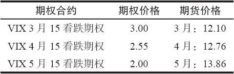
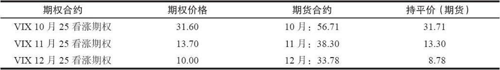
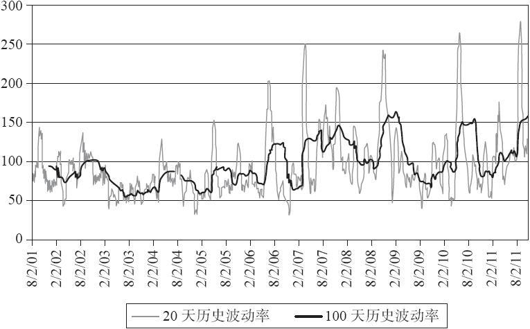
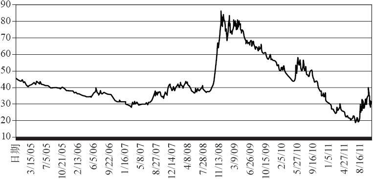
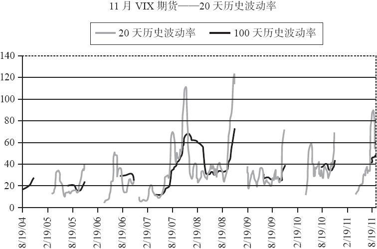
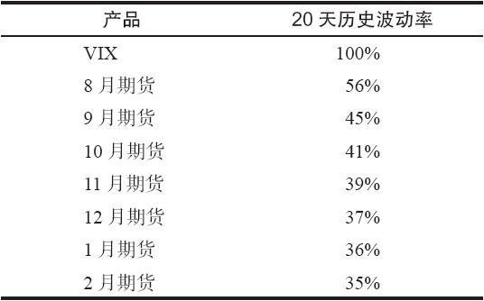

# 41.5　已上市的VIX期权

VIX期货在2004年3月首次上市。方差期货则在随后的5月上市。但两年之后VIX期权才上市。它们最初计划在2005年4月上市，但由于当时没有一个可行的让做市商对冲其头寸的方法，所以日程表被更改了。经过一些具有创造性的工作，VIX期权在2006年2月24日开始交易。这些期权后来被证明是非常受欢迎的，尽管它们的一些特征与以前交易的期权有些不同。

我们在前文提到过，一些ETN，比如VXX，也有期权上市。这些期权属于“常规的”类型，在到期月的第三个星期五到期，并在被行权或指派时交割VXX份额。

但VIX期权是基于现金的期权，在到期日以现金进行交割，就像OEX或SPX期权那样。在交割VIX期权时，前文已经说过，是以VIX期货早上的结算价来进行的。

【示例41-8】某个投资者持有VIX 7月25看跌期权。他没有在公开市场中卖出这个合约，而是持有至到期。确定的交割价（VRO）为20.84。那这个7月25看跌期权就有4.16点实值（25减去20.84）。在到期之后，该投资者的账户中可以获得416美元。而该看跌期权合约则会从他的账户中移出。

不过VIX期权的几乎所有其他方面都与其他上市的个股或指数期权不同，不管它们是不是以现金为基础的。

首先，它们与VIX期货有相同的到期日——比下一个上市的SPX期权的到期日早30天。这一天经常是星期三，并且常常是第三个星期五之前的那个星期三，但有时会是第三个星期五之后的那个星期三。

不过关于VIX期权需要知道的最重要的事是，它们的价格是基于VIX期货的，而不是VIX本身。或者你可以这样来想这个问题：VIX期权是基于多条SPX期权的隐含波动率来定价的（当然，这就是VIX期货所表示的）。不过当你仔细看的时候，会发现隐含波动率（以及期货价格）或在不同月份之间大幅变化。如果有人在讨论IBM股票，比如10月的IBM和12月的IBM，它们都是一个东西，都是IBM的价格。对于诸如SPX指数来说也是如此。不过对于这些标的指数的期权的隐含波动率来说，就不是一回事。

【示例41-9】在2006年2月24日，也就是VIX期权上市交易的第一天，VIX的价格为11.46。行权价为15的VIX看跌期权有下列的价格存在：

VIX指数：11.46

3月15看跌期权：3.00

4月15看跌期权：2.55

5月15看跌期权：2.00

首先，这看上去有点奇怪，难道不是吗？更长期的看跌期权的价格居然比更短期的低？不过每个期权交易者都会把期权价格与持平价相关。首先，对于一个正常的/美式的期权，实值看跌期权的持平价等于行权价减去标的物价格。

如果我们（错误地）假设VIX就是这个标的物，那我们会计算出：

持平价=15-11.46=3.54

看上去这些看跌期权都是在持平价的下面交易。这个5月15看跌期权，价格为2.00，看上去比其持平价低了接近1.5点。

这种情况怎么可能发生？这个问题的答案与这个事实有关，为了在到期日之前对期权进行定价，这些VIX期权的标的物不是VIX自身（至少在它们到期之前不是），而是VIX期货。那么考虑一下进一步的信息，见表41-7：

表41-7　VIX期权和期货的价格

考虑一个众所周知的XYZ期权有下面的一般信息：

XYZ：13.86

XYZ 5月15看跌期权：2.00

你可能没有发现这里有什么不寻常的地方。XYZ股票价格低于15的行权价，因此它是1.14点实值的（15减去13.86）。该看跌期权的价格为2.00，在它的内在价格之上。

用表41-7中的数据来替代这个5月15看跌期权：

5月VIX期货：13.86

5月15看跌期权：2.00

如果你认为标的资产是期货合约而不是VIX自身，那现在表41-7中的期权价格就有用了。事实上，VIX可能与它的期货价格有显著的差异，正如我们在以前的示例中可以看到的。在交割流程开始之前，VIX都不会与近期期货价格靠拢。因此，在一个VIX期权的几乎全部存续期里，VIX自身的价格都是一个无关的信息！确实是这样，在知道近期期货和VIX最终会靠拢的情况下，我们也许可以采用一些策略来赚钱。但就对期权进行定价的目的来说，VIX的信息是不必要的。VIX期权是根据期货合约的价格来定价的。

为了强化这一点，考虑在2008年金融危机中的某一天的VIX期权价格。这一天是2008年10月10日，与我们先前在表41-4中所讨论的期货示例是同一天。在这一天，有下列的信息：

VIX：69.96

10月25看涨期权：31.70

11月25看涨期权：13.70

12月25看涨期权：10.00

现在，如果某人不了解VIX期货和期权的定价结构，他可能会认为上面列出的信息有误。怎么可能一个11月的看涨期权的价格比相同行权价的10月的看涨期权价格还低？同样的问题在12月看涨期权中也存在。此外，当VIX接近70，而这些看涨期权的行权价都是25时，看上去持平价应该是45。为什么所有这些看涨期权的价格都低于持平价呢？肯定有哪里出什么问题了。

不过确实没有问题。记住，在VIX期权的定价中，VIX的价格是一个无关的信息。相反地，我们应该考虑的是10月、11月和12月期货合约的价格。表41-8组合了上面的期权价格，以及表41-4中的期货价格。

表41-8　VIX期权和期货的价格，2008年10月10日

第4列显示了该看涨期权相对于期货合约的持平价（内在价值）。也就是说，该价格等于期货合约的价格减去25的行权价。从这个角度来看，这些期权的价格看上去就比较正常。10月和11月25看涨期权的价格接近持平价，因为它们已经深度实值了。而12月25看涨期权（也是实值的）则还有一些时间价值，因为它有更长的存续期。再说一次，VIX的价格与期权的价格没有关系。

在这部分讨论中需要重点理解的是，单个VIX期货的价格是不同的，并且它们之间的关系并不是一直保持不变。熟悉其他期货合约的交易者应该知道，例如12月的小麦和7月小麦并不是一回事。是的，它们在某种程度上是相关的，但它们的价格之间的差会在不同的时候扩大或缩小。这一点对于VIX期货也是成立的。

### 41.5.1　VIX期权跨期价差

使用相同的概念，让我们来看一看一个特别温和的策略——看涨期权跨期价差，看是否会有一些不同的结果。下面的示例基本上复制了在2008年秋季中所实际发生的情况，这让客户和他们的经纪公司非常苦恼。

日期：2008年9月8日

VIX：22.64

10月25看涨期权：1.75

11月25看涨期权：2.15

当时（当然，现在也基本上是这样）大多数期权经纪系统并没有正确的计算VIX期权的希腊字母和隐含波动率，因为它们没有“足够聪明地”把期货价格作为标的物。相反，它们使用的是VIX，我们现在知道这是错误的。这就产生了一个问题。把VIX作为（不正确的）标的物，会让这两个期权的隐含波动率看上去有问题，因为这样计算出的10月25看涨期权的隐含波动率比11月25看涨期权还高。因此，交易者可能会想着进行看涨期权跨期价差的交易。

VIX跨期价差：

买入11月25看涨期权，卖出10月25看涨期权，价格为0.40

如果这是IBM股票或是个指数，或其他不是期货期权的任何东西，那你就知道，一个“常规的”跨期价差的风险就是最初的支出（这个例子中是0.40），并能够获得有限的盈利，盈利的大小取决于近期（10月）到期日时的标的物价格，以及那时长期（11月）看涨期权的隐含波动率。不过对于IBM来说，就没有“10月IBM”和“11月IBM”，IBM就是IBM。

不过这不是IBM期权，实际发生的情况却是个灾难。你已经在先前的表格中看见了这些价格：

日期：2008年10月10日

10月25看涨期权：31.60

11月25看涨期权：13.70

这个VIX看涨期权跨期价差目前的价格是-17.90点。因此，为了平掉这个价差，还需要额外花费1790美元！你需要在卖出你的11月25看涨期权多头的基础上，再额外花费17.90才能买回10月25看涨期权。由于你在建立这个价差时已经支出了40美元，因此你的总损失是1830美元，再加上手续费。

用这个策略的交易者会损失很多钱，他们的经纪公司在很多情况下也会。因为这些经纪公司对这些头寸没有收取合适的保证金，而是把它认为是一个“常规的”跨期价差。现在许多有经验的经纪公司会对VIX跨期价差或对角价差中的任何期权空头收取裸保证金，只有垂直价差才会按照正常的保证金标准。

### 41.5.2　波动率的波动率

在进入更复杂的VIX期权的定价之前，有必要来看一看这个标的指数VIX和它的期货的波动性会是怎样的。理解波动率的波动率，可以帮助我们对VIX期权进行定价。因为在给期权定价的过程中需要用到对波动率的估计。同样地，了解了VIX和它的衍生品的波动性之后，可以帮助我们理解它们作为一种对冲或投机工具，在高波动率的时期会有多有效。

图41-5显示了过去10年VIX的历史波动率。这个时间周期涵盖了牛市和熊市。此外，VIX的实际价格在这段时间里变化很大。它在2002年的熊市中上升至60附近，然后在2006年下降至10，又在2008年爆发至接近90，然后又在2011年返回至十几的位置，后来又再一次跃升至50。

在数据中，VIX的价格有很大的方差。然而，有一点是成立的：不管是牛市还是熊市，VIX在高位还是在低位，VIX的历史波动率都惊人的维持不变，平均维持在90%附近。

图中黑色的，没有那么波动的线是100天的历史波动率，它的变化范围在60%~150%之间。灰色的线是20天历史波动率，这也是交易者用来估计波动率常用的时间段，它的波动范围是40%~270%。

图中的几个最高的顶峰都发生在VIX极端高的时候（因此也是主要的市场底部）：2001年9月、2002年7月、2005年5月、2006年6月、2007年2月、2007年11月、2008年11月、2010年5月和2011年8月。有意思的一个现象是，当VIX期权开始上市交易之后，VIX变得更加波动。现在还不确定这是否是个巧合。

在图41-5所涵盖的数据中的100天历史波动率的中位数是90%。我认为没有哪个股票的100天历史波动率会有90%这么高，不管是在什么时间周期或长度里。

图41-5　VIX的历史波动率

不过人们不能交易VIX，我们只能交易VIX的衍生品。VIX期货没有VIX自身那么波动，但在股票市场的灾难阶段，期货也会出现很大的波动。图41-6显示了连续VIX期货的长期图。你可能知道，连续期货合约图是通过把所有当月期货合约图“拼接”起来，不过需要剔除不同合约之间的跳空。它用来显示某个期货交易者连续的持有当月期货，并不断地在其到期前（或在第一通知日，如果是实物期货合约的话）挪仓的过程。请注意，这有点类似于巴克莱的VXX，只是VXX是两个当月期货的加权组合，而连续图只包括了当月合约。不过两者都有一个长期的下降趋势，这是由于需要或多或少持续地支付期货的升水。这部分升水会在到期时损失掉。只有在熊市的时候，这个连续图或VXX才会有额外的收益，因为此时期货相对VIX会有贴水。

图41-6　VIX连续期货图

回到实际波动率的主题，考虑一个期货合约。图41-7显示了11月期货的20天和100天历史波动率，数据开始于它们产生时的2006年。这个11月是个合适的合约，因为它经常被用来在9月和10月（这是股市中的典型的“坏”月份）提供保护。你会发现这个合约经常出现波动率爆发，并且这个合约是可以交易的。在2007年和2008年，当股市下跌时，11月合约的实际波动率上升至100%以上（从40%的低点）。

图41-7　VIX期货的历史波动率

### 41.5.3　VIX期权的倾斜

当投资者观察在交易的全部VIX期权时，他是在观察7个或8个到期日的期权。这些期权的价格都基于在那个月到期的标的期货合约。每个后续的更长期的月份的期权会比前面的波动更小。表41-9显示了VIX期货波动率（使用20天的历史波动率）的典型序列。这个数据取自2010年7月22日，但它显示了一般情况下波动率之间的关系。当月的波动率比下个月的大一些，而第二个月的又比第三个月的大一些，以此类推。

引用图41-2关于隐含波动率期限结构的一般图形，可以再强化一下这个概念。假想在图形中每个月份的两条曲线间有一条垂直线，以表示该月份波动率的可能范围。该垂直线会在当月中最长，而在第二个月中第二长，等等。这就是表41-9所要表示的：每个期货月份的波动率的范围。

巧合的是，在2010年7月，波动率从5月和6月（“闪电崩盘”）的尖峰开始下降，可能期货预期这个下降会持续（后来确实是这样）。因此此时VIX的历史波动率和期货的历史波动率之间就比正常情况下的差异更不一致。在任何情况下，VIX一般都比其期货更波动。

表41-9　VIX期货的20天历史波动率（HV），2010年7月22日

表41-9中的数据是用来说明VIX期权的定价，因为它显示了VIX 8月期权会比1个月之后的期权有更高的隐含波动率。另外，9月VIX期权会比任何随后月份的期权有更高的隐含波动率，诸如此类。这意味着在VIX期权中存在一种水平倾斜。近期期权的隐含波动率常比远期期权高。

与单只股票不同，这并不必然代表着一个波动率的交易机会。在单只股票的情况下，如果近期期权相对于远期期权更昂贵，那就可能可以采用跨期价差的策略（不过，有可能出现这样的倾斜是有正当理由的，例如马上就会有一个盈余公告）。不过对于VIX期权，出现这样的倾斜是正常的，因为8月期权和10月期权之间的价差交易，涉及两个不同的标的物，而不只是一个（股票期权就是这样），而近期的标的物会比远期的更波动。

在VIX期权中除了水平倾斜之外，还有垂直倾斜（vertical skew）。有大量的方法来验证为什么会有这样的倾斜存在。其中一个就是因为VIX的下行空间是有限的，而在上行方向可以爆发得非常剧烈。因此较低行权价的期权应该比较高行权价的期权有更低的隐含波动率。

考察这一问题的另一个方法与SPX期权相关。我们在前面的章节中证明了，指数期权在定价中有一个向下的倾斜，这个倾斜自从1987年股灾之后就一直存在。与平值或者虚值看涨期权相比，SPX的虚值看跌期权在隐含波动率方面非常昂贵。因此，较低行权价期权的隐含波动率应该比较高行权价的更高。VIX是SPX的反向（当一个上升时，另一个会下降），因此VIX期权就应该镜像复制SPX期权的特征。因此，对于VIX来说，较高行权价的期权的隐含波动率应该比较低行权价的更高。

这两种讨论都有效地解释了为什么会有倾斜。
