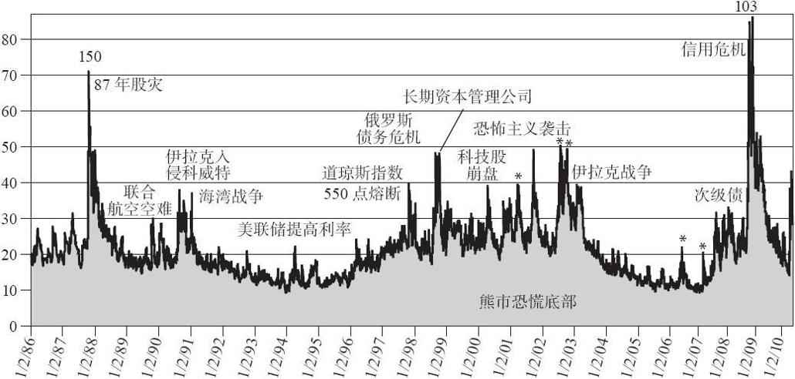
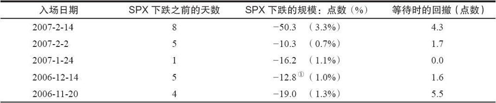
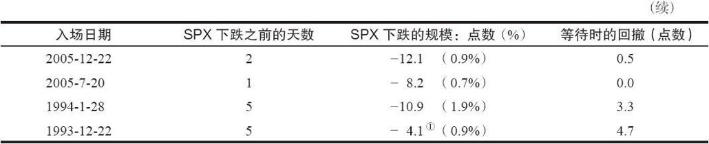

# 41.6　交易策略：方向性信号

现在我们已经了解了相关的定义，并且读者已经熟悉场内波动率期货和期权的交易机制，现在我们可以讨论一些策略了。我们一开始先看一看怎么用VIX及其衍生品的数据来帮助预测市场。

让我们先在图41-8中看一下VXO（“最初的”VIX）的长期图表。我们用这个数据，是因为当CBOE在1993年第一次引进VIX的时候，他们把数据回溯到了1986年，因此在理论上包括了1987年的股灾。你可能还记得，在2003年新的VIX引入之后，这个“最初的”VIX的代码改成了VXO。因此VXO就有最长（理论上）的历史数据。

在这张图上，有大量的关于波动率的普通观察点，以及它们在特定市场阶段时的表现。第一也是最重要的事实是，波动率的尖峰总是与市场危机同时出现，并且是市场底部的最终指标。

VXO在尖峰时的实际水平并不是特别重要，尽管它度量了伴随尖峰而出现的危机的程度。例如，1994年美联储突然提高利率导致的尖峰就刚好是众多“买入”信号中的一个，尽管当时VXO只是上升到了20。

大多数信号的出现，都是因为一些特定事件——战争、金融危机、恐怖袭击等。不过，有一些尖峰则仅仅是因为市场下跌而引起的恐慌情绪，从而快速地推高了VIX和VXO。最高的两个尖峰出现于1987年的股灾和2008年的金融危机。请记住，1993年之间的所有数据都是理论（倒推的）数据，因此它只是对VIX的一种估计。即如果当时有VIX，那么在1987年它会爆发至150。另一方面，我们知道，在2008年时，VXO达到了103。

图41-8　VXO的历史

我们先前讨论过，当VIX或VXO出现尖峰时，常常伴随着出现股票市场的坚实底部。当股票市场快速下跌时，这样的尖峰就会快速地出现。接下来，当VIX达到尖峰并很快反向下跌时，通常股市是在中期的底部附近。

之所以会出现这种现象是因为，在市场下跌时，交易者会恐慌地持有SPX看跌期权。就像你可以预期到的，在股市的暴跌过程中，这些看跌期权会变得非常昂贵。这就像你在房子已经着火的时候才买火险，那当然会非常昂贵。

从这个角度来看，VIX的尖峰是一个反向指标。当“最后的”交易者为“最后的”看跌期权支付了高价之后，然后所有玩家都已经放弃，接着股市就会反转上涨。

图41-8还显示了其他重要的数据。例如，VIX和VXO很少跌到10以下，因此我们可以认为这个水平是一种底部。在下一节，我们将对VIX在10时的含义做进一步的讨论。不过在这里，只要知道VIX不会在10附近形成深谷并很快反弹就已经足够。相反，在图中，VIX会在10附近的底部停留很长时间。这最终会导致一个更高水平的波动率。

从这个角度来看，许多分析师认为VIX是“均值回复的”。这意味着，VIX不会一直向上或向下，就像股市或某只股票一样。相反，它会维持在诸如10~50的正常区域内，并在达到某个极端值后，最终返回这个区域的中点。

一般而言，统计数据显示，在75%或80%的时间里，VIX的运动方向与市场方向相反。这是基于日频数据的。在以更长期的数据进行统计时，两者的运动方向会以更高的水平负相关。简而言之，当市场下跌时，VIX会上升，反之则反是。在这个图上有很明显的证据，这也是为什么买入波动率能对某个投资组合提供很好的保护。

### 波动率的趋势

波动率的趋势也很重要。VIX倾向于在牛市中不断走低，而在熊市中不断冲高。虽然图41-8并没有显示股票市场，只显示了VXO，但其中也可以发现一些较大的趋势。例如，2003~2007年的牛市就伴随着VIX越来越低的趋势，直到它最终达到10。回过头来看，现在知道是因为美联储在管控利率，以给持有金融工具和房地产提供一个“完美的”环境（以及一个副产品，压缩波动率）。不过，这一切在2007~2008的金融危机中都土崩瓦解。

另一个有趣的趋势是1995~2000年期间的波动率上升趋势，这次是伴随着一个牛市。VIX在市场上涨的时候上升的情形很少见，不过这是一个非常波动的牛市。还记得波动率是日频价格变化的标准差吧？如果牛市中出现波动率上升，那就需要大量的反弹、波动和拉锯运动，不过总的趋势是向上的。

VIX的趋势还可以用来作为一个短期的确认指标。例如，如果市场在下跌，但是VIX没有上升，那么你就可以认为市场的下跌是暂时性的。不过，如果市场在下跌，并且VIX在上升，那就是一个看空的组合，应该认为熊市会继续。

相反的分析也适用于上涨的市场。如果市场在上涨，并且VIX在下降，那就是一个牛市的确认。不过，如果市场在上涨，而VIX也在上升，那这个上涨趋势就是值得怀疑的。

用VIX来度量保护的成本。这里是一个对VIX进行一般性描述的好地方：VIX是一个对保险成本的度量。当然，VIX的含义不仅仅是这些，不过这确实是个有用的描述。这可以帮助许多新手理解VIX如何以及为什么会有时上升而有时维持不变。因此，当市场暴跌，而交易者疯狂地买入SPX看跌期权时，保护的成本就会很高，VIX也是一样。

我们先前已经指出，并不是所有的股市低点都会出现VIX的尖峰。确实在有的时候，当股市下跌时，VIX并没有急剧上升。导致这一点的原因有很多，不过它们基本上都是基于一个相同的事实：看交易者是否觉得有必要在这种情形下买入保护，或者保护的供给是否充足。

还记得我们先前提过的，在2007~2009年的熊市的底部，当时SPX下降至2009年3月的低点，而VIX并没有快速上升。有经验的交易者知道，大多数人都已经在这个熊市的后期获得了保护，因此就没有多少保护的需求。此时VIX相对较高，差不多在50，不过并没有出现尖峰。

一般而言，当你看见市场在下跌，而VIX并没有上升时，那你就可以假设保护会比较便宜。有时这种便宜是因为那些预见到市场会下跌而提前买入保护的交易者在卖出保护以实现盈利。保护供给的增加会让成本下降，即使此时股市在下跌。如果没有人愿意买入保护，也会出现同样的效果。需求的缺乏或者供给的充足都会导致保护成本的下降，并让VIX维持在相对低点或不变。

仅仅因为保护很便宜，并不意味着这些不愿意保护的人就很聪明。事实上，在2011年8月，反向的做法才是正确的。当时VIX非常便宜，而市场首次开始下跌。即使SPX已经下跌了100点，VIX仍在20多的低位。不过，很短的时间里，SPX就开始暴跌，而VIX则暴涨，在几天里翻了一倍。不过在那时，对于保护的需求就飞涨了。

隐含波动率的快速上升与标的物的低点同时出现，这个概念对于个股、期货和ETF等也同样适用。目前这些资产还没有类似VIX的产品，不过这不是个问题。你只需要看一看这些资产的期权的复合隐含波动率图，就可以发现波动率的尖峰。

VIX的极端低点。如果说VIX的尖峰是股市的买入信号，那么极端低点是卖出信号吗？它可能是，不过有时最好从更广的范围内看这个低波动率意味着什么。如果交易者们不愿意为期权付高价，那就代表着市场共识认为标的物不会再波动了——它的价格不会再怎么变了。从一个反向观点的角度来看这个问题，如果“每个人”都认为标的物会保持稳定，那它的反面就很可能是对的，即标的物价格会爆发。这个爆发既可能是向上，也可能是向下。因此，从一般的认识来看，极端低的波动率是一个买入波动率的信号。如果该产品并不能直接交易波动率的话，那可能是以买入跨式价差的形式。

至少，当VIX很低的时候，你可以考虑买入VIX看涨期权或SPX看跌期权，来为一个股票组合提供保护。如果市场向上爆发，你的组合会盈利。相反，如果市场暴跌，这个便宜的保护会很好地发挥作用。

不过，需要指出的是，波动率可能会长时间维持低位。与此相反的是，当波动率达到极端高的时候，它会很快向下。换句话说，VIX会停留在底部，而在顶部形成尖峰。由于股市的运动与VIX相反，这也就是说，SPX会停留在顶部，而在底部形成深谷，有经验的交易者都知道这个事实。

我们已经说过，极端低的VIX通常先于一个快速的市场下跌。“新的”VIX的回溯数据始于1993年，而“老的”VIX，也就是现在的VXO，回溯至1986年。在这两个波动率指数的完整历史中，VIX只有少数几次低于10，当它出现时，随后常常会有一个快速的市场下跌。

在它们的历史上，VIX和VXO只在9个不同的“时期”内低于10（一个“时期”可能有多个交易日VIX或VXO低于10，不过都把它们算在一起。），近年来，大多数时间里VXO都比VIX低。因此VXO会先低于10。事实上，VIX并不是每次都会跟随。例如，在2007年2月1日，VXO的收盘价低于10，而VIX则没有低于10，VIX的低点（10.08）出现于2月2日。在此之后，VIX[1]在10之上晃悠了一个星期，然后才最终跌到10以下。

VXO低于10而VIX没有的情形还发生过两次。因此当VXO低于10，而VIX低于10.30时，你就可以说这两个指数“太低了”。把这个作为一个入场标准。表41-10显示了SPX运动的结果。第一列“入场时间”是这个“太低了”的标准首次出现的日期。第二列显示了多少个交易日之后SPX才开始暴跌。SPX的跌幅显示在第三列，是同时用SPX的点数和跌幅来显示的。最后，第四也是最后的一列显示了投资者需要承担的回撤，也就是在第二列中定义的等待期中SPX的上涨点数。

表41-10　“低”VIX出现之后的市场下跌

①总共有2天的下跌

总体上，这是个不错的系统，可以发现什么时候SPX会在1~2天内出现急剧的（差不多1%）下跌。在这样的低波动率市场中，这种跌幅是很可观的。这种下跌一般会在一周内出现，有时甚至就在下一天。此外，投资者等待时的回撤也是很小的。

最差的信号是第一个，发生于1993年。（可能那个时候的交易者还没有意识到VXO低于10究竟代表了什么。当时VIX还是个新东西，就在该年的早期才引进。）相对于SPX最终的跌幅，1993年的回撤是较大的。

因此，要求VXO低于10，并且VIX低于10.30看上去是个不错的入场标准。不过如果你把这视为一种交易系统，那就需要设置一个退出点。在表41-10中显示的大多数情形中，大多数下跌都出现在1~2天内，这可以从第三列中看到。以你要么可以从SPX第一次大的下跌中获利，要么为拟建立的任何空头头寸至少设置一个紧的跟踪止损。1994年1月的信号是个主要的例外，它是一个更严重的下跌的前兆。美联储在1994年2月1日上调了利率，并敲打了股市很长时间。许多小盘指数和个股都在那年大幅下跌。事实上，大多数小盘股投资者都把1994年视为一个熊市年份，即便当时SPX和OEX并没有下跌。因此，有时把1994年称为秘密的熊市（stealth bear market）。

总之，很少看见VIX会为10或低于10，不过当它真的发生的时候，就值得特别留意。

[1] 原文为SPX，疑有误。——译者注
