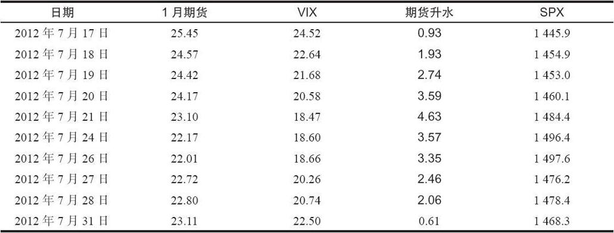
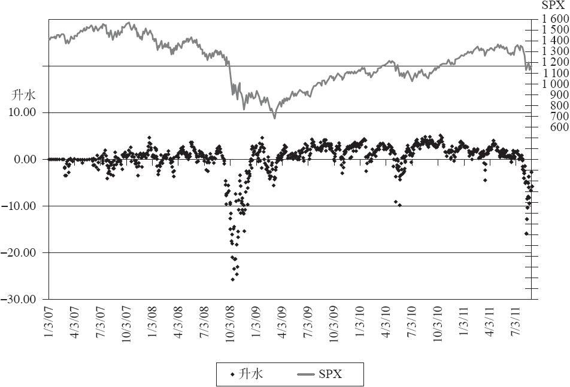

# 41.7　使用VIX期货的信息

VIX期货可以帮助投资者决定策略，有时还可以确定市场方向。VIX期货与VIX的关系，以及它们自己之间的关系——期限结构（term structure）可以提供这些洞察力。

### VIX期货的极端升水或贴水

对于波动率的交易者和观察家来说，近月VIX期货合约与VIX之间的关系非常重要。当VIX衍生品在2004年第一次开始交易时，VIX的价格很低，波动率在这个持续的牛市中处于休眠状态。事实上，VIX在2007年早期之前都主要在10~16之间交易，除了2006年夏季有一个短暂的例外。在这段时间里，VIX期货都有相对大的升水，这并不是因为投资者认为波动率会增加，而是因为他们认为波动率不会更低了，因此它更可能会上升。在任何情况下，这段时间的数据都不能用来确定VIX期货的升水是否有任何预测价值或策略价值。

不过，当VIX变得更高的时候，并且近月期货也有较大的升水，那就常常是“聪明的钱”预期波动率会快速上升的一个标志。波动率的快速上升通常意味着股市的快速下跌。不过，就像我们将显示的，这个现象在熊市中更有效，而在牛市中则没有那么有效。第一次出现这种现象的时间是2007年年底。

【示例41-10】在2007年，股市在这些年里第一次出现了蹒跚。SPX在7月下跌了180点，却等到2007年10月中期才创新高。然后就是再一次的下跌，SPX在2007年感恩节下跌了170点。在那个点位上，又出现了一波反弹，直到圣诞节。SPX在这两个节日期间反弹了110点，而道琼斯30工业指数则反弹了1000点。

表41-11显示了2007年年底VIX、1月VIX期货和SPX的价格，以及期货的权利金。

表41-11　1月VIX期货和VIX，2007年12月

首先，请注意SPX1445~1497的反弹，时间是12月17日至12月26日。再请注意这段时间里伴随着的VIX下降，24.52~18.66。这是个典型的现象：VIX在股市反弹时下降。

不过，现在请看一看1月VIX期货的价格。它们在这段时间里下跌了一点，但没有VIX下跌的那么多。1月VIX期货价格和VIX之间的差异就是“期货升水”。在这张表中的所有情形中，1月期货都在以升水价交易。当升水小于1.00时，这可能不算什么。但当升水有4.63，就像12月21日收盘时那样，或者在12月20~26日维持在3.00之上，就值得关注了。

实际上，VIX期货是在“说”，VIX会继续维持高位，即VIX会上升以便追赶期货价格。当VIX上升时，市场会下跌。事实上，这是一个主要的卖出信号，结果SPX在不到1个月的时间里下跌了230点。

即便是在现在，也很少看到近月VIX期货的升水会高于4.00。

根据我们先前对VIX计算方法以及VIX期货的构成的介绍，我们现在知道有一个很大的不一致现象存在。在上面的示例中，在12月末，VIX是由两条SPX期权来组成的，这两条期权分别会在2008年1月和2月到期。这两条期权的权重会每天变化，但在12月末，它们的权重基本上是相等的。然而，1月VIX期货价格则只基于1条期权——2008年2月的SPX期权。因此，实际上发生的情况是，交易者在打压1月期权价格，从而拉低VIX，但并没有打压2月期权价格。当然，也有可能相反：交易者在买入SPX的2月保护，而没有买入1月保护。不管是哪种情况，从这些SPX期权的活动中都可以推导出这样的事实，就是职业投资者和散户很希望年底的结果会是正的，并且它会保持至2008年。因此，这个较大的VIX期货升水就是某种反向指标。

就像它所显示的，真实的情况是交易者在新的一年开始的时候就开始尽快地卖出，并且法国兴业银行的一个“流氓交易员”事件导致该银行不得不把大量的多头头寸平仓，这进一步加剧了市场的卖出，从而导致了2008年1月中期的严重市场下跌。

还有其他的例子来说明，在升水很高的时候，近期期货的升水会是个很好的卖出指标。例如，在2008年5月，VIX期货上又出现了类似的大升水，很快SPX就在2个月内下跌了240点。

在2009年3月之后出现的大牛市期间，这个技术的有效性被极大地降低了。该牛市在2009年的夏末继续延续，交易者们开始以相对昂贵的价格大量买入SPX期权，这推高了VIX期货的价格。这不仅包括近期VIX期货，还包括远期期货。不过没有出现严重的市场下跌，这让波动率分析师开始找答案来解释这种现象。一种理论认为，在2007年和2008年早期，VIX衍生品是一个相对较新的产品，因此主要是那些“聪明的钱”，即职业交易者在使用。而在2009年中期，这种保护的效果在随后出现的熊市之后已经广为人知，因此在2009年的牛市中，公众和不聪明的共同基金和对冲基金管理人现在也开始买入保护。他们期望在2009年秋季会出现某种程度的市场调整，不过这一直没有实现。

不过与其为不同的投资者贴上“聪明的”（或“笨的”）标签，不如从另外一个方面来解释这个现象。还记得吧，图41-2中显示了期限结构的一般形状。在牛市中，波动率会比较低，并且期限结构会像图41-2中较低的线那样。也就是说，此时期货相对于VIX有升水是正常的。在熊市中，波动率会比较高，并且期限结构会像该图中较高的线那样。也就是说，期限结构会向下倾斜，并且期货相对于VIX会有贴水。

因此，在始于2009年的牛市中，期货有并且一直维持升水是正常的。因此，较大的升水并不是卖出信号，而仅仅是反映了牛市正在持续中。不过在2007~2009年的熊市中，升水就很少见，如果它们出现了，那就是卖出信号。在接下来的熊市中（以及接下来可能会出现的其他熊市中），如果近月期货出现了大的升水，那就可被视为卖出信号。不过在持续的牛市中，近月期货的大升水并不是什么特别的信号。

VIX期货的极端贴水经常是买入主板市场的信号。也就是说，交易者们恐慌地买入短期SPX保护，促使VIX的价格上升。而反映在近期VIX期货价格中的下一个月的SPX期权的隐含波动率却没有那么受欢迎。因此期货低于VIX价格。当贴水先扩大到很大的水平，然后又开始快速缩小的时候，这经常是股市马上就要上涨的信号。这也是一个反向指标。当“每个人”都恐慌着买入近期SPX看跌期权的时候，市场接下来就会上涨。

在2008年10月的金融危机期间，近月期货的贴水达到了惊人的25点。在2010年5月的“闪电崩盘”期间，贴水达到了10点。而在2011年8月暴跌期间，贴水达到了16点。在这些情况发生之后，市场就上涨了。

图41-9是混合的近月期货的日频升水散点图与SPX线图的组合。请注意，当市场处于低位时，期货有很深的贴水。而在最初的两年，大的升水出现之后市场就开始大幅下跌。

图41-9　SPX与混合的近月VIX期货升水

不过，投资者在确定近期贴水或升水之前，应该做一些调整。投资者不能简单地用当月的VIX期货合约减去VIX，因为在VIX临近到期的时候，这样做会产生一种有偏的统计。

你可能已经注意到这张图标题中“混合的”（blended）一词。有必要用两个近期合约的价格来产生一个“混合的”期货价格，用这两个近期期货的加权来得到升水。这样做的好处是，在实际近月合约到期的时候，混合的期货价格就不会有大幅的跳空。这个“混合的”期货价格的计算方法在前面已经有过介绍。在到期日的前20个交易日之中，权重每天减少5%；或在到期日的前25个交易日中，权重每天减少4%。如果这段期间内有假期，则用混合因子来调整这些假期（24个交易日，或19个交易日等，这种情况在1月经常发生。因为在1月，两个VIX到期日之前常常有3个假期）。

【示例41-11】在7月VIX到期日之后的第一天，有下列的价格存在：

8月VIX期货：28.00

9月VIX期货：30.75

加权因子：95%/5%

加权的（混合的）期货价格=0.95×28.00+0.05×30.75=28.14

假设此时VIX为24.38，那么混合的期货升水就是：

28.14-24.38=3.76
