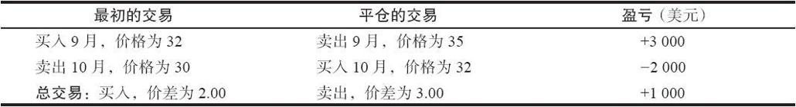
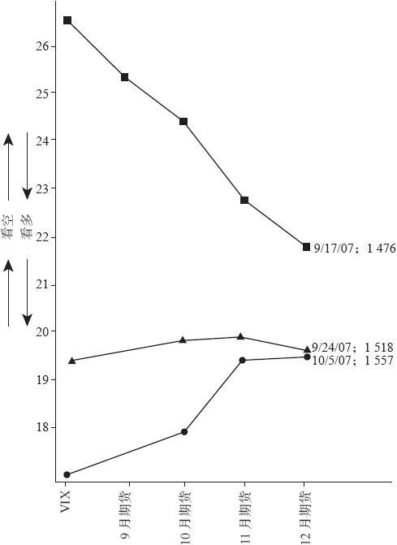
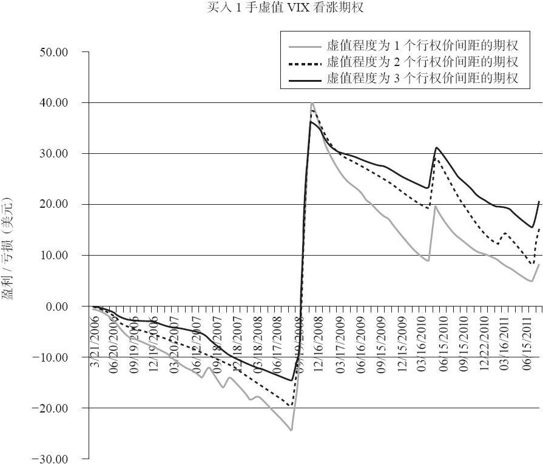

# 41.8　利用和交易期限结构

正如我们先前提到的，期限结构在牛市中会向上倾斜。所有期货相对VIX都会有升水，并且每个期货的价格都比前一个更高。在期货市场的术语中，这种向上倾斜的期限结构也被称为正向市场（forwardation），它的意思与期货升水（contango）一致。

在熊市中，期限结构会向下倾斜。VIX期货相对VIX有贴水，并且每个后续的期货合约的价格都比前一个更低。在期货市场中，这又被称为反向市场（backwardation）。

由于大多数个股期权交易者和波动率交易者都并不一定是有经验的期货交易者，在这部分内容中，我们会用向上倾斜（或有正的斜率）和向下倾斜（或有负的斜率）来描述期限结构，而不是使用期货的术语。这样会更容易从视觉上知道实际的形状，而不是不停地定义正向市场、反向市场或期货升水等。

有时期限结构并不是完全的向上或向下倾斜。这种情况经常发生于牛市向熊市转化的阶段，反之亦然。

期限结构的一个很好的用途就是把它的形状与市场行动进行比较。当投资者对现在的市场类型不太确定时，用这个方法就非常有效。例如，如果期限结构在向下倾斜，这反映了现在是一个熊市。如果这个向下倾斜的形状在市场上涨时也维持不变，那么交易者可以认为这个上涨会是很短暂的，只是熊市中的反弹，并不是熊市向牛市的方向变化。

期限结构可以用期货（跨期）价差来交易。这是一种有高度杠杆的交易方式，不管是对市场方向进行投机，还是有时在近期期货临近到期时获得升水或贴水，这都是一种有意思的交易方式。请注意，在这一节中，我们并没有提到混合的近期期货升水。相反，所提到的近期期货合约就是最近期的VIX期货合约。

CBOE的期货交易所（CFE）有最低的保证金要求。他们对于涉及首次上市的三个月份中的两个期货合约的跨期价差所收取的保证金非常低。当VIX期货刚上市的时候，这种价差的保证金是100美元。后来它涨到了625美元，不过仍非常低。记住1点的VIX期货价格变化价值1000美元。因此，一笔价差交易可能赚也可能亏很大比例。

【示例41-12】假设有下列的价格存在：

VIX：36

9月VIX期货：32

10月VIX期货：30

由于9月是近月，9月VIX期货（32）与VIX（36）之间的4点差异会在9月到期日消失。因此，交易者可能会考虑以2点的差异买入9月VIX期货，并同时卖出10月VIX期货。

买入9月和卖出10月VIX期货：2.00点（9月减10月）

假设过了一段时间，9月开始接近VIX，并且有下列的价格存在：

VIX：38

9月VIX期货：35

10月VIX期货：32

那么价差就扩大到了3.00点（35-32）。

如果该价差交易者平掉了该头寸，那他会有1000美元的盈利。对于一段很短的时间来说，这是很高的收益。因为该笔交易的保证金只有625美元。交易的细节如下所示：

### 41.8.1　用期限结构的价差来投机

期货价差可以用来投机。相对于直接买入ETF或指数看涨期权，一些交易者更愿意交易价差，因为这个价差有很大的杠杆。在牛市中，期限结构会倾向于变陡。也就是说，次月的期货合约会比当月期货更高。因此如果某个交易者的一个可信的指标出现了整个市场的买入信号，那他建立一个期货价差就是值得的。

相反，如果市场走熊，期限结构就可能会变平或向下。在这种情况下，交易者就会想买入当月的VIX期货，并卖出第二个或第三个月份的期货。

小结一下：

当用VIX期货价差来投机时：

如果是牛市，则买入次月VIX期货，并卖出当月VIX期货。

如果是熊市，则买入当月VIX期货，并卖出次月VIX期货。

没有人能够保证VIX期货价差会真的像所期望的那样移动。它在理论上的确会这样，并且在超过75%的时间里都会这样，但确实会有股市变化但期货价差并不跟随的情况发生。并且，需要注意的是，进行这种期货跨期价差交易的职业交易者有时还会在SPY或SPX期权上建立抵消的头寸，以对冲风险。例如，假设你对市场看多，因此买入次月并卖出当月。你可能还会买入一些SPY看跌期权以防股市下跌，因为在股市下跌时，价差的移动方向就会对你不利。如果采用这种方法，小心避免过度对冲是一种聪明的选择。因为如果股市确实上涨了的话，买入大量的SPX看跌期权会显著地损害该价差交易者的潜在盈利。

期限结构的倾斜度本身就可能是判断整体市场方向的一个线索。例如，如果期限结构向下倾斜，那就代表着目前处于熊市。但如果是很陡的向下倾斜，那就可以认为市场被超卖了。在这种情况下，交易者可以预期市场会上涨，从而让期限结构变得稍微平一些。因此一个VIX期货价差的交易者就可以卖出当月期货，并买入次月期货，以期望在市场上涨中它们会稍微靠拢一些。

图41-10显示了一个这样的例子。在2007年8月，当时金融市场已经出现了关于“次级债”和其他抵押资产可能产生问题的消息，股市已经出现了快速下跌。这让期限结构变得向下倾斜（倒过来了）。很快在2007年9月就出现了恢复性的反弹。

截至2007年9月17日，期限结构都非常陡，如图41-10中的最高的线所显示的那样。当时SPX为1476。

某个交易者认为该期限结构会变得平一些，这可能是因为他认为现在确实太陡了，也可能他看多后市，所以才建立这个价差：

买入11月期货：22.83

卖出10月期货：24.33

价差：-1.50

图41-10　VIX期货的期限结构

当时这个价差的保证金只要100美元。现在，它可能会需要625美元。

后来在很短的时间内，本·伯南克就提出了非常宽松的货币政策，然后股市就上涨了很多。在9月24日（图41-10中的中间的线），SPX上涨到1518，而期限结构基本上变得完全水平了。当时的价格为：

11月期货：19.91

10月期货：19.70

价差：+0.21

该价差交易者此时赚了1.71。我们有以下两种方式来看待这笔交易。

1.该价差交易者以-1.50的价格买入，然后现在以+0.21的价格卖出，所以就赚了1.71。

2.你可以通过计算每个期货合约的盈亏来验证这个结果：

11月：买入价22.83，卖出价19.91，2.92点的亏损

10月：卖出价24.33，买入价19.70，4.63点的盈利

因此是4.63的盈利，减去2.92的亏损，得到的总盈利就是1.71

这笔盈利就是1710美元，因为每1点价格变动价值1000美元。而在这一周里的投资额是625美元。显然这是一笔高杠杆的交易，这也是为什么有一些交易者更喜欢交易期货价差，而不是交易实际的SPX或股市的等价物。

最后，请注意，如果该交易者一直等到10月5日才平仓，就如图41-10中的较低的线所示，该价差会进一步扩大，因为现在的期限结构已经开始有一个正的斜率。

### 41.8.2　在存在较大贴水或升水时交易期限结构

交易者可能想用期货价差来投机的另一种方式是VIX期货有较大贴水或升水的时候。不过，交易者必须确信VIX的这种“拉扯”（pull）效果会在他建立的价差的合约中最大。考虑下面的价格，它们取自表41-3，在2008年10月10日。

【示例41-13】在2008年10月10日收盘时，有下列的价格存在：

VIX：69.96

10月VIX期货：56.71

11月VIX期货：38.30

12月VIX期货：33.78

10月期货会在10月22日到期，这意味着10月合约只有7个交易日的存续期。因此，10月期货中13.25的贴水会在那一天之前缩减到零。因此某个交易者想买入10月并卖出11月，这不是因为他看空市场，而是因为在未来的7个交易日里，VIX对10月期货的“拉扯”会非常明显。

不过，这个价差的问题是，11月期货也相对于VIX有一个很大的贴水：31.66点！随着10月期货临近到期日，11月相对于VIX也将会有一个“拉扯”。事实上，为这两个近期月份的价差所支付的18.41太大了，交易者在建立这个头寸时要非常小心。

不过11月减去12月价差则可能更有效。因为12月期货是第三个月份的合约，它在短期内受到的“拉扯”效果可能就没有那么大。因此，在希望VIX把近月合约“拉扯”得更高的时候，建立这个价差可能更好：

买入11月，并卖出12月，以4.52的价差（11月减去12月）

11-12月合约的价差迅速增大，在10月合约到期时已经增至8.62点，相当于获利4100美元，并且价差在继续扩大。在12月份期货合约受到VIX现货“拉扯”之前，价差一度达到14点。

请注意：作为一种替代，买入10月并卖出12月的价差也是有效的。使用上面的价格，这个价差接近23点。它也满足较低的保证金要求，因为这两个合约都属于前三个到期月的合约。不过这个价差的波动会更加剧烈。它先下跌到17点左右，然后又扩大到28。可能没有谁愿意对一个只有625美元初始保证金要求的头寸承受6000美元的回撤。因此11-12月价差是目前最好的价差。

当VIX近月期货有较大的升水时，也有类似的情形存在。考虑下面的示例，其中期货合约相对VIX有较大的升水。

【示例41-14】在2010年10月11日收盘时，有下列的价格存在：

VIX：18.96

10月VIX期货：21.30

11月VIX期货：25.10

12月VIX期货：27.05

在这个示例中，10月期货即将到期，只有6个交易日可供交易了。它的2.34点的升水在到期日就会消失。因此，VIX会对这些10月期货有一个“向下”的拉扯。

而11月期货还有相对较大的升水（6.14）。考虑到在6个交易日之后，11月期货就会变成当月合约，因此VIX也会对它们有一个向下的“拉扯”。

而12月期货在短期内就不太可能受到来自VIX的向下“拉扯”。

在这个例子中，有下面的几种价差可以考虑：

买入11月，卖出10月，价差为3.80（11月减去10月），或者

买入12月，卖出10月，价差为5.75（12月减去10月），或者

买入12月，卖出11月，价差为1.95（12月减去11月）

11-10月价差不会再扩大了，并且它会在10月合约的最后交易日暴跌，因此这不是个成功的价差。相应的，12-10月价差也不会再扩大了。

只有11-12月价差会扩大。它在10月到期日之前（在6个交易日中）达到了2.50，并在随后的一周后扩大到2.90附近。

因此，在这两个例子中，VIX对前两个月合约的拉扯作用基本上是相同的。这就是当月期货临近到期日时会出现的现象。如果当月合约还有更长的存续期（比如三周或者更多），那VIX的这种“拉扯”作用就只会对当月期货合约有用。确实会这样，在这两个例子中，VIX对有5周存续期的次月合约（11月）的拉扯作用就比对第三个月合约（12月）的大。

在任何情况下，期货跨期价差还有另一种有效的使用方法。请注意，方差期货也可以交易跨期价差，但它的保证金很大（每个跨期价差为25000美元）。这是因为此时不能应用相同的原则。对于方差期货，近期合约会靠近已实现波动率，而下一个合约则可以大范围波动，直到它进入“计算期”。

读者需要记住一些最后的建议。首先，期货跨期价差的交易有很大的杠杆。如果交易者试图交易VIX期权或ETN或ETN期权的跨期价差的期限结构，那就不会有杠杆，至少杠杆不会有这么大。

波动率投机。我们已经说过，交易者不能直接交易VIX，而只能交易它的某个衍生品。不过许多交易员还是试图预测波动率，并在VIX的衍生品中持有投机头寸。

在有些时候，波动率是可以预测的。例如，当VIX低至10时，我们就知道它不会更低了。我们只是不知道它什么时候会上升。相反，如果VIX非常高，比如接近50，我们就有相当的信心认为，它的价格会在很短的时间内相对下降。不过这些陈述太笼统了，不能作为一个交易系统来实际使用。

一些交易者实际上试图用技术指标来给VIX画图，就像他们对股票所做的那样。本书作者不是技术分析的粉丝。使用布林通道、MACD或VIX及其期权的看跌–看涨比率并不能得到任何稳定的或显著的结果。为了进一步证明这一点，考虑一下看跌–看涨比率。VIX看涨期权的成交量常常比看跌期权高很多，因为这个产品主要是一个被职业交易者用来做对冲的工具。因此我们知道，看跌–看涨比率（以及其他情绪或反向指标）会在对冲活动很活跃的时候失去效力。因为这些活动与交易者对市场的实际看法并没有什么关系。

我们知道的是，当波动率爆发的时候，它会以非常凶猛的形式出现。当股市极端下跌的情形发生的时候，VIX以及VIX期货的20天历史波动率会以4倍、5倍或更高的倍数跳跃。因此，买入波动率看涨期权会是个有利可图的策略。事实上，有一种称为“永续买入VIX看涨期权”（perpetual VIX call buy）的策略，也就是不停地买入虚值的VIX看涨期权。

这个策略对于股票期权是不适用的。例如，10年的研究表明，如果买入所有行权价的虚值IBM看涨期权，并在每月的到期日挪仓至下个到期日。尽管有2003~2007年的大牛市，这个买入看涨期权的交易在2008年早期也只有很少的盈利。然后它就会亏很多钱，尽管后来IBM也有恢复。这是因为看涨期权总是相当昂贵。看跌期权的买家也不会好多少。虽然2008年后期股市的大跌会让看跌期权的买家赚钱，但他在接下来的牛市中就会亏很多，总结果还是很大的净亏损。

考虑一下图41-11，这就是买入虚值程度为1个、2个或3个行权价间距的VIX看涨期权，持有至最后交易日，并挪仓至下一个月的交易结果。出于研究的目的，假设当VIX低于30时，行权价间距为2.5点，而在VIX高于30时，行权价间距为5点。因此，如果8月VIX期货的价格为18，而你想买入虚值程度为3个行权价间距的看涨期权，那你应该买入25的行权价。或者假设在下一个月，9月VIX期货为35，而你想买入虚值程度为3个行权价间距的看涨期权，那你应该买入9月50看涨期权。买入这些深度虚值的期权，每月的支出就不会太大。

图41-11　虚值VIX看涨期权

仔细看一下图中的黑线，它就是每月买入虚值程度为3个行权价间距的VIX看涨期权的结果。你可以发现，在VIX开始交易之后的5年多的时间里，这个策略可以盈利。盈利主要产生于2008年秋季的市场大跌，在2010年5~6月时大盘下跌所导致的VIX再一次跳跃，以及2011年夏末再一次出现的情况。

当然，对于那些于2008年秋季开始交易的人而言，就会有亏损。因为随着市场越涨越高，波动率被抑制了（你可以在灰线中发现一些向上的点，这反映了VIX在2007年夏季时的首次短暂上升）。这个策略的最糟的时候是2008年的8月（黑线），当时亏了1300美元。不过很快就有了盈利，在2011年8月，这种每月买入1手合约的交易会最终产生大约2000美元的盈利（黑线，未考虑手续费）。

可能在更长的时间段里，比如10年或12年，这个买入虚值程度为3个行权价间距的看涨期权的策略将不再有盈利。不过只要还有熊市出现，那期望这个策略会盈利就是合理的。

这个策略可行的一个理由是，VIX自身的波动率会在市场急速下跌时爆发。而在股市的牛市中，VIX会下降，但它的表现不会像一个股票在熊市中的那样。相反，它会在十几的低点附近走平（很少在10以下交易），并且它的波动率会下降。这就是VIX的表现与股票，甚至诸如SPX指数的表现之间的主要差异。这个永续买入看涨期权的策略对于有2倍或3倍杠杆的ETF就没用，因为它们会每天重设。

投资者可能希望有一个技术能只在VIX很“便宜”的时候买入看涨期权，但问题就在于如何定义便宜。在2010年，VIX在爆发至48之前曾下跌到16附近。在2008年，VIX在雷曼引起的股灾所导致的VIX上升至89之前，曾在20附近。在2011年，VIX在上升至48之前，曾下跌至15。基于这些数据，你可能希望在VIX低于20时才“进入”这个策略。

不过在更早的时间里，在2006年和2007年，VIX一直在下降，跌至10~12的区域，并在这个区域停留了很长时间。即使是在2007年末和2008年的前三个季度，此时熊市已经出现了，但VIX还是有好多次在20之下，并有好多高于30的尖峰。这些都没能让看涨期权的买入者赚到多少钱（可能在月内有盈利，但在到期日却没有，而到期日才是我们分析的基础）。

因此，什么是“便宜”呢？在回答这个问题之前，也许你需要更多的数据点。在2008年9月，VIX到期日的前一个交易日，VIX为36。如果你当时觉得VIX太贵了，因此不买入看涨期权，那么你就会错过一个在10月VIX到期日到69点的涨幅，以及在11月到80点的涨幅。

如果你用这个策略来投机，或者用来保护一个股票组合（我们会在后面强调这一点），那你最好持续地买入虚值程度为3个行权价间距的VIX看涨期权，不要间断。这样就不会给犯错留下余地。
