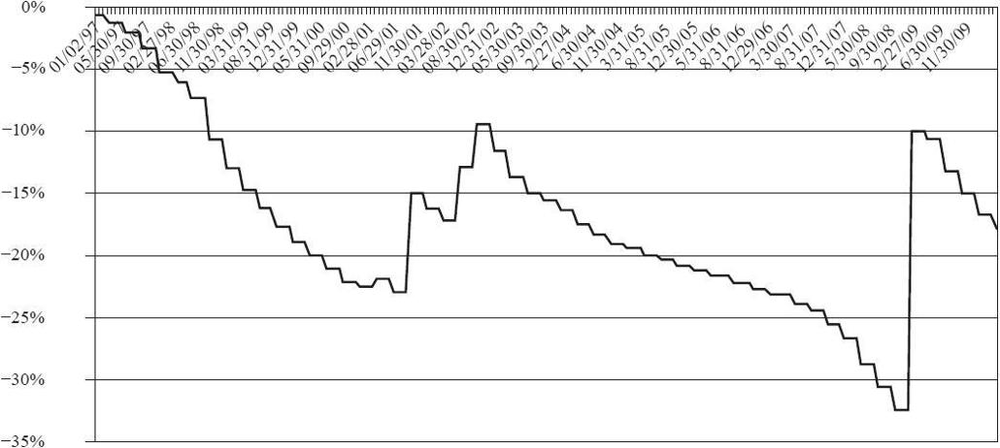
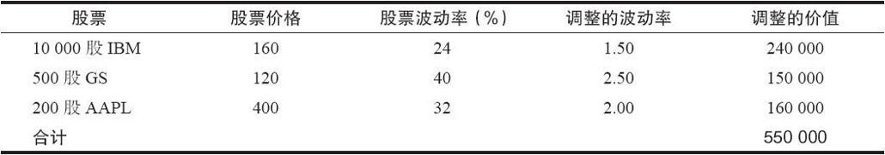
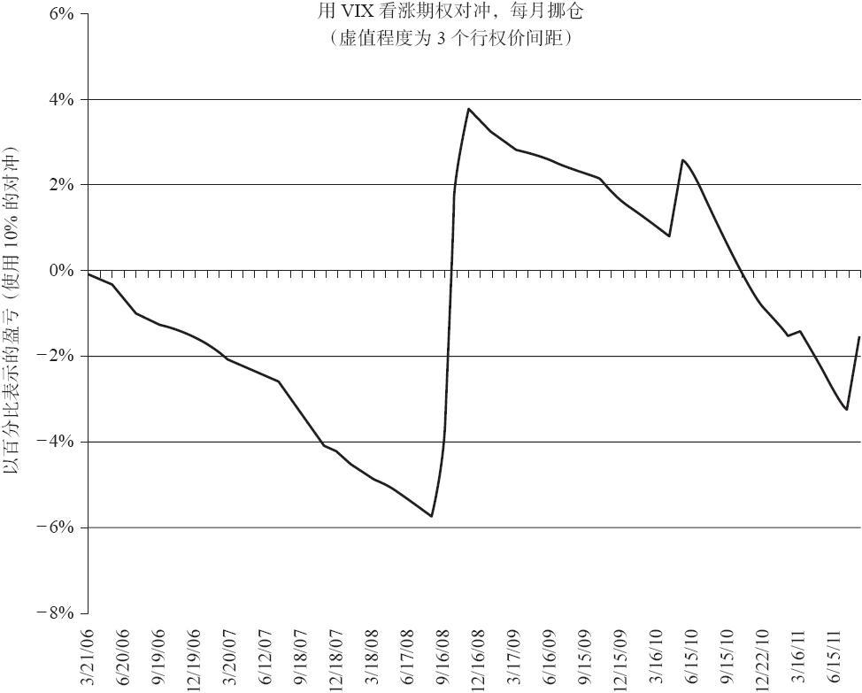

# 41.9　用波动率衍生品来保护股票组合

许多组合管理人，即使他们只是管理自己的组合，也会考虑在牛市中保护盈利，或是在熊市中防范亏损。不过，大多数组合管理人都不愿意放弃上涨的空间。也就是说，他们不愿意把头寸变现，或者卖空他们的头寸。

这时衍生品策略就非常有用了。交易者可以买入“保险”来预防市场下跌。这些保险的成本可以根据单个组合管理人的需求来调节。此外，诸如波动率期货和期权等新产品，甚至可以给这些有远见（forward-thinking）的组合管理人提供更好的对冲。

一个组合有很多方法在不实际卖出股票的情况下获得保护。交易者可以采用一种“宏观”的方法，使用宽基指数期权来对冲主板风险（如标准普尔500、纳斯达克100或VIX）。从成本的角度来看，这种方法是最有效的，但可能没办法满足交易者在其他方面的需要。例如，如果这个组合并没有很好地跟踪标准普尔500，那么用标准普尔500期权来对冲可能就没那么合适。

“微观”的方法就更有效。它一般涉及用这只股票的期权来对冲这只股票。显然，这个方法能提供最好的对冲效果，因为这些对冲工具都与这只股票完全对应。不过，这种方法的成本很高，无论是从“保险金额”还是从管理这些头寸所需的时间来看都是如此。

### 41.9.1　宏观方法

那些用宏观方法来对冲的管理人认为他们的组合与某个主要的指数在平均意义上关系非常紧密，因此这个指数的期货或期权就可以用来对冲这个组合。除非他是在管理一个指数基金，否则这个实际组合与用来对冲的指数衍生品之间都存在一些跟踪误差。不过，在大多数情况下，这个组合管理人不会在意一个小的跟踪误差，因为他知道这个保护能够抵御一个快速的或严重的市场下跌。宏观策略如下。

（1）买入宽基指数看跌期权。这可能是用宽基指数期权来获得保护的最流行的方式（但这并不意味着是保护的最好方式）。交易者一般买入那些保护特征不会立刻生效的看跌期权。也就是说，如果交易者只需要在市场严重下跌时的保险，那保险的成本就会较低。当前组合价格和该看跌期权所保险的水平，从保险的术语来说，就可被视为“免赔额”。特别的，交易者会买入那些行权价低于当前市场价5%、10%，甚至15%的看跌期权（即它们是虚值看跌期权）。该管理人知道他会在市场中承受一定的亏损。不过如果市场下跌的幅度更大，那他就可以让他的组合获得完全的保护。

这种形式的保险的成本会随着市场价格和市场状况而大幅变化。平均而言，一年的虚值程度为10%的SPX看跌期权的支出金额占组合总价值的比例介于2%~3%之间。

（2）宽基指数看跌期权价差。为了降低保险的成本，一些组合管理人会在买入虚值看跌期权的同时，还卖出更虚值的看跌期权，以获得一些收入来降低保险的成本。使用这种策略的风险是，交易者给他的保护戴了一顶“帽子”。例如，如果他买入10%虚值的看跌期权，并同时卖出15%虚值的看跌期权，那他会在股市下跌10%~15%之间时获得有效的保护。如果股市的跌幅超过这个水平，那他的保险收益就会有限。因为这个原因，本书作者不建议这种用看跌期权价差来获得保护的方法。

（3）卖出宽基指数看涨期权。对于那些需要或希望“灾难”保险的人来说，这个策略不怎么受欢迎。不过对于那些认为在跨多个市场周期的过程中，持续的卖出一种消耗性资产（看涨期权）会提高收益的管理人来说，这个策略就很受欢迎。这个卖出看涨期权的交易会降低组合在市场价高于看涨期权行权价的时候的上行潜力。不过，作为补偿的是，这种形式的保险实际上不需要花一分钱（它的成本是损失了向上的机会）。CBOE建立了多个基于指数的卖出备兑看涨期权的基准指数，从理论上跟踪这个方法，你可以用代码BXM来看看其中主要的一个的报价。

（4）领圈。这个策略组合了上面的方法1和方法3：它包括买入虚值看跌期权，并卖出虚值看涨期权。卖出看涨期权降低了看跌期权的成本，从而也降低了总的保险成本。这个策略的一种应用方式是“零成本”领圈，其中看涨期权的价格会大于或等于看跌期权的价格（并不是在所有情形中都存在）。不过，为了获得这个优势，该组合管理人再一次冒了失去上行潜在盈利的风险，因为他卖出了看涨期权。因此他用失去上行潜在盈利的机会成本来换取了保险现金成本的降低。

（5）期货。交易者可以卖出宽基指数期货来对冲他的股票组合。可以是标准普尔500期货、纳斯达克100期货，或其他一些期货。这个方法一般不怎么受欢迎，因为尽管卖出的期货保护了下行的风险，但它也去掉了在上涨市场中的任何潜在盈利。即使只有很少比例的组合采用了期货空头来对冲，大多数的组合管理人也会把这种放弃上行盈利的举动视为一种负担。此外，普遍认为是这种策略导致了1987年的股灾，因此大家对这种策略的印象并不好。

（6）波动率衍生品。这是一种不同的方法。当市场下跌时，波动率一般会上升。因此，当对一个组合进行对冲时，交易者会买入波动率期货，或更喜欢的是买入波动率看涨期权。图41-8显示了VIX在股市暴跌时会如何（引人注目地）上涨。因此，这种“买入”波动率的行为是一种有效的保护方式，并且有可能是最好的方式。

①波动率期货。在2004年波动率期货上市之前一点，美林的一个分析师显示了，10%的波动率对冲就足够保护一个宽基的股票组合。换句话说，如果把90%的钱投资于表现类似于SPX的股票中，并把剩余的10%投资于“VIX”，这个组合的表现无论是在牛市中，还是在熊市中，都会好于SPX。在实践中，这种理论被证明是没办法实现的，主要是因为买入VIX期货有很高的升水成本。后来，其他的研究表明，20%的对冲会更合适，不过这个原则很有价值。为了验证这个，交易者只需用波动率期货来对冲他组合名义净资产价值中的很小比例。

利用波动率期货来对冲并没有用SPX期货时的一些劣势，尽管它仍有一些劣势。基本上，如果股市上涨，波动率期货就可能会亏钱，除非它们变得非常低（比如在10~15的区域内）。因此，它们会在牛市中给组合的表现带来拖累。虽然这个拖累没有卖出标准普尔期货那么大，但仍比较大。

②VIX看涨期权。可以买入VIX的虚值看涨期权来构造组合的对冲。由于VIX会在股市下跌时急剧上涨，这些看涨期权就会盈利，因此可以对冲一个权益组合的亏损。

这个策略与把买入SPX看跌期权作为“保险”的策略类似。买入期权只有有限的风险，并在需要对冲时会有无限的潜在盈利。不过，相对于SPX看跌期权，用VIX看涨期权来对冲一个权益组合的效率更高。

### 41.9.2　VIX看涨期权比SPX看跌期权更适合用来进行组合对冲

VIX看涨期权是宽基权益组合更好的对冲方法的简单理由是，它们提供了动态的保护，而SPX看跌期权就没有。为了证明这一点，我们看一下下面的示例：

【示例41-15】在6月，SPX为1530，某个组合管理人决定买入SPX看跌期权来对冲。他选择了12月1400看跌期权，它差不多8%虚值。在买入了这个保护之后，假设股市有一个很强的夏季攻势。在9月早期，SPX达到了1700。在最需要这些看跌期权的时候（进去这一年的秋季，而秋季是股市传统的困难时期），先前买来提供保护的看跌期权现在已经有300点虚值了。问题就在于，看跌期权的行权价是固定的，当市场上涨时，这个保护就变得越来越没有价值。从这一点来看，交易者要么不得不在更合理的虚值位置上（8%~10%）买入更多的保护，要么干脆放弃保护。

正是因为本示例中提到的原因，许多组合管理人都避免买入看跌期权来作为保护。因为他们会在市场上涨时失去保护能力。

在VIX期权上就不会发生同样的事。考虑上面示例中的那个组合管理人，不过现在他决定买入VIX看涨期权来作为保护。

【示例41-16】在6月，SPX为1530，VIX在15附近，某个组合管理人决定买入VIX看涨期权来对冲。他选择了12月20看涨期权。也就是说，这些看涨期权会在VIX到期前高于20时提供保护。这只可能在一个市场急剧下跌时出现。不过正常情况下，VIX的尖峰会在30多，若市场急剧下跌，VIX还会更高，即使它的起点非常低。

正如上一个例子所示，SPX在夏季出现了上涨，在9月初达到了1700。这时，VIX的价格可能会更低，比如在12附近。但尽管VIX已经下跌了，但这并没有什么关系。因为一旦股市从1700点开始快速下跌，VIX就会很快涨到30多，然后这些VIX看涨期权多头就可以提供保护，即使股市已经比刚开始涨了很多了。

这个例子显示了VIX看涨期权是怎样的动态保护。当大盘上涨时，它们不会失去保护能力。当VIX一开始就相对较低时就更是如此。

### 41.9.3　买入SPX看跌期权来实施宏观保护

权益组合管理人对他的保护成本非常关心。当然，这个成本是会随着市场状况而变化的。如果波动率很高，特别是在一个已经开始下跌的市场里，SPX看跌期权和VIX看涨期权都会更贵。

为了估计这种保护的成本，可以用实际价格来做一些模拟。然后就可以估计出保护的净成本。

例如，图41-12显示了买入3个月期，虚值程度10%的SPX看跌期权的净成本。此外，假设一直持有这个保护至到期日，若在到期日时有内在价值则得到这部分价值，或无价值到期。接下来，再买入一个新的，3个月期的，虚值程度10%的看跌期权。这种行动是每季度进行一次的，采用的是实际SPX看跌期权价格。分别在3月、6月、9月和12月的到期日买入看跌期权。

图41-12　用3个月期权对冲10%虚值的SPX

图41-12中的数据始于1997年1月，因此它包括了13个完整的年度。这张图是用SPX价格的累积比例（左轴）来显示保护成本的。换句话说，在2010年夏季的终点，图中对应的数字为大约-0.18，或负的18%。这就意味着，在过去13年多中，这个保护的累积成本为SPX价值的18%（如果你喜欢的话，也可以说是组合价值的18%）。平均而言，这相当于每年不到2%的保护成本。

即便是在最低点，也就是2008年夏季，该图为大约负的32%。换句话说，截至那一天的过去11年多的时间里，保护的累积成本为组合价值的32%。平均而言，这相当于每年不到3%的保护成本。

请注意，这个保护在两个特定时期有效，包括2001~2002年，以及2008年第1季度的熊市。图形在这段时期里上升，表示这些看跌期权在这些季度里赚钱。不过，在这段时期之前以及之后，这种保护几乎每个季度都会亏钱。请注意该图在除熊市时期之外的其他时间内都有一种向下的梯级模式。这标志着在作为保护而买入的看跌期权上的亏损。

还需要注意的是，在一些季度中，看跌期权会先出现盈利，然后在季末却失去了它们的价值。确实是这样。例如，在2007年第3季度，当时“次级债”这个词第一次展露出其丑陋的一面。在7月和8月这段时间里，市场出现了急速下跌，而买入的保护性看跌期权则有盈利。不过随着9月出现了由美联储引起的强劲上涨，让这个保护最终无价值到期。

当图中的梯级很高时，就是看跌期权保护非常昂贵的时候。也就是说，这些期权的隐含波动率很高。从2008年中期开始，一般情况下这是正确的。请注意这些梯级在2006年时是多么的小，当时VIX一直在接近10的低位徘徊。

总之，过去13年的对冲损失大约是组合价值的18%，或是每年1.4%（不计复利）这一更可接受的数字。

关于SPX期权，还有一些其他的研究。它们使用了其他不同的免赔额或更长期的期权，不过它们的统计结果并不比上面的更好。

在进行SPX对冲时，交易者需要买入足够的看跌期权来完全对冲他的组合在该行权价下的调整价值。

【示例41-17】假设交易者有个表现类似SPX的组合。此外，该组合的净资产价值为300万美元。他决定买入SPX 6月1500看跌期权来对冲。那他需要买入下面的数量：

组合价值/（100×行权价）=3000000/（100×1500）=20看跌期权

（假设该期权的每点运动价值100美元，这就是上式中100的来源。）

如果交易者的组合与SPX并不完全相同，那他在买入保护之前必须根据SPX调整他的组合。这个过程类似于我们在第30章中“模拟指数”时所做的那样。

我们这里就不介绍太多的细节了，只指出交易者在确定“等期货头寸”时需要注意的几点。首先，该组合中的每个股票都应该从金额的角度进行波动率调整。也就是说，持有的每个股票价值都应该根据它的可比较波动率（有些人将它称之为beta）进行调整。如果交易者的组合中有负beta的股票（如黄金股票），那么这些股票应该不包含在宏观计算中。

【示例41-18】交易者有一个由3只不同的股票组成的小组合。他希望用SPX看跌期权来对冲这个组合。表41-12显示了这些股票的价格和波动率，以及它们的“调整的波动率”，也就是每个股票的波动率除以SPX波动率后的值。交易者也可以用beta来替代调整的波动率，不过beta是一个长期的测量，因为它可能会得到不准确的对冲计算结果。最后，把每只股票的金额乘以调整的波动率，再加总起来，就得到了需对冲的SPX总金额。

表41-12　波动率调整的组合价值（SPX的波动率=16%）

这个组合净SPX波动率调整后的总价值，就是表41-12中最右边一列所显示的3个数字的和，也就是550000美元。请注意，这个金额与这3只股票的实际净资产价值（300000美元）有很大的差异。换句话说，这3只股票的波动性都比SPX大，因此交易者需要买入价值550000美元的SPX保护，来对冲这个价值300000美元的小组合。需要买入的看跌期权的数量是：

SPX看跌期权数量=波动率调整价值/（100×SPX行权价）

因此，如果交易者将买入行权价为1100的SPX看跌期权来对冲他的组合时，他需要买入550000/（100×1100）=5手看跌期权。请注意，公式中的100是该看跌期权的合约乘数，即每点运动价值100美元。例如，如果交易者有一个科技股组合，他可能希望用QQQ来作为对冲指数。那也是采用上面示例中的相同步骤，只是在计算每只股票的波动率调整价值时，应该使用QQQ的波动率，而不是SPX的。

### 41.9.4　买入VIX看涨期权来实施宏观保护

如果权益组合管理人希望用VIX看涨期权来作为保护，那他就必须决定两件事。第一类似于在买入SPX看跌期权时需要做出的决定：这个保护的虚值程度需要为多少？它是这个保险的“免赔额”。在持有本质上类似于SPX的组合时，交易者可以很容易地确定他的风险（“免赔额”）——5%、10%等。不过，在使用VIX看涨期权时，情况就不是那么简单了。当SPX下跌10%时，VIX并不一定会上涨10%。事实上，它经常会上涨更多。因此，买入的VIX看涨期权应该虚值程度更深一些，这样就可以节约一些初始的保险费支出。

第二个问题是，“需要买多少保护呢？”由于SPX看跌期权和权益组合都是与SPX相关的，这个问题就很好回答，只要把该组合的净资产价值转化为SPX“等量值”就可以了，就像上面的示例所示。不过，对于VIX看涨期权来说，就没有这样直接的关系了。因此，我们用美林最初的研究来回答这个问题——如何买入足够的VIX来对冲该组合10%~20%的价值。

【示例41-19】假设SPX价格为1530，VIX为15。该对冲者决定买入VIX 12月20看涨期权。假设他的组合根据SPX的波动率调整后的价值为1000万美元。然后，根据美林的研究，他决定根据组合价值的10%（等于100万美元）来买入保护。因此他的保护会在VIX高于20时触发，我们用这个行权价来确定需要买入的VIX看涨期权的数量：

数量=10%×净资产价值/（100×行权价）

=10%×1000万美元/（100×20）

=100万美元/2000

=500手看涨期权

这个数量对于VIX看涨期权来说并不算什么，因为它是流动性最好的几个合约之一。

假设买入了1个月的看涨期权（因为当指数快速下跌时，近月合约跟随的程度会最大），那么这些看涨期权的成本应该低于每个合约1点（100美元），总成本不超过5万美元，这相当于组合实际净资产价值的0.5%少一点。如果交易者决定对冲20%的调整价值，那他应该买入1000手看涨期权。

注意，这个公式并不完全正确，因为它意味着，如果使用的行权价更高，那应该买入的看涨期权就更少。相反，我们稍后会看到，我们建议买入与当前VIX期货价格有一个相对固定的距离的期权。此外，交易者可能会想用一个高于20%的数来代替公式中的10%，因为最近的研究（根据美林最初的研究的扩展）表明，合适的对冲比率可能接近该组合的资产价值的20%。

那这些看涨期权能够提供多少保护呢？还记得吧，计算VIX时只使用了SPX两个近期系列的期权。因此，更长期的SPX期权可能会以显著不同的隐含波动率在交易，并不会必然地紧密跟踪VIX自身。

在VIX的情况下，即使是当月的期货和期权也并不一定会完全跟踪VIX。接着上面的示例，假设买入的VIX看涨期权的价格为1.00每手。此外，假设股票市场快速下跌了，并且VIX上冲到了27。此时，VIX看涨期权不太可能会完全反应这7点实值的全部价值（由于期权的期限结构），不过它们可能会很容易地上涨到5。因此，每个合约的盈利就会是400美元，或合计222000美元，这相当于权益组合的净资产价值的2.2%。

如果出现了一个严重的市场冲击，VIX可能会在更高的价格上交易，然后看涨期权就能提供更多的保护。此外，更低行权价的看涨期权能够提供更多的保护水平，但会在一开始时就增加保险的成本。

图41-13显示了实际的结果，由于VIX期权开始交易于2006年，买入1个月的，虚值程度为3个行权价间距的VIX看涨期权，并不断地挪仓。（注意：当VIX低于30时，3个行权价间距至少意味着7.5点；而当VIX高于30时，则至少代表着15点。）此外，主要这些虚值程度是相对于相应的VIX期货合约价格的，而不是VIX自身。

图41-13　看涨期权对冲挪仓

y轴显示了以百分比表示的盈亏，假设这个交易者买入了足够的VIX看涨期权来对冲某个组合（在这个例子中是SPX）10%的名义净资产价值。

显然，你可以看见持有VIX看涨期权在实际危机发生时的有效性。VIX看涨期权在2008年10月出现了大笔的盈利，并在2010年5月和2011年8月出现了较小的盈利。

下面提供一些量化的数据，VIX的历史波动率会周期性地高于50%，并有时达到100%，而SPX的波动率在长期中的平均值是15%，并在长期的牛市中会更低。因此，交易者从统计的角度可以确定，可以买入虚值更多的VIX看涨期权，而不用与SPX看跌期权有同样的虚值程度，因为VIX的实际波动率会更高。

我们已经说过，VIX度量的是30天的波动率。因此，没有理由去买更长期的VIX期权。

把这些都考虑进去，以过去市场下跌时的平均VIX移动为基础，一个关于需要买入多少VIX看涨期权的更好的答案就可以用这样的方式来表示：

（1）把你的组合转化为“波动率调整的”价值，以SPX为基础；

（2）根据上面的方法来买入虚值程度为3个行权价间距的VIX看涨期权；

（3）每10万美元波动率调整的价值所需要买入的看涨期权数量=比例×0.35。

其中，比例是指你希望对冲的调整价值的比例，根据美林的研究，它介于10~20之间。如果该比例是20，那你应该为每10万美元波动率调整的价值买入7手VIX看涨期权。我的观点是，这个比例应该是20，如果看涨期权离到期日还有一点远，那或者还可以更高一些。
