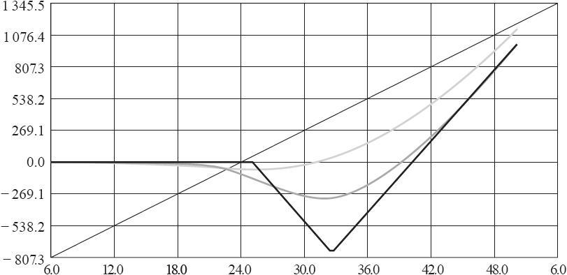

# 41.10　其他的宏观策略

在关于组合保护的这一节开始的部分，我们提到了其他一些策略，它们都是简单买入期权来作为保护的策略的变种。虽然我并不喜欢这些价差策略，不过许多交易者会发现，领圈策略还是挺有用的。

### 41.10.1　SPX领圈

除了买入SPX看跌期权作为保护之外，交易者还可以通过同时卖出SPX的虚值看涨期权来降低这些看跌期权的支出。如果卖出的看涨期权的价格等于或大于看跌期权的价格，那么这个最终的头寸就被称为“零支出的”领圈。

当然，这时会存在一个机会成本——当价格高于卖出的看涨期权的行权价时，所放弃的上行潜在盈利。即便是这样，某些交易者也会认为领圈是一个可以接受的策略。

零支出的领圈经常是用长期期权来构建，并在股息率很低，且波动率很高时有最好的作用。交易者可能没办法一下子就了解所有的细节，不过我们可以用一个在2007年（最近的牛市的尾部）的示例来说明。当时有下面的价格存在：

2007年6月：

SPX：1517

12月（09年）SPX 1450看跌期权：107.6

12月（09年）SPX 1700看涨期权：118.8

在2007年6月，股息率很低，虽然波动率不是很高，但也不处于低位。因此，用这些2.5年后到期的期权，交易者可以建立一个零支出的领圈，来限制住低于1450时的亏损（比当前市场价格低5%），并允许升值到1700点（高于SPX的历史高点）。因此这是一个非常有吸引力的领圈，特别是考虑到在2007和2008年所实际发生的情况。

### 41.10.2　对领圈进行调整

在建立了领圈之后，应该怎么操作呢？交易者可以什么都不做，计划接受它的结果，不管结果是怎样的。但这可能不是最好的方式。

许多投资者会在标的物价格下跌时调整领圈。接着上面的示例，假设过了一段时间之后，SPX跌到了1300。领圈中的看跌期权会变得深度实值，价格会比（那时）深度虚值的看涨期权高得多。因此如果把这个领圈平仓，会得到一笔收入。

那用这笔钱来干什么呢？有以下的选择：（1）在更低的行权价上建立一个新的领圈。如果又建立了一个“无支出的”领圈，那上端的行权价就会比先前的低，因此卖出的看涨期权就会限制SPX的强劲上涨。大多数交易者都不愿意这样做，除非他们相当肯定股市会下跌（如果是这样的话，那他应该继续保留他最初的领圈）。（2）用这笔收入来买入一些虚值看跌期权。当股价进一步下跌的时候，这些看跌期权就能提供保护，而与此同时上端就不再被限制住。（3）什么都不做，任由组合中的股票多头“裸露着”。只有当交易者对目前已经达到市场底部相当肯定的时候，才应该这样做。

另一方面，如果股价在建立了领圈之后上涨了，那这个投资者就没有什么有吸引力的选择方案。看涨期权价格会上涨，而看跌期权价格会下跌，因此把领圈平仓需要一笔支出。当然，股票组合也会有上涨，因此该交易者总体上是盈利的，只是没有一开始就不建立领圈时的盈利那么多。如果他相当肯定地认为最差的时间已经过去了，标的物会继续上涨，那交易者常常会在价格上涨时把领圈平仓。

### 41.10.3　VIX领圈

交易者也可以用VIX期权来构造领圈。不过在这种情况下，交易者是在卖出VIX看跌期权，并买入VIX看涨期权来获得保护。

【示例41-20】目前VIX价格为23.50，某个交易者想建立以下的VIX保护性领圈：

买入VIX11月30看涨期权，价格为0.90

卖出VIX11月20看跌期权，价格为1.00

VIX领圈与SPX领圈有一些不同的特征。首先，交易者并没有真的像SPX领圈那样限制他的组合的盈利。是的，如果市场上涨了，VIX会下跌，并且可能会低于卖出的看跌期权的行权价。不过，VIX实际上不会低于10，因此这个卖出的VIX看跌期权对他的组合的上行潜在盈利的限制就会有一个约束。而卖出的SPX看涨期权则会在市场的上涨过程中持续性地限制上行的盈利。

在上面的示例中的领圈是一个无支出的领圈。不过为了实现这个目的，卖出的VIX看跌期权的行权价可能离现在的VIX价格非常近。这意味着只需一个温和的市场上涨就可以让VIX的价格低于20，从而给这个上涨的股票组合带来损失。

更具有操作性的方法是，交易者可以卖出更虚值的VIX看跌期权。不过，在这种情况下就不能建立一个零支出的领圈了，但卖出的看跌期权也能在一定程度上降低买入VIX看涨期权作为保护的支出。

### 41.10.4　波动率保护的另一种策略

机构交易者常常在找不需要支出的保护性策略。这就是零支出领圈这么受欢迎的原因了。如果交易者已经有了保护，但并不需要或没有使用它，那对他来说就没有什么实际的支出。“支出”是一种机会成本，它是在标的物价格上涨足够多（例如，高于卖出的SPX看涨期权的行权价，或低于卖出的VIX看跌期权的行权价）的时候对盈利设置的一个上限。

还可以用VIX期权来设计一种VIX看涨期权后式价差的策略来提供保护或投机。有人认为这种策略会更好，因为它可以在有亏损发生的时候，让你更早地退出。不过，所有的有思想的交易者都知道，天下没有免费的午餐。如果这里没有风险，那么你肯定要放弃一些其他的东西。

这个策略是基于2对1的看涨期权后式价差，如下例所示：

【示例41-21】2对1的VIX看涨期权后式价差

日期：5月中期，在5月VIX衍生品合约的到期日

VIX：17

7月VIX期货：20.25

买入2手VIX 7月32.5看涨期权，价格为0.80

卖出1手VIX 7月25看涨期权，价格为1.60

初始支出：0美元

在5月VIX衍生品的到期日，用8月期权建立了一个VIX看涨期权后式价差：卖出1手虚值看涨期权，并买入2手更虚值的看涨期权，其中前者的价格差不多为后者的2倍。注意，这两个期权会在2个月后到期，而不是1个月。如果交易者在建立这个价差时需要一些小额的支出，比如不超过15或20美分，那结果也和这个例子差不多。

建立这个头寸背后的主要思想是，一个2对1的看涨期权后式价差的表现更像一个看涨期权多头（至少在一段时间内是这样），直到该头寸非常接近到期日，到那时在较高行权价附近的损失会变大。

图41-14显示了这样一个价差的盈利图。图41-14中有3条线。直的黑线显示了持有头寸至7月到期日时的表现：低于25时没有盈利或亏损（手续费除外）；介于25~32.5之间时，亏损会增加，并在到期日为32.5时达到7.5的最大亏损（750美元）；高于32.5时，亏损会逐渐下降，并在40时达到上行盈亏平衡点；高于40时，则盈利没有限制。

图41-14　VIX 2对1的看涨期权后式价差

黑灰线自身没有什么特别有吸引力的地方。弯曲的黑灰线显示了头寸在到期日前10天的表现。再一次，头寸会在接近32时达到300美元左右的相对最大亏损。这也并没有什么吸引力。

这个头寸真正有吸引力的地方是灰线。它显示了头寸在6月VIX衍生品的最后交易日时（或者在7月到日之前的1个月时）的表现。由于距离到期日还有很远，灰线几乎很少处于负的区域。最差的点是在25附近有大约60美元的小损失，并且还有一个月的时间。它确实是有很大的上行潜在盈利（在这3条线中），因为这个价差持有了2手看涨期权，而只卖出了1手看涨期权。

如果你只是看灰线，那它的形状非常像在到期日之前持有1手看涨期权多头时的形状。当价格高于31或32时，灰线就会急剧地转为向上，因此7月VIX期货也会上涨至那里或更高，以便让这个还有1个月到期的头寸开始产生盈利。

因此这个后式价差可以在理论上被用在正常情况下需要买入VIX看涨期权的策略中。主要是用来保护一个股票组合，或者是直接对波动率的大幅上涨进行投机。

那么，这个2对1的后式价差是否真的就比买入短期看涨期权更好呢？可能不是的。这个策略的关键很简单：交易者建立一个2对1的后式价差，并在亏损开始出现的时候把头寸挪仓到下一个到期月。简而言之，这意味着该头寸是在离到期日还有2个月时开仓，然后在还剩1个月到期时挪仓。

从表面上看，这个后式价差策略看上去非常有吸引力。如果你仅是想投机波动率，那它可能是合适的。不过在这个策略有两个主要的缺点。第一个缺点是与VIX期货的期限结构有关。我们知道，期权是基于期货而不是基于VIX的。此外，在一个严重的熊市中，当VIX向上爆发时，期限结构会变得向下倾斜（即所有期货相对于VIX都有贴水）。当这种情况发生时，这个后式价差策略（用第二个月的期权而不是第一个月的）可能就不能产生期望的盈利。

证明这一点的最简单方法，就是再看一看在VIX衍生品上市之后出现的最厉害的熊市（2010年10月）。在某一点，有下面的大致价格存在：

VIX：70，2010年10月10日

10月VIX期货：56

11月VIX期货：38

10月VIX看涨期权多头的实值程度比11月2对1的看涨期权后式价差多18点！当10到期日临近时，VIX停留在70附近，那么10月期货也会上涨到70。与此同时，11月期货只能上涨到40多一点。这对于用第二个月而非第一个月的期权来提供保护的人来说，这是一种灾难。

一个反驳的观点是可以买入更多的11月2对1后式价差来抗衡直接买入10月看涨期权。这个观点是对的，不过两者的保证金要求有很大的差别。

后式价差的保证金是两个价之间的差，再加上建立这个价差时可能出现的任何支出。显然，直接买入看涨期权的要求只是付出的权利金。即使这个2对1的后式价差的行权价之差只有5点（如果交易者希望只为这个价差付一点点支出，那这并不总是可能的），下面就是与以0.60点直接买入看涨期权的对比：

资金要求对比

零支出的2对1的看涨期权后式价差：500美元

以0.60直接买入看涨期权：60美元

因此，口头上说“做更多的后式价差”很简单，但从投资的资金要求的角度来看，这样做的支出很高。这一点可能是很显著的。例如，假设有一个交易员在以全部保证金的方式持有股票多头，或就账户中的全部股票卖出了裸指数或个股看跌期权。在这种情况下，他很可能必须平掉账户中的一些“主”策略来给后式价差提供资金。

期限结构很重要。不过可能最大的问题是，什么情况下才会有潜在盈利产生。从图41-14中可以看到，使用后式价差时，当价格刚好低于后式价差中较高的行权价时（在这个例子中是31或32）会有潜在盈利出现。这个虚值程度可能比我们在关于买入看涨期权的建议中用的“3个行权价间距”还要深。

总之，2对1的看涨期权后式价差策略有一定的吸引力，因为如果能在到期前很好地挪仓，亏损确实很少。不过，在严重的危机中，这个策略的表现没有直接买入当月看涨期权的策略好。如果交易者支付了一小笔的钱来直接买入看涨期权，那他就能在比后式价差产生盈利的价格更低的位置获得保护，并且在VIX的上行过程中与VIX跟踪得更紧密。

### 41.10.5　组合保护小结

相对于SPX看跌期权，VIX看涨期权提供了一种更优越的、更动态的对冲。这是源于两个基本事实：（1）在真实的危机中，不管是买入的哪个行权价的VIX看涨期权，VIX都会很轻易地爆发得更高；（2）VIX的波动率比SPX大得多，因此只需要很少数量的看涨期权就可以对冲整个组合，而相同的情况则需要买入更多的SPX看跌期权来获得保护。

可能VIX对冲更像一个危机对冲，但这就是需要保护的时候。正常情况下，交易者不会为了一个小幅的市场下跌而使用保护，因为这样做的成本最终被证明会非常大。
