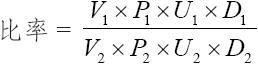
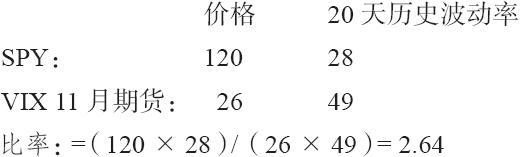
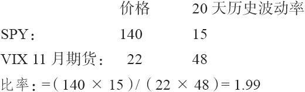
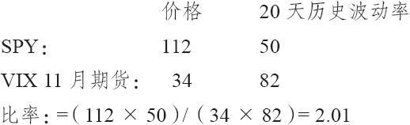

# 41.11　使用波动率衍生品的对冲策略

关于这一点，我们已经主要讨论了直接买入VIX和它的衍生品来进行投机或保护。不过，还有一些其他的有用策略。其中一个这样的策略就是跨期价差，前面我们稍微对它提及了一下。

前文已经显示，两个期货月份之间的跨期价差可以作为股票市场交易的替代，或者当交易者预期VIX的期限结构会发生变化时使用这个策略。这是一个高杠杆的策略，因为涉及前3个月的期货价差的保证金只要624美元。

我们先前已经发现，使用VIX期权的跨期价差的表现与股票的跨期价差并不一样。这是因为这个价差涉及两个VIX期权，而这两个期权的标的物并不一样。而股票的标的物都是一个，比如IBM或苹果。

### 41.11.1　VIX跨期组合

在前面的关于VIX衍生品的策略中，都有很大的风险，虽然在理论上风险是有限的。如果交易者在交易这些期货价差时没有使用很大的杠杆，风险确实是有限的。除了用期货来交易价差之外，交易者还可以用实值的期权来构建一个类似的头寸。

本书的前面已经指出，任何跨品种价差都可以用实值期权来构建，并且通常是个更好的选择。期权头寸可以在两个方面挣钱：（1）品种间价差如交易者所期望的那样扩大或缩小；（2）两个标的物都极端波动。在后面的情形中，其中一个期权会获得很大的盈利，而另一个期权则只有有限的风险。因此在第2种情形中，即使跨品种价差本身并没有变化，也有可能盈利。

【示例41-22】某个交易者希望卖出10月VIX，并买入11月VIX。他可以简单地买入10月VIX期货，并卖出11月VIX期货。不过如果这个价差朝不利于他的方向变动，就像2008年秋季中出现的极端价差，他可能会承受巨大的亏损。相反，有11月VIX看涨期权多头和10月VIX看跌期权空头组成的头寸（这两个期权都是实值的），则可能是期货跨期价差的很好替代品。

在9月8日有以下的价格存在：

日期：2008年9月8日

VIX：22.64

10月VIX期货：23.39

11月VIX期货：23.63

假设某个交易者建立这个期货跨期价差，买入11月和卖出10月。正如我们先前在表41-7中所见的，情况很快变糟了。

日期：2008年10月10日

VIX：69.96

10月VIX期货：56.71

11月VIX期货：38.30

这个价差在建立时是24分（11月减去10月），现在是18.41（10月减去11月），因此该笔期货交易的总损失会是18.65（0.24+18.41）点，或18650美元。但如果我们最初买入的是期货组合，情况会怎么样呢？

日期：2008年9月8日

买入VIX 11月20看涨期权：5.00

买入VIX 10月27.5看跌期权：4.30

组合支出：9.30点

这个价差的最大风险是最初投资的930美元。出现这种情况时，11月VIX必须低于20之下，而10月VIX期货必须高于27.5——对于这么低的VIX来说，这样的价格基本上是不可能出现的。

相反地，正如我们所知，VIX出现了爆发，10月超过了11月很多。即便是这样，这个组合仍可以在上面所描述的情形中盈利，因为此时两个标的物都出现了很大的波动。在2008年10月10日，这些价格为：

日期：2008年10月10日

买入VIX 11月20看涨期权：17.70

买入VIX 10月27.5看跌期权：0.00

因此现在这个价差有8.40点的盈利（每个组合有840美元）。相对于最初投资的930美元，这是一个接近90%的收益率（不考虑手续费），这个收益率可能没有高杠杆的期货价差那么高，不过也是一个很不错的结果。

### 41.11.2　VIX/SPY对冲头寸

在前文中，我们第一次说到VIX期货有时会相对于VIX有较大的贴水（或升水）时，曾说过有一种策略可以利用这种情况，这就是VIX/SPX对冲。这一节会详细地介绍这个策略。包括它的基本概念，确定对冲的每一条腿交易多少期权，以及最后如何实施一些后续策略等。

这个交易的对冲部分源于这样的事实，一般而言，当股市下跌的时候，VIX会上升（反之亦然）。因此，在两个工具中买入类似的期权（看跌期权或看涨期权）就是一笔对冲交易。例如，在理论上，如果交易者持有VIX的看涨期权，并同时持有SPX的看涨期权[或更可能的，标普ETF（S&P SPDRS，SPY）的看涨期权]，那它们就可以互相对冲。类似地，如果交易者持有两种看跌期权，那同样是一个对冲头寸。

此外，就像我们在上一节所示，用期权来进行的对冲，有两种机会盈利：（1）如果该对冲靠拢；（2）如果标的物的价格移动了很多。例如，假设我们分别买入SPY和VIX的看涨期权来建立了一个对冲头寸。一方面，这些看涨期权只会损失一个固定的金额，另一方面，这些看涨期权可能会有非常大的盈利。

### 41.11.3　基本概念

在采用这个策略时，VIX和当月VIX期货之间的关系是这个策略的关键。当价差很大时（不管是很大的升水或贴水），这种交易都是有效的。

在市场平静的时期，可以在价差达到2.0点或更多的时候建立这个策略，可以是2点的升水，也可以是2点的贴水。在更极端的时期，特别是在极度下跌的熊市中，可能会出现极大的贴水（我们在本章中前面的一些示例中已经看到了这一点）。那么此时建立这种对冲就更具有吸引力了。因此，作为一个一般的规则，我们希望在VIX和它的当月期货合约之间存在较大的价差时建立这个策略。这个价差在到期日最终会消失（如果没有提前消失的话）。

我们看一个简单的概念性的示例。

贴水的示例1假设有下面的价格存在：

VIX：31

VIX当月期货：25（6点贴水）

SPX：1200

（这些基本上符合2008年9月15日时的价格）

情形1：如果VIX期货是“正确的”，那么VIX会下跌来让两者相等，而SPX会在VIX下跌时相应地上涨。

情形2：如果情况刚好相反呢？如果VIX是“正确的”呢？那么期货价格会上涨来让两者相等。在这种情况下，VIX可能不会变化，因此SPX可能也不会变化。

那么什么策略会在这些情形中有效呢？买入两者的看涨期权，因为VIX期权的价格是基于期货的，而不是VIX自身。我们会想买入“当月”看涨期权，因为它会有最大的波动。

在上面情形1中，VIX期货保持不变，而SPX上涨。因此VIX看涨期权可能会损失一点时间价值，不过SPY看涨期权会在SPX的上涨运动中有很大的盈利。

在情形2中，SPX维持相对无变化，而VIX期货的价格会上涨。因此SPY看涨期权会损失一些时间价值，而VIX看涨期权会有盈利，因为期货价格上涨了。

现在让我们考虑一个相反情形的例子，当VIX期货相对VIX有升水时的情形。如果某个对冲交易者想在这种情况下用这个VIX/SPX策略，那他需要买入VIX和SPX的看跌期权。

升水的示例1

VIX：18

VIX当月期货：22（4点升水）

SPX：1400

情形1：期货价格是“正确的”，因此VIX会上涨，而SPX会下跌，SPY看跌期权会有盈利。

情形2：VIX价格是“正确的”，因此期货价格会下跌到与VIX相同，而SPX和VIX会保持相对无变化。此时VIX看跌期权会盈利，因为VIX期货下跌了。

### 41.11.4　需要买入多少期权

这里有一个一般的公式来确定涉及两个不同的标的物时的对冲比率。

式中　Vi——波动率；

Pi——标的物价格；

Ui——合约乘数；

Di——期权的delta。

如果涉及的是指数或个股期权，Di一般情况下是每手合约100股。不过如果你对冲的是股票、ETF或指数的期货期权，那它可能是其他的数字。

波动率一般是20天的历史波动率，尽管在极端情况下，交易者可能希望用一个有更广视野的波动率。

一般情况下，如果你在交易期权，那期权的delta是非常重要的。例如，如果你在用期货对冲ETF，那么就不存在delta的部分。

关于VIX/SPX对冲，一个历史上的经验规则是，这个公式一般会让我们买入2倍的VIX期权，1倍的SPY期权。不过，不同的市场情况可能对VIX期货或对SPX自身产生一些异常的波动率，因此在每次建立这个对冲时都需要用这个公式算一下，而不是简单地用2对1的比率。

我们继续在这里讨论前面的两个实例，以显示如何设定这些比率。如果交易者是在交易VIX期权和SPY期权，两者的变量U都是相同的（100）。此外假设买入的两个期权的delta也是相同的。因此，只需价格和波动率就可以确定这个比率（HV是历史波动率）。

贴水的示例2

它大致等于5对2，意味着需要买入5手VIX看涨期权和2手SPY看涨期权（或10手VIX对4手SPY，诸如此类）。

升水的示例2

这是上面第二个示例的后续部分。在这种情况下的股票市场波动率会更低：

因此在这种情况下，需要买入2手VIX看跌期权来对应1手SPY看跌期权。记住，如果期权的delta有很大的不同，那么就需要调整这些比率。

### 41.11.5　退出/调整这个对冲

在建立这个头寸之后，如果VIX和当月期货变得恢复“正常”状态，价格靠拢得变得差不多相等时，交易者就可以考虑把头寸平仓。不过，在这个价差中还有另一种盈利的方式，那就是标的物朝一个或另一个方向出现了快速和大幅的移动。考虑下面的示例。

【示例41-23】

VIX：45

10月VIX期货：34（11点贴水）

确定这个比率：

这是个2对1的比率：买入2手VIX看涨期权来对应买入的每手SPY看涨期权。

在实际实施这笔交易时，可以买入略微实值的VIX和SPY看涨期权（这样它们就有类似的delta）：

买入10手VIX 10月32.5看涨期权，价格为3.70

买入5手SPY 10月111看涨期权，价格为5.90

总支出（不含手续费）：6650美元

此外，假设1周之后，股市出现了大幅下跌，有以下的价格存在。

VIX：64

10月期货：52

10月32.5看涨期权：20.50

SPY：90.75

SPY 10月111看涨期权：0.00（无价值）

该价差并没有靠拢（10月期货的贴水从11点扩大到12点），但也有很大的盈利，这是因为出现了很大的价格变动（VIX上涨，SPY下跌）。

交易的盈亏：

10手VIX看涨期权（买入价3.70，现在值20.5）：+16800美元

5手SPY看涨期权（买入价5.90，现在无价值）：-2950美元

头寸的总盈利：+13850美元

因此这个对冲头寸产生了一笔很大的盈利，这是因为标的物移动了很多，而不是因为VIX和它的期货如最初期望的那样出现了靠拢。一般情况下，靠拢会产生相对小的盈利，而第二种方式（大幅移动）会产生大得多的盈利。当然，第二种情形发生的概率要比第一种小得多。

在每个情形中，当产生了盈利之后，交易者都应该提取一部分盈利。如果期货维持与VIX之间的显著价差，整个头寸会“回到中心位置”（re-centered）以去除头寸的任何一条腿中的极端delta。

### 41.11.6　什么情况下会犯错

没有哪个策略会长胜不败的。对于这个对冲的策略，如果VIX和SPY“分开”并且它们没有大的波动，那初始的支出就处于风险之中。在一个持续的时期里，这种情况不太可能发生，不过它确实会在短期内发生。

例如，如果VIX期货有大的贴水，根据这个策略就会同时买入VIX和SPY的看涨期权。如果股市后来上涨了，隐含波动率通常会下降。VIX下降了，那么VIX期货也会下降，这会给VIX看涨期权多头带来损失。此外，下降的波动率也会对持有的SPY看涨期权的价格带来拖累。因此，在这种情况下，有可能对冲头寸的两条腿都出现亏损。虽然这种情况不大可能会一直持续，不过在理论上什么都可能发生。

在持有两个看跌期权的时候，VIX下降的影响就没有那么大，因为此时VIX看跌期权就可能赚一些钱，即使下降的VIX会给SPY看跌期权多头带来一些问题。

另一个潜在的差错来源于调整过程。如果头寸的某一条腿有很大的delta，交易者需要要么让头寸重新回到中心位置，要么提取一部分盈利，或至少在盈利的腿中设置一个跟踪止损。如果没有做这些，那么在市场的急速反转中，这些已经产生的盈利就可能会消失。

### 41.11.7　一般的观察

如果回过头来看，并仔细地想一下，只要市场是不稳定的，交易者不管是用两个看涨期权还是两个看跌期权，这个策略都应该有效。因此这个策略应该可以在任何时候使用。事实上，持有这个对冲与持有“整个市场”的跨式价差非常类似。可以是买入SPY（或SPX）跨式价差，也可以是买入VIX自身的跨式价差。这个对冲交易的“优势”来自于VIX期货所存在的显著升水或贴水，这个差异会在期货到期时消失。

这个一般的策略能够成功还有第二个条件，即它只在SPY和VIX之间的一般关系维持有效的时候才能盈利。也就是说，只有当波动率和股票市场在不同方向的变化速度基本接近的情况下才有效。离开了这一点，这个对冲就不再有效。

由于VIX和SPY之间没有绝对的关联性，因此我们无法知道这个对冲的未来表现。这一点就是那些买入VIX或SPY跨式价差的人所不需要考虑的。在实践中，肯定会有SPY或VIX跨式价差的表现好于这个对冲头寸的情况出现。不过，特别是在VIX期货中存在“优势”的时候，在绝大多数情况下，这个对冲头寸的表现都会更好。

### 41.11.8　小结

总之，这个对冲策略是一种很好的交易波动率的方法。也就是说，当VIX期货相对于VIX有很大距离的时候建立这个头寸。通过使用期权，可以在VIX和VIX期货出现靠拢，或者任何一个方向有大幅的波动出现时获得无限的盈利。
