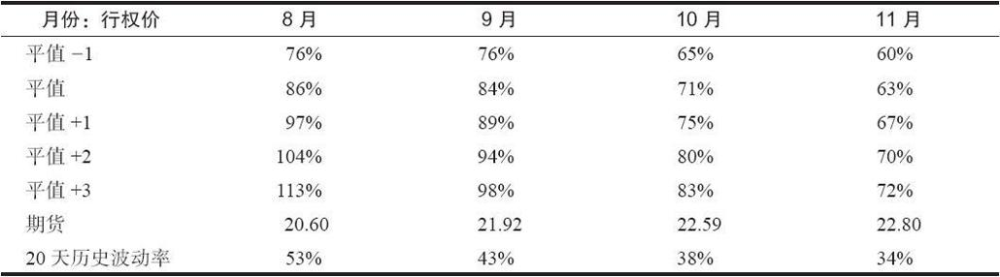
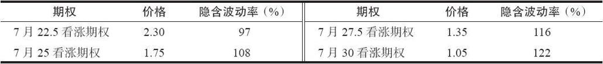
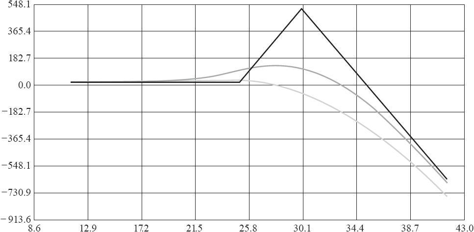
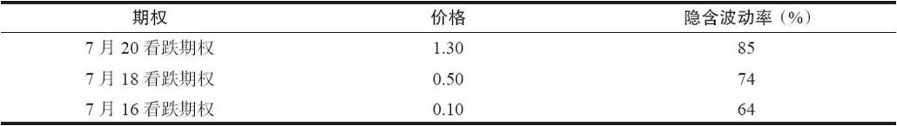
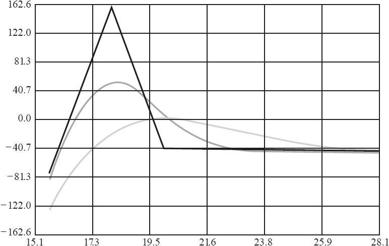
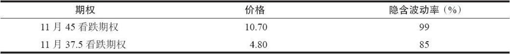
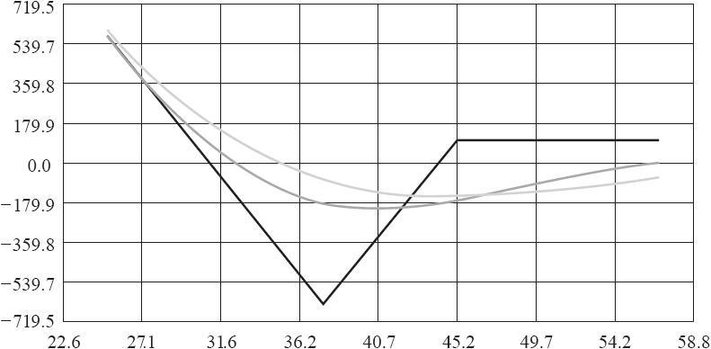

# 41.12　用VIX期权来构建比率价差

在表41-8附近的讨论中，显示了为什么VIX期权会在水平方向和垂直方向存在倾斜。表41-13显示了VIX期权隐含波动率的典型情形：

表41-13　VIX期权的隐含波动率，7月15日，假设VIX为21

请注意这明显的水平倾斜（短期期权更贵，而长期期权更便宜）。这是基于期货上的类似倾斜（表41-13的最后一行，其中HV表示“历史波动率”）。此外，请注意VIX期权比单个期货合约的近期历史波动率要更昂贵。这是因为VIX期货常常有爆发的潜力，而期权的定价是基于前瞻的波动率，而不是历史波动率。

此外，还存在垂直倾斜。表中的第一列显示了5个行权价，都是相对于平值期权的，代表着不同期货合约的不同行权价的期权。表中显示的高于行权价（+1，+2，+3）和低于行权价（-1）表示的是与“平值”行权价的行权价间距倍数（行权价间距为2.50点）。行权价更低的期权的隐含波动率比行权价更高的期权低。这种线性的倾斜与SPX期权中出现的倾斜（不过方向相反）有些类似，对使用相同到期月的比率价差和后式价差有利。VIX期权的垂直倾斜是一种向上的或正的倾斜，而SPX期权的垂直倾斜是一种向下的或负的倾斜。

不过，使用不同月份的期权的跨期价差和对角价差，就没办法获得优势，即使期权中也存在着水平倾斜。这种明显的水平倾斜确实是应该存在的，因为标的物期货的实际波动率也是在近期期货上最高，随着期限越长越连续下降的。

当交易者买入较低隐含波动率的期权，并卖出较高隐含波动率的期权时，看涨期权比率价差就有理论上的优势。

【示例41-24】

VIX：22.73

7月VIX期货：21.95

示例看涨期权比率价差：

买入1手7月25看涨期权，价格为1.75

卖出2手7月30看涨期权，价格为1.05

净收入：0.35

上行盈亏平衡点：35.35

该价差交易者必须为1手裸看涨期权提供质押，以符合针对裸指数看涨期权（这里的指数并不是一个宽基指数）的常见的保证金要求。

这个比率价差的盈利图显示在图41-15中。这个例子中的看涨期权比率价差的理论优势来自于这个事实：买入的期权的隐含波动率为108%，而卖出的期权的隐含波动率为122%。

这个价差会在VIX在到期日不高于35.35时盈利。在低于25时，盈利只有建立头寸时最初收入的35分。不过在25~35之间时，就可以获得更大的盈利，其中5.35的最大盈利会在VIX刚好等于30时获得。当然，在到期日之前，如果7月期货上涨很多或期权的隐含波动率扩大，这个价差也会有亏损。图41-15中的灰线显示了到期前的结果。

这些特征非常类似于SPX或SPY的看跌期权比率价差。喜欢交易SPX看跌期权比率价差的交易者也会把这个VIX看涨期权比例价差作为备选。如果市场突然暴跌，这两个策略都会有很大的亏损。当这种情况发生的时候，隐含波动率会爆发，波动率的波动率也会爆发。

图41-15　VIX看涨期权比率价差

哪个策略会“更安全”呢？这是个有意思的问题。作为一种非对冲的策略，这个问题很难回答。因为两个策略都受制于上文提到的波动率上升的危险。不过，如果交易者是在管理一个SPY或SPX看跌期权比率价差的组合，那他可以买入一些虚值的VIX看涨期权来对市场暴跌进行对冲。而VIX看涨期权比率价差的交易者就不大可能会这样做，因为这样做会把他的比率价差转化为一个蝶式价差，而蝶式价差可能就没有他所需要的获利能力特征。

### 41.12.1　VIX看跌期权比率价差

某些机构交易者喜欢VIX看跌期权价差，尽管这个策略有理论上的劣势。这个策略的劣势在于，从隐含波动率的角度来看，交易者买入的期权比卖出的期权更贵。

【示例41-25】假设有个交易者认为VIX将会下跌，但他对此并不确定。他可能买入VIX看跌期权，但又不希望如果波动率在买入期权的时期内没有下跌而带来损失。他可能会考虑买入熊市价差或看跌期权比率价差来抵消部分持有VIX看跌期权的风险，并等着市场下跌。

VIX：22.73

7月VIX期货：21.95

示例看跌期权比率价差：

买入1手7月20看跌期权，价格为1.30

卖出2手7月18看跌期权，价格为0.50

净支出：0.30

下行盈亏平衡点：16.30

交易者需要为头寸中的1手裸看跌期权提供保证金。

由于较低行权价的期权的隐含波动率的下降，VIX期权中的虚值看跌期权的价格会下跌很快。如果交易者仅以1.30买入了7月20看跌期权，那他会在7月期货价格下跌时盈利，特别是在到期前期货价格低于18.70时。

图41-16显示了这个看跌期权比率价差的盈利图像。在看跌期权比率价差中，如果VIX没有下跌，他只有30分的风险，不过如果7月VIX期货立刻下跌，他也挣不了什么钱，因为此时期权空头会对组合不利（见图41-16中的曲线）。最后，在到期日，如果VIX介于16.30~19.70之间，他就能盈利。不过如果VIX跌过16.50，他就会亏损相当大的金额。

图41-16　VIX看跌期权比率价差

因此，这个策略只有当交易者预期VIX价格会有适度的下跌时才有效，而这一点是很难预测的。

### 41.12.2　VIX看跌期权后式价差

不过，有另外一个看跌期权策略可以利用期权中的倾斜来交易，这就是看跌期权后式价差。这个策略的典型应用情形是：交易者认为VIX会有一个适度的移动，并且向下的移动比向上的移动更可能出现。因此它经常是在VIX位于或高于30时才建立的。

【示例41-26】在一轮市场下跌之后，VIX已经有了显著的上升，并在38附近交易。某个交易者认为市场可能会上涨，那么VIX就会下跌。不过，也有可能市场会再次下跌，并且VIX向上爆发到更高的位置。

VIX：37.81

11月VIX期货：36.30

示例看跌期权后式价差：

买入2手11月37.5看跌期权，价格为4.80

卖出1手11月45看跌期权，价格为10.70

净收入：1.10

下行盈亏平衡点：31.10

在这个头寸中没有裸看跌期权。这个2对1的价差的保证金等于最大的风险，即两个行权价之差（7.50）再减去初始收入（1.10），或640美元。

这个后式价差的盈利图显示于图41-17。在这个策略中，交易者建立这个后式价差获得了收入（这常常是策略家正常情况下在交易后式价差时所期望的）。此外，买入的期权的隐含波动率比卖出的期权的低很多，因此这个价差有一个理论上的优势。

如果VIX向上爆发，然后所有看跌期权都无价值到期，那这个价差交易者就可以获得1.10的初始收入作为他的盈利。相反，如果VIX大幅下跌（例如在一个上涨的市场中），那只要VIX在到期日低于31.10，他都会有盈利。事实上，由于这个策略有1手净看跌期权多头，那在VIX比盈亏平衡点低很多的时候，他就会有显著的盈利。

当VIX在到期日刚好等于买入的期权的行权价（37.5）时，就会有最差的情形出现，实现640美元的最大损失。显然，如果VIX离它的初始价格移动很远的时候，这个价差就会很有吸引力。

然而，交易者不需要等到期权到期才实现盈利。如果VIX立刻出现了大的移动，并且这个移动足够大，那他就会有盈利。此时交易者可以采取一些调整方法来锁定部分盈利，或提取部分盈利，甚至把头寸全部平仓。不过，如果VIX并没有移动，那他可能会想在11月1日附近平掉头寸，那时的损失会如图41-17中的深灰色线所示。等待更长时间会让这个头寸暴露于最大损失中，正如盈利图中的实黑线所示。

图41-17　VIX看跌期权后式价差

### 41.12.3　小结

VIX期权的比率价差和后式价差可以使用，并且在理论上有吸引力。先前介绍的看涨期权后式价差是一种保护策略，或者也可以在冒少量风险的情况下进行上行方向的投机。看跌期权后式价差在进行VIX的下行方向的投机时有理论上的优势。从向上倾斜的角度来看，看涨期权比率价差很有吸引力。只有看跌期权比率价差看上去缺乏吸引力，不过即便是这样，也有一些交易者喜欢用这个策略。
