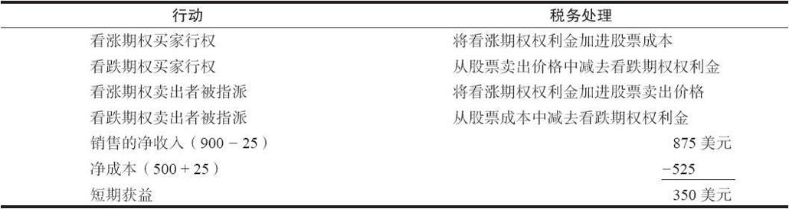
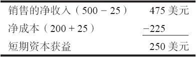
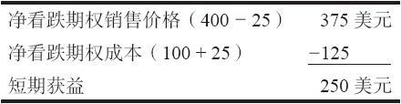
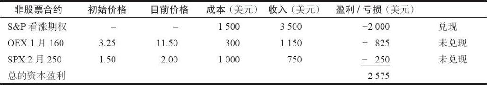

# 42.2　基本税务处理

就税收的目的而言，行权或指派的场内期权属于不同的范畴。期权交易的最初的权利金被结合在股票的交易中。在股票头寸平仓之前，这个股票头寸不必纳税。行权或指派的看涨期权和看跌期权有四种不同的组合。表42-1总结了将期权权利金用在股票成本或卖出价格上的方法。

下面几节里是一些如何对待这些不同的交易的示例。除了这些说明基本税务处理的示例之外，还有一些补充的策略。

### 42.2.1　看涨期权买家

如果一个看涨期权的持有者随后卖掉了这个看涨期权或者让它无价值到期，他就有一笔资本盈利或者亏损。对股票期权来说，期权的这个持有期决定了这笔盈利或亏损是长期的还是短期的。正如前面提到的，如果持有长达1年以上，就有可能算作长期盈利。就税收的目的而言，一手无价值到期的期权被看作是一手在到期日按照零美元卖掉的期权。

【示例42-1】一个投资者在7月花5点买了一手XYZ 10月50看涨期权。他在9月1日用9点卖掉了这手看涨期权。也就是说，通过平仓交易，他兑现了一笔资本盈利。他需要报税的盈利是按表42-1所显示的那样计算出来的，假设他在买入和卖出这手期权时都付了25美元的手续费。

表42-1　将期权权利金用在股票成本或销售价格上

换过来说，如果股票在10月到期日时价格下跌，这手10月50看涨期权无价值到期，那么这个看涨期权的买家就有525美元的亏损（他的整个净成本）。如果他将这个头寸一直持有到它无价值到期，在他的需要报税的交易中，他就可以申报一笔短期的525美元的亏损。

### 42.2.2　看跌期权买家

只要他不是同时也买入标的股票，看跌期权持有者的税务后果同看涨期权的持有者基本相似。这个对看跌期权持有者的税务责任的初级讨论是以他没有同时拥有标的股票为前提的。如果看跌期权持有者在期权市场卖掉他的看跌期权，或者是让它无价值到期，盈利或亏损就被算作资本盈利，它对持有1年以上的股票看跌期权来说是长期的。在历史上，买入看跌期权或许是投资者在一个下跌的市场中能够得到长期盈利的唯一途径。

【示例42-2】一个投资者在股票价格为43的时候花2点买入了一手XYZ 4月40看跌期权。后来，股票价格下跌，看跌期权被卖掉，售价为5点。手续费在每次期权交易中都是25美元，因此，他需要报的税如下。

换过来说，如果他在一个上涨的市场里赔钱卖掉了这个看跌期权，他就有了短期资本亏损。此外，如果他让这个看跌期权完全无价值地到期，他的短期亏损就等于整个净成本，也就是225美元。

### 42.2.3　看涨期权卖出者

卖出的看涨期权，无论是在期权市场中被买回来，还是无价值到期，都是短期资本盈利。一手卖出的看涨期权无法产生长期盈利，无论持有的时间有多长。对卖出的看涨期权的这种处理方法即使在投资者同时拥有标的股票的情况下（也就是说，他持有的是一个卖出备兑）也同样如此。只要这个看涨期权被买回来，或者是让它无价值到期，这个看涨期权上的盈利或亏损，就税收的目的而言，就同标的股票分开处理。

【示例42-3】一个交易者出售了一手裸XYZ 7月30看涨期权，售价为3点，3个月之后他把它买了回来，买价是1点。每次交易的手续费是25美元，因此，需要报税的盈利如下。

如果这个投资者没有把这个看涨期权买回来，而是幸运到能够让它无价值到期，那么，他就税收目的而言的盈利就会是275美元的净销售收入。对一个无价值到期的期权来说，它的购买成本被看作是零。

### 42.2.4　看跌期权卖出者

对卖出的看跌期权的税务处理同卖出的看涨期权很相似。如果这个看跌期权在公开市场上被买了回来，或者是允许它无价值到期，这个交易就是一个短期的资本项目。

【示例42-4】一个投资者用4点卖出了一手XYZ 7月40看跌期权，后来，在标的股票上扬之后，又花了2点将它买了回来。手续费是每手期权交易25美元，因此，税务的情况就会是：

如果看跌期权被允许无价值到期，这个投资者就会有净盈利375美元，这笔盈利是短期的。

### 42.2.5　60/40规则

正如上面提到的，非股票期权头寸和期货头寸必须在税务年度结束的时候根据市场价进行结算，无论是兑现的还是未兑现的盈亏都必须报税。这条相同的规则也适用于期货头寸。在这些盈亏上的税率比在股票期权上的税率要低。无论实际持有期是多长，交易者的60%的必须报税的资产算作长期资本投资，40%算作短期的。这条规则意味着即使这笔盈利来自像日间交易这样非常短时间的活动，它也可以部分被算作长期投资。

自1986年以来，长期和短期资本盈利的税率就是相同的。如果长期税率会降低，那么，这条规则又会有其他用处。

【示例42-5】一个非股票期权的交易者在这个税收年度中做了3笔交易。现在是这个税收年度结束的时候了，他必须计算他需要报的税。首先，他用1500美元买入了标普500指数（SPX）看涨期权，在6个星期之后将它们卖掉，售价是3500美元。其次，他在7个月之前买入了1手标普100指数（OEX）的1月160看涨期权，价格是3.25，这个头寸现在还在手里。它目前的交易价是11.50。最后，他3天之前卖出了5手标普500指数2月250看跌期权，价格是1.50。它们目前的交易价格是2。这些交易的净盈利可以在不考虑持有期长短的情况下计算出来。

总的要报税的数量是2575美元，不管持有期是多长，也不管盈利或亏损是兑现的还是未兑现的。在这个总的需要报税的数额中，有60%（1545美元）是作为长期投资的盈利，而40%（1030美元）是按短期投资盈利考虑的。

在实践中，投资者在不同的税表（报税附表1256）上计算这些数字，然后只是将这两个最终的数字（1545美元和1030美元）填入资本盈利或亏损的税务表。注意一下，如果投资者在非股票期权中有亏损，同股票期权相比，在税收上他反而有了劣势，因为他必须将一部分亏损作为长期投资的亏损，而股票期权的交易者可以将他所有的亏损作为短期投资的亏损。
