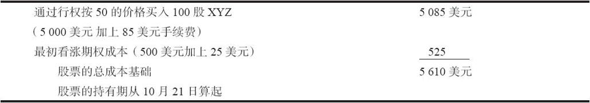
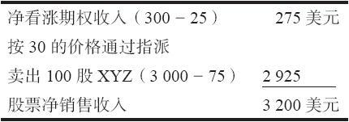
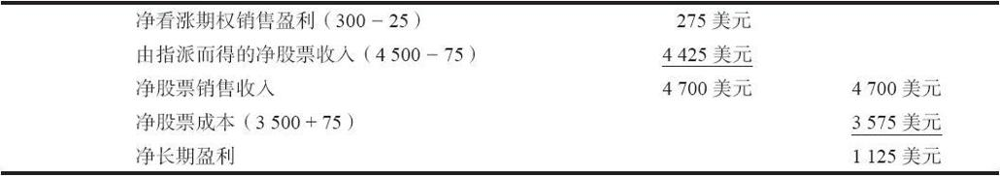
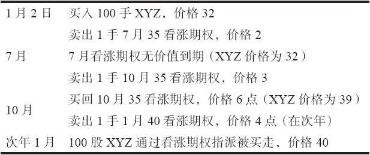
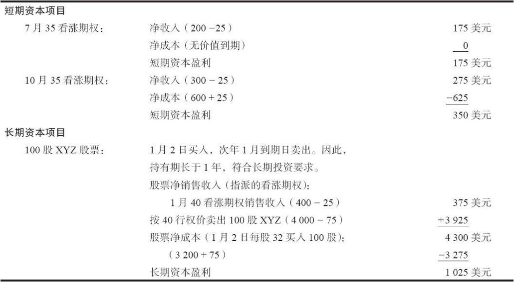
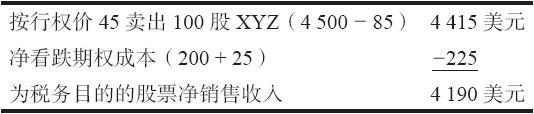
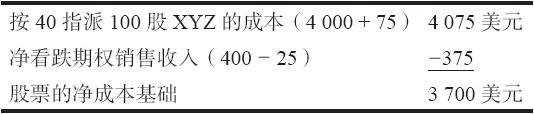

# 42.3　行权和指派

除了我们在后面要讨论的特殊情况，对非股票期权来说，行权和指派对税收没有影响，因为所有的头寸在税务年度的年底都要根据市场价进行结算。不过，因为股票期权是要考虑持有期限的，下面的讨论就同它们有关。

### 42.3.1　看涨期权行权

一个拥有实值期权的股票看涨期权的持有者也许应当决定将他的看涨期权行权，而不是到期权市场将它卖掉。如果他这样做，在期权交易自身之上就没有纳税的责任。而且，股票的成本就加进了最初的看涨期权的成本。此外，持有期从买入股票的那一天算起（看涨期权行权的后一天）。期权的持有期对由行权产生的股票头寸没有影响。

【示例42-6】一手XYZ 10月50看涨期权是花5点在7月1日买入的。到10月到期日时股票价格上升了，期权持有者决定将这个看涨期权在10月20日行权。期权的手续费是25美元，股票的手续费是85美元。于是，股票的成本基础就可以计算如下。

当这笔股票最终被卖掉的时候，根据股票售价同它的报税成本基础5610美元的比较，这可以是一笔盈利，也可以是一笔亏损。此外，除非是一直将这些股票持有到下一年10月21日，这就是一笔短期的投资。

### 42.3.2　看涨期权指派

如果一个卖出的看涨期权没有平仓，而是被指派了，这个看涨期权的净销售收入就被加进到标的股票的销售收入中。看涨期权的持有期不再作数，股票头寸被看作是在指派的那一天卖掉的。

【示例42-7】一个裸卖出者卖出了一手XYZ 7月30看涨期权，售价为3点，后来，在接近到期日时，这个期权变成实值的，期权不是被买回来，而是被指派了。股票的手续费是75美元。他从股票中得到的净销售收入可以计算如下。

在投资者出售的是一个裸的或者说未备兑的看涨期权的情况里，他在指派时是卖空股票。当然，他也可以通过在公开市场买入股票来交割以回补卖空。这样的股票卖空要遵守同卖空相关的税务法令，也就是说，任何从股票卖空中得到的盈利或亏损都是短期的盈利或亏损。

备兑卖出者的税务处理。另一方面，如果投资者是就一个备兑看涨期权而被指派的，也就是说，他所运作的是一个卖出备兑的策略，而且，他在收到指派通知的时候选择交割他所拥有的股票，那么，他就有了一个完整的股票交易。股票的成本是由在早些时候的购买价格所决定的，当然，净销售盈利是根据前面的示例由指派来决定的。

从股票的购买和销售中确定盈利是一件容易的事，不过，要确定这个交易的税务情况就不那么容易。为了防止持股人使用深度实值看涨期权在股票变为长期投资的同时保护他们的股票，税务部门建立一些复杂的税务法。它们可以总结如下。

（1）如果股票期权在出售的时候是虚值的，它对股票的持有期就没有影响。

（2）如果股票期权在出售的时候是深度实值的，而且股票的持有期还没有达到长期持有的期限，那么，股票的持有期就被取消。

（3）如果股票期权是实值的，但实值的程度不深，那么，股票的持有期在持有这个看涨期权期间就被中止。

这些规则相对复杂，值得做进一步的解释。第1条规则只是说交易者可以出售虚值看涨期权而不会有任何问题。如果股票后来价格上涨，通到期权指派而被买走，出售股票所得到的盈利就包括期权权利金。根据股票的持有期，这个交易可以是长期的，也可以是短期的。

【示例42-8】假设在某一年的9月1日，一个投资者用35的价格买了100股XYZ。他将股票留在手里一段时间，然后，在第2年的7月15日，在股票上涨到43，他卖出了一手10月45看涨期权，价格为3点。

因此，这个备兑卖出者就有1125美元的盈利，它是长期投资，因为股票持有期超过1年（从买入股票的这一年的9月1日到股票被指派买走的下一年的10月的到期日）。

请注意，如果在相似的情况中，股票持有期少于1年，这笔盈利就是短期投资的盈利。

让我们现在来看一看其他两条规则。它们是相互关联的，因为它们之间的区别只在于“过度实值”的定义。只有在股票持有期没有成为长期投资，而且有看涨期权出售的情况下，它们才发挥作用。如果售出的看涨期权过度实值，它就可以取消股票的短期持有时间。否则的话，它就中止持有期。如果看涨期权是实值的，但不是过度实值，它就被看作合格的卖出备兑。在决定一个看涨期权是否合格方面，有若干相关的规则。在实际讨论这个复杂的定义之前，让我们先从两个示例来看一看一个看涨期权是否合格会有的影响。

【示例42-9】合格的卖出备兑：在3月1日，一个投资者买入了100股XYZ，价格是35。他将这个股票持有了3个半月，在7月15日，股票上升到43。这时，他卖出了一手实值看涨期权，10月40看涨期权，价格是6。到10月到期日，股票价格下跌，看涨期权无价值到期。

他现在面临下面的情况：从出售看涨期权所得的575美元的短期盈利，加上他买入100股XYZ，持有期只有3个半月。因此，出售10月看涨期权中止了他的持有期，但是没有取消它。

他现在可以将股票再持有8个半月，然后把它作为长期投资卖掉。

如果这个示例里的股票价格保持在40之上，而且因为看涨期权的指派而被买走，净结果就会是，像前面的示例那样，期权的盈利被加进股票的销售价格中，而且，因为卖出合格的备兑看涨期权可以在3个半月中止股票的持有期，所以整个净盈利会是短期投资的盈利。

这是一个出售不是过度实值的看涨期权的示例。不过，如果交易者是就还没有成为长期持有的股票出售一手过度实值的看涨期权的话，那么，这个股票的持有期会被取消。这就是说，如果这个看涨期权接着被买回来或者无价值到期，这个股票必须要再持有1年才能被视为长期投资。这个规则有可能用在对投资者有利的方向。如果投资者买入了股票，而股票价格下跌，他面临有一笔长期亏损的危险，但是，他实际上并不想卖掉这只股票，那么，他就可以卖出一手过度实值的看涨期权（如果有这样的期权存在的话），从而取消在这个股票上的持有期。

合格的备兑看涨期权。上面的示例和讨论总结了同卖出备兑有关的税务规则。现在，让我们来看一看什么样的看涨期权是合格的备兑看涨期权。下面的规则是文字解释。大多数投资者使用根据这些规则建立起来的表格。这些表格可以在“附录E”中找到。（记住，这些规则有可能变化，你需要咨询税务顾问，看看最新的数字是什么。）合格的备兑看涨期权是：

（1）期权在卖出的时候离到期的时间多于30天；

（2）卖出的看涨期权的行权价不低于下面的基准价位。

①首先决定可用股票价格（ASP）。这一般是该股票前一天的收盘价。不过，如果股票开盘的时候比前一个收盘价高110%，那么，可用股票价格就是较高的开盘价。

②如果ASP低于25美元，那么，这个基准行权价就是ASP的85%。因此，任何卖出的看涨期权如果行权价低于ASP的85%，就不合格。（例如，如果股票价格是12，投资者卖出一手行权价为10的看涨期权，这样的期权就不合格：它过度实值。）

③如果ASP在25.13~60之间，那么这个基准价格就是下一个最低的行权价。因此，如果股票价格是39，投资者卖出一手行权价为35的看涨期权，这个看涨期权就是合格的。

④如果ASP高于60但是低于150，而且看涨期权离到期不止90天，那么，这个基准价格就是低于ASP的两个行权价。这里有一个进一步的考虑，那就是这个基准价格不能比ASP低过10点。因此，如果股票的交易价是90，投资者可以卖出一手行权价为80的看涨期权，只要这个看涨期权离到期还有不止90天，这个看涨期权就是合格的。

⑤如果ASP大于150，而且看涨期权离到期不止90天，那么，这个基准价格就是ASP之下的两个行权价。因此，如果期权的行权价间距是10点，那么，投资者可以出售20点实值的看涨期权，这个期权还是合格的。当然，如果有5点的行权价间距，那么，投资者就不能卖出一个实值高于10点的看涨期权，否则，这个看涨期权就是不合格的。

这些规则相当复杂。这是为什么我们在“附录E”中对它们进行总结的原因。此外，它们始终都是有可能发生变化的，因此，如果投资者考虑要就一个性质仍然是短期的股票出售一手实值的备兑看涨期权，他应当向他的税务顾问或经纪人咨询一下，以确定这个实值看涨期权是否合格。

同合格的看涨期权相关，还有一条进一步的规则。还记得吗，我们说过，上面的规则只有在当看涨期权卖出时股票还不是长期持有的时候才适用。如果股票在期权卖出时已经是长期持有了，那么，在看涨期权被指派，股票被买走的时候，它就被看作长期的，不管看涨期权在卖出的时候行权价是什么。不过，如果投资者就已经长期持有的股票卖出看涨期权，然后认赔买回这个看涨期权，这个看涨期权上的亏损就必须看作长期亏损，因为这个股票是长期持有的。

总的来说，就报税而言，对备兑看涨期权卖出者来说，上升的市场是最好的。如果他卖出虚值看涨期权而股票上涨了，他在看涨期权上有短期的亏损，再加上在股票中有长期盈利。

【示例42-10】在某一年的1月2日，一个投资者买入了100股XYZ，价格为32，付了75美元手续费，与此同时他也卖出了1手7月35看涨期权，售价为2点。这个7月35看涨期权无价值到期了，这个投资者于是又用3点的价格卖出了1手10月35看涨期权。到了10月，XYZ的价格是39，投资者用6点买回了10月35看涨期权（它是实值的），同时卖出了1手1月40看涨期权，价格是4点。在1月，在到期日，股票通过看涨期权的指派而被用40的价格买走。投资者在股票上有了长期资本盈利，因为他将股票持有了1年之上。他同时在1月35和10月35看涨期权上有两手短期资本交易。表42-2和表42-3显示了他在运作这个卖出备兑策略中的净税务处理。期权手续费在每笔交易上是25美元。

表42-2　交易总结

表42-3　交易的税务处理

无论是就盈利还是税收而言，对这个备兑看涨期权卖出者来说，事情都进展得很好。他不但在1年的时间内在他的股票和期权交易上有850美元的盈利，而且他在税收方面也得到很好的待遇。他在7月和10月期权交易中加起来承接了175美元的短期亏损，同时，得到了1025美元的长期盈利。

这个示例说明了税务处理对备兑卖出者的重要性：就税收而言，他的优化情景是一个上升的市场，因为，如果他将标的股票持有1年以上，他就可能得到长期盈利，与此同时，他还可以因为以更高价格平仓卖出的看涨期权减少短期亏损。不幸的是，在一个下跌的市场里，会出现相反的情况：短期期权盈利加上标的股票上可能的长期亏损。有一些可以避免长期亏损的方法，例如，买入一手看跌期权（本章后面会讨论），或者在股票变成长期之前就盒式价差进行卖空。不过，这些运作会打断卖出备兑的策略，因此，未必是一种聪明的选择。

总体来说，如果备兑看涨期权卖出者手里有的是一手卖出的实值看涨期权，而且接近到期日，那么，他有几种选择。如果股票还不是长期持有，他可以选择买回卖出的看涨期权，同时卖出另一手到期日超出股票长期持有期限的看涨期权。这是前面那个示例中假想的投资者针对他的10月35看涨期权所做的。因为这个看涨期权是实值的，他可以选择让这个看涨期权被指派，当时就从这个头寸中提走他的盈利。不过，这会产生一笔短期盈利，因为股票的持有期还没有超过1年，因此，他可以通过买回期权的办法将这手10月35看涨期权平仓，与此同时卖出另一手到期日可以使得股票的持有期超过1年的看涨期权。他因此卖出了在下一年到期的1月40看涨期权。注意一下，这个投资者不但决定把股票留作长期投资，而且决定想要获得更多的潜在盈利：他将看涨期权向上挪仓到更高的行权价。这就使得持有期持续下去。一手实值的卖出会中止这个持有期。

### 42.3.3　交割“新”股票以防止出现大量长期盈利

有的备兑看涨期权卖出者在看涨期权被指派时，也许不想交割他们用来为卖出的看涨期权做对冲的股票。例如，如果备兑卖出者就一个成本基础极低的股票而出售期权，他也许不愿意为了卖掉他持有的这只特别的股票而付税。因此，这个被指派的看涨期权的出售者有的时候也许想在公开市场买入股票来为指派而交割，而不是交割他已经拥有的股票。回忆一下，看涨期权卖出者在公开市场买入股票来完成指派义务是完全符合期权清算所的规则的。就税收的目的而言，投资者从他的经纪人那里收到的出售股票的确认书应当特别指明卖掉的究竟是哪些具体的股份。通常这样做的方法是在确认书上写明“通过买入”，并且写明售出股票的买入日期。这样做的目的是清楚地认明就指派而交割的是“新”股票，而不是原有的长期持有的股票。投资者必须向他的经纪人下达这些指示，这样，经纪公司就会在确认书上做合适的注明。如果投资者意识到他的股票有可能会因为指派而被买走，而他不想这样的事发生，那么，他必须事前同他的经纪人商量，这样，在股票实际因为指派要被买走的时候，就可以采取适当的措施。

【示例42-11】一个投资者拥有100股XYZ股票，他的成本基础，在几年中多次分股和分发股息之后，是每股2美元。XYZ的价格为50，投资者决定按5点卖出1手XYZ 7月50看涨期权，给他的投资组合带进一些收入。接着，这个看涨期权被指派了，但是投资者不想交割他的成本基础为2美元的股票，因为这样的话他就必须为高额盈利支付资本盈利。他可以到公开市场去按目前的价格另外买100股XYZ，用它们来完成指派的义务。假定现在是7月20日，这时他收到他的XYZ 7月50看涨期权的指派通知。他从他的经纪人那里收到的按50出售100股XYZ的确认书（也就是看涨期权指派的确认书）应当写明：“通过7月20日买入”。销售日期的年份也应当在确认书上写明。这只XYZ股票的长期持有者当然必须重新掏钱到公开市场上去买入额外的XYZ以完成指派通知而进行交割。因此，如果这个投资者觉得他有可能要实施这样的策略以避免出售低成本基础股票需要承担的税务的话，他就必须存有一定数量的可以调用的资金。

### 42.3.4　看跌期权行权

如果看跌期权的持有者不是选择在场内市场将期权平仓，而是将看跌期权行权（从而按行权价出售股票），这个看跌期权的净成本就从标的股票的净销售收入中扣除。

【示例42-12】假设XYZ 4月45看跌期权是用2点买入的。XYZ在4月到期时价格跌到了45之下，这个看跌期权的持有者决定要将他的实值的期权行权，而不是到公开市场将它卖掉。股票销售的手续费是85美元，因此，从标的股票中得到的净销售盈利就是：

如果股票销售代表了一个新头寸，也就是说，投资者卖空这个标的股票，那么，根据目前同卖空有关的税务法，它最终就是一笔短期的盈利或者亏损。如果看跌期权的持有者已经拥有标的股票，并且利用看跌期权行权作为手段来卖出这只股票，那么，就税务目的而言，他在这笔股票交易上的盈利或亏损的计算方法就是从用上面的方式决定的销售收入中减去最初的净股票成本。

### 42.3.5　看跌期权指派

如果一手卖出的看跌期权被指派，股票就按行权价买入。买入股票的净成本要减去最初收入的看跌期权权利金。

【示例42-13】如果交易者最初用4点卖出了一手XYZ 7月40看跌期权，它后来被指派了，于是确定这只股票成本的方法就是（假定在买入股票时有75美元的手续费）：

通过看跌期权指派而买入的股票的持有期从看跌期权被指派的那一天算起。投资者卖出期权的那段时间对股票持有期没有影响。显然，看跌期权交易自身并没有变为一项资本项目；它变成了股票交易的一部分。
