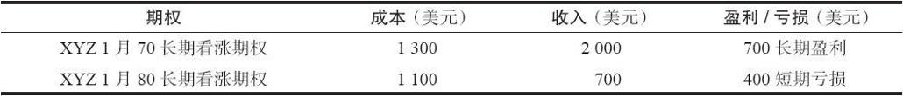

# 42.6　股票期权的税务计划策略

### 42.6.1　推迟短期看涨期权盈利

看涨期权持有者有可能对将盈利推迟到明年或者将看涨期权的短期盈利转换为股票的长期盈利感兴趣。前者要比后者容易得多。一手赚钱的、明年到期的看涨期权的持有者可以采取三种可能的行动，让他在保留住盈利的同时，将盈利推迟到明年。一种方法是买入一手看跌期权。显然，为这个目的，他应当买入一手实值看跌期权。通过这样做，他既可以在时间价值上尽量少花钱，同时也锁住了他在看涨期权上的盈利。随着时间的进展和股价的起伏，这个看跌期权和看涨期权组合的盈利和亏损会基本相抵，除非股票强势上涨，超过了看跌期权的行权价。不过，这也可能是一件令人高兴的事，因为会有更多的盈利积累起来。这个组合在第二年平仓，从而产生一笔盈利。

【示例42-14】一个投资者在9月1日买入了一手XYZ 1月40看涨期权，价格是3点。这个看涨期权在明年到期。XYZ到12月1日价格上涨，看涨期权的售价是6点。这个看涨期权持有者想要提取他的3点的盈利，但是也想将这笔盈利留到下一年。举例来说，他可以通过花5点买入一手XYZ 1月50看跌期权来做到这一点。于是他持有这个组合，一直到第2年的第1天。在这个时候，他可以按照至少10点将整个组合平仓，因为看跌期权的行权价高出看涨期权10点。在这两个行权价上，时间价值的增值都会带来好处。无论是哪种情况，他都有盈利。他最初的成本是8点（看涨期权是3点，看跌期权是5点）。因此，他就有效地将最初持有看涨期权的盈利提取推迟到了下一个税务年。这个看涨期权持有者在这类交易中承担的风险是买入和卖出看跌期权的手续费，以及看跌期权中可能出现的任何时间价值的损失。投资者必须自己决定是这些风险大（尽管它们也许相对比较小），还是将税务盈利推迟到明年的好处大。

看涨期权持有者有可能将他的税务盈利推迟到明年的另一种方法是就他目前持有的看涨期权卖出另一手XYZ看涨期权。也就是说，他创造出了一手价差。为了保证他能够尽量多地保存他现有的盈利，他应当出售一手实值看涨期权。事实上，如果可能的话，他应当出售一手行权价比他现在持有的看涨期权的行权价要低的实值看涨期权，以保证如果标的股票价格大幅度下跌的话，他的盈利不会受到影响。一旦建立了这个价差，它就被一直保持到下一个税务年度，然后再平仓。这种推迟盈利的方法中明显的风险是，交易者有可能在卖出的看涨期权上收到指派通知。这种可能性并不一定十分遥远，因为用来保护目前盈利的是实值看涨期权。这样的指派会导致在由此产生的买入和卖出标的股票中的大量的手续费成本，而且有可能显著地减少他的盈利。因此，这个策略中的风险大于前面的那个策略（买入一手看跌期权），不过，如果在这个标的股票上没有看跌期权交易的话，它就是唯一的选择。

【示例42-15】一个投资者在8月花3点买入一手XYZ 2月50看涨期权。在12月，股票的价格是65，看涨期权的价格是15。持有者想要“锁住”这12点的看涨期权盈利，但是想要将实际盈利推迟到下一个税务年度。他可以按将近20点的价格卖出一手XYZ 2月45看涨期权来做到这一点。如果不收到指派通知的话，只要股票价格在50之上，他就能够在2月到期日用5点的成本将这个价差平仓。因此，他最后会有12点的盈利（从卖出2月45中收入20点，为2月50付出3点，加上将价差平仓提取盈利时付出5点）。如果股票在2月到期之前跌到50之下，他的盈利甚至会更大，因为他就不必在把价差平仓时支付整整5点。

看涨期权持有者锁住他的盈利同时仍然可以将这个盈利推迟到下一个税务年度的第三种办法是，继续持有这个看涨期权，同时卖空股票。这显然可以锁住盈利，因为卖空股票和买入看涨期权在潜在盈利方面随着标的股票上下波动会相互抵消。事实上，如果股票下跌，就会有大量的盈利。不过，使用这个策略也有它的风险。卖空的手续费成本会减少看涨期权持有者的盈利。此外，如果标的股票在股票卖空持有期间有除息的话，这个策略家还必须支付股息。另外，卖空股票需要更多的保证金。

上面讨论的三种方法显示了如何将一个赚钱的看涨期权的盈利推迟到下一个税务年度。当这笔盈利兑现的时候，它仍然是短期盈利。看涨期权持有者能够有希望将他的盈利转换为长期盈利的唯一办法是将这个看涨期权行权，然后将股票持有一年以上。还记得吗，通过行权而得到的股票的持有期是从行权那天开始的，期权的持有期不算在内。如果投资者选择这种方法，他当然要在买入股票的手续费上花去一定的盈利，而且，他将置身在整整一年的市场风险中。在保护持有的股票同时让持有期积累起来方面，有若干的方法，例如，卖出虚值看涨期权，不过，选择这种方法的投资者要小心衡量由此而产生的风险，将它同最终会得到的长期盈利的可能好处进行比较。投资者同时也应当注意，如果他要持有这只股票，他就必须投入相当数量的资金。

### 42.6.2　推迟看跌期权持有者的短期盈利

不必讨论大量的细节，对一个有短期盈利且要在下一年到期的看跌期权持有者来说，有相似的方法可以推迟到下一个税务年度再兑现这笔盈利。一个保护他的盈利的简单方法是买入看涨期权来保护他有盈利的看跌期权。为了这个目的，他应当买入实值看涨期权。由此产生的组合在性质上同前面一节看涨期权持有者所使用的相似。

保护他的盈利，同时仍然可以将它的兑现推迟到下一年的第2种方法是就他买入的看跌期权卖出另一手XYZ看跌期权。这就创造出一个垂直价差。如果可能的话，这个看跌期权持有者应当出售一个实值的看跌期权。当然，他不想要卖出一个深度实值、有可能会导致提前指派的期权。这样的一个价差的结果同我们在前面一节详细介绍过的看涨期权价差相似。

最后，如果有足够的现金或者质押来支持购买股票的话，这个看跌期权的持有者可以买入标的股票。这样就可以锁住盈利，因为随着股票上下运动，股票和看跌期权在盈利或亏损方面会相互抵消。事实上，如果股票大幅度上涨，涨到这个看跌期权的行权价之上，那么就有可能产生更大的盈利。

在上面所介绍的每一种方法中，头寸都是在下一个税务年度平仓的，因此，盈利的兑现就被推迟了。

### 42.6.3　从卖出中推迟盈利的困难

作为讨论推迟期权交易盈利的这一节中的最后一点，介绍一下想要将从卖出未备兑期权中得到的盈利推迟到下一个税务年度的策略伴随的风险，也许是适当的。回忆一下，在上面我们显示了，一个看涨期权或看跌期权的持有者，当期权中有未兑现的盈利，而期权要到下一个税务年度才到期时，可以设法“锁住”盈利，并将它推迟。对于试行这样的税务推迟策略的持有者来说，风险金额主要是手续费成本或者少量的为期权所支付的时间价值。不过，对于期权的卖出者来说，如果他有未兑现的盈利，那么，想要将这个盈利“锁住”并且将它的兑现推迟到下一个税务年度，就要困难得多。初看起来，看涨期权的卖出者似乎只需要采取同持有者所采取的行动相反的行动：买入标的股票，买入另一手看涨期权，或者卖出一手看跌期权。不幸的是，这些行动都无法“锁住”看涨期权卖出者的盈利。事实上，如果想要将他的盈利推迟到下一年，他有可能会亏损掉大量的投资。

【示例42-16】一个投资者出售了一手未备兑的XYZ 1月50看涨期权，价格为5点，在12月初，这个看涨期权的价值下跌到1点。他也许应当提取4点的盈利，但是，也许又想要将这个盈利的兑现推迟到下一个税务年度。因为出售这个看涨期权现在有盈利，股票的价格一定是下跌了，或许在12月初售价为45。买入标的股票无法实现他的目的，因为如果股票在跨入下一年时继续下跌，他在买入的股票上就会有大量亏损，而在看涨期权卖出上只能得到多出1点的盈利。与此相似，买入一手看涨期权也起不了多大作用。一个行权价更低的看涨期权（例如，XYZ 1月45或者1月40）在股票价格继续下跌时会有大量亏损。一手虚值看涨期权（XYZ 1月60）是不可接受的，因为在到期日如果标的股票上扬到55之上，这个卖出者在出售1月50看涨期权和买入1月60看涨期权上都会输钱。出售一手看跌期权也无法“锁住”盈利。如果标的股票继续下跌，卖出看跌期权一侧的亏损就会大过卖出1月50看涨期权所剩的1点的潜在盈利。换一种情况，如果股票上扬，在1月50看涨期权上的亏损会抵消由出售看跌期权所产生的潜在的有限盈利。因此，对未备兑看涨期权的卖出者来说，没有相对容易的方法来“锁住”一笔盈利，将它的兑现推迟到下一个税务年度。想要推迟盈利兑现的看跌期权的卖出者也有同样的问题。

### 42.6.4　价差上的不均等的税收处理

有两类价差，它们的多头腿的税务处理同空头腿不同。一个是正常的股票期权价差，它的持有期长于1年。另一个是所有期货、期货期权或现金结算的期权同股票期权之间的价差。

对股票期权来说，如果投资者的价差建立了1年以上，如果标的股票的运动是对他有利的，他在买入的一侧会有长期盈利的处理，而在卖出的一侧则会有短期亏损的处理。

【示例42-17】一个投资者使用离到期还有15个月的期权建立了一手XYZ看多的看涨期权价差。在这一年的10月，他买入了1月70长期（LEAPS）看涨期权，到期日刚好是1年。与此同时，他卖出了1月80长期看涨期权，到期日也刚好是1年。假定他为1月70看涨期权支付了13点，从1月80看涨期权上收入了7点。在下一年的12月，他决定要将这个价差平仓，他这时已经将这个头寸持有了1年，准确地说，是14个月。XYZ在这时价格上涨了，这个价差价值9点。XYZ的价格是90，1月70看涨期权的交易价是20，1月80看涨期权的交易价是11。下面的表格总结了为税务目的而列出的资本盈利和亏损（在这个示例里没有计算手续费）。

这个价差不必报税，因为1/2的长期盈利少于整个的短期亏损。持有这个价差的投资者处于有利的情况中，因为，即使他在这个价差中实际赚钱了（用6点支出买入，按9点收入卖出），由于对这个价差的两条腿的不同的税务处理，他在报税中可以申报一笔亏损。

在上面的示例里，要实现这个税务优势，股票必须朝对投资者有利的方向运动。如果股票朝相反方向运动，那么，投资者应当在价差买入的一侧达到一年的持有期之前将他的价差平仓。这就可以避免长期亏损。

就这一点而言，另一类价差也许更具有吸引力。这是非股票期权对股票期权的价差。在这样的情况里，交易者希望在非股票资产或期货上盈利，因为这个盈利的一部分自动就是长期盈利。他同时想要在股票期权的一侧承接亏损，因为这一部分整个都是短期亏损。

要做到这一点，没有无风险的途径。例如，投资者可以买入一组股票看跌期权，然后卖出一个指数看跌期权来对冲，整个指数的表现同所选股票多少相似。如果指数价格上升，那么，投资者在股票期权上就有短期亏损，而指数看跌期权上的盈利中有一部分是长期盈利。不过，如果指数价格下跌，反过来就成了事实，于是就会产生长期亏损，而这通常不是人们想要的。此外，这个价差有自身的风险，特别是在股票篮子同指数之间的跟踪风险。

这就提出了一个重要的问题：投资者在只是为了税务目的而建立价差时要格外小心。他也许会因此而输钱，更不要说会有不利的税务后果。同往常一样，在尝试任何以税务为目的的策略之前，必须向税务专家进行咨询。
