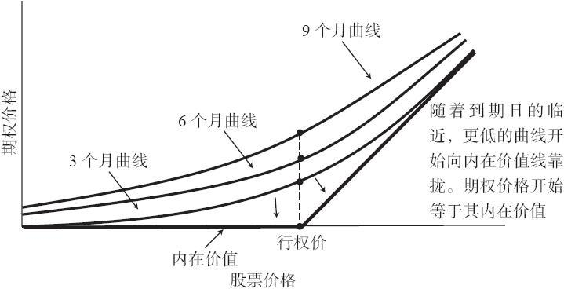
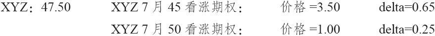

# 3.2　买入看涨期权的风险和收益

对看涨期权的买家来说，最重要的是要意识到，一般而言只有在股票价格上涨的时候他才有可能会盈利。如果标的股票价格下跌，不管他花多大的功夫去分析和选择应当买入的看涨期权，买入的期权都不会产生任何盈利。不过，这个事实不应当妨碍投资者在选择看涨期权方面做一定的分析。我们见得太多的是，看涨期权的买家觉得某只股票要上涨，而且在这一点上他没有预测错，但是由于没有在买入看涨期权时对各种可以使用的期权进行风险和收益分析，结果还是赔了钱。他选对了股票，可是买错了看涨期权。

因为看涨期权买家的最好同盟是标的股票的向上运动，因此标的股票的挑选就成了看涨期权买家要做的最重要选择。对买入看涨期权来说，抓住正确的时机非常重要，因此，在挑选股票时，技术分析也许比基本面因素更为重要：即便有利好的基本面因素存在，你也不知道这些因素需要多长时间才会反应到股票价格上。投资者必须对标的股票是看多的，才会考虑买入这只股票的看涨期权。只有在选好股票之后，投资者才能考虑其他因素，例如，用什么样的行权价和买哪一个到期月的合约等。看涨期权买家还会有另一个同盟军，但这个同盟军通常是他预计不到的：如果他的看涨期权的标的股票价格变得波动很大，看涨期权的价格就会上涨，以反映这种变化。

相对于购买实值看涨期权，购买虚值看涨期权的潜在风险和潜在收益都更大。许多看涨期权购买者都倾向于选择虚值看涨期权，他们的理由是因为虚值期权的价格更便宜。对看涨期权的买家来说，绝对的以金额来衡量的价格不应当是一个决定因素。如果某个投资者的资金只够买入最便宜的看涨期权，他就不应当用这个策略来进行投机。如果标的股票价格有显著的上涨，虚值看涨期权自然能提供更大的收益。但是如果股票价格的上涨幅度不大，实值看涨期权的表现就会更好一些。

【示例3-3】XYZ的价格是65，7月60看涨期权的售价是7，7月70看涨期权的售价是3。如果股票相对缓慢地上升到68，7月70虚值看涨期权的买家实际上就会遭受亏损，尽管这个看涨期权还没有过期。另一方面，7月60实值期权的持有者则会得到一笔盈利，因为这个看涨期权至少可以按8点，也就是它的内在价值出售。关键是，就百分比来看，当股票上升幅度不大时，实值看涨期权能够提供更好的收益，而虚值看涨期权则在股票价格上升幅度更大的情况下会表现更好。

在考虑风险的情况下，实值看涨期权的风险概率显然要小一些。在前面的示例中，只有在XYZ至少跌了5点的时候，实值看涨期权的买家才会失去其全部投资。另一方面，对7月70虚值看涨期权的买家来说，除非在期权到期时股票上涨5点以上，否则他就会失去全部投资。显然，相对于虚值看涨期权，实值看涨期权无价值到期的可能性要小得多。

对看涨期权的买家来说，剩余存续期的长短也有关系。如果股票价格与行权价相当接近，那么，近期看涨期权就会紧跟标的股票的价格运动，因此，它的收益最高，风险也最大。远期看涨期权，由于它距到期日还有很长时间，因而风险最小，百分比收益也最小。中期看涨期权的风险和收益都是中等的，因而通常最有买入的吸引力。许多时候，投资者买入较长期看涨期权的原因是因为它的价格只比中期看涨期权高出1或者1.5点。他觉得多支付这一点钱而得到3个月的额外时间是值得的。不过，这种想问题的方法是不对的，因为大多数看涨期权的买家都不会持有期权超过60天或90天。因此，即使多花1个点就可以得到长期看涨期权的想法似乎挺吸引人，但也会是一笔不必要的花费。就像我们通常所见到的那样，投资者在60天或者90天就会把看涨期权卖掉。

### 3.2.1　时机的确定

如果投资者确定标的股票价格会上涨，这对他选择买入什么样的看涨期权会有帮助。如果投资者相当肯定标的股票马上就会上涨，他就应当努力得到更多的收益，而不必那么担心风险。这就意味着应买入短期的、稍稍虚值的看涨期权。当然，这只是一般的规则。无论在什么情况下，投资者一般都不要买入离到期只有一个星期的虚值看涨期权。另一方面，如果投资者在时机把握上非常欠缺，他就应当买入长期的看涨期权，这样，如果他对时机的把握差错很大，可以降低他的风险。这种情况很容易出现，例如，如果某个投资者认为某个公司的利好基本面因素会在将来的某个未知时刻表现出来，并且促使该公司股价上涨的话，因为该投资者不知道这个利好基本面因素是会在下个月还是会在此后6个月里发挥作用，他就应当买入长期看涨期权，给时机把握上的错误留下余地。

许多情况下，投资者并不打算长期持有看涨期权，他只是想在标的股票的短期快速上涨中获利。在这种情况下，他应当买入相对短期的实值看涨期权。尽管这个看涨期权可能要比同一标的股票的虚值看涨期权更贵一些，但只要标的股票价格上涨，这个期权就几乎肯定会上涨。因此，这个短期的交易者就会盈利。

### 3.2.2　delta

到现在，读者应当对与看涨期权相关的各种基本事实较为了解了。当股票价格与看涨期权行权价相同时，时间价值最高；它是实值或虚值程度最浅的期权；期权的价格不是线性因时减值的，随着到期日的临近，时间价值消失的速度会更快。为了再复习一下，这里重印了第1章里讲到的期权定价曲线。请注意，上面提到的所有事实都可以在图3-1中观察到。与中间区域相比，这些曲线在两头时与“内在价值”线的距离更近，这就意味着时间价值在股票价格等于行权价时最大，在股票价格偏离行权价时最小，无论是向实值方向还是向虚值方向偏离。此外，3个月期的期权曲线位于内在价值线和9个月期的期权曲线的中间，这意味着当期权是平值的或近值（near-the-money）时，它的因时减值率是呈非线性的。读者还可以翻回到第1章，看看时间价值的因时减值图形（见图1-4）。

图3-1　3个月、6个月和9个月看涨期权的定价曲线

买家应当熟悉看涨期权的另一个特性，就是期权的对冲比率（delta）。简单地说，期权的delta就是当标的股票运动1点时，看涨期权的价格会上涨或下跌的数量。

【示例3-4】当标的股票的价格比看涨期权的行权价高很多时，这个看涨期权的delta就接近于1。假设XYZ是60，XYZ 7月50看涨期权是10.10，如果XYZ移动了1点，不管是上涨还是下跌，看涨期权的价格都会大致变化1点。深度虚值看涨期权的delta接近于零。如果XYZ是40，7月50看涨期权的售价可能是0.25点。如果XYZ运动了1点，到41或者39，看涨期权价格的变动会很小。当股票价格等于行权价时，delta一般是0.50或者0.60。对期限很长的看涨期权来说，如果期权是平值的，它的delta会更大一些。因此，如果XYZ是50，7月50看涨期权是5，如果XYZ涨到了51，看涨期权就上涨到5.50点，如果XYZ跌到49，看涨期权就下跌到4.50点。

事实上，标的股票价格的每一次变动，即使只变动了几分钱，delta也都会发生变动。这涉及一个精确的数学推导，我们会在后面对其进行介绍。要明白这一点，最容易地是根据这样的事实：深度实值期权的delta是1。不过，如果股票经过很多次每次1点的下跌而跌到行权价时，delta就更可能是0.50，肯定不会再是1。在现实中，股票的价格一跌，delta就立刻会发生变化。那些对几何学感兴趣的读者，可以在前文提到的期权价格曲线上画出delta的图形。delta是价格曲线的正切线的斜率。请注意，深度实值期权位于该曲线的右上方，非常接近于内在价值线，它的斜率为1。与此相似，深度虚值看涨期权居于价格曲线的左面，同样接近于内在价值线，它的斜率为零。

因为人们通常根据标的股票1整点的变化来讨论期权价格的变化，（而不是依据价格中的“即时”变化），于是就产生了上行delta（up delta）和下行delta（down delta）的概念。也就是说，如果标的股票向上运动了1整点，某个delta为0.50的看涨期权的价格也许会上涨0.55点。但是，如果股票下跌了1整点，看涨期权价格则可能只下跌0.45点。当股票上涨了1整点而不是下跌了1整点时，这个看涨期权价格的净变化是不同的。根据观察，上行delta是0.55，而下行delta则是0.45。在真正的数学意义上，只有一种delta，它衡量的是“即时的”价格变动。上行delta和下行delta与其说是理论性的概念，还不如说是实践性的概念。它们所说明的是这样的事实：只要股票价格有变化，真实delta就会立即发生变化，即使股票价格的变化小于1点。在下面的示例和后面的章节里，我们将只讨论一种delta。

对所有看涨期权的买家来说，delta都是一则重要的信息，因为它可以告诉买家，标的股票的短期运动会带来多大的增值或减值。这个信息可以帮助看涨期权的买家决定买入什么样的看涨期权。

【示例3-5】如果XYZ是47.50，而看涨期权的买家预计标的股票价格会有一个快速但可能有限的上涨，他应当买入45看涨期权呢，还是50看涨期权呢？delta也许可以帮助他做出决定。他有下面的信息：

让我们作一个简单但不怎么准确的假设，让事情变得容易一些。假设delta在短期内保持不变。如果该买家预期股票会迅速上涨到49，买入哪一个期权更合适呢？XYZ上涨了1.50点，7月45看涨期权会相应上涨0.97点（1.50×0.65），7月50看涨期权会对应上涨0.37点（1.50×0.25）。因此，如果7月45看涨期权的价格上升了0.97，那么它就增值了28%。而如果7月50看涨期权的价格上升了0.37，那它就增值了37%。所以，在这个简单的示例中，买入7月50看涨期权看起来更有利可图。当然，在实际的投资分析中，应当把手续费考虑进去。

投资者不必自己费力计算delta。任何好一点的期权数据提供商都会提供这样的信息，有的经纪公司还免费提供这样的信息。

在后面的许多章节中，根据不同策略中的不同应用，我们将描述delta的更高阶应用方法。
