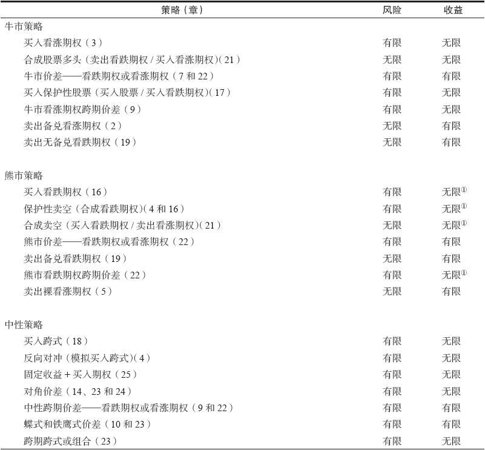
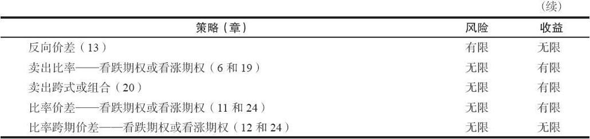

# 第七部分　附录

## 附录A　策略总结

除套利策略和税收策略之外，我们介绍的其他策略都与市场运动的风险有关。因此可以很方便地根据它们的风险收益特征和它们的市场展望（牛市、熊市或中性）来进行总结。表A-1列出了所有这些我们曾讨论过的风险策略，根据它们的风险收益特征进行区分。如果某个策略家对市场方向有明确的看法，或者他愿意承受风险，那他可以看一下表A-1，以选择一个最符合他的想法的策略。策略名称后面的括号中的数字注明了我们在哪一章中讨论了这个策略。

表A-1　常用策略小结

①其中风险或收益的有限是基于股票价格不会跌到零以下这个事实。显然，虽然这样的潜在盈亏可能从技术上是有限的，但如果标的股票下跌了很多，它将会非常大

表A-1对这些策略的风险收益特征进行了一个很广的区分。例如，牛市看涨期权跨期价差实际上并没有无限的潜在盈利，除非它的近期看涨期权无价值到期。事实上，所有跨期价差或对角价差头寸在近期期权到期前都只有有限的潜在盈利。

此外，有限风险的定义可以很宽泛。一些策略相对于其初始投资的风险确实有限，比如买入保护性股票。在其他情况下，虽然风险有限，但是却是其全部初始投资。也就是说，交易者可能会在短期内亏损掉其全部投资。买入期权，牛市、熊市和跨期价差就是这样的例子。

因此，尽管表A-1从很广的角度展示了这些不同的策略，但交易者在实际采用其中某一个策略时，必须认识到这个策略在收益、风险和市场展望上的差异。
