# 附录C　公式

公式出现在第几章在括号中标注。本附录中使用以下符号：

x——当前股票价格；

s——行权价；

c——看涨期权价格；

p——看跌期权价格；

r——利率；

t——时间；

f——期货价格；

B——盈亏平衡点；

U——上行盈亏平衡点；

D——下行盈亏平衡点；

P——最大潜在盈利；

R——最大潜在风险；

BSM——布莱克–斯科尔斯模型。

下标说明这是多重项目。例如，s1，s2和s3表明这个公式中的3个行权价。这些公式是按照标题的字母或按照策略顺序排列的。

年化风险（第26章）
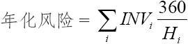
式中　INVi——在持有期Hi中，期权投资占总资产的比例；

Hi——以天计算的持有期长度。

熊市价差

s1＜s2

——看涨期权（第8章）
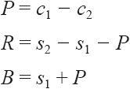
——看跌期权（第22章）
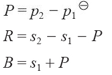
注：原文为P=c1/2-c1/2，疑有误。——译者注

布莱克模型（第34章）
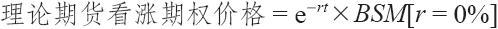
式中，BSM[r=0]为布莱克–斯科尔斯模型在把短期利率设为0%时的值。
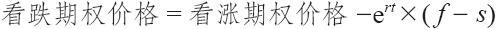
式中，f为期货价格。

布莱克–斯科尔斯模型（第28章）
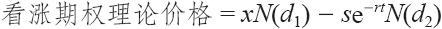
式中
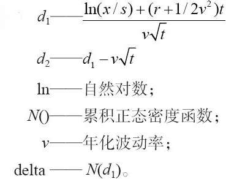
牛市价差

s1＜s2

——看涨期权（第7章）
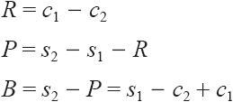
——看跌期权（第22章）
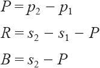
蝶式价差

蝶式价差是由行权价分别为s1和s2的牛市价差和行权价分别为s2和s3的熊市价差所组成的。

s1＜s2＜s3

s3-s2=s2-s1

——如果全都用看涨期权（第10章）
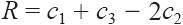
——如果全都用看跌期权（第23章）
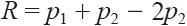
——如果是用看跌期权牛市价差和看涨期权熊市价差（第23章）
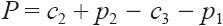
——如果是用看涨期权牛市价差和看跌期权熊市价差（第23章）
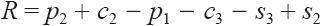
那么
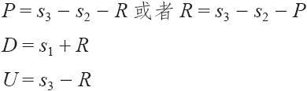
买入组合（第18章）
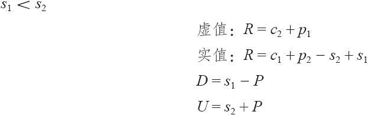
卖出组合（第20章）

鹰式（铁鹰式）（第23章）
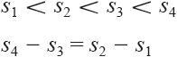
如果同时使用看涨期权和看跌期权（铁鹰式）（第23章）
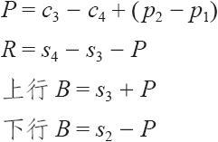
转换和反转组合的盈利（第27章）

转换组合：P=s+c-x-p+股息-持有成本

反转组合：P=x+p-c-s-股息+持有成本

式中
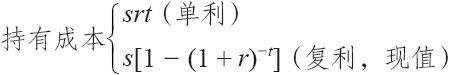
卖出备兑看涨期权（第2章）

P=s+c-x

B=x-c

卖出备兑跨式（第20章）

P=s+c+p-x
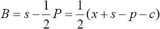
累积正态密度函数（第28章）

近似到5次多项式
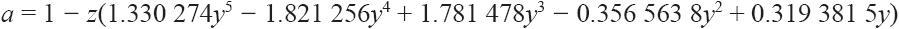
式中
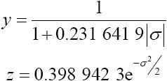
那么
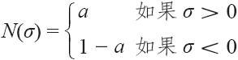
delta——见布莱克–斯科尔斯模型

delta中性比率：

——股票对期权（第6章）
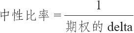
——价差（第11章和第24章）
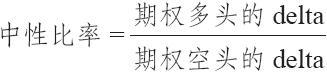
相等期货头寸（第34章）

EFP=delta×期权数量

相等股票头寸（第28章）

ESP=合约乘数×delta×期权数量

式中，合约乘数为1手期权所对应的买入或卖出的标的股票的股份数（通常为100）。

期货合约合理价差（第29章）

——股票指数期货

指数价值×（1+rt）+股息现值

请参见现值。

未来股票价格（第28章）

——对数正态分布，假设股票价格运动有固定数量的标准差

式中　q——未来股票价格

vt——这个时段的波动率

a——运动的标准差数量（一般是-3.0≤a≤3.0）

gamma（第40章）
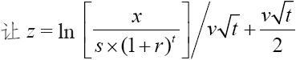
那么
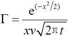
铁鹰式——参见鹰式

股票运动的概率（第28章）

——对数正态分布
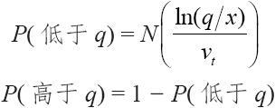
式中　q——该股票价格

N（）——累积正态密度函数

ln——自然对数

vt——这个时段的波动率

某个未来数量的现值（第28章）
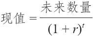
看跌期权定价模型——套利模型（第28章）

看跌期权理论价格=看涨期权理论价格+s–x+股息–持有成本

式中：

卖出看涨期权比率（第6章）

一般的例子：买入m手股票，卖出n手看涨期权
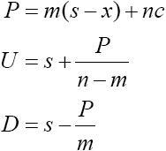
2：1比率（卖出跨式）
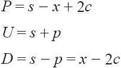
比率价差

——看涨期权（第11章）：买入n1手较低行权价（s1）的看跌期权，卖出n2手较高行权价（s2）的看涨期权
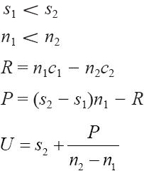
为买入看涨期权采取的后续行动的盈亏平衡成本（第11章）
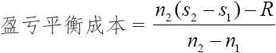
——看跌期权（第24章）：买入n2手较高行权价（s2）的看跌期权，卖出n1手较低行权价（s1）的看跌期权
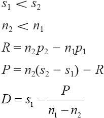
反转组合——参见转换和反转组合的盈利

反向对冲（第4章）——模拟买入跨式

一般的例子：卖出m手股票，买入n手看涨期权
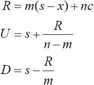
2：1比率（买入跨式）：

R=s+2c-x

U=s+R

D=s-R=x-2c

使用看跌期权（买入100股股票，买入2手看跌期权）（第18章）

R=x+2p-s

U=s+R=x+2p

D=s-R

买入跨式（第18章）

R=p+c

U=s+R

D=-R

卖出跨式（第20章）

P=p+c

U=s+p

D=s-p

合成买入看跌期权——卖出股票并买入看涨期权（第4章）

R=s+c-x

B=s-c

卖出变量比率（第6章）

——买入100股股票，卖出1手行权价为s1的看涨期权，卖出1手行权价为s2的看涨期权
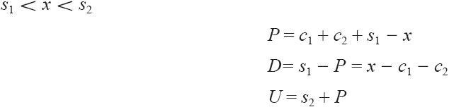
波动率——标准差（第28章）
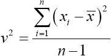
式中　xi——每日股票收盘价；

x——这些xi的均值（平均值）；

n——观测值的数量。

如果v为年化波动率，那么某段特定时期t的波动率则为
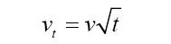
