# 附录D　图形

策略所出现的章号标注在括号内。

A.内在价值——看涨期权（第1章）
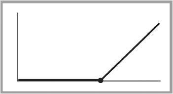
B.内在价值——看跌期权（第15章）
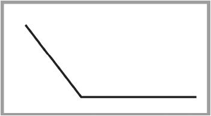
C.看涨期权价值曲线（第1章）
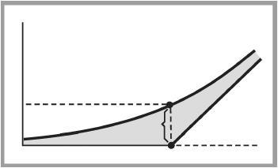
D.看跌期权价值曲线（第15章）
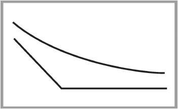
E.时间价值的因时减值（第1章）
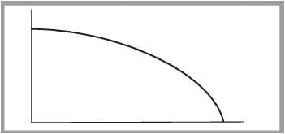
F.对数正态分布（第28章）
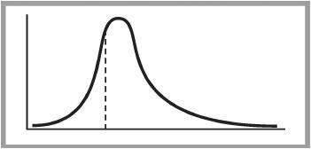
G.买入看涨期权（第1章）

（买入股票/买入看跌期权——第17章）
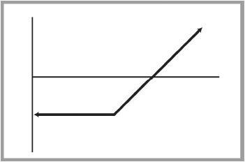
H.买入看跌期权（第16章）

（卖出股票/买入看涨期权——第4章）
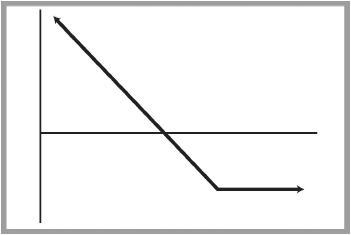
I.卖出备兑看涨期权（第2章）

卖出裸看跌期权（第19章）
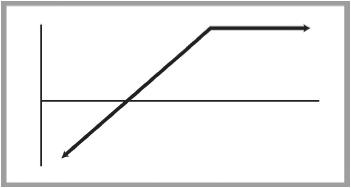
J.卖出裸看涨期权（第5章）

（卖出股票/卖出看跌期权——第19章）
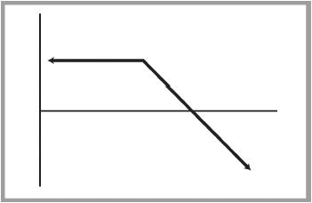
K.牛市价差（第7章和第22章）

（卖出备兑看涨期权+买入虚值看跌期权——第17章）
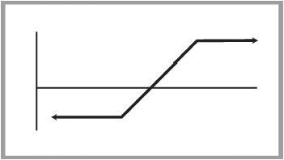
L.熊市价差（第8章和第22章）
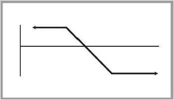
M.跨期价差（第9章和第22章）
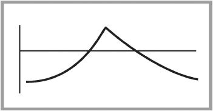
N.蝶式价差（第10章和第23章）
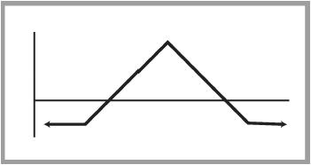
O.卖出裸跨式（第20章）

卖出看涨期权比率（买入100股股票，卖出2手看涨期权——第6章）

卖出看跌期权比率（卖出100股股票，卖出2手看跌期权——第19章）
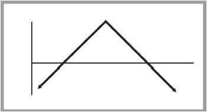
P.买入跨式（第18章）

反向对冲（卖出100股股票，买入2手看涨期权——第4章）

看跌期权对冲（买入100股股票，买入2手看跌期权——第18章）
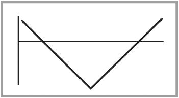
Q.卖出组合（第20章）

买入变量比率（买入100股股票，卖出2手行权价不同的看涨期权——第6章）
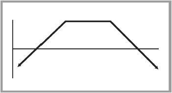
R.买入组合（第18章）

（卖出100股股票，买入2手不同行权价的看涨期权——第4章）
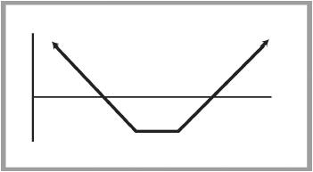
S.看涨期权比率价差（第11章）
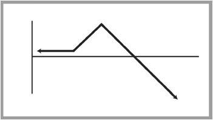
T.看跌期权比率价差（第24章）
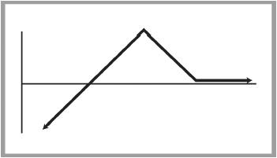
U.反向跨期价差（第13章）
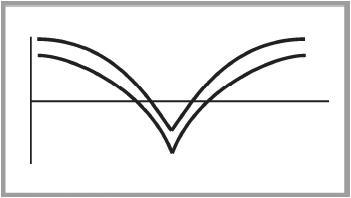
V.铁鹰式价差（鹰式）（第23章）
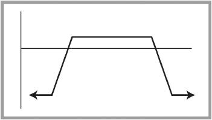
W.双重跨期价差（第23章）
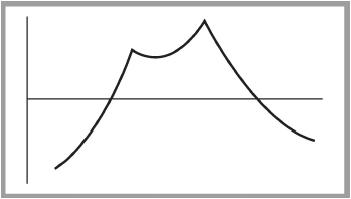
