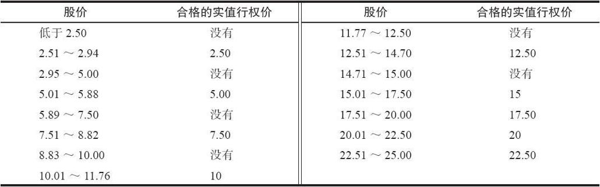
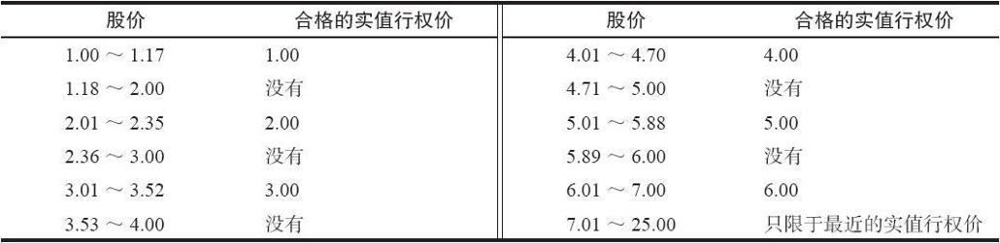
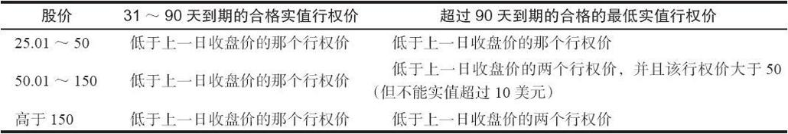

# 附录E　合格的备兑看涨期权

从税收的角度，在股票的持有期内卖出虚值看涨期权，不会对股票的持有期有影响。不过，当卖出实值看涨期权时，它就会消除该普通股的持有期，除非该股票已经符合长期持有标准了。这种情况的唯一例外是该备兑看涨期权符合标准，那么该持有期就只会中断而不是消除。表E-1显示了在股票的价格区间内，能够卖出的看涨期权的最低行权价。

表E-1　当股价为25美元或更低，并且行权价间距为2.50美元时，合格的备兑看涨期权的行权价

表E-2　当股价为25美元或更低，并且行权价间距为1.00美元时，合格的备兑看涨期权的行权价

表E-3　当股价高于25美元时，合格的备兑看涨期权的行权价

不管行权价间距是1.00，5.00还是10.00，或其他什么数字，这些规则都是适用的。在上述所有表格中，“股价”都是指上一日的收盘价，除非股票在下一日的开盘价高于110%，并且该期权是在跳空日卖出的，那这时上述表格中的“股价”就会为该日的开盘价。
