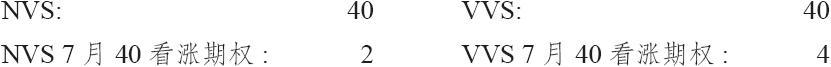
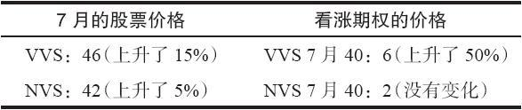
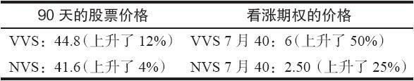

# 3.4　高级选择标准

前面的看涨期权选择标准只是一些初级技巧。在实际操作中，在某个具体的时刻，投资者通常不会只对一只股票看多。事实上，他也希望有一份看涨期权的名单，这些看涨期权在任何时候都是“最好的”买入对象。使用某些选择股票的方法，或者是技术面的，或者是基本面的，他可以选出3~4种看起来能提供最好收益的看涨期权。这份名单里的看涨期权应当按潜在收益的大小排序，不过编制这份名单本身就是一件很重要的事。

因买入目的而对看涨期权排序时，选择标准应该基于标的股票的波动率。从数学上来说，这样做并不是一件容易的事，大家看得到的许多看涨期权排序都是严格以标的股票的百分比变化为基础的。这样的名单很容易把人带入歧途，得出错误的结论。

【示例3-6】有两只股票，它们都有场内看涨期权：波动性不大的NVS和波动性相当大的VVS。因为波动性大的股票的看涨期权的价格会比波动性小的高，因此就有可能有下面的价格：

如果就买入的目的将对这两个看涨期权进行排序的话，要是严格地按照标的股票的百分比变化，NVS的看涨期权看上去似乎是个更好的买入对象。例如，投资者也许会看到类似“标的股票上涨10%时可以买入的最好的看涨期权”这样的名单。在这个示例里，如果在到期时每只股票都上涨了10%，NVS和VVS的价格都会是44。因此，NVS 7月40看涨期权就会价值4，也就是说，价格涨了一倍，潜在盈利是100%。同时，VVS 7月40看涨期权也会价值4，对看涨期权的买家来说，盈利是0%。这样的分析会使得投资者认为买入NVS 7月40看涨期权更合算。这样的结论可能是错的，因为在对这两只股票的潜在变化进行排序时，基于的是一个错误的假设。假设这两只股票在到期时都有10%的运动概率是不对的。相对于波动率更低的股票来说，波动率更高的股票自然有大得多的上涨10%（或者更多）的机会。任何只考虑标的股票的百分比变化而不考虑它们的波动率，并由此得到的期权排序，都是没有价值的，因而不能被采用。

对这两个7月40看涨期权的正确比较方法是使用标的股票的实际波动率。假定波动率较大的股票VVS在7月到期以前的时间里会有15%的运动，而波动率较小的股票NVS在同样的时段内预计只有5%的运动。利用这一信息，看涨期权的买家可以得出这样的结论：VVS 7月40看涨期权更值得买。

通过假设每个股票价格的上涨幅度与它们的波动率相对应，我们可以看到，尽管VVS 7月40一开始时要贵出一倍，但它的潜在收益还是更好。这个分析方法具有更大的现实性。

就这个排序过程而言，还有一点需要强调。因为大多数看涨期权是按30~90天的持有期而买入的，那么假定这些期权会被持有至到期就是不正确的。也就是说，即使投资者所买的是6个月的看涨期权，他通常也会在1~3个月之内将它平仓，以获得盈利或是限制亏损。因此，这个看涨期权的名单就应当以看涨期权在其实际持有期（例如90天）内的表现为基础来得到。

假定在我们的示例里波动率较大的VVS股票在90天内有可能会上涨12%，而波动率较小的NVS股票在90天的潜在上涨率只有4%。在90天里，这些7月40看涨期权不会为持平价（at parity），因为离7月到期日还剩有一段时间。因此，有必要预测一下在90天的持有期结束时它们会有怎样的价格。假定标的股票的价格会对应其波动率而上涨，下面的价格就是对7月40看涨期权在90天后卖出时的准确估计：

由于90天后看涨期权还有一段时间才到期，因此它们都还有时间价值。VVS看涨期权中的时间价值会更大一些，因为标的股票的波动率更大。使用这种分析方法，仍然是应当买入VVS的看涨期权。

对看涨期权的买家来说，潜在收益的正确排序方法可以表达如下：

（1）假定每只股票在一个固定的时段（30、60或90天）内都会根据其波动率而上涨；

（2）对每次上涨后的看涨期权价格进行估计；

（3）按照进攻型买入方式对所有潜在的买入看涨期权行为按最高百分比收益机会进行排序；

（4）假定每只股票的价格都会跟随其波动率而下跌；

（5）对每次下跌后的看涨期权价格进行估计；

（6）按照收益/风险比（用第5步得出的亏损百分比去除第2步得出的收益百分比）对所有可购买的看涨期权排序。

从第3步得出的名单会产生比较激进的购买方式，因为它只考虑了潜在收益。从第6步得出的名单的投机性会比较小一些。这个分析的方法自动结合了前面所设定的标准，例如买入短期虚值看涨期权称为进攻型的购买方式，买入长期实值看涨期权称为保守型的购买方式。delta也是波动率的函数，第1步和第4步基本上将它结合进去了。

要进行这种分析需要借助计算机。看涨期权的买家通常可以从经纪商或者数据商那里得到这样一份名单。对那些有计算机并且想自己作这种分析的人来说，在第28章里讨论数学技巧的部分里，有如何计算股票波动率和为各种看涨期权定价的细节。

### 3.4.1　被高估或被低估的看涨期权

有现成的公式可以预测出一个看涨期权应当有什么样的价格，这些公式是以股票价格与行权价之间的关系、剩余存续期，以及标的股票的波动率为根据的。这些公式有一定的用途，例如，可以用它们来进行上面所说的分析中的第2步，对看涨期权在标的股票每次上涨后的价格进行估计。在现实中，看涨期权的实际价格会与由这些公式所计算出的价格有所不同。如果看涨期权的实际卖价高于其“合理”（计算出的）价格，这个看涨期权就视为被高估的（overpriced）。如果看涨期权的实际交易价格低于其“合理”价格，它就视为被低估的（underpriced）。

如果该看涨期权确实是被高估的，那么就可以用既能降低它们的成本又能保留上行潜在盈利的策略。不过这个策略要求在买入看涨期权之外，再建立一个看跌期权价差，因此，它不在我们现在讨论的范围之内。我们将在第23章讨论看涨期权和看跌期权组合的价差时对其进行介绍。

一般而言，看涨期权的价格与其“合理”价格的差异很小，比如为0.10或0.20。在理论上，如果被低估的看涨期权回到其“合理”价格，那买入被低估的看涨期权的买家会稍微有一些优势。但是，在实践中，这些信息只对做市商或者那些只付很少或不付手续费就可以交易期权的公司交易员才最有用。由于要支付手续费，普通公众即使知道了有这种小额的价格差异存在，也无法从中直接获利。

投资者在决定应当买入什么样的看涨期权时，不应当只是以这个看涨期权是否被低估为根据。如果他买了一个“便宜”的看涨期权，而这个看涨期权在他买入之后就下跌了，那么这个看涨期权在他买入时是否被低估，对他说来并没有多大意义。事实上，前面所描写的对买入的看涨期权进行排序的方法给了被低估的看涨期权一定的优势。但是，根据我们所推荐的分析方法，被少量低估并不一定就使得某个看涨期权成为购买的首选对象。

### 3.4.2　时间价值是一个误称

我们在本书的许多地方都将讨论这个议题，最突出的是在讨论波动率交易的时候。在这里引进这个议题的原因是，即使是没有经验的期权交易者也必须懂得，期权的价格中不是内在价值的那部分，也就是我们通常叫做“时间价值”的那部分，实际上并不只是由时间价值构成的。的确，随着到期日的临近，时间最终会夺走期权价格中的这部分价值。但是，当期权离到期日还有相当长的时间时，期权价值中更重要的一个组成部分实际上是波动率。如果交易者认为它的标的股票会有相当大的波动率，那么这个期权就会很贵；如果他们的看法相反，这个期权就会相当便宜。这样的贵或便宜是反映在期权价格的不是内在价值的那部分里的。例如，在1天的时间里，6个月的期权不会减值多少，但是，如果交易者对波动率的看法迅速发生变化，那就会严重地影响到这个期权的价格，特别是在这个期权离到期日还有很长时间的时候。因此，看涨期权的买家应当仔细地考察他所要买的期权，而不要把它们看作是某种将要作废的东西。经过谨慎地分析，如果期权的买家考虑的不只是在到期日时会发生什么，而且是在这个期权的存续过程中将发生什么，那么他就有可能会得到非常好的结果。

### 3.4.3　看涨期权买家的烦恼

无论多么努力，当一个波动率相当大的股票迅速运动了3点或4点的时候，投资者似乎常常不能从中获得厚利。其中的原因比我们现在能解释的要更复杂一些，虽然它们与delta、因时减值和标的股票的波动率有紧密的联系。我们将在第36章里讨论它们。如果你正在认真地考虑要采用买入看涨期权的策略，那在你开始大量买入看涨期权之前，应当首先读一下那一章。
