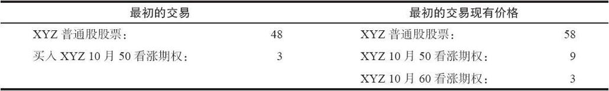
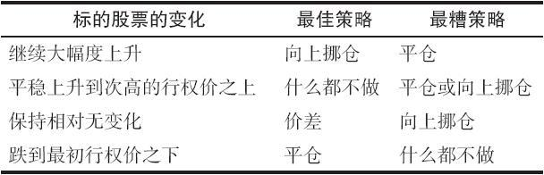
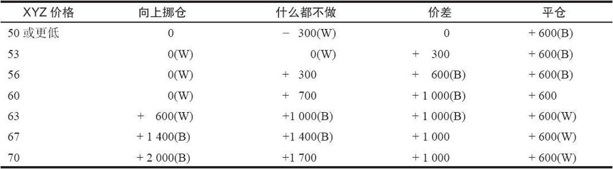
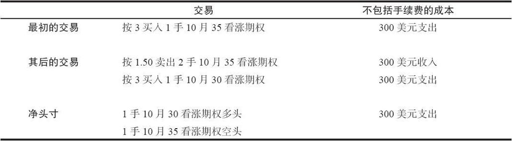
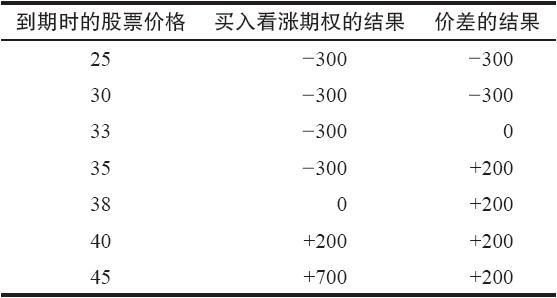
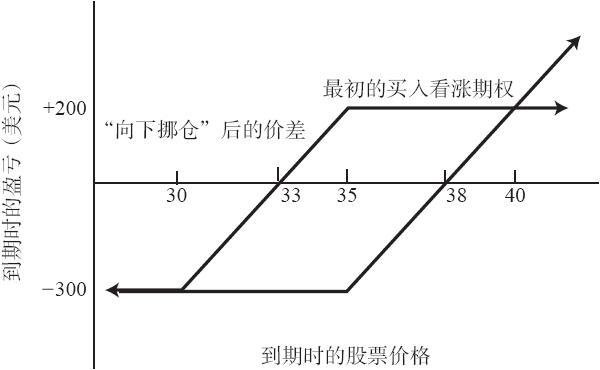

# 3.5　后续行动

当标的股票价格下跌时，看涨期权买家最简单的后续行动就是卖掉他手里的看涨期权以止损。人有一种自然的心理，想要把头寸留在手里，希望股票会涨回到或者是超过行权价。大部分时候，在股票表现很差的情况里，采取止损的办法对买家最有利。根据其交易看涨期权的交易所的规则，他可以在“心理上”建立一个止损价格，或者实际上下达卖出止损指令。一般而言，期权的止损指令都执行得很差，因此，使用“心理”止损价格要更好一些。也就是说，投资者应对根据标的股票自身的技术走势来决定他的出场点。例如，如果它跌破了支撑位，那么期权的持有者就应当下达一个市价指令（不是持有）来卖出他的看涨期权。

如果股价上涨了，买家应当考虑拿走盈利。如果某个看涨期权是以5点买的，随后涨到了10点，在类似这样的情况里，大部分买家都愿意拿走盈利。但是，如果看涨期权是以1点买入的，同一个买家就不太情愿在期权价格是2点时将它出手，因为“我只挣了1点”。这两种情况的相似性其实相当清楚：两者都几乎产生了100%的盈利，投资者没有理由会接受前者而不接受后者。这并不是说所有的用1点买入的看涨期权一旦它们的价格到了2时都应当卖掉，而是说投资者所依据的将10点的期权在价格翻倍后卖掉的因素，也应当适用于2点的看涨期权。

事实上，在所持的看涨期权增值后取走部分盈利常常是个明智的行为。例如，如果有人按3的价格买入了一些看涨期权，这些期权后来价值5，那么按5的价格将他的头寸卖掉三分之一或是一半以拿走部分盈利，对这个看涨期权持有人是有好处的。这样做之后，常常更容易让盈利在账户上滚动。而一般来说，让盈利滚动是成功交易的关键之一。

如果要支付手续费的话，将看涨期权行权一般对看涨期权的买家是不利的。在行权时，他需要为股票支付手续费，按行权价买入股票。在把股票卖出之后，他还要为卖出股票支付手续费。因为从金额上看，期权的手续费要比股票的手续费小得多，看涨期权的持有者一般都将他的看涨期权在期权市场里卖掉，而不是将它行权，从而得到更多的净美元。

### 3.5.1　锁住盈利

如果看涨期权持有者的运气足够好，标的股票相对迅速地上涨，那么他可以实施若干增强自己的头寸的策略。对于那些在应该拿走盈利还是应该继续持有头寸，以求在标的股票继续上升时获得更大的盈利，之间举棋不定的已经有未兑现盈利看涨期权持有者来说，这些策略是有帮助的。

【示例3-7】某个投资者在标的股票是48时，以3点买入了一手XYZ 10月50看涨期权。股票随后涨到了58。这个买家也许应当考虑将他的10月50看涨期权卖掉（这个期权现在可能值9点），又或者是采取其他一些行动，其中有的会涉及10月60看涨期权，它的售价是3点。表3-1对这个情况进行了总结。在这个时候，这个看涨期权的买家可能会采取以下四种基本行动中的某一种：

（1）卖出买入的看涨期权，将头寸平仓，从而拿走盈利；

（2）卖出持有的10月50看涨期权，用部分收入买入10月60看涨期权；

（3）构建一个价差头寸，持有10月50看涨期权的同时，再卖出10月60看涨期权；

（4）什么都不做，继续持有10月50看涨期权。

表3-1　XYZ 10月看涨期权目前的情形

每一种行动都会产生不同程度的风险和收益。如果持有者选择卖出10月50看涨期权，他就有6点的盈利，再去掉手续费。不过这样的话，他的头寸就不复存在了，他不会再从这个看涨期权中得到好处，也不会损失任何已经得到的盈利。他将6点的盈利兑现了。这是上面四种方法中最不激进的一种。如果标的股票价格继续上涨，涨到63以上，其他3种策略的表现都会比将把全部看涨期权平仓的做法要好。但是，如果标的股票价格不是上涨而是下跌了，并在到期日时跌到了50以下，那么这个行动所带来的盈利是四种方法中最多的。

第四种方法也是一种简单的策略，它什么都不做。如果一直持有看涨期权至到期日，这个策略就是四种策略中风险最大的。如果XYZ在到期时跌到了50以下，只有这个策略会产生亏损。不过，如果标的股票价格继续上涨，这个看涨期权就会积累更多的盈利。每个看涨期权的买家都知道全部平仓或什么都不做这两种策略的后果，并且希望找到一种替代方法，这种方法应该可以减少他的某些风险，但又不会完全放弃潜在盈利。剩下的这两种策略就是为了这个目的而设计的：它们限制了总的风险，同时又为进一步的盈利提供了机会，这个进一步的盈利在数量上应该大于全部平仓可以获得的盈利。

持有者卖掉当前持有的10月50看涨期权，然后用一部分收入买入次高行权价的看涨期权，这种策略叫作向上挪仓（roll up）。在这个示例里，他可以按9卖掉1手10月50看涨期权，收回最初投资的3点，再用剩余的收入按每手3点的价格买入2手10月60看涨期权。因此，有的时候投机者通过向上挪仓，可以在收回全部初始投资的同时，还能增加其持有的看涨期权数量。在这一步完成之后，无论它们的价格如何，10月60看涨期权都代表了纯粹的盈利。按这种方式“向上挪仓”的买家从本质上说是在用别人的钱进行投机。他把自己的钱放回了自己的口袋，使用积累的盈利来博取进一步的收益。在到期时，如果XYZ大幅度上升，这个策略的表现就会最好。但如果XYZ保持在目前的价格上，也就是停留在53以上，没有上涨到63以上，这个策略的表现就会是四个策略中最差的。

另外一个策略，也就是上面所列的第三种策略，在继续持有10月50看涨期权的同时，卖出10月60看涨期权。这就构造了一个所谓的牛市价差（bull spread）。这个技术只有那些有保证金账号，并且能满足其经纪公司对价差的最低资产要求（一般是2000美元）的交易者才能使用。这个价差是没有风险的，因为该价差中买入的那条腿，也就是10月50看涨期权，花费的是3点，而价差中卖出的那条腿，也就是10月60看涨期权，通过卖出而收入了3点。即使在到期日标的股票价格跌到50以下，所有看涨期权都无价值到期，除了手续费之外，这个交易者也不会再损失任何东西。另一方面，这个价差的最大潜在盈利是10点，也就是50与60这两个行权价之间的差。如果在到期日XYZ高于60，这个最大潜在盈利就会实现。因为在这个时候，无论标的股票价格高于60多少，10月50看涨期权的价值都会比10月60看涨期权高出10点。如果XYZ保持相对不变，在到期时高于较低的行权价，但又不比较高的行权价高出多少，这个策略就会是四种策略中表现最好的。有趣的是，无论在到期时股票的价位如何，这个策略都不会是四个策略中表现最差的。例如，如果XYZ跌到了50以下，这个策略没有风险，因而优于“什么都不做”的策略。如果XYZ有显著的上涨，这个价差就会产生10点的盈利，这就比“平仓”策略所提供的6点盈利要好。

很难说在某个既定的情况里这四种策略中哪一种最好。不过，如果能就当前持有的看涨期权卖出一个看涨期权，以产生一个没有风险或风险很小的价差，这常常是个有吸引力的答案。它绝不会变成最糟的决定，与此同时，如果XYZ价格维持在原位，那它可以产生最大的盈利。表3-2和表3-3总结了某个看涨期权持有者在有未兑现盈利时可以选择的四种策略。重申一下，这四种策略是：

表3-2　4种可选策略的比较

表3-3　到期日的盈利结果

注：“W”表示在这个价格上该策略是最糟的策略，“B”表示在这个价格上该策略是最佳策略。

（1）“平仓”，卖掉买入的看涨期权，提走盈利，不再投资；

（2）“向上挪仓”，卖掉看涨期权，收回最初的投资，用剩下的收益买入尽可能多的虚值看涨期权；

（3）“价差”，就现有的看涨期权多头卖出虚值看涨期权，以建立牛市价差；

（4）“什么都不做”，继续持有10月50看涨期权多头。

请注意，这四个策略中的任何一种在某种情况下都会被证明是最优的策略，而价差则从来都不是最糟的策略。表3-2和表3-3表示了将头寸持有至到期日时的各种结果。如果读者想要知道这些策略的具体表现及比较结果，可以看看表3-3，该表总结了这4种策略中在使用上面示例的价格时会有的潜在盈亏。

当然，投资者可以对这些策略中的任何一个进行调整。例如，他可以决定卖出一半的看涨期权多头头寸，收回大部分初始投资，并继续持有剩下的看涨期权多头头寸。这让他能从市场的后续上涨中继续获益。

卖出一部分头寸并保留剩余头寸的做法被称为“部分获利出场”（taking a partial profit）。当标的资产价格大幅上涨时，这个策略和上面所有的策略（除“上面都不做”以外）都会少赚很多钱。每当投资者采取部分获利出场、向上挪仓或其他措施时，都表明他对其所持头寸较为悲观。如果价格继续上涨，这些略带悲观的行动就是有害的。有一种交易流派的人认为，与其对一个看多头寸做一些看空调整，还不如设置一个跟踪止损（比如根据标的物的20天均线设置止损）。当然，在盘整市场中，部分获利出场可能是有利的，不过看涨期权买家获利的最好方式就是足够幸运，或在一个大趋势中一直做多。为了最大化他的盈利和驾驭趋势，他应该全力以赴，通过“什么都不做”或是设置跟踪止损来紧跟市场。

### 3.5.2　防范行动

当标的股票价格下跌时，看涨期权的买家有时会使用下面的两种策略。两者都涉及价差策略，也就是说，同时买入和卖出同一标的股票上的不同看涨期权。我们在后面的章节将详细讨论价差。这里对价差的讨论只适用于为看涨期权的买家所用。

“向下挪仓”。如果期权的持有者拥有一个期权，这个期权目前有未兑现的亏损时，这样做就有可能大大增加当股票价格有一个相对小的反弹时得到一笔有限盈利的机会。在某些情况下，投资者可以在不增加风险，或者只增加很小风险的情况下实施这个策略。

许多看涨期权的买家都经历过类似这样的情景：最初用3点买入1手XYZ 10月35期权，希望股票价格会很快上涨。结果股价下跌了，例如跌到了32。随着10月到期日的临近，这个看涨期权现在只值1.50。如果期权的买家仍然认为在到期日前股票会略有反弹，那他可以继续持有这个看涨期权，或者“向下均摊价”（average down）（按1.50买入更多的看涨期权）。无论是哪种情况，他都需要在到期前股票能反弹到38，这样才能保持盈亏平衡。要达到这一点，在到期前股票就需至少上涨15%，而这个可能性很小。这个买家可以考虑换一种方法，采取下面的策略，我们将使用一个示例来说明这个策略。

【示例3-8】此时，投资者持有10月35看涨期权：

XYZ：32

XYZ 10月35看涨期权：1.50

XYZ 10月30看涨期权：3

投资者可以卖出2手10月35看涨期权，与此同时，买入1手10月30看涨期权。如果不考虑手续费，这样做不需要额外的投资。也就是说，不考虑手续费的情况下，以每手150美元的价格，卖出2手10月35看涨期权可以收到300美元，而这刚好是买入1手10月30看涨期权的成本。这是实施向下挪仓策略的关键：投资者可以通过基本相等的钱买入1手行权价较低的看涨期权，同时卖出2手行权价较高的看涨期权。

请注意，投资者现在是要卖出他先前持有的10月35看涨期权。他先前只持有1手10月35看涨期权，而现在需要卖出2手这样的期权。与此同时，他还要再买入1手10月30看涨期权。因此，他的头寸变为：

1手XYZ 10月30看涨期权多头

1手XYZ 10月35看涨期权空头

从技术上说，这叫作牛市价差。表3-4总结了这个买家为建立这个价差而进行的交易。这个交易者现在以300美元的成本再加上手续费而“持有”这个价差。通过这个交易，他显著地降低了自己的盈亏平衡点，却没有增加风险。不过，最大潜在盈利却因此而受到限制：如果标的股票大幅反弹，他就不能在这个机会中大幅获利了。

表3-4　牛市价差中的交易

为确定盈亏平衡点是否真的降低了，考虑一下如果在10月到期时XYZ是33时的情况。10月30看涨期权会价值3个点，而当XYZ是33时，10月35看涨期权会无价值到期。因此，在这个时候，卖掉10月30看涨期权可以获得300美元，同时不必再花钱买回10月35看涨期权。因此，这个价差平仓时可以得到300美元，刚好等于“买入”它的成本。于是，在到期时，这个价差就在33上保持盈亏平衡。如果这个看涨期权的买家没有向下挪仓，他在到期日时的盈亏平衡点就会是38。因为他最初买入10月35看涨期权付了3点，因此只有当XYZ的价格是38时，他才能在平仓时收回这3点来。显然，这个股票反弹到33的机会要比38大。因此，使用这个策略，这个看涨期权的买家就大大降低了他的盈亏平衡点。

降低盈亏平衡点并不是投资者唯一关心的事。他必须同时意识到他的盈利和亏损的机会。风险基本上没有变化，仍然是300美元的债务，再加上手续费，这些都已经支付过了。实际上，风险有少许的增加，因为加入了“向下挪仓”的手续费。但是，产生最大亏损时的股票价格被降低了。如果继续持有最初买入的10月35看涨期权，在10月到期的时候，如果股票价格低于35，这个买家就会损失掉所有的300美元投资。使用这个价差策略，只有在10月到期时XYZ低于30的时候，才会出现300美元全部亏掉的结果。如果在10月到期时XYZ价格高于30，价差中多头的那条腿就能从平仓中得到一定的收入，从而避免全军覆没。由于出现最大亏损的价格被降低了5点，投资者就减少了出现最大亏损的机会。

同大多数投资一样，风险暴露的改善，也就是盈亏平衡点和最大亏损价格的降低，是以牺牲部分潜在盈利为代价的。在最初买入的看涨期权里（10月35看涨期权），最大潜在盈利是不受限制的。在新的头寸中，如果在10月到期时XYZ反弹到35，或者比35更高的价位，潜在盈利就都限制在2点以内。为了说明这一点，假设在到期时XYZ是35。这样，买入的10月30看涨期权就会价值5点，而10月35看涨期权就会无价值到期。因此这个价差平仓时的收入为5点，除去建立头寸所支付的3点，还有2点的盈利。不过，这就是这个价差的盈利极限，因为如果在到期时XYZ高于35，任何买入10月30看涨期权所得到的进一步的盈利都会被卖出的10月35看涨期权的亏损所抵消。因此，如果XYZ在到期前大幅度上涨，“向下挪仓”头寸所实现的盈利会低于最初买入看涨期权头寸所能实现的盈利。

表3-5　最初头寸与价差头寸的比较

图3-2　比较：最初的买入看涨期权与价差

表3-5和图3-2对最初的头寸和新的头寸进行了总结。请注意，当股票价格在30~40之间时，新头寸的表现要好些。在30以下，除了额外花费的手续费之外，两个头寸是相同的。如果股价反弹到40以上，最初的头寸会表现更好。如果在到期前股价没有反弹到40以上，新头寸就会是一种改善。XYZ从32反弹到40而上涨8点，或者说25%，这样的机会应当说是不大的。因此，在这个示例里，将买入的看涨期权向下挪仓，建立一个价差，应当说是一个正确的选择。

这个示例特别有吸引力，因为建立这个价差不需要额外的资金。不过，在许多情况下，投资者会发现把买入的看涨期权变成价差时的收支并不相等。会出现一些支出。这一事实并不是说不应当改变策略，因为只需要小部分的额外投资，就可以显著地增加在股票反弹时达到盈亏平衡甚至得到盈利的机会。

【示例3-9】下列的价格同前面所用的有所不同，不同在于10月30看涨期权的价格。

XYZ：32

XYZ 10月35看涨期权：1.50

XYZ 10月30看涨期权：4

根据这些价格，要向下挪仓，就会有1点的支出。这就是说，卖出2手10月35看涨期权会收到300美元（每手150美元），而买入10月30看涨期权的成本是400美元。因此，这笔交易就需要花费100美元再加上手续费才能完成。根据这些价格，向下挪仓之后的盈亏平衡点是34，仍然比最初的盈亏平衡点38要低得多。现在，由于向下挪仓额外花费了1点，因此风险增加了。如果在10月到期时XYZ跌到30以下，这个投资者的总损失就是4点加上手续费。最初买入10月35看涨期权的最大亏损是3点加上一小笔手续费。最后，这个价差的最大盈利金额是100美元减去手续费。在这个示例里，这个替代策略远远没有前面那个有吸引力。不过如果这个看涨期权的买家认为，在10月到期日前XYZ只会出现有限的反弹，他还是值得去这样做的。

投资者不应当只是因为把买入的看涨期权转换成价差需要额外的支出，就自动放弃这个策略。请注意，使用按1.50买入额外的10月35看涨期权来“向下均摊”需要额外的150美元投资。这比示例中转换为价差头寸所需的100美元还要多。通过“向下均摊”而得到的头寸，其在到期时的盈亏平衡点是37，而这个价差的盈亏平衡点是34。应当承认，向下均摊的头寸的潜在盈利要比价差高得多，但是，转换成价差的成本比“向下均摊”低，同时也提供了较低的盈亏平衡价格。

总的来说，如果股票价格下跌，看涨期权的买家有未兑现的亏损，但又不愿意将头寸平仓，那么他可以通过“向下挪仓”为价差头寸的方法，以改善其实现盈亏平衡的机会。也就是说，他可以卖出2手他目前持有的看涨期权，1手是他已经持有的，再加上另外一手，与此同时，买入1手次低行权价的看涨期权。如果卖出2手看涨期权的收入基本等于买入1手看涨期权的支出，那这个买家实施这个策略肯定对他有利，因为盈亏平衡点会显著降低。而且，一旦标的股票价格略有反弹，这个买家实现盈亏平衡或者得到小笔盈利的机会就会大大增加。

建立跨期价差（calendar spread）。当看涨期权的买家发现标的股票价格下跌时，有时他们可以采用另一种防御型的价差策略。在这种策略中，某个中期或远期看涨期权的持有者可以卖出一手相同行权价，但存续期更短的看涨期权。这就构造出了所谓的跨期价差。这样做的理由是，如果近期的看涨期权无价值到期，那这个买家买入看涨期权的总成本就降低了。如果股票价格上涨，这个看涨期权买家的盈利机会就增加。

【示例3-10】假定某个投资者在4月的某个时候以3点买入了1手XYZ 10月35看涨期权。到6月的时候，股价跌到了32，而且看上去股价还会持续低迷相当长一段时间。10月35看涨期权的持有者可以考虑按大约1点的价格卖出1手7月35看涨期权。如果在7月到期日以前XYZ保持在35以下，卖出的看涨期权就会无价值到期，从而收入1点的小额盈利。投资者仍然拥有那手10月35看涨期权，希望在10月前XYZ的价格会上涨，从而从这手看涨期权中盈利。即使到10月XYZ仍然不上涨，他也因为卖出7月35看涨期权得到的收入而减少了总亏损的金额。

这个策略使用起来不像前一个那么有吸引力。如果在7月到期日之前XYZ上涨，投资者就可能面临两个亏损的头寸。例如，假定在下个星期XYZ反弹回到36。他按1点卖出的看涨期权的售价就会更高，从而在卖出的7月35看涨期权的交易中产生未兑现的亏损。此外，10月35看涨期权的价格可能还没有涨回到最初的3点，因此，价差的另一条腿上也有未兑现的亏损。

因此，在使用这个策略时要格外小心。因为如果在近期期权到期之前标的股票迅速上涨，这个价差就会在两条腿上都有亏损。请注意，前面的价差策略就不会发生这样的情况。即使XYZ迅速上升，它也可以从反弹中得到一定的盈利。
