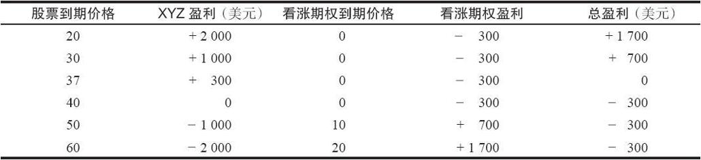
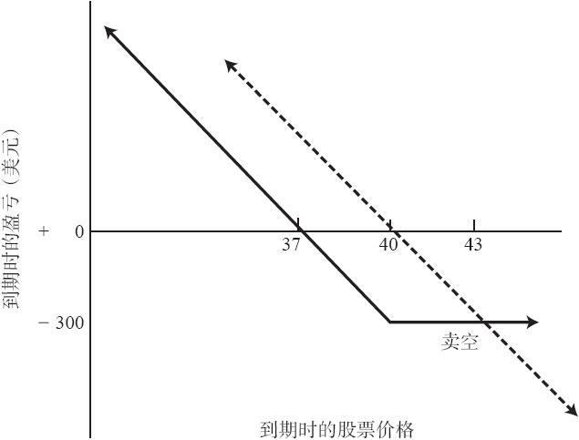
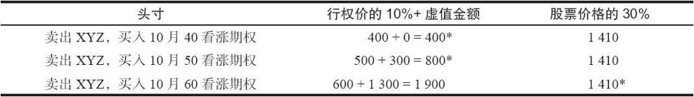

# 4.1　保护性卖空（合成看跌期权）

在卖空标的股票的同时买入看涨期权，是将卖空的风险限制在一定数额里的一种手段。从理论上来说，卖空的风险是无限的，因此许多投资者在卖空时都会有所顾虑。对这些卖空股票的投资者来说，股票价格的上涨会让他们心绪不安。投资者有可能会由于情绪的缘故而被迫作出也许是不正确的决定——回补卖空头寸，以减低心理压力。如果在卖空股票的同时持有看涨期权，投资者就可以把亏损限制在一个固定的、通常是相当小的数额内。

【示例4-1】某个投资者按40卖空XYZ股票，与此同时，以3点的价格买入1手XYZ 7月40看涨期权。如果XYZ价格下跌，卖空者就会从卖空的头寸中获利，再减去为看涨期权所付的3点，看涨期权无价值到期。因此，买入看涨期权作为保护，就牺牲了一小部分盈利。但是，如果股票价格上涨，我们就可以看到持有看涨期权的好处了。如果在7月到期时XYZ涨到40以上，卖空者就可以把看涨期权行权并按40买入股票，从而回补他的卖空头寸。因此，在这个示例中，该卖空者的最大风险就是为看涨期权所付的3点。表4-1和图4-1描述了在到期时这个策略所产生的结果。手续费没有考虑在内。请注意，在这个示例里，盈亏平衡点是37。也就是说，如果股票下跌了3点，这个保护性卖空头寸就能实现盈亏平衡，因为在看涨期权里损失了3点。当然，如果没有额外花钱买入看涨期权，卖空者在股价为37时就会有3点的盈利。但是，如果股票继续上涨到43以上，保护性卖空的表现就会超出普通卖空。在43时，两种卖空都有300美元的亏损。但在高于这个水平时，普通卖空的亏损会继续增长，而保护性卖空的亏损则是一个固定的金额。无论是哪种情况，卖空者的风险都会因标的股票发放股息而略有增长，因为他必须为卖空的股票支付股息。

表4-1　到期时的结果：保护性卖空

图4-1　保护性卖空

当投资者买入看涨期权来保护卖空头寸时，有一个简单的公式可以计算最大风险金额：

风险=买入的看涨期权的行权价+看涨期权价格–股票价格

卖空者愿意承担的风险可能不同，他也许想买入1手虚值看涨期权作为保护，而不是上面示例中的平值看涨期权。如果买入的是虚值看涨期权，保护成本就会低一些，卖空者所放弃的潜在盈利也少一些。但是他的风险就会大一些，因为只有在股票上涨到行权价之上的时候，这个看涨期权才具有保护功能。

【示例4-2】XYZ是40，XYZ的卖空者按0.50买入7月45看涨期权作为保护。他的最大可能亏损是5.50，在7月到期日时XYZ高于45的时候就会发生这样的情况。其中5点是现在股票价格40同行权价45之间的差，再加上看涨期权的成本。另一方面，如果XYZ下跌，保护性卖空头寸的盈利与未保护的卖空头寸几乎没有什么区别，因为买入看涨期权只花了0.50点。

如果投资者为保护他的卖空头寸所买入的是实值看涨期权，他的风险就会相当小。不过他的潜在盈利则会受到严重的限制。例如，当XYZ是40的时候，投资者按5.50买入了1手7月35看涨期权，如果在7月到期时XYZ高于35，他的风险就限制在0.50点。不幸的是，如果股票价格为34.50，即下跌5.50点，那他的头寸就没有任何盈利。这个保护就太大了，它对盈利限制得太厉害，以至于几乎没有可能获利。

一般而言，最好是买入平值或略微虚值的看涨期权来对卖空头寸进行保护。买入深度虚值看涨期权在保护方面起不到什么作用，除非股价急剧上涨，否则它对风险没有什么改善。正常情况下，投资者会在卖空头寸对其产生严重不利后果之前就回补。因此，花钱买入这样一个深度虚值看涨期权是一种浪费。不过，如果投资者想要他的卖空头寸有足够的“活动”空间，并且非常肯定他对这个股票极度看空的看法是正确的，那么他可以买入相当深度的虚值看涨期权来作为灾难保护，以防股票价格突然向上爆发（例如，标的股票突然收到收购要约）。

### 保证金要求

根据最新的保证金规则，如果股票空头头寸有看涨期权多头保护，投资者在保证金要求方面就会有相当的优待。实际所需的保证金为下列两项的较小值：第一，看涨期权行权价的10%加上虚值部分的金额；第二，卖空股票现有市场价值的30%。这个头寸会被逐日盯市，如果股票价格低于行权价，大部分经纪商会要求该卖空头寸按“正常”比率缴纳保证金。

【示例4-3】假定有下列的价格：

XYZ普通股股票：47

10月40看涨期权：8

10月50看涨期权：3

10月60看涨期权：1

假定某个投资者考虑在47的价位卖空100股XYZ，同时买入1手看涨期权作为保护，下面为不同行权价时的保证金要求。（请注意，期权价格自身并不是保证金要求的一部分，但是所有期权在最初买入时就需要支付全额）

注：因为保证金取两者之中的较小值，用星号（*）标出的就是所需支付的保证金。

请记住，买入的看涨期权必须是全价付清的，并且当股票价格低于看涨期权行权价时，大部分经纪商会要求在现有保证金的基础上，再额外缴纳一笔维持保证金，其金额至少等于卖空头寸的价值。
