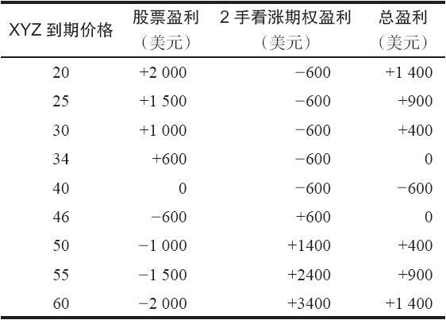
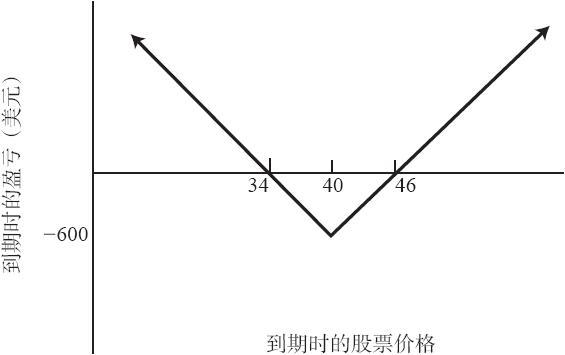

# 4.4　合成跨式价差（反向对冲）

在就股票卖空头寸而买入看涨期权方面，还有另一种策略。在这种策略里，投资者买入的看涨期权所对应的股数要多于其卖空的股数。如果在期权的存续期内标的股票上涨或下跌的幅度足够大，这个策略家就可以盈利。这个策略一般被称作反向对冲（reverse hedge）或合成跨式价差（synthetic straddle）。如果该股票有场内看跌期权交易，那这个策略就过时了，直接买入跨式价差（1手看涨期权和1手看跌期权）所产生的结果会更好。因此，这个反向对冲策略又被称为“合成跨式价差”。

这个策略的潜在亏损有限。通常是最初投资的一个中等百分比，而潜在盈利从理论上来说是没有限制的。当选择得当时（在关于波动率交易的第36章中，将仔细介绍选择的标准），买入跨式价差或合成跨式价差的成功概率是相当高的。这些特征让这个策略很有吸引力，特别是当看涨期权的权利金相对于标的股票的波动率而言比较低的时候。

【示例4-5】XYZ的价格是40，投资者认为这个股票会有较大幅度的运动，但是他不敢肯定股票会朝哪个方向运动。他可以卖空XYZ，同时按每手3的价格买入2手XYZ 7月40看涨期权，从而建立1手反向对冲。如果XYZ向上大幅度运动，他的股票会有亏损，但由于他持有2手看涨期权，这就意味着看涨期权的盈利会超出股票的亏损。另一方面，如果XYZ跌得够深，卖空股票的盈利会大于看涨期权的亏损，因为看涨期权的亏损被限制在了6点。表4-2和图4-2显示了在7月到期时不同股票价格上的各种结果。如果XYZ价格下跌，卖空股票的盈利会不断增加，而2手看涨期权的亏损则被限制在600美元（每手3点）之内，因此，如果股票价格低于34，这个反向对冲的盈利就会不断增加。当上涨的时候，尽管卖空的股票会出现亏损，但由于买入了2手看涨期权，因此看涨期权盈利的增长要快于股票卖空的亏损。如果在到期日股票价格是60，在股票卖空中有20点（2000美元）的亏损。不过，此时每手XYZ 7月40看涨期权的价格就会是20点。因此，这2手看涨期权就会价值4000美元，去掉最初600美元的投资，看涨期权的盈利就是3400美元。

表4-2　7月到期时的合成跨式价差

图4-2　合成跨式价差（反向对冲）

表4-2和图4-2也说明了另外一个重要事实：在看涨期权到期时，若股票价格刚好等于行权价，就会出现最大亏损。如果在到期时XYZ的价格是40，就会出现600美元的最大亏损。实际操作中，因为卖空者必须支付标的股票的股息，这个策略的风险还应当加上这部分股息的金额。

这个策略所需要的净保证金是标的股票的50%再加上购买这些看涨期权的总价格。在上面的示例里，也就是最初的2000美元投资（股票价格的50%）再加上为看涨期权所付的600美元，或者说2600美元再加上手续费。这个卖空的头寸是逐日盯市的，所以当股票价格上升时，质押的要求会提高。在不计手续费时，策略的最大风险是600美元，这就意味着这笔交易的净百分比风险是600美元/2600美元，也就是大约23%。对一个有可能得到非常大盈利的头寸来说，这个百分比风险是相对较小的。此外，只有当股票价格刚好等于期权行权价时，才会出现最大风险，因此实现全部最大亏损的可能性也不大。不过，投资者不应当因此而认为这个策略一定会盈利。一般而言，在3~6个月的时间里，股票运动的幅度不会非常大。不过，如果小心选择，投资者也常常可以发现股票运动幅度能够大到足以达到盈亏平衡点的情况。即使真的发生亏损，这也是为在股票有大幅运动时获得可观盈利所付出的代价。

根据上面的信息，如果股票在任何方向上有足够幅度的运动，显然都可以得到盈利。事实上，投资者可以准确地判断出，如果要盈利，在到期时股票必须达到怎么样的价格。在前面的示例里，这样的价格是34和46。下行盈亏平衡点是34，上行盈亏平衡点是46。这些盈亏平衡点很容易计算出来。首先计算出最大风险，然后再确定盈亏平衡点。

最大风险=行权价+2×看涨期权价格-股票价格

上行盈亏平衡点=行权价+最大风险

下行盈亏平衡点=行权价-最大风险

在前面的示例里，行权价是40，股票价格也是40，看涨期权的价格是3。因此，最大风险=40+2×3-40=6。因此该头寸的最大风险是6点，也就是600美元。上行的盈亏平衡点是40+6，或者说是46，下行盈亏平衡点是40–6，或者说是34。这些结论与表4-2和图4-2是一致的。

在到期之前，即使股价离行权价很近也有可能盈利，因为买入的看涨期权还剩有时间价值。

【示例4-6】如果XYZ在1个月内运动到45，每手看涨期权就会价值6点。如果发生这样的情况，投资者在股票上会有5点亏损，但每手看涨期权会有3点盈利，一共2手。因此他的净盈利是1点，也就是100美元。在到期日前，盈亏平衡点显然会低于46，因为在价格为45时该头寸是盈利的。

在理想情况下，为了更有效地实施他的策略，投资者希望能发现相对被低估的看涨期权，并且其标的股票的波动率适中。这样的情况虽然不多见，但还是可以找到。正常情况下，看涨期权的权利金能够精确地反映标的股票的波动率。不过即便是这样，这个策略仍然相当有效。因为无论它的波动率如何，几乎每一种股票都会不时出现一种直线的、幅度相当大的运动。正是在这样的时候，投资者可以从这个策略中获利。

一般而言，进行合成跨式价差交易的股票的波动率应该较大。尽管这种股票的期权权利金会比较高，但当价格呈直线运动时，股票价格的变化幅度仍会大于这些权利金。使用波动率较大的股票的另一个好处是，一般它们很少或者没有股息。这是合成跨式价差所期望的，卖空者也就不必付或者只需付很少的股息。

在建立头寸时，标的股票的技术形态也会有帮助。交易者一般希望在策略亏损的区域内不存在技术性的支撑位和压力（resistance）位。在这样的形态里，股票可以上下快速运动。交易者有时也可以交易宽幅震荡的股票，它们的股价不断地在震荡区域的这一端摆动到另一端。如果反向对冲的亏损区域刚好位于该震荡区间之内，那这个头寸也会有吸引力。

【示例4-7】在前面示例里，XYZ股票的交易范围是从30~50，它也许相当频繁地从一端摆动到另一端。现在，这个在46之上或34之下有利可图的反向对冲头寸就显得更有吸引力了。
