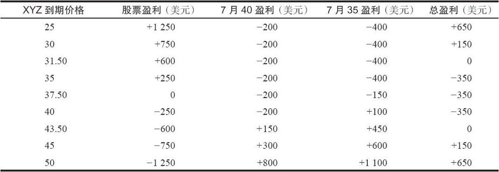
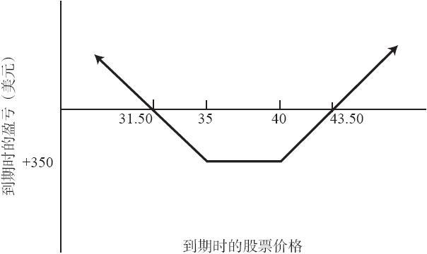

# 4.6　改变看涨期权多头和股票空头之间的比率

让我们讨论一下这个策略的另一方面。投资者不一定非要刚好买入2手看涨期权来对应100股股票空头。他可以就100股股票空头买入3或4手看涨期权，以建立一个更为看多的头寸。他也可以在卖空200股股票的同时买入3手看涨期权，以建立一个更为看空的头寸。根据他是更为看多还是看空，投资者可以采用一个不等于2：1的比率。如果股票价格位于两个不同的行权价之间，而投资者仍想建立一个上下行盈亏平衡点与现有股票价格的距离都相等的头寸，那他也可以使用不同的比率。下面的示例可以说明这些观点。

【示例4-11】XYZ是40，投资者对这只股票略微看多，但是仍然想要使用合成跨式策略，因为他认为股票有急剧下跌的可能性。他可以按40卖空100股XYZ股票，按每手3点买入3手7月40看涨期权。因为他为这些看涨期权付出了9点，如果XYZ在到期日时是40，他的最大亏损就是9点。这意味着他的下行盈亏平衡价格是31，因为在股价为31时，他可以从卖空的股票中得到9点盈利来对冲看涨期权中的9点亏损。在上行方面，他现在的盈亏平衡点是44.50。如果在到期时XYZ和看涨期权的价格分别为44.50和4.50，那他在卖空股票上会亏损4.50，而在看涨期权上每手盈利1.50，3手的总盈利也是4.50。

一个更为看空的投资者可以卖空200股XYZ，同时按每手3点买入3手7月40看涨期权。此时他的下行盈亏平衡点是35.50，上行盈亏平衡点是49，最大潜在风险是9点。不管比率是多少，都可以用一个公式来计算最大风险和盈亏平衡点。

最大风险=（行权价-股票价格）×卖空的股票手数+买入的看涨期权手数×看涨期权价格

上行盈亏平衡点=行权价+最大风险/（买入的看涨期权手数-卖空的股票手数）

下行盈亏平衡点=行权价-最大风险/卖空的股票手数

为了验证这个公式，可以使用按40卖空100股XYZ，同时按每手3买入3手7月40看涨期权的示例。

最大风险=（40-40）×1+3×3=9

上行盈亏平衡点=40+9/（3-1）=40+4.50=44.50

下行盈亏平衡点=40-9/1=31

前面说过，投资者可以通过修正比率来让上行和下行盈亏平衡点与现有股票价格保持相等的距离。

【示例4-12】假定XYZ是38，XYZ 7月40看涨期权是2。如果投资者想要建立1手合成跨式，以便当XYZ上下运动相等的距离时都能获利，他就不能使用2：1的比率。2：1的比率会使盈亏平衡点设置在34和46。因此在开始的时候，股票价格离下行盈亏平衡点的距离会比其离上行盈亏平衡点要近得多，距离下行盈亏平衡点的距离只有4点，而上行的则有8点。通过改变比率，投资者可以建立一手相对标的股票为中性的合成跨式。假定这个投资者按38卖空100股XYZ，同时按每手2买入3手7月40看涨期权。这时他的下行盈亏平衡点是32，上行是44。这是一个更偏向于中性的局面，其中下行盈亏平衡点低于当前股票价格6点，上行盈亏平衡点的距离也是6点。利用上面的公式可以验证，盈亏平衡点事实上是32和44。请注意，3：1比率的最大风险是8点，而2：1比率的最大风险是6点。

这个策略可以使用的最后一种调整方法，就是在卖空100股股票的同时，买入2手行权价不同的看涨期权。如果开始时XYZ是37.50，投资者就必须使用不同于2：1的比率才能让两个盈亏平衡点与现行股票价格的距离保持相等。使用更高的比率会增加最大风险，并且投资者必须持有一个看多或看空的态度。如果使用两个行权价不同的看涨期权，投资者就能够建立一个既能让两个盈亏平衡点与股票价格距离相等，又只有较小风险的头寸。

【示例4-13】目前有下列的价格：

XYZ　37.50

XYZ 7月40看涨期权：2

XYZ 7月35看涨期权：4

如果投资者打算按37.50卖空100股XYZ，按2买入1手7月20看涨期权，再按4买入1手7月35看涨期权，他就有一个与合成跨式相似的头寸。不同之处在于，在到期时，如果股票价格在35~40之间，该策略均会实现最大风险。虽然这个风险区域比一般的合成跨式要大得多，但在程度上则要小得多。表4-3和图4-3显示了这类头寸在到期时的结果。最大亏损是3.50点（350美元），这比只使用任何比率的7月35或7月40看涨期权时的最大风险都要小得多。不过该策略在35~40的整个区域内都会产生最大亏损。如果股票在上行或下行方向运动得足够远的话，仍可以获得大额潜在盈利。

表4-3　使用两个行权价的反向对冲

只有当股票价格位于两个行权价中间，且该交易者希望有相同点数的中性头寸时，才应该使用这个策略。先前讨论的类似后续行动也可以使用在这种类型的类合成跨式策略中。由于这个策略涉及两个行权价，因此被称为“合成宽跨式”（synthetic strangle），即由两个行权价不同的看涨期权或看跌期权构成的普通跨式。

图4-3　使用两个行权价的反向对冲（合成宽跨式价差）
