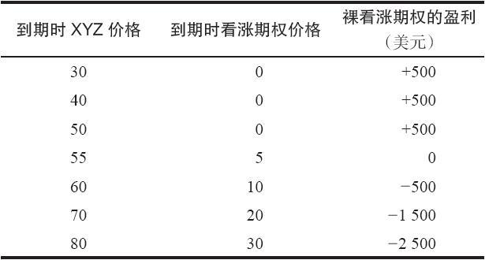
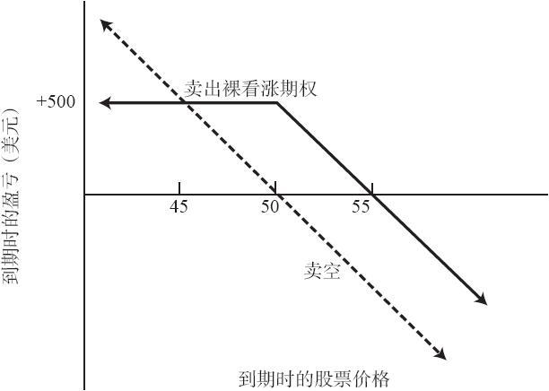

# 5.1　无备兑（裸）看涨期权

如果某个投资者在不持有标的股票，或者是任何相当的证券（可转换股票、债券或者另一种看涨期权）的情况下卖出看涨期权，他就被认为是在卖出无备兑看涨期权。这个策略的潜在盈利有限，但理论上的潜在亏损无限。由于这个原因，有些投资者不适合使用这个策略。这个事实让这一策略并不特别有吸引力，不过由于卖出裸看涨期权并不需要实际的现金投资（这个头寸可通过质押可充抵保证金的证券来建立），因此这个策略可以与其他投资策略结合起来使用。

下面用一个简单的示例来大致说明卖出裸看涨期权的基本潜在盈亏。

【示例5-1】XYZ的售价是50，7月50看涨期权的售价是5。如果投资者想要卖出7月50裸看涨期权，也就是在既不持有XYZ股票也不持有任何可以转换成XYZ股票的证券的情况下卖出XYZ期权，他最多可以得到5点盈亏。如果XYZ在7月到期前的价格是50或者低于50，看涨期权就会无价值到期，投资者获得盈利。但如果XYZ价格上涨，裸卖出者就有可能会大幅亏损。如果股票涨到100，这个看涨期权的价格就会是50。如果这个卖出者按50的价格回补这个看涨期权（将它买回来），在这笔交易中，他就损失了45点。理论上亏损是无限的，但在实践中这个亏损是为时间所限制。在这个看涨期权的存续期内，股票价格不可能上涨到一个无限的量。显然，在这种方法里，防御的策略至关重要，因为没有人想要如此大的亏损。表5-1和图5-1（实线）表示了这个头寸在7月到期日的各种结果。请注意，这个示例里的盈亏平衡点是55。也就是说，如果XYZ在到期时上涨10%，或者说5点，这个裸卖出者就盈亏平衡。他可以持平买回这个看涨期权，或者说用5点，刚好等于其卖出看涨期权时的收入。该策略在上涨方面有一定的容错空间。如果股票上涨，裸卖出未必就一定亏钱。只有当股票上涨的金额大于看涨期权在卖出时的时间价值时，这个头寸才会亏钱。

表5-1　7月到期时的头寸

图5-1　卖出未备兑（裸）看涨期权

卖出裸看涨期权与卖空标的股票不同。虽然这两个策略都有很高的潜在风险，但卖空股票的潜在收益要高得多，而卖出裸看涨期权则在标的股票价格相对稳定的情况下表现更好。当卖空股票亏钱的时候，卖出裸看涨期权也有可能盈利。用上面的示例，假定某个投资者按5点卖出1手7月50裸看涨期权，而另一个投资者按50的价格卖空股票。如果XYZ在到期时是52，裸看涨期权卖出者可以用2点持平买回看涨期权，得到3点盈利。而卖空者则会亏损2点。另外，卖空者要为股票支付股息，而裸看涨期权卖出者则不需要。当然，这个裸看涨期权会到期，而卖空的头寸不会。这是一个卖出裸看涨期权的表现比卖空股票更好的情况。但如果XYZ急剧下跌，比如说跌到20，裸看涨期权卖出者只能得到5点盈利，而卖空者可以得到30点。图5-1中的虚线显示了卖出7月50裸看涨期权和按50卖空XYZ的头寸的表现。请注意，当XYZ在到期时是45的时候，这两个策略是相同的：两者都有5点盈利。当高于45时，卖出裸看涨期权的表现要好些，盈利更大而亏损更小。当低于45时，卖空的表现会更好，股票跌得越深，卖空就相对更出色。正如我们在后面将看到的，投资者可以通过卖出实值裸看涨期权来模拟卖空头寸。
