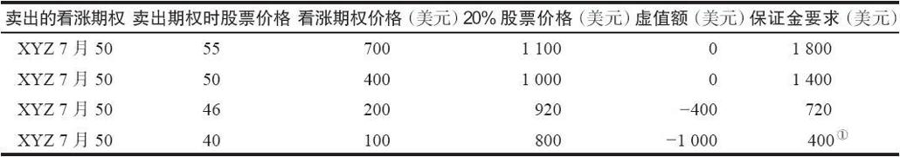

# 5.2　所需投资

卖出一手裸看涨期权所要求的保证金是股票价格的20%加上看涨期权的权利金，再减去股票价格低于行权价的那部分（虚值额）。如果股票价格低于行权价，就从保证金要求里减去这个差。不过，每手看涨期权的最低保证金要求为股票价格的10%，即使实际计算结果更小也是如此。表5-2中举了4个在不同股票价格上时计算初始保证金的例子。交易所要求的最低质押比例是20%，不同的经纪公司可能会有不同的要求。看涨期权权利金可以用来充抵保证金。在表5-2的第一行里，如果XYZ 7月50的售价是7点，那么就有700美元的期权权利金可以用来充抵1800美元的保证金要求，该投资者实际需要提供的质押额为1100美元。

表5-2　四种不同股票价格的初始保证金要求

①保证金不能低于10%。

除了基本的要求之外，经纪公司还可能会要求卖出裸看涨期权的客户在其账户中保持一定金额的资产。这种对资产的要求可以从2000~100000美元不等。因为卖出裸看涨期权是一项风险很高的策略，有的经纪公司在批准这个账户进行卖出裸看涨期权之前，要求客户证明其经济实力和期权交易经验。

裸期权头寸是要逐日盯市的。这就意味着这个头寸的质押要求与卖空股票一样，是每天重新计算的。这里用的是与上面的计算保证金相同的公式，如果股票上涨到一定程度，客户就必须存入额外的质押物，否则头寸就会被强平。需要进行逐日盯市的理由很明显。如果标的股票价格上涨，经纪公司就必须能够保证，如果这个裸看涨期权收到指派通知，客户有足够的质押物来在公开市场上买入股票，并按行权价卖掉股票。如果股票价格下跌，逐日盯市就对客户有利。多余的质押物就会转回到客户的保证金账户，并可以用来做其他交易。

意识到这样一点很重要：只要有质押物，就可以卖出裸看涨期权。如果某个投资者持有足够的质押物，那就不需要用现金来“投资”。

【示例5-2】某个投资者持有100股售价为每股60美元的股票。这些股票价值6000美元。如果这6000美元的质押率是50%，这个投资者就拥有一笔借贷价值相当于6000美元的50%，也就是3000美元的质押。这个投资者不需要在其账户中存入任何现金或证券，就可以卖出表5-2中的任何一个裸看涨期权。此外，他也符合6000美元的最低资产要求，因为他的股票就是资产（equity）。

对许多投资者来说，使用质押来卖出裸看涨期权很有吸引力，因为投资者不必改变他现有的投资组合就可以卖出看涨期权和收到权利金。当然，如果裸期权的标的股票价格上涨太多，由于逐日盯市的缘故，经纪商有可能会要求该投资者追加额外的质押物。此外，不管是用质押还是现金，都有风险存在。当投资者买回亏损的裸看涨期权时，他必须付出现金，在其中账户中产生一笔支出。

不管投资者是用什么钱来建立裸期权头寸，持有足够的质押总是个好主意，以便头寸能够有足够的空间来运动到合适的价位。例如，假定一只股票的交易价是50，投资者卖出一手4月60裸看涨期权，希望当股票上涨到60（即等期权变成实值）时回补这个看涨期权。在这种情况下，他应当预留足够的质押，就像股票价格已经到了60（尽管实际保证金要求小于这个数目）。如果他有多余的质押，那么他就不至于在想要采取后续行动之前就被迫追加保证金。简单地说，你应当让市场而不是保证金追加通知把你带出这个头寸。
