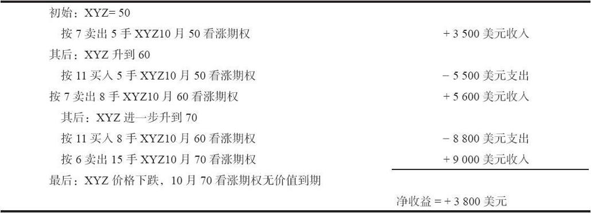
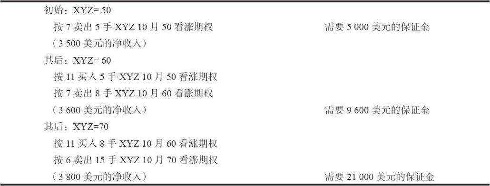

# 5.5　后续行动

由于卖出裸看涨期权在理论上有很大的上行风险，投资者需要持续地监控他的头寸。限制亏损的最简单方法就是在心中设置某个止损价。例如，某个投资者卖出了虚值看涨期权，现在股票价格上涨到行权价，这就是一个很好的退出时机。一些交易者喜欢把止损价设在盈亏平衡点。

【示例5-6】XYZ的售价是45，某个交易者以1.00卖出了7月50裸看涨期权。在到期时该笔交易的盈亏平衡点为51。因此，该交易者可能等股价上涨到51时（到期前的任何时间里）就止损平仓。显然，当股价上涨到51时，看涨期权的价格会比1.00稍微大一点，当股价发生快速上涨时更是如此。

另一种后续行动就是，当没有挣更多钱的机会时，平掉头寸拿走盈利。投资者可以计算出继续持有该裸看涨期权头寸的剩余收益。如果该剩余收益太小，那就应该买回看涨期权，然后寻找其他交易机会。

【示例5-7】在过去的某个时间，某个交易者以1.00卖出了7月50裸看涨期权。假设现在距离到期日还有1个月。XYZ的售价为42，看涨期权的售价为0.05。此时应该把它买回来吗？正如前文所说过的，该交易者为其期权头寸预留了等于行权价20%的质押（1000美元），因此在股价上涨到50前不需要采取任何后续行动。该质押的收益率为：

年化收益率=看涨期权价格/（保证金要求×剩余时间）

=看涨期权价格/（0.2×行权价×时间）

=5/（0.2×5000×（1/12））

=6%

是应该继续持有头寸，为质押物赚取只有6%的年化收益率呢，还是应该建立一个可能有更高收益率的新头寸呢？可能就是后者，应该平掉看涨期权并开仓新头寸。

### 5.5.1　收入挪仓

虽然这个策略对某些期权交易者有吸引力，但有一点需要避免，那就是卖出平值看涨期权。这对先前卖出的裸看涨期权所采取的后续行动也同样适用。此时股票价格上涨到行权价，以及在那一点卖出平值看涨期权。

在收入挪仓的策略中，投资者需要在股票价格达到另一个行权价时，平掉其看涨期权空头，并同时卖出更多的另一个行权价的看涨期权，同一个月份或更远一些的月份均可。他应该卖出足够的新看涨期权，以便让卖出较高行权价看涨期权所收到的权利金等于买回较低行权价看涨期权所支付的金额。投资者可以重复这样做，直到股票最终下跌，而让最后卖出的看涨期权无价值到期。到时他的盈利额为最初的收入，加上后续挪仓中可能得到的任何收入。不过在大多数情况下，挪仓都会需要少量的支出，因此盈利主要还是最初的收入。

当投资者月复一月地不断向上挪仓，则可能在风险和需要的质押方面存在问题，这会侵蚀最初的有限收入。

表5-3和表5-4显示了这种情况发生时的结果。如果XYZ快速上涨，而投资者仍持有10月看涨期权，那该策略的质押要求就会膨胀到难以控制。表5-3中的每次交易都有收入，都有（除了最后一次）亏损兑现。

表5-3　股票上涨时的收入挪仓

表5-4　质押要求的增长

在这些表格中，卖出的看涨期权数量增加了3倍，从5变为15；而质押要求则增加了4倍，从5000美元变为21000美元。

在这个策略中，股票的任何快速上涨都会带来问题。此外，如果股票暴涨并继续暴涨（比如收到收购要约，有大订单或建立生意伙伴关系等消息宣布）则会带来毁灭性的打击。

这实际是一个“马丁格尔策略”（Martingale strategy）。也就是说，要想赢，你就得不断“加倍”，如果达到了一定的物理界限，你可能就毁了。经典的马丁格尔策略是这样的：最开始下注1单位；如果你输了，就加倍下注再玩一次；如果你赢了，你的净盈利就是1单元（你输了1单位，但是赢了2单位）；如果第二次下注你又输了，就再加倍下注。不管你输了多少次，每次都加倍下注。当最终赢了的时候，你的盈利就是最初的本金（1个单元）。不幸的是，这样的策略不能用于现实生活。例如，在一个赌场里，当你输到一定程度时，你就会遇到赌场为赌台所设的限额，从而不能再加倍下注。“收入挪仓”并不是真的要投资者每次将买入看涨期权的数量加倍，不过它确实要求投资者不断增加他的风险暴露，以求得到金额等于其最初卖出的收入的盈利。实际上，在期权交易中也设置有上限：期权清算公司的持仓限额会最终阻止投资者买入足够数量的行权价更高的看涨期权。不过，该投资者的质押规模是更常见的物理限制。在不停地向上挪仓过程中，质押要求会变得越来越大，该策略最终可能会导致大笔的亏损。投资者应当避免使用马丁格尔策略。

如果看涨期权是备兑的，这类策略会更有效一些（参考卖出备兑中的“增额收益概念”）。这些分析对于卖出裸看跌期权也同样适用。在这种情况下，股票价格不会下跌至零，但也会因质押要求变得非常大而难以维持头寸。

### 5.5.2　时间价值是一个误称

与第3章一样，我们再讨论一下时间价值这个议题。许多刚从事期权交易的人都认为，只要他们卖出的是虚值期权（无论是备兑的还是裸的），他们需要做的就是坐着等时间流逝而收取权利金。然而，在卖出期权至期权到期的时间段内，有可能会发生许多事情。股票可能会大幅度运动，隐含波动率也可能会涨到天上去。这些都对期权的卖出者不利，对因时减值产生反方向的作用。期权的卖家必须考虑在期权的存续期内会发生些什么事，而不是简单地把它看作一种将期权持有至到期的策略。卖出裸看涨期权的投资者特别应当在交易时多想一想，卖出备兑看涨期权的投资者也是如此，尽管他们大部分人并没有这样做。备兑卖出者所放弃的是市场上涨时的盈利，如果他不断卖出期权而不考虑波动性或者股票价格会上涨的可能，他就是在自己伤害自己。

因此，把期权价格中不是其内在价值的那部分称作“时间价值”，这并没有什么不对，不过有见识的期权交易者知道，波动率和股票价格的运动对这部分价值的影响，要比时间流逝对其的影响大得多。
